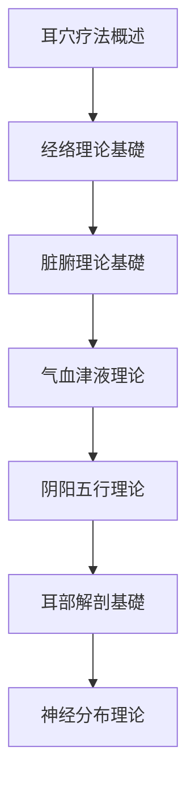
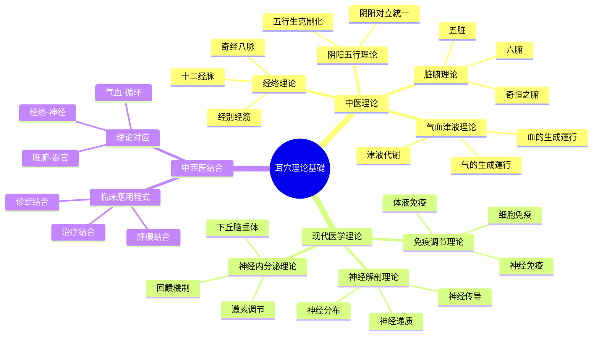

# 知識

# 知識
---
## 🧭 理论体系导航

```mermaid
graph TD
# 知識
    A --> C[歷史發展]
    A --> D[解剖基礎]
    A --> E[機制研究]
    A --> F[標準規範]
    
    B --> B1[中医理论]
    B --> B2[现代医学理论]
    B --> B3[中西医结合]
    
    C --> C1[古代记载]
    C --> C2[现代發展]
    C --> C3[国际推广]
    
    D --> D1[耳部解剖]
    D --> D2[神经分布]
    D --> D3[血管分布]
    
    E --> E1[神经機制]
    E --> E2[体液機制]
    E --> E3[免疫機制]
    
    F --> F1[国家標準]
    F --> F2[国际標準]
    F --> F3[行业規範]
```

## 📚 核心理论內容

### 🏛️ 中医理论基礎
| 理论       | 核心概念     | 重要文獻    | 关联穴位   |
| -------- | -------- | ------- | ------ |
| [[经络理论]] | 耳为宗脉之所聚  | 《灵枢·口问》 | 全身穴位   |
| [[脏腑理论]] | 脏腑功能耳部对应 | 《黄帝内经》  | 脏腑穴位   |
| [[气血理论]] | 气血運行耳部调节 | 《难经》    | 气血相關穴位 |
| [[阴阳理论]] | 阴阳平衡耳穴调节 | 《易经》    | 调理阴阳穴位 |
| [[全息理论]] | 耳部为全身缩影  | 现代研究    | 全息对应穴位 |

### 🧬 现代医学基礎
| 理论 | 核心內容 | 研究证据 | 临床應用程式 |
|------|----------|----------|----------|
| [[神经解剖理论]] | Arnold神经分布 | 解剖学研究 | 神经系統疾病 |
| [[反射理论]] | 耳部反射区 | 生理学研究 | 各系統疾病 |
| [[神经内分泌理论]] | 神经-内分泌-免疫網路 | 分子生物学研究 | 内分泌疾病 |
| [[胚胎发育理论]] | 胚胎发育与耳部关系 | 发生学研究 | 发育相關疾病 |
| [[量子医学理论]] | 微观能量调节 | 物理学研究 | 能量平衡调节 |

### 📜 歷史發展脉络
| 时期 | 重要事件 | 代表人物 | 标志性成果 |
|------|----------|----------|------------|
| **古代时期** | 《内经》记载 | 黄帝内经作者 | 耳部与全身联系 |
| **晋唐时期** | 《针灸甲乙经》 | 皇甫谧 | 耳穴系統记载 |
| **明清时期** | 《针灸大成》 | 杨继洲 | 耳穴詳細描述 |
| **现代初期** | Nogier發現 | Paul Nogier | 耳穴反射区發現 |
# 整理
| **標準化期** | 国际標準化 | WHO | 国际標準制定 |

## 🎯 學習重点

### 🔥 核心必掌握
# 知識
2. **经络理论基礎** - [[经络理论]]
3. **脏腑理论基礎** - [[脏腑理论]]
4. **耳部解剖基礎** - [[耳廓解剖基礎]]

### 📚 重要理论
1. **气血津液理论** - [[气血津液理论]]
2. **阴阳五行理论** - [[阴阳五行理论]]
3. **神经反射理论** - [[神经反射理论]]
4. **全息胚理论** - [[4 Archives/医学/医学/耳穴知識庫/理论基礎/全息胚理论]]

# 知識
# 知識
2. **现代機制研究** - [[耳穴作用機制研究]]
3. **標準規範体系** - [[耳穴標準規範]]
4. **国际比较研究** - [[国际耳穴疗法比较]]

## 🧭 學習路徑

### 🎓 基礎學習路徑


**學習要求**：
- 📖 掌握基本概念和定义
- 🎯 理解核心理论和原理
- 🔍 了解歷史發展和现状
- 📊 熟悉標準規範体系

### 🔬 深入研究路徑
```mermaid
flowchart TD
    A[基礎理论掌握] --> B[现代機制研究]
# 方法
    C --> D[临床证据評價]
    D --> E[前沿進展追踪]
# 分析
```

**研究要求**：
- 🔬 深入理解作用機制
# 方法
- 🧪 熟悉实验技術
- 🌍 了解国际前沿

## 🏷️ 標籤分類体系

### 📚 按理论类型
- `#theory/tcm` - 中医理论
- `#theory/modern` - 现代医学理论
- `#theory/integrated` - 中西医结合理论
- `#theory/historical` - 歷史理论研究

### 🔬 按研究深度
- `#level/basic` - 基礎理论
- `#level/intermediate` - 中等理论
- `#level/advanced` - 高深理论
- `#level/research` - 研究前沿

### 🏛️ 按学科分類
- `#subject/anatomy` - 解剖学
- `#subject/physiology` - 生理学
- `#subject/biochemistry` - 生物化学
- `#subject/physics` - 物理学

# 知識

### 🧠 理论关系網路


## 📖 重要文獻資源

### 📜 古典文獻
1. **《黄帝内经》** - 中医理论源头
2. **《灵枢经》** - 针灸理论基礎
3. **《针灸甲乙经》** - 针灸学专著
4. **《针灸大成》** - 针灸学大成
5. **《难经》** - 医学疑难解答

### 📚 现代专著
1. **《耳穴疗法学》** - 系統教材
2. **《耳穴诊断学》** - 诊断专著
3. **《耳穴解剖学》** - 解剖专著
4. **《耳穴機制研究》** - 機制研究
5. **《国际耳穴標準》** - 国际標準

### 📄 重要论文
1. **耳穴神经機制研究** - 神经科學论文
2. **耳穴临床疗效評價** - 临床研究论文
3. **耳穴標準化研究** - 標準化论文
4. **耳穴国际比较研究** - 比较研究论文
5. **耳穴前沿進展综述** - 综述论文

## 🔬 前沿研究方向

### 🧬 分子生物学研究
- **基因表达**：耳穴刺激对基因表达的影响
- **蛋白质组学**：耳穴相關蛋白质变化
- **细胞信号传导**：耳穴信号转导機制
- **表观遗传学**：耳穴对表观遗传的影响

### 🧠 神经科學研究
- **脑功能成像**：fMRI、PET等成像技術
- **神经电生理**：EEG、MEG等电生理技術
- **神经化学**：神经递质、神经调质研究
- **神经網路**：脑網路連接研究

### 🤖 人工智能應用程式
- **智能诊断**：AI辅助耳穴诊断
- **精准治疗**：AI優化治疗方案
- **疗效预测**：机器學習疗效预测
# 知識

## 📈 學習进度追踪

### 📊 理论掌握情况
| 理论模块 | 掌握程度 | 學習時間 | 复习次数 |
|----------|----------|----------|----------|
| **中医基礎理论** | 85% | 20小时 | 5次 |
| **现代医学理论** | 75% | 15小时 | 3次 |
| **歷史發展** | 90% | 8小时 | 2次 |
| **解剖基礎** | 80% | 12小时 | 4次 |
| **機制研究** | 65% | 18小时 | 3次 |

### 🎯 本月學習計劃
- ✅ 完成[[神经内分泌理论]]學習
- 🔄 學習[[量子医学理论]]基礎
- 📋 開始[[免疫调节理论]]學習
- 🎯 目標：理论掌握度达到85%

---

## 💡 學習要點提示

### 🎯 核心要點
- **理论基礎**：中医理论是根基，现代医学是补充
- **發展脉络**：从古代經驗到现代科學的發展历程
- **解剖基礎**：耳部解剖是定位和應用程式的基礎
- **作用機制**：神经、内分泌、免疫多系統调节

# 方法
- **系統學習**：按逻辑顺序系統學習各理论
- **對比學習**：對比中西医理论异同点
- **临床联系**：结合临床案例理解理论
- **前沿追踪**：關注最新研究進展

### ⚠️ 學習难点
- **理论抽象**：中医理论概念抽象难理解
# 知識
- **機制复杂**：作用機制复杂多样
- **標準不一**：不同標準之间存在差异

---

> 📌 **推荐下一步**：深入學習[[经络理论]]掌握中医基礎，或學習[[神经解剖理论]]了解现代基礎

# 知識庫

---
# 知識