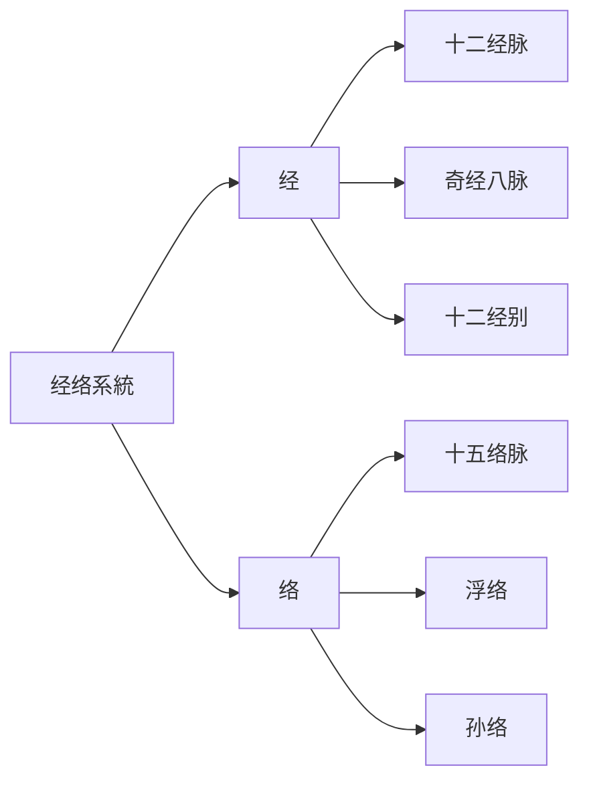
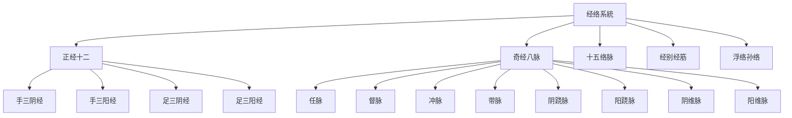
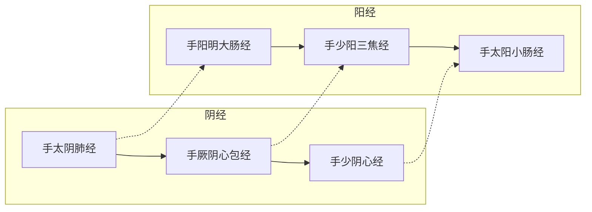
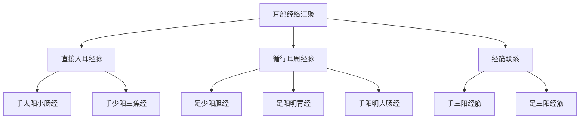
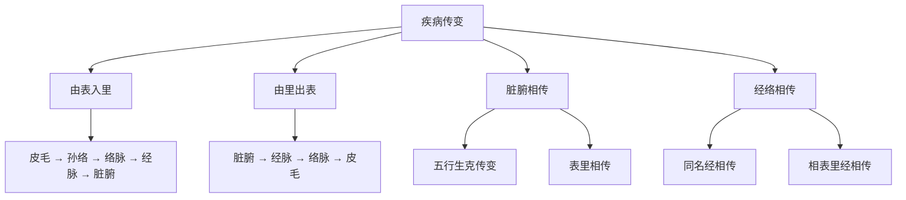
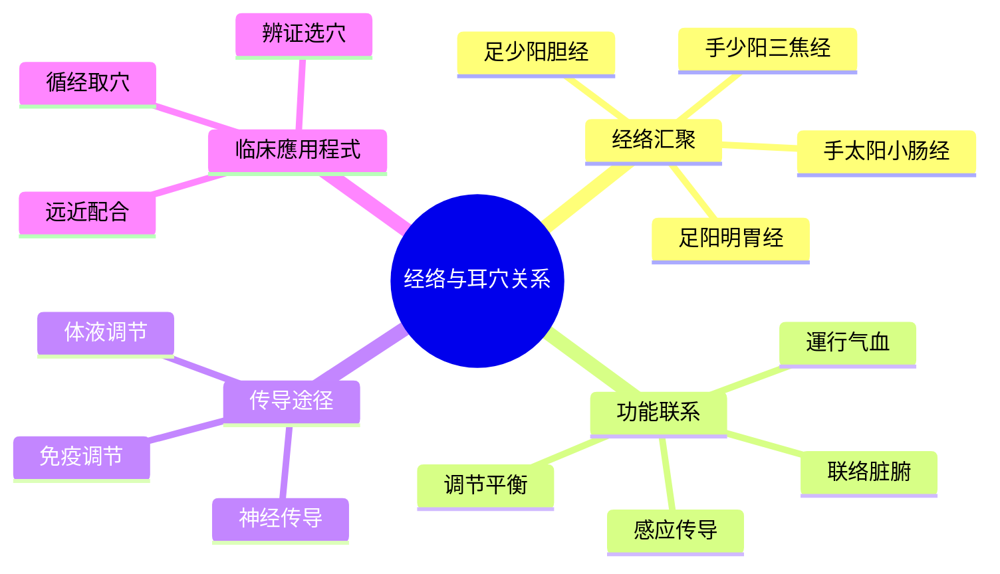

# 经络理论

> [!abstract] 概述
> 经络理论是中医学的核心组成部分，是耳穴疗法的重要理论基礎。本文系統阐述经络的概念、分類、循行规律及其与耳穴疗法的关系，为理解和應用程式耳穴疗法提供理论支撑。

---

## 📋 目錄

- [一、经络基本概念](#一经络基本概念)
- [二、经络系統组成](#二经络系統组成)
- [三、十二经脉详解](#三十二经脉详解)
- [四、奇经八脉概述](#四奇经八脉概述)
- [五、经别经筋皮部](#五经别经筋皮部)
- [六、经络与耳部关系](#六经络与耳部关系)
- [七、经络功能作用](#七经络功能作用)
- [八、经络病机传变](#八经络病机传变)
- [九、耳穴选穴原則](#九耳穴选穴原則)

---

## 一、经络基本概念

### 1.1 经络的定义

**经络**是人体運行气血、联络脏腑、沟通内外、贯穿上下的通路。



### 1.2 经络的构成

| 构成 | 特點 | 功能 |
|------|------|------|
| **经** | 主干，较大 | 贯穿上下，主体通道 |
| **络** | 分支，较小 | 網路全身，渗灌气血 |
| **经别** | 经之别出 | 加强表里经联系 |
| **经筋** | 联缀肢体 | 约束骨骼，主司运动 |
| **皮部** | 体表区域 | 防御外邪，反映病候 |

### 1.3 经络与耳穴的关系

> [!quote] 经典论述
> "耳者，宗脉之所聚也" —— 《灵枢·口问》

耳部是全身经络汇聚之处，通過经络的传导作用，刺激耳穴可以调节全身脏腑功能。

---

## 二、经络系統组成

### 2.1 系統架構图



### 2.2 经络分類表

| 类别 | 数量 | 主要特點 | 功能 |
|------|------|----------|------|
| **十二经脉** | 12条 | 气血運行主干 | 運行气血，联络脏腑 |
| **奇经八脉** | 8条 | 调节气血盛衰 | 统率联络，溢蓄气血 |
| **十五络脉** | 15条 | 沟通表里 | 加强表里经联系 |
| **十二经别** | 12条 | 深部联系 | 加强内部联系 |
| **十二经筋** | 12条 | 联缀肢体 | 主司运动 |
| **十二皮部** | 12区 | 体表分区 | 防御外邪 |

---

## 三、十二经脉详解

### 3.1 十二经脉循行规律

#### 循行方向



#### 交接规律

| 交接部位 | 交接经脉 | 說明 |
|----------|----------|------|
| **手指末端** | 阴经→阳经 | 手三阴交手三阳 |
| **头面部** | 阳经→阳经 | 手三阳交足三阳 |
| **胸腹部** | 阳经→阴经 | 足三阳交手三阴 |
| **足趾末端** | 阴经→阳经 | 足三阴交足三阳 |

### 3.2 十二经脉与脏腑关系

| 阴经（属脏） | 阳经（属腑） | 表里关系 |
|--------------|--------------|----------|
| 手太阴肺经 | 手阳明大肠经 | 肺与大肠相表里 |
| 手厥阴心包经 | 手少阳三焦经 | 心包与三焦相表里 |
| 手少阴心经 | 手太阳小肠经 | 心与小肠相表里 |
| 足太阴脾经 | 足阳明胃经 | 脾与胃相表里 |
| 足厥阴肝经 | 足少阳胆经 | 肝与胆相表里 |
| 足少阴肾经 | 足太阳膀胱经 | 肾与膀胱相表里 |

### 3.3 与耳部直接相關的四条经脉

#### 手少阳三焦经

```
【循行路线】
手少阳三焦经 → 上肢外侧 → 肩部 → 颈部 → 耳周 → 耳前 → 目外眦

【耳周穴位】
├── 翳风 (SJ17) - 耳垂后方
├── 瘈脉 (SJ18) - 耳后乳突
├── 颅息 (SJ19) - 耳后乳突
├── 角孙 (SJ20) - 耳尖上方
└── 耳门 (SJ21) - 耳屏前方

【主要功能】
- 调理三焦气机
- 疏通水道
- 主治耳鸣、耳聋
```

#### 足少阳胆经

```
【循行路线】
足少阳胆经 → 躯干侧面 → 腋下 → 侧头部 → 耳后 → 耳上 → 目外眦

【耳周穴位】
├── 听会 (GB2) - 耳屏前下方
├── 上关 (GB3) - 耳前颧弓上
├── 率谷 (GB8) - 耳尖上方
├── 天冲 (GB9) - 耳根后上方
└── 完骨 (GB12) - 耳后乳突后下方

【主要功能】
- 疏肝利胆
- 调理情志
- 主治偏头痛、耳疾
```

#### 手太阳小肠经

```
【循行路线】
手太阳小肠经 → 上肢外侧后缘 → 肩胛部 → 颈部 → 耳中 → 耳尖 → 目外眦

【耳周穴位】
├── 听宫 (SI19) - 耳屏前中央
├── 颧髎 (SI18) - 颧骨下缘
├── 肩外俞 (SI15) - 肩胛部
└── 肩中俞 (SI14) - 肩胛部

【主要功能】
- 清热利湿
- 调理心神
- 主治耳鸣、耳聋
```

#### 足阳明胃经

```
【循行路线】
足阳明胃经 → 面部 → 鼻旁 → 耳前 → 颈部 → 胸部 → 腹部

【耳周穴位】
├── 下关 (ST7) - 耳前颧弓下
├── 颊车 (ST6) - 咬肌隆起
├── 大迎 (ST5) - 下颌角前方
└── 人迎 (ST9) - 颈部胸锁乳突肌

【主要功能】
- 健脾和胃
- 调理气血
- 主治面部疾病
```

---

## 四、奇经八脉概述

### 4.1 奇经八脉特點

| 特點 | 說明 |
|------|------|
| **不直接络属脏腑** | 与十二正经不同，無表里配合 |
| **無循环流注** | 不同于十二经脉的流注次序 |
| **無专属腧穴** | 除任督二脉外，無本经腧穴 |
| **调节气血盛衰** | 对十二经脉气血有蓄溢调节作用 |

### 4.2 与耳部相關的奇经

#### 督脉

```
【循行路线】
会阴 → 背部正中 → 头顶 → 额部 → 上唇

【耳部相關】
- 督脉入耳：调节阳经气血
- 主治：头痛、耳鸣、听力下降

【重要穴位】
└── 百会 (GV20) - 头顶正中
```

#### 任脉

```
【循行路线】
会阴 → 腹部正中 → 胸部 → 咽喉 → 下唇

【耳部相關】
- 任脉调节阴经气血
- 主治：咽痛、耳鸣

【重要穴位】
└── 承浆 (CV24) - 下唇下方
```

#### 冲脉

```
【循行路线】
小腹内 → 会阴 → 脊柱 → 头面

【耳部相關】
- 十二经之海
- 调节全身气血
- 主治：月经不调、头痛
```

---

## 五、经别经筋皮部

### 5.1 十二经别

#### 经别的作用

| 功能 | 說明 |
|------|------|
| **加强表里经联系** | 深入体腔加强表里经联系 |
| **加强内部联系** | 联系脏腑，深部循行 |
| **扩大经脉循行** | 补充经脉未能循行部位 |

#### 与耳部相關的经别

```
足阳明经别
└── 上通于耳 → 加强耳部与胃肠联系

手少阳经别
└── 上挟咽 → 联系耳部与三焦
```

### 5.2 十二经筋

#### 经筋的分布特點

| 特點 | 說明 |
|------|------|
| **联缀肢体** | 附属于十二经脉，行于体表筋肉之间 |
| **主司运动** | 约束骨骼，主司关节运动 |
| **反映病候** | 筋肉的拘挛弛缓反映经脉病变 |

#### 耳部经筋分布

```
手三阳经筋
├── 手阳明经筋 → 耳前
├── 手少阳经筋 → 耳后、耳周
└── 手太阳经筋 → 耳中、耳尖

足三阳经筋
├── 足阳明经筋 → 耳前
├── 足少阳经筋 → 耳后
└── 足太阳经筋 → 耳上
```

### 5.3 十二皮部

#### 皮部分区

| 十二皮部 | 分布区域 | 对应经脉 |
|----------|----------|----------|
| 太阳皮部 | 背部、腰部 | 足太阳膀胱经 |
| 阳明皮部 | 面部、胸腹 | 足阳明胃经 |
| 少阳皮部 | 侧头部、耳周 | 足少阳胆经 |
| 太阴皮部 | 胸腹部 | 足太阴脾经 |

#### 耳部皮部

```
耳部皮部特點：
├── 耳轮 → 阳明皮部
├── 耳背 → 太阳皮部
├── 耳前 → 少阳皮部
└── 耳周 → 多经皮部交界
```

---

## 六、经络与耳部关系

### 6.1 耳部经络汇聚

> [!important] 核心概念
> 耳部是"宗脉之所聚"，多条经脉循行于耳周或入耳中。



### 6.2 耳穴与经络对应

#### 耳廓分区与经络对应

| 耳廓区域 | 对应经络 | 主要功能 |
|----------|----------|----------|
| **耳轮** | 足阳明胃经 | 调理胃气 |
| **耳舟** | 手太阳小肠经 | 调理小肠 |
| **对耳轮** | 足少阳胆经 | 疏肝利胆 |
| **三角窝** | 足太阳膀胱经 | 调理膀胱 |
| **耳甲艇** | 足少阴肾经 | 补肾益精 |
| **耳甲腔** | 手厥阴心包经 | 清心泻火 |
| **耳屏** | 手少阳三焦经 | 调理三焦 |
| **对耳屏** | 足厥阴肝经 | 疏肝解郁 |
| **耳垂** | 多经汇集 | 头面五官 |

### 6.3 经络传导原理

#### 传导途径

```
耳穴刺激 → 神经传导 → 脊髓相应节段 → 脑干 → 大脑皮层
         ↓
    自主神经调节 → 脏腑功能调节
         ↓
    内分泌调节 → 免疫功能调节
         ↓
    整體效应 → 治疗作用
```

#### 传导特點

| 特點 | 說明 |
|------|------|
| **双向性** | 既可传入資訊，又可传出调节 |
| **特异性** | 不同耳穴对应不同脏腑经络 |
| **整體性** | 调节全身功能，而非局部 |
| **双向调节** | 对亢进或低下的功能均有调节作用 |

---

## 七、经络功能作用

### 7.1 主要生理功能

| 功能 | 說明 | 临床意义 |
|------|------|----------|
| **運行气血** | 气血運行通道 | 营养全身，维持生命 |
| **联络脏腑** | 沟通内外網路 | 协调脏腑功能 |
| **沟通上下** | 上下联系通路 | 整體调节基礎 |
| **感应传导** | 刺激感应传导 | 针灸治疗基礎 |
| **调节平衡** | 调节气血盛衰 | 维持阴阳平衡 |

### 7.2 经络与脏腑关系

#### 属络关系

```
┌─────────────────────────────────────────┐
│                 十二经脉                  │
│  ┌───────────────────────────────────┐  │
│  │  属脏络腑（阴经）                   │  │
│  │  属腑络脏（阳经）                   │  │
│  └───────────────────────────────────┘  │
└─────────────────────────────────────────┘
              ↓
┌─────────────────────────────────────────┐
│                 脏腑                     │
│  ┌───────────────────────────────────┐  │
│  │  心、肝、脾、肺、肾、心包（六脏）   │  │
│  │  胆、胃、小肠、大肠、膀胱、三焦（六腑）│ │
│  └───────────────────────────────────┘  │
└─────────────────────────────────────────┘
```

#### 表里配合

| 表里配合 | 生理联系 | 病理影响 |
|----------|----------|----------|
| 肺与大肠 | 气机升降 | 肺热移大肠 |
| 心与小肠 | 血脉相通 | 心火下移小肠 |
| 肝与胆 | 疏泄相關 | 肝胆湿热 |
| 脾与胃 | 运化相合 | 脾胃不和 |
| 肾与膀胱 | 水液代谢 | 肾虚膀胱不固 |

### 7.3 经络的调节作用

#### 双向调节

| 调节方向 | 适应症举例 |
|----------|------------|
| **功能亢进** | 高血压、焦虑、失眠 |
| **功能低下** | 低血压、抑郁、乏力 |

#### 整體调节

```
单一穴位刺激
    ↓
经络传导
    ↓
全身调节
    ↓
多系統效应
    ↓
整體疗效
```

---

## 八、经络病机传变

### 8.1 经络病机类型

| 病机类型 | 病理变化 | 表现特點 |
|----------|----------|----------|
| **经络不通** | 气血瘀滞 | 疼痛、麻木、肿胀 |
| **经络失养** | 气血不足 | 乏力、萎软、畏寒 |
| **经络空虚** | 正气亏虚 | 功能低下、久病不愈 |
| **经络厥逆** | 气血逆乱 | 昏厥、抽搐、震颤 |

### 8.2 经络传变规律

#### 传变途径



#### 耳部经络传变

| 传变类型 | 传变途径 | 临床表现 |
|----------|----------|----------|
| **外邪传耳** | 皮部 → 络脉 → 经脉 → 耳 | 耳痒、耳痛 |
| **脏腑及耳** | 脏腑 → 经脉 → 耳 | 耳鸣、耳聋 |
| **经络互传** | 耳周经络相互影响 | 耳周疼痛 |

### 8.3 经络辨证在耳穴治疗中的應用程式

#### 循经取穴

| 辨证要點 | 取穴原則 | 代表耳穴 |
|----------|----------|----------|
| **经络不通** | 疏通经络 | 相应部位耳穴 |
| **经络失养** | 补益气血 | 脾胃耳穴 |
| **气血瘀滞** | 活血化瘀 | 心、肝耳穴 |
| **风寒湿痹** | 祛风除湿 | 相应部位 + 脾、肾 |

---

## 九、耳穴选穴原則

### 9.1 循经选穴法

#### 近部选穴

| 选穴原則 | 适应症 | 耳穴举例 |
|----------|--------|----------|
| **病变部位** | 局部病症 | 眼疾取眼穴 |
| **相邻部位** | 邻近病症 | 牙痛取颌穴 |
| **耳廓反应点** | 压痛敏感点 | 探查阳性反应点 |

#### 远部选穴

| 选穴原則 | 适应症 | 耳穴举例 |
|----------|--------|----------|
| **循经取穴** | 循经病症 | 腰痛取腰穴 |
| **辨证取穴** | 全身病症 | 失眠取神门 |
| **經驗取穴** | 特效病症 | 痛证取神门 |

# 方法

#### 主配穴配合

# 方法
|----------|------|------|
| **主穴** | 针对主病主症 | 失眠取神门 |
| **配穴** | 针对兼症 | 失眠配心、肾 |
| **随症加减** | 根据症状调整 | 心肾不交加肾 |

#### 常用配穴组合

| 病症 | 主穴 | 配穴 |
|------|------|------|
| 失眠 | 神门 | 心、肾、脾 |
| 头痛 | 颞、额 | 肝、肾 |
| 胃痛 | 胃 | 脾、交感 |
| 高血压 | 降压点 | 肝、肾、心 |
| 月经不调 | 内生殖器 | 肝、肾、脾 |

### 9.3 耳穴与经络对应表

| 经络 | 主治规律 | 常用耳穴 |
|------|----------|----------|
| **手少阳三焦经** | 耳疾、水液代谢 | 耳门、三焦 |
| **足少阳胆经** | 偏头痛、情志病 | 颞、胆 |
| **手太阳小肠经** | 耳疾、消化不良 | 听宫、小肠 |
| **足阳明胃经** | 面部、胃肠病 | 颊、胃 |
| **足太阴脾经** | 消化、血液病 | 脾 |
| **足少阴肾经** | 耳疾、腰膝酸软 | 肾 |

---

## 📊 经络与耳穴关系總結



---

## 🔗 相關文檔連結

# 知識庫
- [[脏腑理论]] - 脏腑与耳穴关系
- [[气血津液理论]] - 气血運行调节
- [[阴阳五行理论]] - 阴阳平衡理论
# 知識

---

## 📝 修订記錄

# 版本
|------|------|----------|--------|
# 版本

---

> [!info] 學習提示
> 经络理论是耳穴疗法的核心理论基礎，理解经络的循行规律和功能特點，对于正确选穴和提高疗效具有重要意义。建議结合实际病例進行學習和應用程式。

%% 经络是中医理论的核心组成部分 %%
%% 耳为宗脉之所聚，经络理论是耳穴疗法的重要基礎 %%
