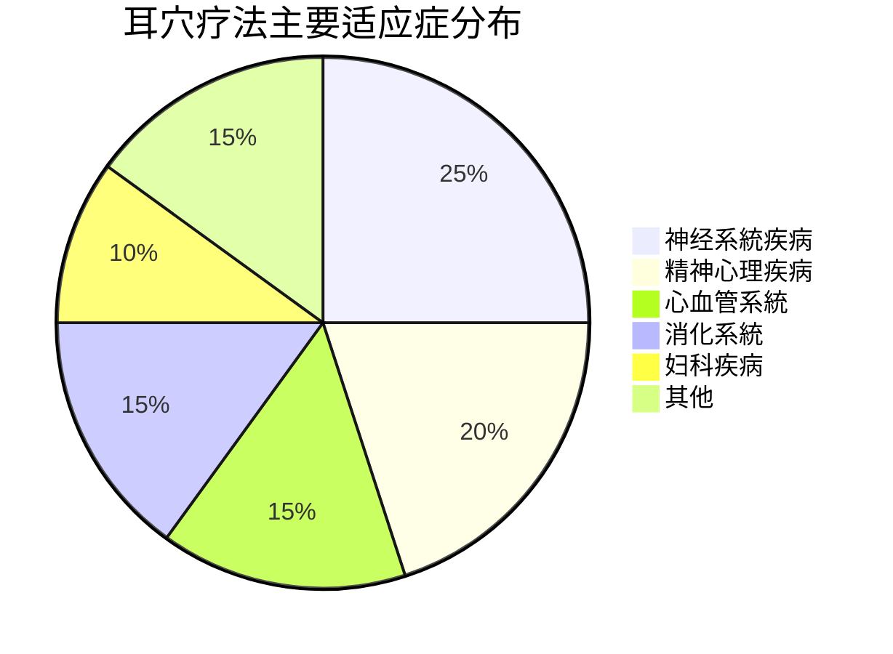

---
aliases:
tags:
  - theory
  - basics
  - auricular-therapy
type: concept
created: 2026-01-21
related_to:
---


---
tags: #theory #basics #auricular-therapy
type: concept
created: 2026-01-21
# 知識庫
---

# 🧠 耳穴疗法概述

## 📖 定义

# 方法

### 🔍 核心特征
# 方法
- #safe - 安全性高，不良反应少
- #effective - 疗效确切，适应症广
- #simple - 操作简便，易于掌握

## 🏛️ 理论基礎

### 🇨🇳 中医理论基礎
> **"耳为宗脉之所聚"** - 《灵枢·口问》

#### 核心理论
- #meridian-theory [[经络学说]] - 十二经脉、三百六十五络汇聚于耳
- #zang-fu-theory [[脏腑理论]] - 脏腑功能在耳部的对应关系
- #qi-blood-theory [[气血理论]] - 气血運行与耳部调节
- #yin-yang-theory [[阴阳理论]] - 阴阳平衡与耳穴调节

### 🧬 现代医学基礎
- #neuro-anatomy [[神经解剖]] - Arnold神经分布理论
- #reflex-theory [[反射理论]] - 耳部反射区与全身对应
- #holographic-theory [[全息理论]] - 耳廓作为全身缩影
- #endocrine-theory [[神经内分泌]] - 神经-内分泌-免疫網路调节

## 📊 分類体系

```mermaid
graph TD
# 方法
    A --> C[按治疗目的]
    A --> D[按理论基礎]
    
    B --> B1[毫针针刺]
    B --> B2[耳穴按压]
    B --> B3[耳穴按摩]
    B --> B4[耳穴电针]
    B --> B5[耳穴放血]
    
    C --> C1[治疗性]
    C --> C2[预防性]
    C --> C3[诊断性]
    C --> C4[保健性]
    
    D --> D1[传统中医]
    D --> D2[现代西医]
    D --> D3[中西医结合]
```

## 🌍 發展历程

### 📜 古代记载
- **《黄帝内经》** - 首次记载耳与全身联系
# 方法
- **《针灸大成》** - 詳細记载耳部穴位和主治

### 🚀 现代發展
- **1957年** - 法国Paul Nogier發現耳穴反射区
# 整理
- **1990年代** - 耳穴疗法標準化研究
- **2000年代** - 耳穴疗法国际化推广
- **2020年** - WHO發佈耳穴国际標準

## 🎯 主要特點

### 💪 優勢特點
| 特點 | 具体表现 | 临床意义 |
|------|----------|----------|
| #safety | 非侵入性，不良反应少 | 适合老年、儿童患者 |
| #effectiveness | 适应症广，疗效确切 | 多种疾病均有良效 |
| #simplicity | 操作简便，易于學習 | 便于基层推广 |
| #economy | 成本低廉，设备简单 | 减轻患者经济负担 |
| #compatibility | 可与其他疗法联合 | 提高综合治疗效果 |

### 🔄 作用機制
> 参见 [[耳穴作用機制]]

## 🏥 临床應用程式

### 📋 主要适应症


### 🎖️ 代表性應用程式
# 效率
# 效率
# 效率
# 效率
# 效率

## ⚠️ 安全性考量

### 🚫 禁忌症
- #contraindication [[禁忌症列表]]
- 耳部皮膚感染、溃疡
- 严重出血性疾病
- 严重心脏病（不稳定期）
- 孕妇（腹部穴位）

### ⚠️ 不良反应
- #adverse-reaction [[不良反应處理]]
- 局部皮膚反应（<3%）
- 全身性反应（<0.5%）
- 严重反应（<0.05%）

## 🔗 相關概念

### 📚 核心概念
- [[耳穴]] - 耳部特定反应点
# 方法
# 方法
- [[辨证论治]] - 中医辨证选穴原則

### 🧬 相關理论
- [[经络理论]] - 经络循行与耳部关系
- [[脏腑理论]] - 脏腑功能与耳穴对应
- [[全息理论]] - 全息胚理论在耳穴的應用程式
- [[神经反射理论]] - 现代神经生理学基礎

## 📖 延伸阅读

### 📖 必读文獻
1. [[GB/T 13734-2020]] - 耳穴名称与定位国家標準
2. [[WHO耳穴標準]] - 世界卫生组织耳穴国际標準
3. [[耳穴疗法学]] - 系統教材
4. [[耳穴機制研究進展]] - 最新研究综述

### 🔍 深入學習
# 知識
- [[3 Resources/01-Tech/医学/耳穴疗法知識庫/00-MOCs/MOC-临床應用程式]] - 临床應用程式內容地图
- [[研究文獻彙總]] - 重要研究文獻索引

---

## 💡 核心要點

# 方法
- 🏛️ **理论基礎**：中医经络理论 + 现代神经科學
- 🌟 **特點**：安全、有效、简便、经济
- 🏥 **應用程式**：适应症广，疗效确切
- ⚠️ **安全**：禁忌症明确，不良反应少

---

# 查看

# 更新