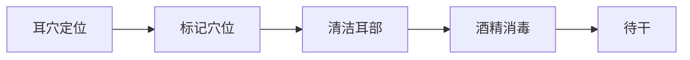
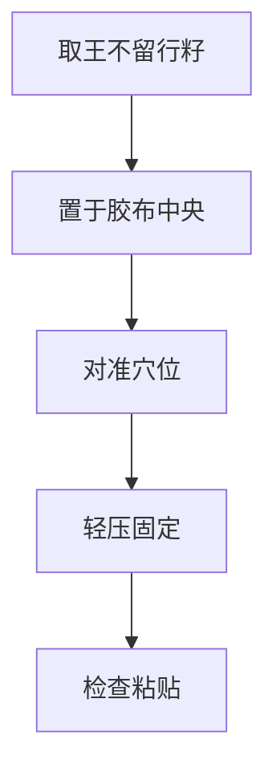
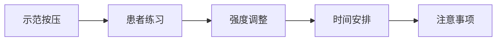
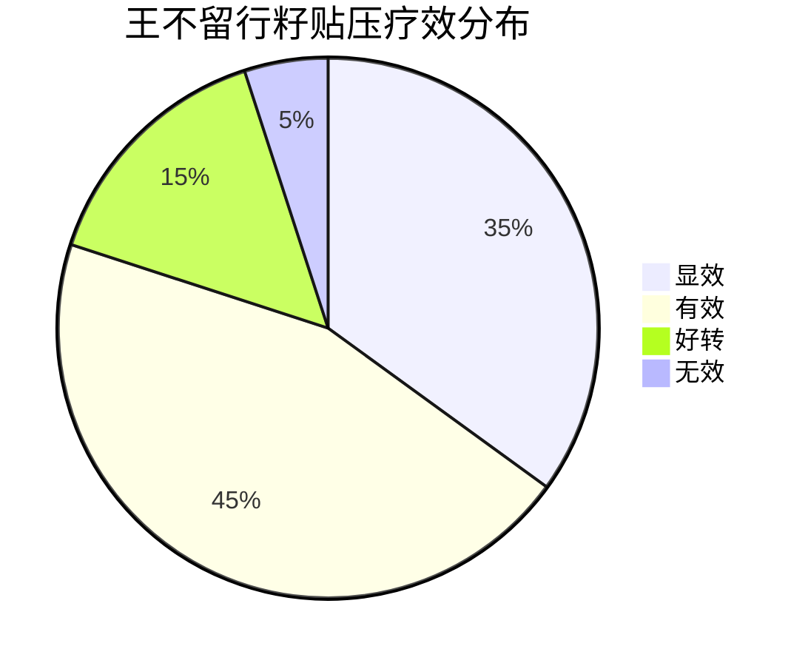

# 🌰 王不留行籽贴压技术

## 📖 概述

> **王不留行籽贴压**是耳穴疗法中最常用、最安全、最简便的刺激方法之一，特别适合儿童、老年人和怕针患者。

### 🌟 核心优势
- #non-invasive - 无创伤，无感染风险
- #safe - 安全性极高，不良反应少
- #simple - 操作简便，易于掌握
- #economical - 成本低廉，材料易得
- #sustained - 持续刺激，效果持久

## 🌱 材料准备

### 🌰 王不留行籽
- **来源**：石竹科植物麦蓝菜的成熟种子
- **性状**：球形，直径1-2mm，黑色或棕黑色
- **特性**：质地坚硬，表面光滑，无毒性
- **选择标准**：
  - 颗粒饱满，无破损
  - 大小均匀，直径1-2mm
  - 颜色深黑，有光泽
  - 无虫蛀，无霉变

### 📦 贴压材料
| 材料 | 规格 | 要求 | 备注 |
|------|------|------|------|
| 胶布 | 0.5×0.5cm | 医用胶布，透气性好 | 防过敏最佳 |
| 镊子 | 尖头镊子 | 医用镊子，尖端细长 | 便于夹取 |
| 探棒 | 圆头探棒 | 木质或塑料，圆头光滑 | 用于定位 |
| 消毒剂 | 75%酒精 | 医用酒精 | 皮肤消毒 |
| 容器 | 小瓶或盒 | 干燥清洁 | 存放种子 |

## 🔧 操作技术

### 📋 操作前准备
1. **患者准备**
   - 向患者解释治疗过程
   - 取得患者配合
   - 选择舒适体位

2. **材料准备**
   - 检查王不留行籽质量
   - 准备适当大小胶布
   - 检查工具完整性

3. **环境准备**
   - 清洁安静环境
   - 充足光线照明
   - 适宜温度湿度

### 📍 操作步骤

#### 1️⃣ 定位消毒

**详细步骤**：
- 🔍 **准确定位**：使用探棒或手指按压寻找敏感点
- ✏️ **标记位置**：用记号笔轻柔标记
- 🧹 **清洁耳部**：用生理盐水清洁耳廓皮肤
- 🦠 **酒精消毒**：75%酒精常规消毒
- ⏳ **等待干燥**：待酒精完全挥发

#### 2️⃣ 种子粘贴

**详细步骤**：
- 🌰 **夹取种子**：用镊子夹取1粒王不留行籽
- 📦 **放置胶布**：将种子置于胶布中央
- 🎯 **对准穴位**：将带有种子的胶布对准穴位
- 👆 **轻压固定**：轻压胶布，确保粘贴牢固
- ✅ **检查粘贴**：检查种子是否准确位于穴位上

#### 3️⃣ 按压指导

**按压方法**：
- 👆 **按压手法**：用拇指和食指对捏按压
- 💪 **按压强度**：以局部酸胀感为度，不可过强
- ⏱️ **按压时间**：每穴按压1-2分钟
- 🔄 **按压频次**：每日3-5次
- 🕐 **最佳时间**：早、中、晚各一次

## 🎯 临床应用

### 📋 适用病症
| 疾病分类 | 常用穴位 | 贴压方案 | 疗程安排 |
|----------|----------|----------|----------|
| 🧠 神经系统疾病 | 神门、心、肾、皮质下 | 双耳交替 | 10-15次 |
| ❤️ 心血管疾病 | 心、交感、降压沟 | 双耳同时 | 15-20次 |
| 🍽️ 消化系统疾病 | 胃、脾、大肠、小肠 | 双耳交替 | 10-15次 |
| 🫁 呼吸系统疾病 | 肺、平喘、肾上腺 | 双耳同时 | 10-20次 |
| 🤰 妇科疾病 | 内生殖器、肾、肝 | 双耳交替 | 15-20次 |

### 👶 特殊人群应用

#### 👶 儿童患者
- **年龄要求**：3岁以上儿童适用
- **种子选择**：选择较小颗粒
- **贴压强度**：轻柔按压，避免过强
- **贴压时间**：2-3天更换一次
- **注意事项**：家长协助按压，防止误吞

#### 👴 老年患者
- **皮肤特点**：皮肤干燥，弹性差
- **胶布选择**：选用低过敏性胶布
- **贴压时间**：3-5天更换一次
- **按压强度**：以舒适为度，避免损伤
- **注意事项**：观察皮肤反应，及时处理

#### 🤰 孕妇患者
- **禁忌穴位**：避免腹部、腰骶部穴位
- **安全穴位**：四肢、头面部穴位
- **贴压强度**：轻柔按压
- **贴压时间**：2-3天更换
- **注意事项**：密切观察，产科随访

## ⚠️ 安全性管理

### 🚫 禁忌症
- **绝对禁忌**：
  - 耳部皮肤破损、感染
  - 对胶布过敏者
  - 血友病患者

- **相对禁忌**：
  - 糖尿病患者（需密切观察）
  - 严重皮肤病患者
  - 耳部湿疹患者

### ⚠️ 不良反应及处理

#### 🧴 皮肤反应
| 反应类型 | 表现 | 处理方法 | 预防措施 |
|----------|------|----------|----------|
| 红斑 | 局部皮肤发红 | 减少按压频次 | 降低按压强度 |
| 瘙痒 | 局部瘙痒感 | 更换低敏胶布 | 选择透气胶布 |
| 过敏 | 皮疹、水泡 | 立即停止贴压 | 皮肤过敏测试 |
| 破损 | 皮肤破损 | 局部消毒处理 | 避免过强按压 |

#### 😰 其他反应
- **头晕**：可能是按压过强，休息后缓解
- **心悸**：暂停按压，观察心电图
- **恶心**：减少按压次数和强度

## 📊 疗效评价

### 📈 评价标准

#### 🎯 疗效分级
- **显效**：症状完全消失，功能恢复正常
- **有效**：症状明显改善，功能基本恢复
- **好转**：症状有所改善，功能部分恢复
- **无效**：症状无改善或加重

### 📋 影响疗效因素
| 因素 | 影响程度 | 优化建议 |
|------|----------|----------|
| **穴位选择** | 高 | 准确辨证选穴 |
| **贴压技术** | 高 | 规范操作技术 |
| **按压依从性** | 中高 | 加强患者教育 |
| **个体差异** | 中 | 个体化方案 |
| **病程长短** | 中 | 早期治疗效果佳 |

## 🔄 操作技巧

### 💡 专业技巧
1. **定位技巧**
   - 使用探棒轻压寻找最敏感点
   - 对比双耳选择反应更强的一侧
   - 标记后再次确认位置准确性

2. **粘贴技巧**
   - 胶布大小要适中，覆盖种子即可
   - 粘贴时要平整，避免皱褶
   - 检查种子是否准确位于穴位中心

3. **按压技巧**
   - 用指腹按压，避免用指甲
   - 压力由轻到重，逐渐适应
   - 按压时要体会到酸胀感

4. **更换技巧**
   - 更换时清洁旧胶布残留
   - 观察皮肤情况，如有异常暂停
   - 交替使用不同穴位，避免耐受

### 🎯 注意事项
- 🕐 **时间控制**：每穴贴压时间不宜过长
- 🔄 **定期更换**：夏季2-3天，冬季3-5天
- 👀 **皮肤观察**：每次更换时观察皮肤状态
- 💧 **保持干燥**：洗澡时避免弄湿胶布
- 🗣️ **患者教育**：详细指导按压方法和注意事项

## 📚 学习资源

### 📖 推荐阅读
- [[耳穴贴压技术规范]] - 技术操作标准
- [[王不留行籽质量标准]] - 材料质量控制
- [[儿童耳穴贴压指南]] - 儿童专用指南
- [[老年患者耳穴应用]] - 老年人注意事项

### 🎥 视频教程
- [[王不留行籽贴压演示]] - 完整操作视频
- [[耳穴定位技巧展示]] - 定位技术视频
- [[患者按压指导视频]] - 患者教育视频

### 🧪 实践练习
- [[耳穴定位练习卡]] - 定位练习工具
- [[贴压技术评分表]] - 技术评估工具
- **临床实习** - 在指导下进行实际操作

---

## 💡 核心要点总结

- 🌰 **材料**：王不留行籽 + 医用胶布
- 🔧 **技术**：准确定位 → 消毒 → 贴压 → 按压指导
- ⏱️ **时间**：每穴1-2分钟，每日3-5次
- 🔄 **更换**：夏季2-3天，冬季3-5天
- ⚠️ **安全**：观察皮肤反应，及时处理异常
- 🎯 **适应**：儿童、老人、怕针患者首选

---

> 📌 **下一步建议**：学习 [[耳穴按压法]] 了解其他按压技术，或查看 [[王不留行籽质量标准]] 了解材料要求

🔗 **相关技术**：[[耳穴针刺法]] | [[耳穴按摩法]] | [[磁珠贴压法]]