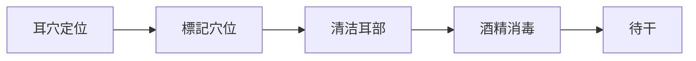
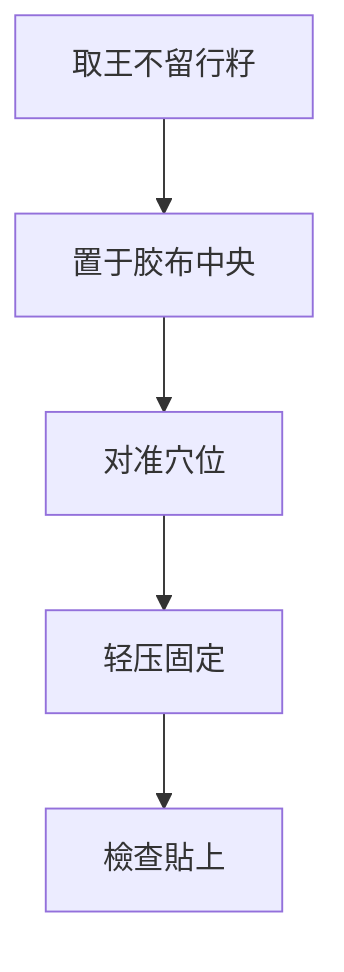
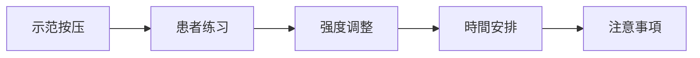
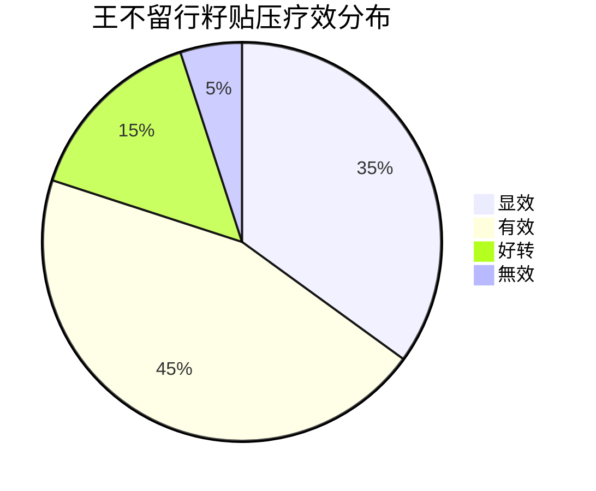

# 🌰 王不留行籽贴压技術

## 📖 概述

# 方法

### 🌟 核心優勢
- #non-invasive - 無创伤，無感染风险
- #safe - 安全性极高，不良反应少
- #simple - 操作简便，易于掌握
- #economical - 成本低廉，材料易得
- #sustained - 持續刺激，效果持久

## 🌱 材料准备

### 🌰 王不留行籽
- **来源**：石竹科植物麦蓝菜的成熟种子
- **性状**：球形，直径1-2mm，黑色或棕黑色
- **特性**：质地坚硬，表面光滑，無毒性
- **選擇標準**：
  - 颗粒饱满，無破损
  - 大小均匀，直径1-2mm
  - 颜色深黑，有光泽
  - 無虫蛀，無霉变

### 📦 贴压材料
| 材料 | 规格 | 要求 | 备注 |
|------|------|------|------|
| 胶布 | 0.5×0.5cm | 医用胶布，透气性好 | 防过敏最佳 |
| 镊子 | 尖头镊子 | 医用镊子，尖端细长 | 便于夹取 |
| 探棒 | 圆头探棒 | 木质或塑料，圆头光滑 | 用于定位 |
| 消毒剂 | 75%酒精 | 医用酒精 | 皮膚消毒 |
| 容器 | 小瓶或盒 | 干燥清洁 | 存放种子 |

## 🔧 操作技術

### 📋 操作前准备
1. **患者准备**
   - 向患者解釋治疗過程
   - 取得患者配合
   - 選擇舒适体位

2. **材料准备**
   - 檢查王不留行籽品質
   - 准备适当大小胶布
   - 檢查工具完整性

3. **環境准备**
   - 清洁安静環境
   - 充足光线照明
   - 适宜温度湿度

### 📍 操作步骤

#### 1️⃣ 定位消毒

**詳細步骤**：
- 🔍 **准確定位**：使用探棒或手指按压寻找敏感点
- ✏️ **標記位置**：用记号笔轻柔標記
- 🧹 **清洁耳部**：用生理盐水清洁耳廓皮膚
- 🦠 **酒精消毒**：75%酒精常规消毒
- ⏳ **等待干燥**：待酒精完全挥发

#### 2️⃣ 种子貼上

**詳細步骤**：
- 🌰 **夹取种子**：用镊子夹取1粒王不留行籽
- 📦 **放置胶布**：将种子置于胶布中央
- 🎯 **对准穴位**：将带有种子的胶布对准穴位
- 👆 **轻压固定**：轻压胶布，确保貼上牢固
- ✅ **檢查貼上**：檢查种子是否准确位于穴位上

#### 3️⃣ 按压指导

# 方法
- 👆 **按压手法**：用拇指和食指对捏按压
- 💪 **按压强度**：以局部酸胀感为度，不可过强
- ⏱️ **按压時間**：每穴按压1-2分钟
- 🔄 **按压频次**：每日3-5次
- 🕐 **最佳時間**：早、中、晚各一次

## 🎯 临床應用程式

### 📋 适用病症
| 疾病分類 | 常用穴位 | 贴压方案 | 疗程安排 |
|----------|----------|----------|----------|
| 🧠 神经系統疾病 | 神门、心、肾、皮质下 | 双耳交替 | 10-15次 |
| ❤️ 心血管疾病 | 心、交感、降压沟 | 双耳同时 | 15-20次 |
| 🍽️ 消化系統疾病 | 胃、脾、大肠、小肠 | 双耳交替 | 10-15次 |
| 🫁 呼吸系統疾病 | 肺、平喘、肾上腺 | 双耳同时 | 10-20次 |
| 🤰 妇科疾病 | 内生殖器、肾、肝 | 双耳交替 | 15-20次 |

### 👶 特殊人群應用程式

#### 👶 儿童患者
- **年龄要求**：3岁以上儿童适用
- **种子選擇**：選擇较小颗粒
- **贴压强度**：轻柔按压，避免过强
- **贴压時間**：2-3天更换一次
- **注意事項**：家长协助按压，防止误吞

#### 👴 老年患者
- **皮膚特點**：皮膚干燥，弹性差
- **胶布選擇**：选用低过敏性胶布
- **贴压時間**：3-5天更换一次
- **按压强度**：以舒适为度，避免损伤
- **注意事項**：观察皮膚反应，及时處理

#### 🤰 孕妇患者
- **禁忌穴位**：避免腹部、腰骶部穴位
- **安全穴位**：四肢、头面部穴位
- **贴压强度**：轻柔按压
- **贴压時間**：2-3天更换
- **注意事項**：密切观察，产科随访

# 管理

### 🚫 禁忌症
- **绝对禁忌**：
  - 耳部皮膚破损、感染
  - 对胶布过敏者
  - 血友病患者

- **相对禁忌**：
  - 糖尿病患者（需密切观察）
  - 严重皮膚病患者
  - 耳部湿疹患者

### ⚠️ 不良反应及處理

#### 🧴 皮膚反应
# 方法
|----------|------|----------|----------|
| 红斑 | 局部皮膚发红 | 减少按压频次 | 降低按压强度 |
| 瘙痒 | 局部瘙痒感 | 更换低敏胶布 | 選擇透气胶布 |
| 过敏 | 皮疹、水泡 | 立即停止贴压 | 皮膚过敏測試 |
| 破损 | 皮膚破损 | 局部消毒處理 | 避免过强按压 |

#### 😰 其他反应
- **头晕**：可能是按压过强，休息后缓解
- **心悸**：暫停按压，观察心电图
- **恶心**：减少按压次数和强度

## 📊 疗效評價

### 📈 評價標準

#### 🎯 疗效分级
- **显效**：症状完全消失，功能恢復正常
- **有效**：症状明显改善，功能基本恢復
- **好转**：症状有所改善，功能部分恢復
- **無效**：症状無改善或加重

### 📋 影响疗效因素
| 因素 | 影响程度 | 優化建議 |
|------|----------|----------|
| **穴位選擇** | 高 | 准确辨证选穴 |
| **贴压技術** | 高 | 規範操作技術 |
| **按压依从性** | 中高 | 加强患者教育 |
| **个体差异** | 中 | 个体化方案 |
| **病程长短** | 中 | 早期治疗效果佳 |

## 🔄 操作技巧

### 💡 专业技巧
1. **定位技巧**
   - 使用探棒轻压寻找最敏感点
   - 對比双耳選擇反应更强的一侧
   - 標記后再次確認位置准确性

2. **貼上技巧**
   - 胶布大小要适中，覆盖种子即可
   - 貼上时要平整，避免皱褶
   - 檢查种子是否准确位于穴位中心

3. **按压技巧**
   - 用指腹按压，避免用指甲
   - 压力由轻到重，逐渐适应
   - 按压时要体会到酸胀感

4. **更换技巧**
   - 更换时清洁旧胶布残留
   - 观察皮膚情况，如有异常暫停
   - 交替使用不同穴位，避免耐受

### 🎯 注意事項
- 🕐 **時間控制**：每穴贴压時間不宜过长
- 🔄 **定期更换**：夏季2-3天，冬季3-5天
- 👀 **皮膚观察**：每次更换时观察皮膚狀態
- 💧 **保持干燥**：洗澡时避免弄湿胶布
# 方法

## 📚 學習資源

### 📖 推荐阅读
- [[耳穴贴压技術規範]] - 技術操作標準
- [[王不留行籽品質標準]] - 材料品質控制
# 指南
- [[老年患者耳穴應用程式]] - 老年人注意事項

# 教程
- [[王不留行籽贴压演示]] - 完整操作視訊
- [[耳穴定位技巧展示]] - 定位技術視訊
- [[患者按压指导視訊]] - 患者教育視訊

### 🧪 實踐练习
- [[耳穴定位练习卡]] - 定位练习工具
- [[贴压技術评分表]] - 技術評估工具
- **临床实习** - 在指导下進行实际操作

---

## 💡 核心要點總結

- 🌰 **材料**：王不留行籽 + 医用胶布
- 🔧 **技術**：准確定位 → 消毒 → 贴压 → 按压指导
- ⏱️ **時間**：每穴1-2分钟，每日3-5次
- 🔄 **更换**：夏季2-3天，冬季3-5天
- ⚠️ **安全**：观察皮膚反应，及时處理异常
- 🎯 **适应**：儿童、老人、怕针患者首选

---

# 查看

🔗 **相關技術**：[[耳穴针刺法]] | [[耳穴按摩法]] | [[磁珠贴压法]]