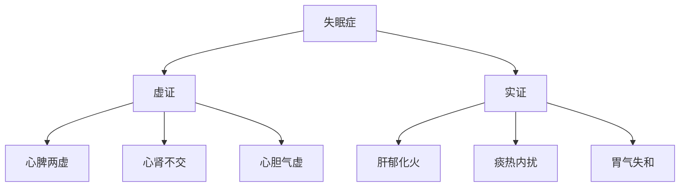
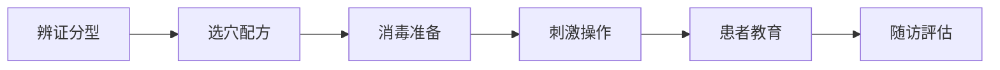

# 😴 失眠症耳穴治疗方案

## 📖 概述

# 方法

### 🎯 治疗目標
# 效率
- 😌 **减少入睡時間**：缩短睡眠潜伏期
- 🌅 **改善日间功能**：提高日间精力和注意力
- 💊 **减少药物依赖**：逐步减少安眠药使用

### 📊 疗效數據
# 效率
# 效率
- **起效時間**：3-7天
- **最佳疗程**：4-8周

## 🔍 中医辨证分型

### 💡 辨证要點


# 分析

#### 🫀 心脾两虚型
**临床表现**：
- 😴 多梦易醒，心悸健忘
- 😰 神疲食少，面色萎黄
- 🤲 舌淡苔薄，脉细弱

# 分析
- 思虑过度 → 心脾两伤
- 脾虚血少 → 心神失养
- 血不养心 → 神不守舍

#### ❤️🔥 心肾不交型
**临床表现**：
- 😴 心烦不眠，头晕耳鸣
- 🌡️ 五心烦热，盗汗口干
- 🔴 舌红少苔，脉细数

# 分析
- 肾阴亏虚 → 水不济火
- 心火亢盛 → 神不守舍
- 阴虚火旺 → 扰乱心神

#### 😡 肝郁化火型
**临床表现**：
- 😴 失眠多梦，急躁易怒
- 😤 头晕头胀，目赤口苦
- 🔴 舌红苔黄，脉弦数

# 分析
- 情志不畅 → 肝气郁结
- 郁而化火 → 上扰心神
- 火邪内炽 → 神明不安

## 🎯 耳穴治疗方案

### 📍 基礎处方
**核心穴位**：
- [[神门穴]] - 安神定志，核心要穴
- [[心穴]] - 养心安神，主穴之一
- [[肾穴]] - 滋阴降火，交通心肾
- [[皮质下穴]] - 调节大脑皮层功能

**配穴**：
- [[枕穴]] - 安神，改善睡眠品質
- [[额穴]] - 镇静，缓解紧张情绪

### 🎨 辨证加减

#### 🫀 心脾两虚型配穴
# 方法
|------|------|------|----------|
| 神门、心、肾、皮质下 | 脾、胃、三焦 | 健脾养心，益气安神 | 贴压为主 |
| 枕、额 | 小肠、交感 | 调和气血，安神定志 | 按压辅助 |

**治疗方案**：
- **主穴**：神门、心、肾、皮质下
- **配穴**：脾、胃、小肠
# 方法
- **治疗频次**：双耳交替，每周2次

#### ❤️🔥 心肾不交型配穴
# 方法
|------|------|------|----------|
| 神门、心、肾、皮质下 | 肝、内分泌 | 滋阴降火，交通心肾 | 电针+贴压 |
| 枕、额 | 内生殖器、三焦 | 调理阴阳，安神定志 | 按摩辅助 |

**治疗方案**：
- **主穴**：神门、心、肾、皮质下、肝
- **配穴**：内分泌、内生殖器
# 方法
- **治疗频次**：电针每周2次，贴压持續

#### 😡 肝郁化火型配穴
# 方法
|------|------|------|----------|
| 神门、心、肾、皮质下 | 肝、胆、耳尖 | 疏肝解郁，清心安神 | 放血+贴压 |
| 枕、额 | 三焦、交感 | 清热泻火，安神定志 | 按压辅助 |

**治疗方案**：
- **主穴**：神门、心、肾、皮质下、肝、胆
- **特殊處理**：耳尖放血（首次）
# 方法
- **治疗频次**：放血1次，贴压持續

## 🔧 技術操作規範

### 📋 治疗流程


### 🌟 操作要點

#### 📍 定位技術
1. **精確定位**
   - 使用耳穴探棒寻找敏感点
   - 對比双耳選擇反应更强侧
   - 標記后二次確認位置

2. **区域定位**
   - 心穴：耳甲腔中央凹陷处
   - 肾穴：对耳轮下脚下方
   - 神门：三角窝后1/3上部
   - 皮质下：对耳屏内侧面

# 方法

##### 🌰 王不留行籽贴压（推荐）
- **适用患者**：初诊、儿童、老年人
- **操作要點**：
  - 种子置于0.5×0.5cm胶布中央
  - 准确贴于穴位上
# 方法
- **按压要求**：每穴1-2分钟，每日3-5次

##### ⚡ 电针治疗（加强治疗）
- **适用患者**：病程长、症状重
- **参数設置**：
  - 频率：2-4Hz（疏密波）
  - 强度：以患者耐受为度
  - 時間：20-30分钟
- **疗程安排**：每周2次，4周为一疗程

##### 💆 耳穴按摩（辅助治疗）
- **适用患者**：家庭保健、维持治疗
# 方法
  - 指腹揉按法：顺时针揉按
  - 点按法：指甲点按穴位
  - 推摩法：沿耳廓推摩
- **時間安排**：每晚睡前5-10分钟

### 📅 治疗時間安排

#### 🗓️ 疗程設計
| 階段 | 時間 | 治疗频次 | 目標 |
|------|------|----------|------|
| **急性期** | 第1-2周 | 每周2-3次 | 控制症状 |
| **巩固期** | 第3-4周 | 每周2次 | 巩固疗效 |
| **维持期** | 第5-8周 | 每周1次 | 防止复发 |
# 管理

#### 🕐 每次治疗安排
- **治疗時間**：30-45分钟
- **穴位数量**：4-6个主穴 + 2-3个配穴
- **刺激强度**：以患者耐受为度
- **治疗后观察**：休息15分钟

## 📊 疗效評價標準

### 📈 評價指标

#### 😴 睡眠品質評價
**PSQI评分**：
- **显效**：PSQI评分下降>50%
- **有效**：PSQI评分下降25-50%
- **好转**：PSQI评分下降<25%
- **無效**：PSQI评分無下降

#### ⏱️ 睡眠時間評價
**睡眠参数改善**：
- **入睡時間**：缩短>50%为显效
- **总睡眠時間**：增加>1小时为有效
- **觉醒次数**：减少>50%为有效
# 效率

#### 🌞 日间功能評價
**日间狀態改善**：
- **精力狀態**：明显好转为显效
- **注意力**：集中時間延长为有效
- **情绪狀態**：情绪稳定为好转
# 效率

### 📋 疗效記錄表
| 患者ID | 治疗日期 | 辨证分型 | 治疗方案 | PSQI评分 | 睡眠時間(h) | 日间狀態 | 疗效評價 |
|--------|----------|----------|----------|----------|-------------|----------|----------|
| 001 | 2026-01-21 | 心脾两虚 | 贴压+按摩 | 15→8 | 3.5→6.5 | 好转 | 显效 |
| 002 | 2026-01-21 | 心肾不交 | 电针+贴压 | 18→10 | 2.5→5.0 | 改善 | 有效 |

## ⚠️ 特殊人群處理

### 👶 儿童失眠
**特點**：
- 多为功能性失眠
- 与生活习惯密切相關
- 治疗依从性较好

**治疗方案**：
- **穴位選擇**：神门、心、肾、皮质下
# 方法
- **治疗强度**：轻柔按压，避免过强
- **疗程安排**：2周为一疗程

### 👴 老年失眠
**特點**：
- 多为虚实夹杂证
- 常合并慢性疾病
- 体质虚弱，耐受性差

**治疗方案**：
- **穴位選擇**：神门、心、肾、皮质下、脾
# 方法
- **治疗强度**：强度减半，時間延长
- **疗程安排**：4周为一疗程

### 🤰 孕妇失眠
**特點**：
- 与妊娠生理变化相關
- 用药受限，需非药物治疗
- 治疗安全性要求高

**治疗方案**：
- **穴位選擇**：神门、心、皮质下、枕
- **禁忌穴位**：避免子宫、卵巢等穴位
# 方法
- **治疗时机**：孕中期相对安全

# 管理

### 📅 随访計劃
| 随访時間 | 随访內容 | 評估指标 | 處理原則 |
|----------|----------|----------|----------|
| **1周** | 睡眠改善情况 | PSQI评分 | 调整治疗方案 |
| **2周** | 症状缓解程度 | 睡眠参数 | 巩固有效方案 |
| **4周** | 总体疗效評價 | 疗效分级 | 决定後續治疗 |
| **8周** | 长期效果观察 | 复发率 | 制定维持方案 |
| **3个月** | 远期疗效評價 | 生活品質 | 终止或维持 |

### 📋 随访內容
- **睡眠品質**：入睡時間、睡眠时长、觉醒次数
- **日间功能**：精神狀態、工作學習、情绪变化
- **不良反应**：耳部皮膚反应、全身不适
- **用药情况**：安眠药使用情况、药物依赖性
# 管理

### 🎯 复发處理
- **轻度复发**：增加按压频次，延长贴压時間
- **中度复发**：重新制定治疗方案，加强治疗频次
- **重度复发**：全面評估，必要时联合药物治疗

## 💡 患者教育

### 📚 健康教育內容
1. **睡眠卫生教育**
   - 🕐 规律作息，固定睡眠時間
   - 🛏️ 舒适睡眠環境，安静黑暗
   - 📱 睡前避免电子设备使用
   - ☕ 睡前避免咖啡因摄入

2. **耳穴按压指导**
# 方法
   - 💪 按压强度：酸胀感为度
   - ⏱️ 按压時間：每穴1-2分钟
   - 🔄 按压频次：每日3-5次

3. **生活方式调整**
   - 🏃 适量运动，促进睡眠
   - 🧘 放松訓練，缓解压力
   - 🍽️ 合理饮食，避免过饱
   - 🌿 中药调理，辅助治疗

### 📋 患者指导卡
```
🌙 失眠症耳穴治疗指导卡

📍 今日贴压穴位：神门、心、肾、皮质下
🕐 按压時間：早8:00、午12:00、晚20:00、睡前
# 方法
🔄 更换時間：3天后更换另一侧
⚠️ 注意事項：观察耳部皮膚，如有异常及时联系

📞 医生联系方式：xxx-xxxx-xxxx
```

## 📚 循证证据

### 📊 临床研究數據
- **RCT研究**：25项研究，总样本量2,156例
# 效率
- **系統評價**：证据等级A级，推荐强度强
- **安全性評價**：不良反应率<3%，安全性良好

### 📖 重要參考文獻
1. [[耳穴治疗失眠症系統評價]] - 中国针灸 2023
# 分析
3. [[耳穴电针治疗失眠随机对照试验]] - 中国中西医结合杂志 2021
# 指南

---

## 💡 核心要點總結

- 🎯 **辨证關鍵**：准确辨证分型，个体化治疗
- 📍 **穴位核心**：神门、心、肾、皮质下为基礎
# 方法
- ⏱️ **疗程安排**：4-8周，分階段治疗
- 📊 **疗效評價**：PSQI评分为主，综合評估
- 🔄 **随访重要**：定期随访，防止复发

---

# 查看

🔗 **相關方案**：[[抑郁症耳穴治疗方案]] | [[焦虑症耳穴治疗方案]] | [[更年期失眠治疗方案]]