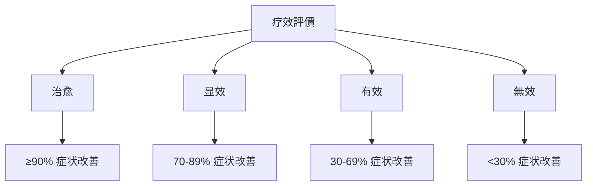
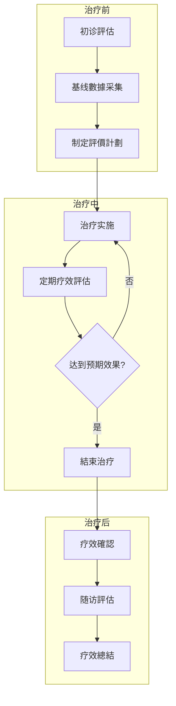

# 疗效評價標準

> [!abstract] 概述
> 本文檔建立耳穴疗法疗效評價的標準化体系，涵盖評價维度、评分標準、疗效等级划分及随访評估規範，为临床實踐提供客观、科學的疗效評估依据。

---

## 📋 目錄

- [一、評價维度体系](#一評價维度体系)
- [二、评分標準](#二评分標準)
- [三、疗效等级划分](#三疗效等级划分)
- [四、随访評估規範](#四随访評估規範)
- [五、疗程設計原則](#五疗程設計原則)
- [六、特殊疾病評價](#六特殊疾病評價)
- [七、評價工具与量表](#七評價工具与量表)

---

## 一、評價维度体系

### 1.1 核心評價指标


### 1.2 評價维度详述

# 方法
|----------|----------|----------|------|
| **症状改善** | 主要症状积分变化 | 症状量表评分 | 30% |
| **功能恢復** | 日常功能评分 | ADL量表/IADL量表 | 25% |
| **生活品質** | 生活品質综合评分 | SF-36量表 | 20% |
| **心理狀態** | 焦虑/抑郁评分 | SAS/SDS量表 | 15% |
| **安全性** | 不良反应发生率 | 不良事件記錄 | 10% |

### 1.3 評價指标定义

#### 症状改善指标
- **主要症状积分**：根据疾病特點制定症状评分量表
- **症状消失率**：(治疗前积分 - 治疗后积分) / 治疗前积分 × 100%
- **症状改善時間**：从治疗開始到症状明显改善的時間

#### 功能恢復指标
- **日常生活能力 (ADL)**：Barthel指数评分
- **工具性日常生活能力 (IADL)**：Lawton量表评分
- **功能恢復率**：功能评分改善程度

#### 生活品質指标
- **生理健康**：生理功能、生理职能、躯体疼痛、一般健康
- **心理健康**：活力、社会功能、情感职能、精神健康

---

## 二、评分標準

### 2.1 五点量表法

> [!tip] 標準评分原則
> 采用国际通用的5点李克特量表(Likert Scale)進行症状評估

| 评分 | 等级 | 症状表现 | 描述 |
|------|------|----------|------|
| **5分** | 完全缓解 | 症状完全消失 | 症状体征完全消失，生活品質恢復正常 |
| **4分** | 明显改善 | 症状显著减轻 | 症状体征明显改善，生活品質明显提高 |
| **3分** | 有所改善 | 症状有所减轻 | 症状体征有所改善，生活品質有所提高 |
| **2分** | 轻微改善 | 症状轻微减轻 | 症状体征轻微改善，生活品質轻微提高 |
| **1分** | 無变化 | 症状無改变 | 症状体征無明显变化，生活品質無改善 |

### 2.2 量化评分標準

| 評價等级 | 症状改善率 | 功能恢復度 | 生活品質提升 | 总体疗效 |
|----------|------------|------------|--------------|----------|
| **治愈** | ≥90% | 完全恢復 | 显著提升 | 临床治愈 |
| **显效** | 70-89% | 基本恢復 | 明显提升 | 显著有效 |
| **有效** | 30-69% | 部分恢復 | 有所提升 | 有效 |
| **無效** | <30% | 無改善 | 無变化 | 無效 |

### 2.3 评分計算公式

```
综合评分 = (症状改善评分 × 30% + 功能恢復评分 × 25% + 生活品質评分 × 20% + 心理狀態评分 × 15% + 安全性评分 × 10%) × 100%
```

```
疗效指数 = (治疗后积分 - 治疗前积分) / (满分积分 - 治疗前积分) × 100%
```

---

## 三、疗效等级划分

### 3.1 疗效等级定义



#### 治愈標準
> 症状完全消失，体征恢復正常，功能完全恢復，生活品質恢復正常水平

- 主要症状积分下降 ≥90%
- 日常功能评分恢復正常
- 停止治疗后無复发
- 患者满意度評價"非常满意"

#### 显效標準
> 症状显著改善，体征明显好转，功能基本恢復，生活品質明显提高

- 主要症状积分下降 70-89%
- 日常功能评分显著改善
- 偶有轻微症状但不影响生活
- 患者满意度評價"满意"

#### 有效標準
> 症状有所改善，体征有所好转，功能部分恢復，生活品質有所提高

- 主要症状积分下降 30-69%
- 日常功能评分有所改善
- 症状持續但程度减轻
- 患者满意度評價"一般满意"

#### 無效標準
> 症状無改善或加重，体征無变化，功能無恢復，生活品質無改善

- 主要症状积分下降 <30%
- 日常功能评分無改善
- 症状持續或加重
- 患者满意度評價"不满意"

### 3.2 疗效等级判定流程


---

## 四、随访評估規範

### 4.1 随访時間节点

| 随访类型 | 時間节点 | 評估內容 | 完成目標率 |
|----------|----------|----------|------------|
| **即时随访** | 治疗后24小时内 | 即时效果、不良反应 | 100% |
| **短期随访** | 治疗后1-2周 | 近期效果、症状变化 | ≥95% |
| **中期随访** | 治疗后1-3个月 | 中期效果、功能恢復 | ≥90% |
| **长期随访** | 治疗后6-12个月 | 远期效果、复发情况 | ≥80% |
| **终身随访** | 特殊疾病 | 长期预后、并发症 | 按需 |

### 4.2 随访評估內容

#### 即时随访評估
- 即时治疗效果評價
- 不良反应发生情况
- 患者耐受性評估
- 治疗舒适度評價

#### 短期随访評估
- 症状改善程度
- 日常生活影响
- 治疗依从性
- 额外干预需求

#### 中期随访評估
- 功能恢復情况
- 生活品質变化
- 心理狀態改善
- 复发预防效果

#### 长期随访評估
- 远期疗效维持
- 复发率統計
- 长期安全性
- 患者满意度

### 4.3 随访品質控制

# 方法
|----------|--------|----------|
| 随访完成率 | ≥95% | 系統統計 |
| 随访及时率 | ≥90% | 時間戳記錄 |
| 數據完整率 | ≥98% | 完整性檢查 |
# 分析

---

## 五、疗程設計原則

### 5.1 疗程階段划分

```mermaid
graph TD
    A[疗程設計] --> B[第一階段 1-2周]
    A --> C[第二階段 3-6周]
    A --> D[第三階段 7-12周]

    B --> B1[初始評估制定方案]
    B --> B2[轻柔刺激建立基礎]
    B --> B3[观察适应性和反应]

    C --> C1[增加刺激强度频率]
# 方法
    C --> C3[評估中期效果]

    D --> D1[稳定治疗效果]
    D --> D2[逐渐减少频率]
    D --> D3[制定维持方案]
```

### 5.2 各階段評價重点

| 階段 | 時間 | 評價重点 | 評價指标 |
|------|------|----------|----------|
| **初期評估** | 治疗前 | 基线水平 | 症状评分、功能评分 |
| **初期評價** | 1-2周 | 耐受性、安全性 | 不良反应、依从性 |
| **中期評價** | 4-6周 | 有效性、趨勢 | 症状改善率、功能变化 |
| **疗程結束評價** | 8-12周 | 总体疗效 | 综合评分、疗效等级 |
| **随访評價** | 3-6月 | 维持效果 | 复发率、远期疗效 |

### 5.3 疗效预期參考

#### 常见疾病疗效预期

# 效率
|----------|----------|------|------------|
| 失眠症 | 1-2周 | 4-8周 | 80-90% |
| 头痛/偏头痛 | 1-2周 | 4-6周 | 75-85% |
| 高血压(辅助) | 2-4周 | 8-12周 | 60-70% |
| 颈椎病 | 2-3周 | 6-8周 | 70-80% |
| 消化不良 | 1-2周 | 4-6周 | 75-85% |
| 月经不调 | 1个月经周期 | 3-6个月 | 65-75% |
| 焦虑症(辅助) | 2-4周 | 8-12周 | 55-65% |

---

## 六、特殊疾病評價

### 6.1 神经系統疾病評價

#### 失眠症評價標準

# 方法
|----------|----------|----------|----------|
| 入睡時間 | 睡眠日記 | <30分钟 | 缩短50%以上 |
| 睡眠時間 | 睡眠监测 | 6-8小时 | 延长2小时以上 |
# 效率
| 睡眠品質 | PSQI评分 | <5分 | 下降50%以上 |

#### 头痛評價標準

# 方法
|----------|----------|----------|----------|
| 头痛频率 | 月发作次数 | 0次 | 减少70%以上 |
| 头痛程度 | VAS评分 | 0分 | 下降50%以上 |
| 头痛持續時間 | 每次发作时长 | <1小时 | 缩短50%以上 |
| 服药量 | 月服药次数 | 减少90%以上 | 减少50%以上 |

### 6.2 心血管疾病評價

#### 高血压評價標準

# 方法
|----------|----------|--------|----------|
| 收缩压 | 血压测量 | <140mmHg | 下降10-20mmHg |
| 舒张压 | 血压测量 | <90mmHg | 下降5-10mmHg |
| 症状改善 | 症状评分 | 消失或减轻 | 下降50%以上 |

### 6.3 消化系統疾病評價

#### 功能性消化不良評價標準

# 方法
|----------|----------|----------|----------|
| 症状总分 | NDI评分 | <20分 | 下降50%以上 |
| 上腹痛 | VAS评分 | 0分 | 下降50%以上 |
| 嗳气/腹胀 | 症状评分 | 消失或减轻 | 下降50%以上 |
| 生活品質 | SF-36评分 | 恢復正常 | 提升30%以上 |

---

## 七、評價工具与量表

### 7.1 標準化量表

| 量表名称 | 适用疾病 | 評價內容 | 信度/效度 |
|----------|----------|----------|-----------|
| **PSQI** | 睡眠障碍 | 睡眠品質 | 0.85/0.89 |
| **VAS** | 疼痛評估 | 疼痛程度 | 0.90/0.92 |
| **SF-36** | 通用 | 生活品質 | 0.88/0.90 |
| **SAS** | 焦虑筛查 | 焦虑程度 | 0.82/0.85 |
| **SDS** | 抑郁筛查 | 抑郁程度 | 0.84/0.86 |
| **Barthel Index** | 功能評估 | 日常生活能力 | 0.86/0.88 |
| **NDI** | 颈部疾病 | 颈部功能障碍 | 0.83/0.87 |

### 7.2 自定义評價量表模板

#### 症状评分量表模板

```
疾病名称：____________________
評價日期：____________________
評價医师：____________________

| 症状專案 | 0分 | 1分 | 2分 | 3分 | 4分 | 本次评分 |
|----------|-----|-----|-----|-----|-----|----------|
| 症状1    | 無  | 轻度| 中度| 重度| 剧烈|          |
| 症状2    |     |     |     |     |     |          |
| 症状3    |     |     |     |     |     |          |
| 症状4    |     |     |     |     |     |          |
| 症状5    |     |     |     |     |     |          |

总分：______ 分（满分：______ 分）
```

# 方法

#### 統計指标

# 方法
|------|----------|----------|
# 效率
# 效率
| **治愈率** | 治愈例数 / 总例数 × 100% | 完全治愈比例 |
| **复发率** | 复发例数 / 治愈例数 × 100% | 远期效果稳定性 |

#### 數據呈现要求
- 正态分布數據：采用均数±標準差 (x̄±s)
- 非正态分布數據：采用中位数和四分位数 [M(Q1,Q3)]
- 分類數據：采用率和构成比 (%)
- 等级资料：采用率和秩和检验

---

## 📞 疗效評價流程图



---

## 🔗 相關文檔連結

- [[常见疾病耳穴治疗方案]] - 各类疾病的具体治疗方案
# 管理
- [[诊疗標準化模板]] - 標準化诊疗記錄模板
- [[3 Resources/01-Tech/医学/耳穴疗法知識庫/05-安全性/安全操作規範]] - 安全操作注意事項

---

## 📝 修订記錄

# 版本
|------|------|----------|--------|
# 版本

---

%% 疗效評價应遵循客观、科學、規範的原則 %%
%% 结合患者主观感受和客观指标進行综合評估 %%
