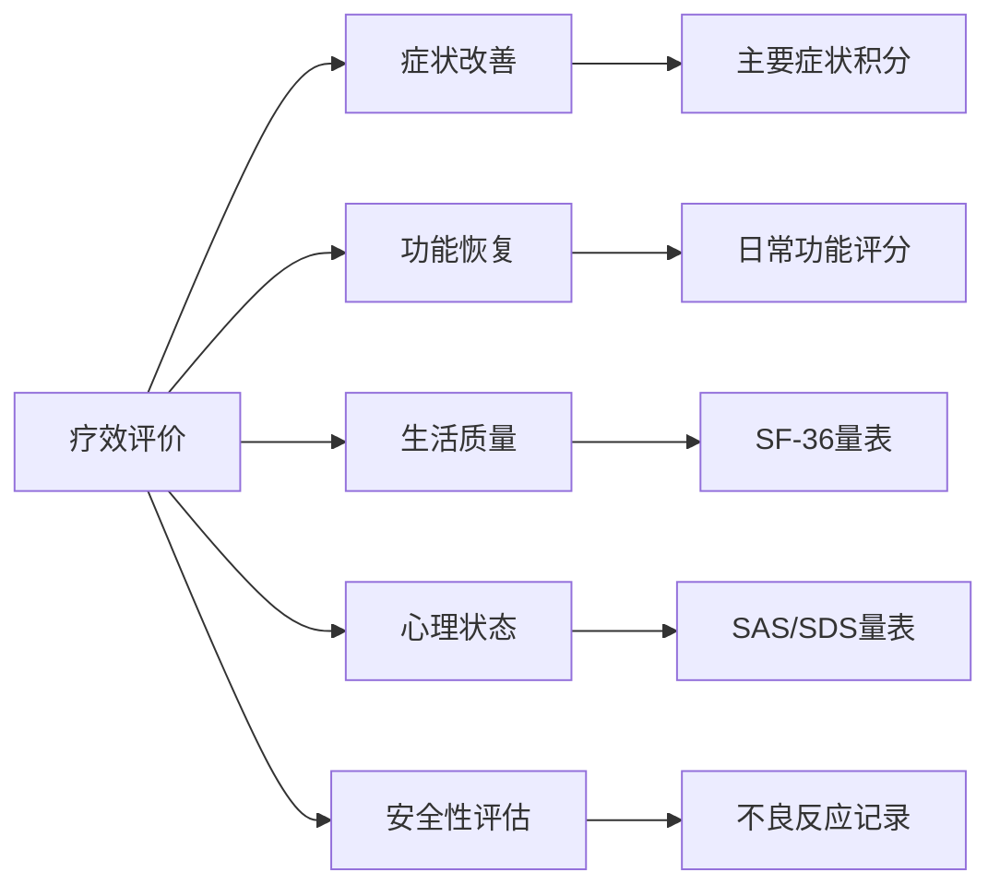
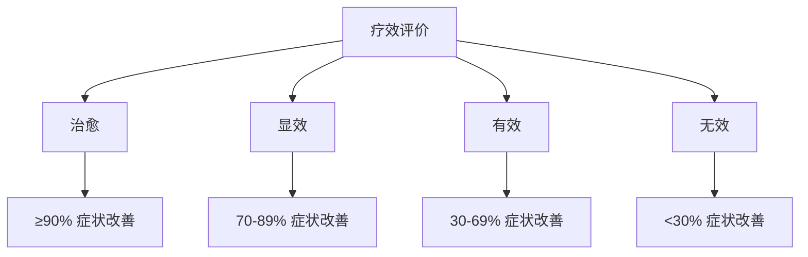
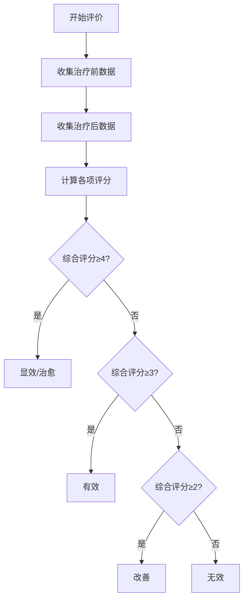
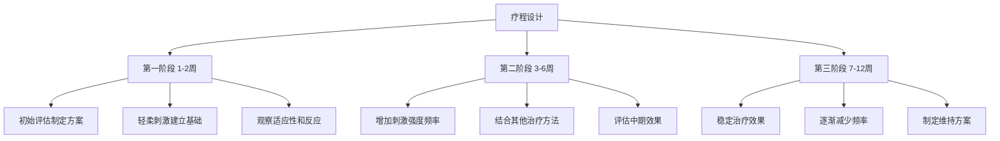
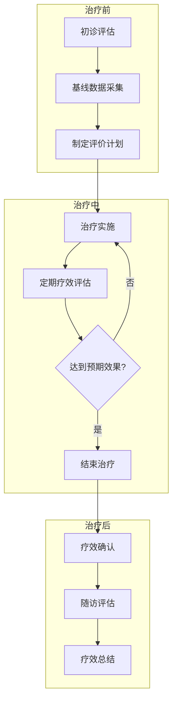

# 疗效评价标准

> [!abstract] 概述
> 本文档建立耳穴疗法疗效评价的标准化体系，涵盖评价维度、评分标准、疗效等级划分及随访评估规范，为临床实践提供客观、科学的疗效评估依据。

---

## 📋 目录

- [一、评价维度体系](#一评价维度体系)
- [二、评分标准](#二评分标准)
- [三、疗效等级划分](#三疗效等级划分)
- [四、随访评估规范](#四随访评估规范)
- [五、疗程设计原则](#五疗程设计原则)
- [六、特殊疾病评价](#六特殊疾病评价)
- [七、评价工具与量表](#七评价工具与量表)

---

## 一、评价维度体系

### 1.1 核心评价指标



### 1.2 评价维度详述

| 评价维度 | 评价指标 | 评价方法 | 权重 |
|----------|----------|----------|------|
| **症状改善** | 主要症状积分变化 | 症状量表评分 | 30% |
| **功能恢复** | 日常功能评分 | ADL量表/IADL量表 | 25% |
| **生活质量** | 生活质量综合评分 | SF-36量表 | 20% |
| **心理状态** | 焦虑/抑郁评分 | SAS/SDS量表 | 15% |
| **安全性** | 不良反应发生率 | 不良事件记录 | 10% |

### 1.3 评价指标定义

#### 症状改善指标
- **主要症状积分**：根据疾病特点制定症状评分量表
- **症状消失率**：(治疗前积分 - 治疗后积分) / 治疗前积分 × 100%
- **症状改善时间**：从治疗开始到症状明显改善的时间

#### 功能恢复指标
- **日常生活能力 (ADL)**：Barthel指数评分
- **工具性日常生活能力 (IADL)**：Lawton量表评分
- **功能恢复率**：功能评分改善程度

#### 生活质量指标
- **生理健康**：生理功能、生理职能、躯体疼痛、一般健康
- **心理健康**：活力、社会功能、情感职能、精神健康

---

## 二、评分标准

### 2.1 五点量表法

> [!tip] 标准评分原则
> 采用国际通用的5点李克特量表(Likert Scale)进行症状评估

| 评分 | 等级 | 症状表现 | 描述 |
|------|------|----------|------|
| **5分** | 完全缓解 | 症状完全消失 | 症状体征完全消失，生活质量恢复正常 |
| **4分** | 明显改善 | 症状显著减轻 | 症状体征明显改善，生活质量明显提高 |
| **3分** | 有所改善 | 症状有所减轻 | 症状体征有所改善，生活质量有所提高 |
| **2分** | 轻微改善 | 症状轻微减轻 | 症状体征轻微改善，生活质量轻微提高 |
| **1分** | 无变化 | 症状无改变 | 症状体征无明显变化，生活质量无改善 |

### 2.2 量化评分标准

| 评价等级 | 症状改善率 | 功能恢复度 | 生活质量提升 | 总体疗效 |
|----------|------------|------------|--------------|----------|
| **治愈** | ≥90% | 完全恢复 | 显著提升 | 临床治愈 |
| **显效** | 70-89% | 基本恢复 | 明显提升 | 显著有效 |
| **有效** | 30-69% | 部分恢复 | 有所提升 | 有效 |
| **无效** | <30% | 无改善 | 无变化 | 无效 |

### 2.3 评分计算公式

```
综合评分 = (症状改善评分 × 30% + 功能恢复评分 × 25% + 生活质量评分 × 20% + 心理状态评分 × 15% + 安全性评分 × 10%) × 100%
```

```
疗效指数 = (治疗后积分 - 治疗前积分) / (满分积分 - 治疗前积分) × 100%
```

---

## 三、疗效等级划分

### 3.1 疗效等级定义



#### 治愈标准
> 症状完全消失，体征恢复正常，功能完全恢复，生活质量恢复正常水平

- 主要症状积分下降 ≥90%
- 日常功能评分恢复正常
- 停止治疗后无复发
- 患者满意度评价"非常满意"

#### 显效标准
> 症状显著改善，体征明显好转，功能基本恢复，生活质量明显提高

- 主要症状积分下降 70-89%
- 日常功能评分显著改善
- 偶有轻微症状但不影响生活
- 患者满意度评价"满意"

#### 有效标准
> 症状有所改善，体征有所好转，功能部分恢复，生活质量有所提高

- 主要症状积分下降 30-69%
- 日常功能评分有所改善
- 症状持续但程度减轻
- 患者满意度评价"一般满意"

#### 无效标准
> 症状无改善或加重，体征无变化，功能无恢复，生活质量无改善

- 主要症状积分下降 <30%
- 日常功能评分无改善
- 症状持续或加重
- 患者满意度评价"不满意"

### 3.2 疗效等级判定流程



---

## 四、随访评估规范

### 4.1 随访时间节点

| 随访类型 | 时间节点 | 评估内容 | 完成目标率 |
|----------|----------|----------|------------|
| **即时随访** | 治疗后24小时内 | 即时效果、不良反应 | 100% |
| **短期随访** | 治疗后1-2周 | 近期效果、症状变化 | ≥95% |
| **中期随访** | 治疗后1-3个月 | 中期效果、功能恢复 | ≥90% |
| **长期随访** | 治疗后6-12个月 | 远期效果、复发情况 | ≥80% |
| **终身随访** | 特殊疾病 | 长期预后、并发症 | 按需 |

### 4.2 随访评估内容

#### 即时随访评估
- 即时治疗效果评价
- 不良反应发生情况
- 患者耐受性评估
- 治疗舒适度评价

#### 短期随访评估
- 症状改善程度
- 日常生活影响
- 治疗依从性
- 额外干预需求

#### 中期随访评估
- 功能恢复情况
- 生活质量变化
- 心理状态改善
- 复发预防效果

#### 长期随访评估
- 远期疗效维持
- 复发率统计
- 长期安全性
- 患者满意度

### 4.3 随访质量控制

| 随访指标 | 目标值 | 监测方法 |
|----------|--------|----------|
| 随访完成率 | ≥95% | 系统统计 |
| 随访及时率 | ≥90% | 时间戳记录 |
| 数据完整率 | ≥98% | 完整性检查 |
| 患者失访率 | <5% | 失访原因分析 |

---

## 五、疗程设计原则

### 5.1 疗程阶段划分



### 5.2 各阶段评价重点

| 阶段 | 时间 | 评价重点 | 评价指标 |
|------|------|----------|----------|
| **初期评估** | 治疗前 | 基线水平 | 症状评分、功能评分 |
| **初期评价** | 1-2周 | 耐受性、安全性 | 不良反应、依从性 |
| **中期评价** | 4-6周 | 有效性、趋势 | 症状改善率、功能变化 |
| **疗程结束评价** | 8-12周 | 总体疗效 | 综合评分、疗效等级 |
| **随访评价** | 3-6月 | 维持效果 | 复发率、远期疗效 |

### 5.3 疗效预期参考

#### 常见疾病疗效预期

| 疾病类型 | 起效时间 | 疗程 | 预期有效率 |
|----------|----------|------|------------|
| 失眠症 | 1-2周 | 4-8周 | 80-90% |
| 头痛/偏头痛 | 1-2周 | 4-6周 | 75-85% |
| 高血压(辅助) | 2-4周 | 8-12周 | 60-70% |
| 颈椎病 | 2-3周 | 6-8周 | 70-80% |
| 消化不良 | 1-2周 | 4-6周 | 75-85% |
| 月经不调 | 1个月经周期 | 3-6个月 | 65-75% |
| 焦虑症(辅助) | 2-4周 | 8-12周 | 55-65% |

---

## 六、特殊疾病评价

### 6.1 神经系统疾病评价

#### 失眠症评价标准

| 评价指标 | 评价方法 | 治愈标准 | 有效标准 |
|----------|----------|----------|----------|
| 入睡时间 | 睡眠日记 | <30分钟 | 缩短50%以上 |
| 睡眠时间 | 睡眠监测 | 6-8小时 | 延长2小时以上 |
| 睡眠效率 | 睡眠效率公式 | >85% | 提升20%以上 |
| 睡眠质量 | PSQI评分 | <5分 | 下降50%以上 |

#### 头痛评价标准

| 评价指标 | 评价方法 | 治愈标准 | 有效标准 |
|----------|----------|----------|----------|
| 头痛频率 | 月发作次数 | 0次 | 减少70%以上 |
| 头痛程度 | VAS评分 | 0分 | 下降50%以上 |
| 头痛持续时间 | 每次发作时长 | <1小时 | 缩短50%以上 |
| 服药量 | 月服药次数 | 减少90%以上 | 减少50%以上 |

### 6.2 心血管疾病评价

#### 高血压评价标准

| 评价指标 | 评价方法 | 目标值 | 有效标准 |
|----------|----------|--------|----------|
| 收缩压 | 血压测量 | <140mmHg | 下降10-20mmHg |
| 舒张压 | 血压测量 | <90mmHg | 下降5-10mmHg |
| 症状改善 | 症状评分 | 消失或减轻 | 下降50%以上 |

### 6.3 消化系统疾病评价

#### 功能性消化不良评价标准

| 评价指标 | 评价方法 | 治愈标准 | 有效标准 |
|----------|----------|----------|----------|
| 症状总分 | NDI评分 | <20分 | 下降50%以上 |
| 上腹痛 | VAS评分 | 0分 | 下降50%以上 |
| 嗳气/腹胀 | 症状评分 | 消失或减轻 | 下降50%以上 |
| 生活质量 | SF-36评分 | 恢复正常 | 提升30%以上 |

---

## 七、评价工具与量表

### 7.1 标准化量表

| 量表名称 | 适用疾病 | 评价内容 | 信度/效度 |
|----------|----------|----------|-----------|
| **PSQI** | 睡眠障碍 | 睡眠质量 | 0.85/0.89 |
| **VAS** | 疼痛评估 | 疼痛程度 | 0.90/0.92 |
| **SF-36** | 通用 | 生活质量 | 0.88/0.90 |
| **SAS** | 焦虑筛查 | 焦虑程度 | 0.82/0.85 |
| **SDS** | 抑郁筛查 | 抑郁程度 | 0.84/0.86 |
| **Barthel Index** | 功能评估 | 日常生活能力 | 0.86/0.88 |
| **NDI** | 颈部疾病 | 颈部功能障碍 | 0.83/0.87 |

### 7.2 自定义评价量表模板

#### 症状评分量表模板

```
疾病名称：____________________
评价日期：____________________
评价医师：____________________

| 症状项目 | 0分 | 1分 | 2分 | 3分 | 4分 | 本次评分 |
|----------|-----|-----|-----|-----|-----|----------|
| 症状1    | 无  | 轻度| 中度| 重度| 剧烈|          |
| 症状2    |     |     |     |     |     |          |
| 症状3    |     |     |     |     |     |          |
| 症状4    |     |     |     |     |     |          |
| 症状5    |     |     |     |     |     |          |

总分：______ 分（满分：______ 分）
```

### 7.3 数据分析方法

#### 统计指标

| 指标 | 计算方法 | 临床意义 |
|------|----------|----------|
| **有效率** | (治愈+显效+有效例数) / 总例数 × 100% | 治疗总体效果 |
| **显效率** | (治愈+显效例数) / 总例数 × 100% | 显著改善比例 |
| **治愈率** | 治愈例数 / 总例数 × 100% | 完全治愈比例 |
| **复发率** | 复发例数 / 治愈例数 × 100% | 远期效果稳定性 |

#### 数据呈现要求
- 正态分布数据：采用均数±标准差 (x̄±s)
- 非正态分布数据：采用中位数和四分位数 [M(Q1,Q3)]
- 分类数据：采用率和构成比 (%)
- 等级资料：采用率和秩和检验

---

## 📞 疗效评价流程图



---

## 🔗 相关文档链接

- [[常见疾病耳穴治疗方案]] - 各类疾病的具体治疗方案
- [[质量控制体系]] - 质量管理整体框架
- [[诊疗标准化模板]] - 标准化诊疗记录模板
- [[3 Resources/耳穴疗法知识库/05-安全性/安全操作规范]] - 安全操作注意事项

---

## 📝 修订记录

| 版本 | 日期 | 修订内容 | 修订人 |
|------|------|----------|--------|
| V1.0 | 2026-01-25 | 初始版本 | 系统生成 |

---

%% 疗效评价应遵循客观、科学、规范的原则 %%
%% 结合患者主观感受和客观指标进行综合评估 %%
