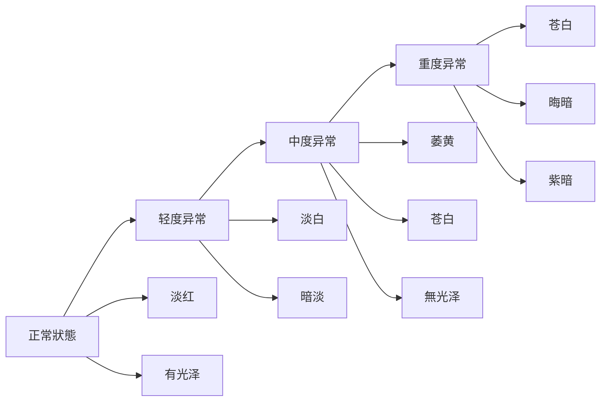
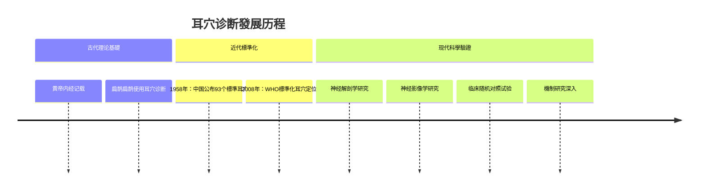

# 耳穴诊断理论基礎

> [!abstract] 诊断概述
# 方法

---

## 🧭 诊断理论基礎

### 耳穴诊断原理

> [!note] 诊断依据
> 耳穴与全身脏腑、经络相通，通過观察耳廓的色泽、形态、分泌物、压痛反应等，可以判斷内部脏腑气血的盛衰变化。

#### 全息反射理论


#### 胚胎发育理论

> [!important] 发育過程
> - **3周**：形成初具雏形的耳廓
> - **3个月**：耳廓基本定型
> - **出生时**：耳廓已完成发育

**倒置胎儿分布规律：**
- 胎部：对应人体头部区域
- 耳廓中部：对应人体上肢和躯干
- 耳轮：对应人体下肢
- 耳垂：对应人体脏腑器官

### 现代医学理论支撑

#### 神经解剖学基礎

> [!tip] 神经与耳穴关系
> - **三叉神经**：分布于耳廓的分支，调节感觉和运动功能
- **迷走神经**：调节内脏器官功能
- **面神经**：部分分支分布于耳廓，调节面部感觉和运动

**主要神经分布：**
- 耳大神经 - 外耳、中耳、内耳感觉
- 迷走神经 - 内脏调节
- 面面神经 - 面部感觉和运动

#### 反射弧理论

> [!note] 反射機制
> 刺激耳穴 → 感觉神经传入 → 脊髓和大脑皮层 → 运动神经传出 → 脏器官调节

**反射弧特點：**
- 速度快速（毫秒级）
- 路徑固定（神经反射弧）
- 效应明确（器官调节）

---

# 方法

# 方法

> [!important] 四诊合参要點
# 分析

# 方法

> [!tip] 望诊內容
> 1. **色泽变化**：正常为淡红色，异常有白、黄、青、黑、紫等
> 2. **形态变化**：肿胀、萎缩、变形、结节等
> 3. **分泌物变化**：油润、干燥、粘稠、颜色变化
> 4. **血管变化**：扩张、收缩、扭曲、中断

**正常狀態：**
- 耳廓色泽红润有光泽
- 形态完整对称
- 無异常分泌物
- 血管纹理清晰

# 方法

> [!note] 闻诊內容
> 1. **气味**：正常無特殊气味
> 2. **声音**：檢查听力状况
> 3. **呼气声**：观察呼吸节律和音质

**异常气味可能：**
- 酸臭味：耳部感染或化脓
- 异味：代谢异常或疾病

#### 问诊內容

> [!question] 问诊要點
> - **主诉症状**：患者当前主要不适
> - **既往史**：相關疾病史和治疗史
> - **生活习惯**：饮食、作息、工作環境等
> - **情志狀態**：情绪、压力、睡眠品質等

**重点询问：**
- 头痛、头晕、耳鸣、失眠等
- 女经相關症状
- 脏官功能状况
- 妇女经带情况

#### 切诊（触诊）

> [!warning] 切诊注意事項
> - **清洁双手**：操作前必须洗手
> **手法轻柔**：避免过度刺激
> **顺序正确**：先外后内，先轻后重
- **观察反应**：注意患者表情变化

**切诊技術：**
- **按压法**：用指腹轻压穴位
- **捏揉法**：捏揉耳穴区域
- **提拉法**：轻提耳垂
- **推摩法**：沿耳廓推摩

---

## 📊 诊断標準体系

### 耳廓分区诊断

#### 耳廓分区对应

```mermaid
graph TD
    A[耳廓分区] --> B[头面部]
    A --> C[上肢躯干]
    A --> D[下肢]
    
    B --> B1[耳尖] → 头部
    B --> B2[耳垂] → 面部、眼部
    B --> B3[对耳屏] → 口腔、咽喉
    
    C --> C1[耳轮脚] → 颈部、上肢
    C --> C2[对耳轮] → 胸部、躯干
    
    D --> D1[耳甲腔] → 下肢、生殖系統
    D --> D2[对耳甲] → 腹腔、生殖系統
    D --> D3[耳轮] → 盆腔、内脏
```

#### 分区诊断要點

| 分区 | 对应脏腑 | 诊断要點 | 常见异常 |
|------|----------|----------|----------|
| **耳尖** | 头部 | 神经、头面疾病 | 红肿、苍白 |
| **耳垂** | 面部、眼部 | 代谢、心血管 | 暗红、脱屑 |
| **对耳屏** | 口腔、咽喉 | 消化系統 | 充血、潮红 |
| **耳轮脚** | 颈部、上肢 | 呼吸、循环 | 增厚、苍白 |
| **耳甲腔** | 下肢、生殖 | 泌尿、生殖 | 萎疹、粗糙 |
| **对耳甲** | 腹腔、内脏 | 消化、生殖 | 疹痛、结节 |

---

## 🎯 脏腑对应关系

### 十二正经对应

#### 手三阳经

> [!note] 手三阳经对应耳穴
> - **手阳明大肠经**：对耳轮脚、耳甲腔、三角窝
> - **手太阳小肠经**：对耳尖、耳垂上部、耳轮脚
> - **手少阳三焦经**：对耳尖、耳垂下部、耳甲腔

**主要功能：**
- 调节消化系統
- 维持气血運行
- 参与水液代谢

#### 足阳经

> [!tip] 足阳经对应耳穴
> - **足太阳膀胱经**：对耳尖、耳甲艇、轮屏切迹
> - **足少阳胆经**： 对耳甲腔、轮屏、耳垂根
> - **足厥阴肝经**： 对耳甲艇、耳垂、轮屏

**主要功能：**
- 疏肝利胆
- 调畅气机
- 维持疏泄

---

## 📈 异常诊断图谱

### 色泽异常诊断

#### 色泽变化规律

| 颜色 | 可能病因 | 临床意义 | 对应脏腑 |
|------|----------|----------|----------|
| **淡白** | 气血不足 | 气血亏虚 | 心脾两虚 |
| **萎黄** | 脾气虚弱 | 脾气不足 | 脾胃虚弱 |
| **苍白** | 大出血 | 严重缺血 | 气血暴脱 |
| **青紫** | 血瘀气滞 | 血瘀阻络 | 肝脉瘀阻 |
| **深红** | 热毒炽盛 | 热入营血 | 心火亢盛 |
| **晦暗** | 肾肾阳虚 | 肾气衰败 | 肾阴精亏 |

#### 色泽变化模式



---

## 🔬 压史發展演进

### 古代理论基礎

#### 《黄帝内经》记载

> [!quote] 经典记载
> **"耳者，宗脉之所聚也。"**
> 
> **"十二经脉，三百六十五络，其气血皆上于面而走空窍。"**

**古代认识：**
- 耳为宗脉之聚
- 耳与全身经络相连
- 通過耳朵可以诊断全身疾病

#### 历代發展历程



---

# 指南

### 诊断流程規範

#### 標準诊断流程

> [!check] 诊断步骤
> 1. **患者准备**：解釋诊断過程，獲得知情同意
> 2. **環境准备**：安静環境，适宜光线
> 3. **器械准备**：耳穴探针、放大镜、記錄工具
> 4. **诊断实施**：按顺序進行四诊合参
> 5. **結果記錄**：詳細記錄诊断發現
# 分析

#### 操作技術要點

> [!tip] 操作技巧
> 1. **观察顺序**：从外到内，从整體到局部
# 分析
> 3. **動態观察**：观察变化趨勢
# 分析

---

## 📚 诊断工具与技術

### 传统诊断工具

#### 耳穴探针

> [!note] 探针用途
> - 精确测量穴位位置
> - 檢查穴位敏感度
- 协助發現异常变化

# 方法
- 選擇合适探针（金属、木质、塑料）
- 保持清洁和消毒
- 以0.2kg/cm²的標準压力
- 轻柔接触，避免伤害

#### 放大镜檢查

> [!tip] 放大镜應用程式
- 观察细小变化
- 檢查血管形态
- 识别异常结构
- 記錄观察發現

### 现代诊断技術

#### 红外影像技術

> [important] 影像学應用程式
- **耳廓摄影**：記錄耳廓狀態
- **耳内镜**：檢查内部结构
# 分析
- **微循环檢查**：血循环狀態

#### 数字化诊断

> [note] 数字化優勢
- **客观性**：减少主观判斷误差
- **可重复性**：便于前后對比
- **數據儲存**：建立诊断档案
- **远程诊断**：支持远程会诊

---

## 📝 诊断報告模板

### 標準報告格式

```markdown
# 耳穴诊断報告

## 基本資訊
- **患者資訊**：{{patient_info}}
- **诊断日期**：{{diagnosis_date}}
- **诊断医师**：{{doctor_name}}
- **诊断机构**：{{institution}}

## 望诊記錄
### 耳廓狀態
- **色泽**：{{color_description}}
- **形态**：{{shape_description}}
- **分泌物**： {{secretion_description}}
- **血管狀態**：{{vessel_status}}

## 闻诊記錄
- **气味**：{{smell_description}}
- **声音檢查**：{{sound_check}}
- **呼吸音**：{{breath_sound}}

## 问诊記錄
### 主诉
- {{chief_complaint}}

### 现病史
- {{medical_history}}

### 生活习惯
- {{lifestyle}}

## 切诊記錄
### 触诊發現
- {{palpation_findings}}
- 敏感性測試：{{sensitivity_test_results}}
- 压痛点檢查：{{tender_points}}

## 诊断结论
### 中医诊断
- **辨证分型**：{{tcm_diagnosis}}
- **脏腑辨证**：{{organ_diagnosis}}
- **气血辨证**：{{qi_blood_diagnosis}}

### 现代医学參考
- **相關檢查**：{{modern_tests}}
- **影像学檢查**：{{imaging_results}}

## 治疗建議
### 耳穴治疗方案
- **主要穴位**：{{main_points}}
- **配穴方案**：{{point_combination}}
# 方法
- **疗程規劃**： {{treatment_plan}}

### 综合建議
- **内治方案**：{{internal_treatment}}
- **外治疗法**：{{external_treatment}}
- **生活方式**：{{lifestyle_suggestions}}
- **随访計劃**：{{follow_up_plan}}

## 注意事項
- {{safety_notes}}
```

---

# 知識

# 知識庫
# 指南
- [[3 Resources/01-Tech/医学/耳穴疗法知識庫/05-安全性/安全操作規範]] - 安全操作標準
- [[研究文獻索引]] - 最新研究成果

---

%% 耳穴诊断是中医诊断体系的重要组成部分 %%
%% 需要在专业指导下進行實踐應用程式 %%