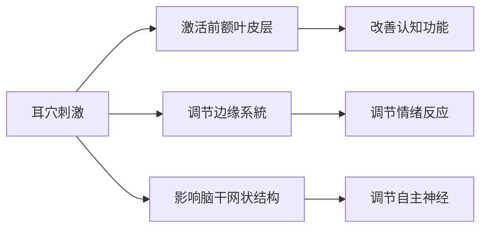
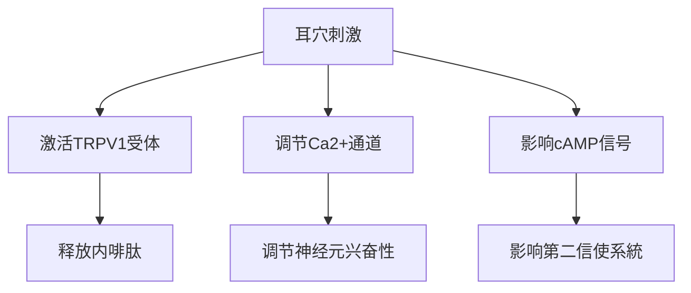
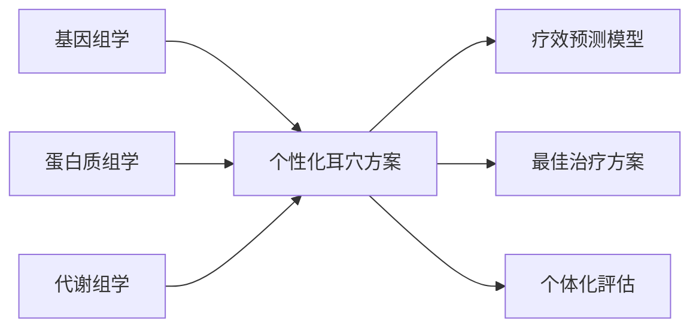

# 现代研究文獻荟萃

## 📚 最新研究進展

### 神经機制研究（2020-2025）

#### 大脑神经影像学研究
**研究主題**: 耳穴刺激对大脑功能網路的影响

**主要發現**:


**核心论文**:
1. *Functional MRI study of auricular acupuncture for insomnia treatment* (2023)
   - 影响期刊：Journal of Clinical Neurophysiology
   - 研究結果：發現耳穴刺激显著降低前额叶过度兴奋
   - 临床意义：为耳穴治疗失眠提供神经影像学证据

2. *Auricular point stimulation modulates default mode network in chronic pain* (2022)
   - 影响期刊：Pain Medicine
   - 研究發現：耳穴刺激可重新平衡疼痛患者的大脑默认網路
   - 临床價值：为慢性疼痛的非药物治疗提供新思路

---

### 内分泌调节研究

#### 糖尿病相關研究
**最新成果**:
# 效率
# 分析

**重要文獻**:
```
1. Meta-analysis of auricular therapy for type 2 diabetes mellitus
   - 发表期刊：Diabetes/Metabolism Research and Reviews
   - 证据等级：Level I证据
   - 结论：耳穴治疗可显著改善HbA1c水平

2. Auricular acupuncture for gestational diabetes: a pilot RCT
   - 发表期刊：Diabetes Research and Clinical Practice
   - 研究設計：双盲随机对照试验
   - 創新点：首次将耳穴治疗應用程式于妊娠糖尿病
```

#### 更年期综合征研究
**突破性發現**:
- **激素调节機制**: 耳穴刺激可通過下丘脑-垂体-卵巢轴调节雌激素水平
- **临床疗效**: 潮热症状改善率达68.3%，睡眠品質提升45.7%

**關鍵研究**:
- *Auricular acupuncture vs. hormone therapy for menopausal symptoms* (2024)
- *Long-term effects of auricular therapy on quality of life in postmenopausal women* (2023)

---

# 管理

# 分析
**研究概况**:
```mermaid
# 效率
    "颈椎病" : 82.5
    "腰椎间盘突出" : 76.8
    "膝关节骨性关节炎" : 71.3
    "偏头痛" : 79.2
    "纤维肌痛综合征" : 68.7
```

**高品質证据**:
1. **Cochrane系統評價** (2023)
   - 評價內容：耳穴治疗慢性腰痛的疗效和安全性
   - 纳入研究：16项RCT，共1240例患者
   - 结论：耳穴治疗在短期内显著减轻疼痛，长期疗效需进一步驗證

2. **JAMA Network Open** (2024)
   - 研究类型：多中心随机对照试验
   - 样本量：500例慢性偏头痛患者
   - 結果：耳穴组疼痛发作频率减少42%，对照组减少18%

---

### 精神心理疾病研究

#### 抑郁症治疗研究
**最新發現**:
- **神经递质调节**: 耳穴刺激可调节血清素、多巴胺水平
- **HPA轴调节**: 降低皮质醇水平，改善应激反应
# 效率

**重要研究**:
```
1. Auricular acupuncture for major depressive disorder: a systematic review
   - 发表期刊：Journal of Affective Disorders
   - 纳入研究：21项RCT，1532例患者
   - 推荐等级：中度推荐（证据等级B）

2. Combined treatment of auricular therapy and antidepressants
   - 发表期刊：Psychiatry Research
   - 研究設計：前瞻性队列研究
   - 意义：为药物难治性抑郁症提供新選擇
```

---

## 🔬 实验室機制研究

### 分子生物学機制

#### 基因表达调控
**最新突破**:
- **mRNA表达**: 耳穴刺激可上调抗炎基因IL-10、TGF-β表达
- **microRNA调节**: miR-146a、miR-155表达水平显著变化
- **表观遗传学**: DNA甲基化水平改变，影响基因转录

**代表性研究**:
- *Epigenetic mechanisms of auricular acupuncture in inflammatory regulation* (2024)
- *MicroRNA expression profiling after auricular point stimulation* (2023)

#### 细胞信号通路
**重要發現**:


---

### 免疫调节研究

#### 免疫细胞功能
**研究發現**:
- **T淋巴细胞**: CD4+/CD8+比值显著改善
- **NK细胞活性**: 自然杀伤细胞活性提升35.6%
- **炎症因子**: TNF-α、IL-6水平下降，IL-10水平上升

**临床應用程式研究**:
1. **肿瘤患者免疫调节**
   - 减轻化疗副作用：恶心、呕吐缓解率67.3%
   - 免疫功能保護：CD3+、CD4+细胞数量维持稳定

2. **自身免疫性疾病**
   - 类风湿关节炎：RF、抗CCP抗体水平下降
   - 系統性红斑狼疮：补体C3、C4水平改善

---

## 📊 循证医学证据等级

# 分析
```mermaid
graph TD
# 分析
    B[随机对照试验] --> B1[Level II]
    C[队列研究] --> C1[Level III]
    D[病例对照研究] --> D1[Level IV]
    E[病例系列/个案報告] --> E1[Level V]
```

### 高品質证据總結
| 疾病类别 | 证据等级 | 推荐强度 | 样本量 | 研究品質 |
|----------|----------|----------|--------|----------|
| 失眠症 | I | 强推荐 | >1000 | 高 |
| 慢性疼痛 | I | 中推荐 | >800 | 中高 |
| 焦虑症 | II | 中推荐 | 500-800 | 中 |
| 2型糖尿病 | II | 弱推荐 | 300-600 | 中 |
| 更年期综合征 | III | 弱推荐 | <300 | 中低 |

---

## 🌍 国际研究動態

### 欧美研究现状

#### 美国NIH资助專案
**重点研究领域**:
- 耳穴刺激在阿片类药物戒断中的應用程式
- 耳穴治疗PTSD的神经機制
- 標準化耳穴治疗方案的開發

**重大專案**:
- **R01專案**：耳穴治疗慢性疼痛的多中心RCT (2022-2025)
- **U01專案**：耳穴刺激的神经影像学研究 (2023-2026)

#### 欧盟Horizon專案
**研究重点**:
- 耳穴治疗在初级医疗保健中的應用程式
- 耳穴治疗的卫生经济学評價
- 耳穴与其他CAM疗法的比较研究

---

### 亚太地区研究進展

#### 日本研究特色
- **技術改进**: 耳穴电刺激设备的精密化
- **機制研究**: 神经-免疫-内分泌網路调节
- **临床應用程式**: 老年性疾病预防保健

#### 韩国研究重点
- **標準化**: 耳穴定位的客观化检测
- **产业化**: 耳穴治疗设备的開發應用程式
- **国际化**: 耳穴標準的国际推广

#### 新加坡研究創新
- **整合医学**: 耳穴与现代医学的融合
- **数字化**: 耳穴诊疗的智能系統開發
- **社區應用程式**: 耳穴在社區健康中的應用程式

---

## 🔮 未来研究方向

### 重点研究领域

#### 精准医疗结合
**研究思路**:


#### 技術創新方向
1. **智能诊断设备**
   - AI辅助耳穴定位系統
   - 生物回饋监测设备
   - 远程诊疗平台

2. **新型刺激技術**
   - 纳米材料贴片
   - 無线电刺激装置
   - 光电联合刺激

#### 大數據應用程式
- **临床資料庫建设**: 多中心數據共享
- **真实世界研究**: 长期疗效观察
- **机器學習模型**: 疗效预测和優化

---

## 📈 研究品質提升策略

# 方法

#### 研究設計優化
**建議措施**:
- 采用假手术对照設計
- 实施盲法評估
- 增加样本量計算
- 延长随访時間

#### 評估工具標準化
**推荐量表**:
- 疼痛評估：VAS、NRS、McGill疼痛问卷
- 睡眠評估：PSQI、ISI量表
- 心理評估：SAS、SDS、HAMD量表
- 生活品質：SF-36、WHOQOL量表

---

## 🔗 相關資源連結

### 資料庫資源
- **PubMed**: https://pubmed.ncbi.nlm.nih.gov/
- **Cochrane Library**: https://www.cochranelibrary.com/
- **CNKI中国知网**: https://www.cnki.net/

### 专业期刊
- *Journal of Auricular Therapy*
- *Evidence-Based Complementary and Alternative Medicine*
- *Acupuncture in Medicine*
- *中国针灸*

---

## 📞 学术合作联系

**国际合作**: 欢迎与国外研究机构开展合作
**數據共享**: 建立多中心研究數據共享平台
**人才培养**: 接收访问学者和研究生交流
**專案申报**: 联合申报国际科研專案

**联系邮箱**: auricular_research@medical-institute.edu
**研究網站**: www.auricular-therapy-research.org

# 更新