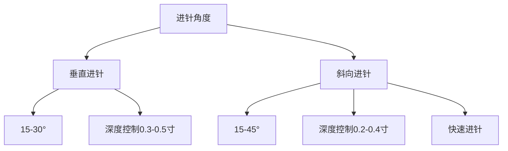
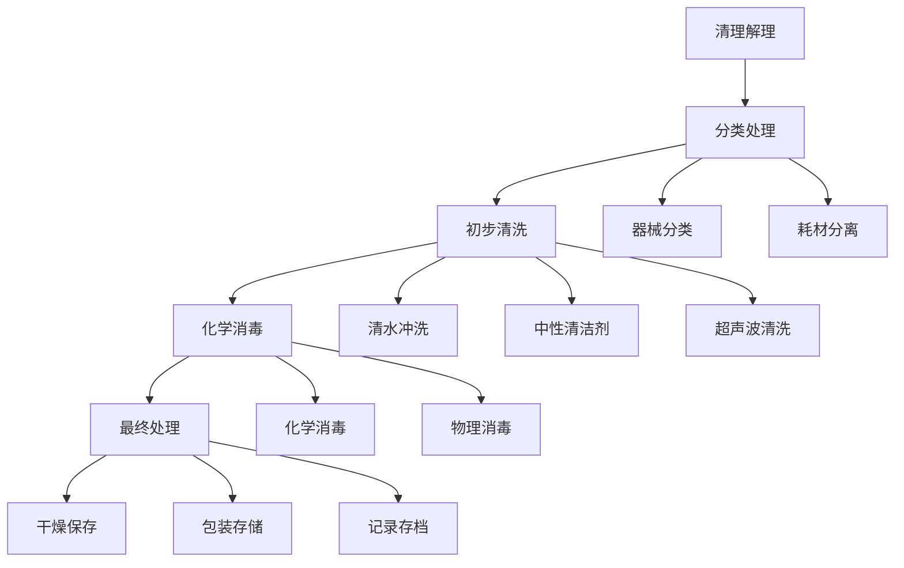

# 耳穴安全操作规范

> [!warning] 安全第一
> 耳穴治疗是相对安全的医疗技术，但必须严格遵守安全操作规范，确保患者和治疗师的安全。

---

## 🛡️ 安全操作原则

### 基本安全要求

> [!important] 核心原则
> 1. **无菌第一**：所有操作必须保持无菌
> 2. **轻柔为主**：刺激强度要适中
> 3. **观察反应**：密切观察患者反应
> 4. **及时处理**：出现异常立即处理

#### 职业素养要求

| 要求项目 | 具体要求 | 检查标准 |
|----------|----------|----------|
| **个人卫生** | 操作前必须洗手 | 使用六步洗手法 |
| **器械消毒** | 器械必须彻底消毒 | 每次使用后消毒 |
| **环境清洁** | 治疗环境清洁整洁 | 定期清洁消毒 |
| **健康状态** | 操作者身体健康 | 无传染性疾病 |

---

## 🔬 操作前准备

### 患查清单

#### 环境检查

> [!check] 环境准备清单
> - [ ] 治疗室温度：22-26℃，湿度40-60%
> - [ ] 光线充足，避免强光直射
> - [ ] 环境安静，无干扰因素
> - [ ] 呼位舒适，患者体位正确
> - [ ] 准备所有必需器械

#### 器械消毒

> [!check] 器械消毒流程
> 1. **分类处理**：根据器械类型分类消毒
> 2. **物理消毒**：高压灭菌、湿热消毒
> 3. **化学消毒**：75%酒精、过氧乙酸
> 4. **紫外消毒**：UV照射30分钟
> 5. **干燥保存**：消毒后干燥保存

**消毒顺序：**
1. 初步清理（去除污物）
2. 清洗干燥
3. 化学消毒
4. 高压灭菌（如需）
5. 干燥保存

### 个体准备

#### 操作者准备

> [!check] 操作前准备
> [ ] 洗手消毒（六步法）
> [ ] 佩戴防护用品（口罩、手套）
> [ ] 检查器械状态
> [ ] 确认患者身体状况
> [ ] 准备应急处理预案

#### 患者准备

> [!check] 患者准备
> [ ] 患者知情同意已签署
> [ ] 患者体位正确
> [ ] 耳部清洁已处理
> [ ] 患者情绪稳定
> [ ] 排空膀胱（如需要）

---

## 🏥 具体操作规范

### 针刺技术规范

#### 针刺操作步骤

> [!important] 标准操作流程
> 1. **穴位定位**：使用探针精确定位
> 2. **皮肤消毒**：使用75%酒精消毒
> 3. **针刺操作**：快速、轻柔、准确
> 4. 针刺深度控制：0.5-1.5寸
> 5. 留针时间控制：20-30分钟

#### 进针技术要点



#### 禁忌进针区域

> [!danger] 禁忌区域
> - **耳尖**：神经密集区域
> - **耳垂**：敏感区域
> **耳屏**：重要功能区域
- **外耳道**：容易感染区域
- **发际线**：皮肤敏感区域

### 按压技术规范

#### 按压手法要点

> [!tip] 按压操作技巧
- **力度控制**：以患者能承受为度为准
- **时间控制**：单个穴位3-5分钟
- **方法选择**：指腹法、指揉法、点按法
- **频率控制**：每日或隔日一次

#### 按压技术分类

| 技术 | 操作方法 | 适用场景 | 强度控制 | 适用患者 |
|------|----------|----------|-----------|
| **指腹法** | 用指腹轻柔按压 | 保健预防 | 轻 | 所有人 |
| **指揉法** | 指腹做圆周运动 | 适度 | 中等 | 中老年 |
| **点按法** | 单点重点按压 | 重度控制 | 症恢复期 |
| **掌擦法** | 掌擦耳廓轻柔 | 日常保健 | 轻微 | 所有人 |

---

## 🛠️ 应急处理

### 常异常情况

#### 晕厥处理

> [!danger] 晕厥应急
> **立即措施：**
> 1. 停止所有治疗操作
> 2. 平卧位，头部后仰
> 3. 保持呼吸通畅
> 4. 按压人中、内关、内关
> 5. 必要时呼叫120

#### 出血处理

> [!warning] 出血应急
> **处理步骤：**
> 1. 立即停止操作
> 2. 按压止血
> 3. 使用止血药或创可贴
> 4. 就医检查
> 5. 记录事件经过

#### 感染处理

> [!alert] 感染预防
> **预防措施：**
> 1. 严格消毒规范
> 2. 一次性器械使用
> 3. 及时处理污染
> 4 | 记录感染事件

#### 疼痛处理

> [!question] 疼痛原因
> **常见原因：**
> 1. 刺激强度过大
> 2. 患者过度紧张
> 3. 穴位不准确
> 4. 炣者极度恐惧

> **处理策略：**
> 1. 立即停止或减轻刺激
> 2. 调整操作手法
> 3. 进行心理疏导
> 4. 必要时暂停治疗

---

## 🔧 特殊人群注意事项

### 儿妇特殊注意

#### 孕期注意事项

> [!note] 孕妇禁忌期
> **早期妊娠（前3个月）**：避免强刺激
> **中期妊娠（4-6个月）：减少刺激强度
> **晚期妊娠（7-9个月）：轻柔操作
> **围产期前**：暂停强刺激穴位
> **哺乳期**：避免乳腺区域刺激

#### 安全穴位选择

> [!check] 孕妇安全穴位
- **禁忌穴位**：合谷、三阴交、石门、神门、子宫穴
- **谨慎穴位**：心俞、内关、神门、三阴交
- **安全穴位**：脾俞、肾俞、太溪、足三里

### 儿童安全注意

#### 儿童特点
> [!info] 儿童生理特点
- **皮肤敏感**：儿童皮肤较薄，反应强烈
- **穴位不发达**：穴位定位需要经验
- **注意力不集中**：需要趣味引导
- **恐惧心理**：需要耐心引导

#### 安全操作要点

> [!tip] 儿童操作技巧
- 使用轻柔手法
- 缩短操作时间
- 增加趣味性元素
- 及时长鼓励机制

### 老年人注意事项

#### 老年人生理特点
> [!note] 老年人特点
- **皮肤干燥**：刺激性更强
- **反应迟钝**：刺激需要更长时间
- **慢性疾病多**：需要综合考虑
- **用药影响**：注意药物相互作用

#### 老年人操作调整

> [!check] 操作调整
- 减少刺激强度到50-70%
- 增加操作时间到30-45分钟
- 使用更轻柔的手法
- 增加观察频率

---

## 📋 器械消毒与维护

### 消毒方法对比

| 消毒方法 | 适用对象 | 消毒效果 | 优点 | 缺点 |
|----------|----------|----------|------|------|
| **75%酒精** | 大多数器械 | 中等 | 快速易得 | 易燃性高 |
| **碘伏** | 精密器械 | 强效 | 杀菌谱广 | �蚀性强 |
| **高压灭菌** | 耐金器械 | 极强 | 彻底消毒 | 需要设备 |
| **湿热消毒** | 热敏器械 | 良好 | 无腐蚀 | 耗时较长 |
| **紫外线** | 非感器械 | 中等 | 无残留 | 设备昂贵 |

### 消毒流程

#### 标准消毒流程



### 消毒记录

```markdown
# 消毒记录表

## 消毒日期：{{消毒_date}}
## 消毒人员：{{operator_name}}
## 消毒器械清单：{{disinfection_list}}

## 消毒流程记录
| 步骤 | 方法 | 时间消耗 | 备注 |
|------|------|-----------|--------|
| 预处理 | 器械分类 | 5分钟 | 分类和初步清理 |
| 清洗阶段 | 清水冲洗 | 10分钟 | 通用清洁 |
| 化学消毒 | 15分钟 | 75%酒精浸泡 |
| 高压灭菌 | 20分钟 | 高温高压 |
| 最终处理 | 干燥保存 | 10分钟 | 包装标记 |

## 质量控制
- 消毒液浓度：75%酒精 ≥ 3分钟
- 消毒液温度：室温
- 消毒时间：根据器械类型调整
- 消毒效果验证：生物指示剂检测

## 不良事件记录
- 发生时间：
- 发生情况：
- 处理过程：
- 处理结果：
- 改进措施：
```

---

## 🎓 感染控制标准

### 环境监测

#### 空气质量监测

> [!check] 环境指标
> - **细菌总数**：<1000 CFU/m³
> **真菌总数**：<100 CFU/m³
- **尘埃粒子**：<0.5 mg/m³
- **温湿度**：22-26℃，40-60%
- **换气次数**：≥6次/小时

#### 污染风险评估

| 风险等级 | 风险表现 | 控制措施 |
|----------|----------|------------|
| **低风险** | 细菌总数<100 | 常规清洁 |
| **中风险** | 细菌总数100-1000 | 加强消毒 |
| **高风险** | 细菌总数>1000 | 停止使用 |

### 微生物监测

#### 检测项目

| 检测项目 | 检测频率 | 标准值 | 应对措施 |
|----------|----------|----------|
| 空气采样 | 每月1次 | <100 CFU/m³ | 增加消毒 |
| 表面采样 | 每季度1次 | <100 CFU/cm² | 增加清洁 |
| 手部采样 | 每月1次 | 无菌生长 | 手套卫生 |
| 器械采样 | 每月1次 | 无致病菌 | 继续使用 |

---

## 📞 培训内容

### 理论知识培训

#### 安全理论学习

**理论学习要点：**
1. **解剖学基础**：耳部神经分布、血管走行
2. **消毒学原理**：各种消毒方法的原理和适用范围
3. **感染控制**：医院感染控制标准
4. **应急处理**：常见异常情况处理

#### 法规法规

**相关法规标准：**
- 《医疗机构消毒技术规范》
- 《中医耳穴技术操作规范》
- 《医疗器械监督管理条例》
- 《医疗废物管理条例》

### 实操技能培训

#### 基础技能训练

**训练项目：**
1. **器械消毒标准操作**
2. **无菌技术操作**
3. 应急处理模拟演练
4. 患者沟通技巧
5. 不良事件处理

#### 高级技能训练

**高级技术：**
1. 特殊人群操作技巧
2. 复杂病例处理
3. 个性化方案制定
4. 治疗效果评估
5. 质量控制方法

---

## 📊 质量控制标准

### 操作质量评价

#### 操作评价指标

| 评价维度 | 评价指标 | 评价标准 | 权重 |
|----------|----------|------------|------|
| **准确性** | 穴位精确度 | ±2mm | 30% |
| **规范性** | 操作符合规范 | 95% | 40% |
| **安全性** | 无安全事件发生 | 100% | 30% |
| **效率性** | 操作时间控制 | 95% | 20% |
| **效果性** | 症状改善 | 80% | 30% |

### 质量提升方案

#### 定期质量评估

> [!calendar] 质量评估计划
> - **每月**：操作技能考核
> - **季度**：理论知识更新
> **半年度**：综合技能评估
> - **年度**：全面评估认证

#### 持续改进机制

> [!info] 改进循环
> - **问题识别**：定期发现并解决问题
> - **培训强化**：针对薄弱环节强化训练
> - **经验分享**：建立最佳实践库
> - **标准更新**：根据标准更新调整

---

## 🔗 相关标准与法规

### 国家标准

#### GB/T 13734-2020

> [!standard] 耳穴名称与定位
- 标准名称：耳穴名称和定位
- 发布机构：国家标准化管理委员会
- 实施日期：2021年
- 适用范围：耳穴定位

#### 关键标准要求

> [check] 标准要点
- 1. **名称统一**：使用标准化耳穴名称
- 2. **定位精确**：提供详细定位坐标
- 3. **描述准确**：包含功能主治
- 4. **图示清晰**：提供定位图解

### 行业标准

#### ZYYXH/T 123-2021

> [!standard] 中医耳穴诊疗规范
- 标准名称：中医耳穴诊疗技术规范
- 发布机构：国家中医药管理局
- 实施日期：2021年
- 适用范围：耳穴诊疗操作

### 医疗机构标准

#### 医疗机构资质要求

> [!check] 机构资质
- **医疗机构执业许可证**：必须持有
- **专业人员资质**：持有相关执业证书
- **设施设备标准**：符合医疗标准
- **安全管理制度**：完善的安全体系

---

## 🔗 相关知识链接

- [[耳穴理论基础]] - 耳穴理论基础
- [[临床应用指南]] - 临床实践指导
- [[研究文献索引]] - 最新研究进展
- [[3 Resources/01-Tech/🏥 专业知识/耳穴知识库/06_安全规范/安全操作规范]] - 安全操作标准

---

## 📚 联系与支持

### 技术支持

| 类型 | 联系方式 | 响应时间 |
|------|----------|------------|
| 📧 技术咨询 | technical@auricular-therapy.com | 24小时内 |
| 📞 培训报名 | training@auricular-therapy.com | 48小时内 |
| 📊 线课程 | course@auricular-therapy.com | 按课程 |
| 📞 案例分析 | cases@auricular-therapy.com | 个案指导 |

### 学术交流

- **学术会议**：定期举办学术研讨会
- **期刊投稿**：支持学术期刊投稿
- **研究合作**：促进跨机构合作
- **标准制定**：参与行业标准制定

---

## 📚 版本控制

### 版本信息

- **当前版本**：v2.0
- **创建日期**：2024年1月24日
- **维护团队**：AI-value医疗团队
- **更新频率**：定期更新
- **下次更新**：根据反馈调整

### 更新记录

| 版本 | 更新日期 | 更新内容 | 更新人 |
|------|----------|--------|
| v2.0 | 2024-01-24 | 重大优化和扩展 | 增加大量内容 | 全体重构 |
| v1.0 | 2023-12-15 | 初始版本创建 | 基础框架 | 开发团队 |

---

## 📊 免责声明

> [!warning] 重要提示
> 本安全操作规范基于国家相关标准和行业最佳实践制定，使用者必须严格按照实际法规要求执行。如有标准更新，请及时更新。

### 使用须知

1. **专业指导**：所有操作应在专业医师指导下进行
2. **法规遵循**：严格遵守相关法律法规
3. **安全第一**：始终将安全放在首位
4. **持续学习**：定期更新知识和技能

---

%% 安全规范是耳穴治疗的基石，需要严格执行，确保患者安全 %%