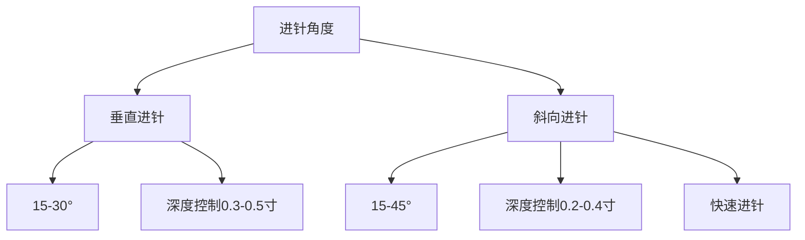
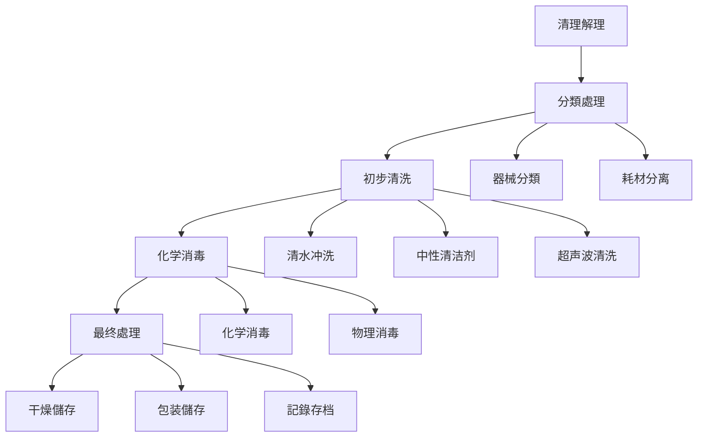

# 耳穴安全操作規範

> [!warning] 安全第一
> 耳穴治疗是相对安全的医疗技術，但必须严格遵守安全操作規範，确保患者和治疗师的安全。

---

## 🛡️ 安全操作原則

### 基本安全要求

> [!important] 核心原則
> 1. **無菌第一**：所有操作必须保持無菌
> 2. **轻柔为主**：刺激强度要适中
> 3. **观察反应**：密切观察患者反应
> 4. **及时處理**：出现异常立即處理

#### 职业素养要求

| 要求專案 | 具体要求 | 檢查標準 |
|----------|----------|----------|
| **个人卫生** | 操作前必须洗手 | 使用六步洗手法 |
| **器械消毒** | 器械必须彻底消毒 | 每次使用后消毒 |
| **環境清洁** | 治疗環境清洁整洁 | 定期清洁消毒 |
| **健康狀態** | 操作者身体健康 | 無传染性疾病 |

---

## 🔬 操作前准备

### 患查清單

#### 環境檢查

> [!check] 環境准备清單
> - [ ] 治疗室温度：22-26℃，湿度40-60%
> - [ ] 光线充足，避免强光直射
> - [ ] 環境安静，無干扰因素
> - [ ] 呼位舒适，患者体位正确
> - [ ] 准备所有必需器械

#### 器械消毒

> [!check] 器械消毒流程
> 1. **分類處理**：根据器械类型分類消毒
> 2. **物理消毒**：高压灭菌、湿热消毒
> 3. **化学消毒**：75%酒精、过氧乙酸
> 4. **紫外消毒**：UV照射30分钟
> 5. **干燥儲存**：消毒后干燥儲存

**消毒顺序：**
1. 初步清理（去除污物）
2. 清洗干燥
3. 化学消毒
4. 高压灭菌（如需）
5. 干燥儲存

### 个体准备

#### 操作者准备

> [!check] 操作前准备
> [ ] 洗手消毒（六步法）
> [ ] 佩戴防护用品（口罩、手套）
> [ ] 檢查器械狀態
> [ ] 確認患者身体状况
> [ ] 准备应急處理预案

#### 患者准备

> [!check] 患者准备
> [ ] 患者知情同意已签署
> [ ] 患者体位正确
> [ ] 耳部清洁已處理
> [ ] 患者情绪稳定
> [ ] 排空膀胱（如需要）

---

## 🏥 具体操作規範

### 针刺技術規範

#### 针刺操作步骤

> [!important] 標準操作流程
> 1. **穴位定位**：使用探针精確定位
> 2. **皮膚消毒**：使用75%酒精消毒
> 3. **针刺操作**：快速、轻柔、准确
> 4. 针刺深度控制：0.5-1.5寸
> 5. 留针時間控制：20-30分钟

#### 进针技術要點



#### 禁忌进针区域

> [!danger] 禁忌区域
> - **耳尖**：神经密集区域
> - **耳垂**：敏感区域
> **耳屏**：重要功能区域
- **外耳道**：容易感染区域
- **发际线**：皮膚敏感区域

### 按压技術規範

#### 按压手法要點

> [!tip] 按压操作技巧
- **力度控制**：以患者能承受为度为准
- **時間控制**：单个穴位3-5分钟
# 方法
- **频率控制**：每日或隔日一次

#### 按压技術分類

# 方法
|------|----------|----------|-----------|
| **指腹法** | 用指腹轻柔按压 | 保健预防 | 轻 | 所有人 |
| **指揉法** | 指腹做圆周运动 | 适度 | 中等 | 中老年 |
| **点按法** | 单点重点按压 | 重度控制 | 症恢復期 |
| **掌擦法** | 掌擦耳廓轻柔 | 日常保健 | 轻微 | 所有人 |

---

## 🛠️ 应急處理

### 常异常情况

#### 晕厥處理

> [!danger] 晕厥应急
> **立即措施：**
> 1. 停止所有治疗操作
> 2. 平卧位，头部后仰
> 3. 保持呼吸通畅
> 4. 按压人中、内关、内关
> 5. 必要时呼叫120

#### 出血處理

> [!warning] 出血应急
> **處理步骤：**
> 1. 立即停止操作
> 2. 按压止血
> 3. 使用止血药或创可贴
> 4. 就医檢查
> 5. 記錄事件經過

#### 感染處理

> [!alert] 感染预防
> **预防措施：**
> 1. 严格消毒規範
> 2. 一次性器械使用
> 3. 及时處理污染
> 4 | 記錄感染事件

#### 疼痛處理

> [!question] 疼痛原因
> **常见原因：**
> 1. 刺激强度过大
> 2. 患者过度紧张
> 3. 穴位不准确
> 4. 炣者极度恐惧

> **處理策略：**
> 1. 立即停止或减轻刺激
> 2. 调整操作手法
> 3. 進行心理疏导
> 4. 必要时暫停治疗

---

## 🔧 特殊人群注意事項

### 儿妇特殊注意

#### 孕期注意事項

> [!note] 孕妇禁忌期
> **早期妊娠（前3个月）**：避免强刺激
> **中期妊娠（4-6个月）：减少刺激强度
> **晚期妊娠（7-9个月）：轻柔操作
> **围产期前**：暫停强刺激穴位
> **哺乳期**：避免乳腺区域刺激

#### 安全穴位選擇

> [!check] 孕妇安全穴位
- **禁忌穴位**：合谷、三阴交、石门、神门、子宫穴
- **谨慎穴位**：心俞、内关、神门、三阴交
- **安全穴位**：脾俞、肾俞、太溪、足三里

### 儿童安全注意

#### 儿童特點
> [!info] 儿童生理特點
- **皮膚敏感**：儿童皮膚较薄，反应强烈
- **穴位不发达**：穴位定位需要經驗
- **注意力不集中**：需要趣味引导
- **恐惧心理**：需要耐心引导

#### 安全操作要點

> [!tip] 儿童操作技巧
- 使用轻柔手法
- 缩短操作時間
- 增加趣味性元素
- 及时长鼓励機制

### 老年人注意事項

#### 老年人生理特點
> [!note] 老年人特點
- **皮膚干燥**：刺激性更强
- **反应迟钝**：刺激需要更长時間
- **慢性疾病多**：需要综合考虑
- **用药影响**：注意药物相互作用

#### 老年人操作调整

> [!check] 操作调整
- 减少刺激强度到50-70%
- 增加操作時間到30-45分钟
- 使用更轻柔的手法
- 增加观察频率

---

## 📋 器械消毒与維護

# 方法

# 方法
|----------|----------|----------|------|------|
| **75%酒精** | 大多数器械 | 中等 | 快速易得 | 易燃性高 |
| **碘伏** | 精密器械 | 强效 | 杀菌谱广 | �蚀性强 |
| **高压灭菌** | 耐金器械 | 极强 | 彻底消毒 | 需要设备 |
| **湿热消毒** | 热敏器械 | 良好 | 無腐蚀 | 耗时较长 |
| **紫外线** | 非感器械 | 中等 | 無残留 | 设备昂贵 |

### 消毒流程

#### 標準消毒流程



### 消毒記錄

```markdown
# 消毒記錄表

## 消毒日期：{{消毒_date}}
## 消毒人员：{{operator_name}}
## 消毒器械清單：{{disinfection_list}}

## 消毒流程記錄
# 方法
|------|------|-----------|--------|
| 预處理 | 器械分類 | 5分钟 | 分類和初步清理 |
| 清洗階段 | 清水冲洗 | 10分钟 | 通用清洁 |
| 化学消毒 | 15分钟 | 75%酒精浸泡 |
| 高压灭菌 | 20分钟 | 高温高压 |
| 最终處理 | 干燥儲存 | 10分钟 | 包装標記 |

## 品質控制
- 消毒液浓度：75%酒精 ≥ 3分钟
- 消毒液温度：室温
- 消毒時間：根据器械类型调整
- 消毒效果驗證：生物指示剂检测

## 不良事件記錄
- 发生時間：
- 发生情况：
- 處理過程：
- 處理結果：
- 改进措施：
```

---

## 🎓 感染控制標準

### 環境监测

#### 空气品質监测

> [!check] 環境指标
> - **细菌总数**：<1000 CFU/m³
> **真菌总数**：<100 CFU/m³
- **尘埃粒子**：<0.5 mg/m³
- **温湿度**：22-26℃，40-60%
- **换气次数**：≥6次/小时

#### 污染风险評估

| 风险等级 | 风险表现 | 控制措施 |
|----------|----------|------------|
| **低风险** | 细菌总数<100 | 常规清洁 |
| **中风险** | 细菌总数100-1000 | 加强消毒 |
| **高风险** | 细菌总数>1000 | 停止使用 |

### 微生物监测

#### 检测專案

| 检测專案 | 检测频率 | 標準值 | 应对措施 |
|----------|----------|----------|
| 空气采样 | 每月1次 | <100 CFU/m³ | 增加消毒 |
| 表面采样 | 每季度1次 | <100 CFU/cm² | 增加清洁 |
| 手部采样 | 每月1次 | 無菌生长 | 手套卫生 |
| 器械采样 | 每月1次 | 無致病菌 | 繼續使用 |

---

## 📞 培训內容

# 知識

#### 安全理论學習

**理论學習要點：**
1. **解剖学基礎**：耳部神经分布、血管走行
# 方法
3. **感染控制**：医院感染控制標準
4. **应急處理**：常见异常情况處理

#### 法规法规

**相關法规標準：**
- 《医疗机构消毒技術規範》
- 《中医耳穴技術操作規範》
# 管理
# 管理

### 实操技能培训

#### 基礎技能訓練

**訓練專案：**
1. **器械消毒標準操作**
2. **無菌技術操作**
3. 应急處理模拟演练
4. 患者沟通技巧
5. 不良事件處理

#### 高级技能訓練

**高级技術：**
1. 特殊人群操作技巧
2. 复杂病例處理
3. 个性化方案制定
4. 治疗效果評估
# 方法

---

## 📊 品質控制標準

### 操作品質評價

#### 操作評價指标

| 評價维度 | 評價指标 | 評價標準 | 权重 |
|----------|----------|------------|------|
| **准确性** | 穴位精确度 | ±2mm | 30% |
| **規範性** | 操作符合規範 | 95% | 40% |
| **安全性** | 無安全事件发生 | 100% | 30% |
# 效率
| **效果性** | 症状改善 | 80% | 30% |

### 品質提升方案

#### 定期品質評估

> [!calendar] 品質評估計劃
> - **每月**：操作技能考核
# 知識
> **半年度**：综合技能評估
> - **年度**：全面評估认证

#### 持續改进機制

> [!info] 改进循环
> - **問題识别**：定期發現并解決問題
> - **培训强化**：针对薄弱环节强化訓練
# 分享
# 更新

---

## 🔗 相關標準与法规

### 国家標準

#### GB/T 13734-2020

> [!standard] 耳穴名称与定位
- 標準名称：耳穴名称和定位
# 管理
- 实施日期：2021年
- 适用范围：耳穴定位

#### 關鍵標準要求

> [check] 標準要點
- 1. **名称統一**：使用標準化耳穴名称
- 2. **定位精确**：提供詳細定位坐标
- 3. **描述准确**：包含功能主治
- 4. **圖示清晰**：提供定位图解

### 行业標準

#### ZYYXH/T 123-2021

> [!standard] 中医耳穴诊疗規範
- 標準名称：中医耳穴诊疗技術規範
# 管理
- 实施日期：2021年
- 适用范围：耳穴诊疗操作

### 医疗机构標準

#### 医疗机构资质要求

> [!check] 机构资质
- **医疗机构执业许可证**：必须持有
- **专业人员资质**：持有相關执业证书
- **设施设备標準**：符合医疗標準
# 管理

---

# 知識

- [[耳穴理论基礎]] - 耳穴理论基礎
# 指南
- [[研究文獻索引]] - 最新研究進展
# 知識庫

---

## 📚 联系与支持

### 技術支持

| 类型 | 联系方式 | 響應時間 |
|------|----------|------------|
| 📧 技術咨询 | technical@auricular-therapy.com | 24小时内 |
| 📞 培训报名 | training@auricular-therapy.com | 48小时内 |
| 📊 线课程 | course@auricular-therapy.com | 按课程 |
# 分析

### 学术交流

- **学术會議**：定期举办学术研讨会
- **期刊投稿**：支持学术期刊投稿
- **研究合作**：促进跨机构合作
- **標準制定**：参与行业標準制定

---

# 版本

# 版本

# 版本
- **創建日期**：2024年1月24日
- **維護團隊**：AI-value医疗團隊
# 更新
# 更新

# 更新

# 更新
|------|----------|--------|
| v2.0 | 2024-01-24 | 重大優化和擴展 | 增加大量內容 | 全体重构 |
# 版本

---

## 📊 免责声明

> [!warning] 重要提示
# 更新

### 使用须知

1. **专业指导**：所有操作应在专业医师指导下進行
2. **法规遵循**：严格遵守相關法律法规
3. **安全第一**：始终将安全放在首位
# 知識

---

%% 安全規範是耳穴治疗的基石，需要严格执行，确保患者安全 %%