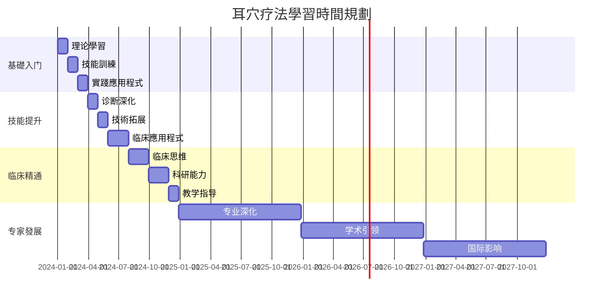
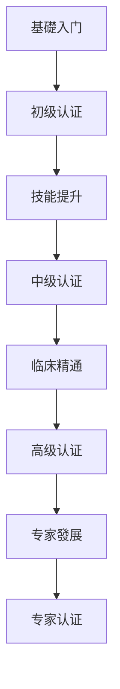

# 耳穴疗法系統學習路线图

## 🎯 學習目標总览

### 培养目標
培养具备扎实理论基礎、熟练操作技能、豐富临床經驗和科研創新能力的复合型耳穴专业人才。

### 能力要求
- **理论掌握**: 深入理解耳穴理论体系和作用機制
- **技能熟练**: 精准定位、規範操作、安全治疗
- **临床應用程式**: 独立诊断、制定方案、評估疗效
- **科研能力**: 文獻檢索、临床研究、学术交流
- **教学指导**: 传承技術、培养新人、推广普及

---

## 📚 分階段學習路线

### 第一階段：基礎入门（1-3个月）

#### 🎯 學習目標
- 掌握耳穴疗法基本概念和發展歷史
- 熟悉耳部解剖结构和穴位分布规律
# 方法
- 能夠進行简单的自我保健和基礎治疗

#### 📋 核心學習內容

##### 理论基礎模块
```
第1周：耳穴疗法概述
├── 定义与基本概念
├── 發展歷史与现状
├── 理论体系特點
└── 临床應用程式范围

第2周：耳部解剖基礎
├── 耳廓解剖结构
├── 神经血管分布
├── 胚胎发育基礎
└── 反射区形成原理

第3周：耳穴定位原理
├── 耳穴分布规律
├── 国际標準定位
├── 常用穴位识别
# 方法
```

##### 操作技能模块
```
第4-6周：基礎操作技術
# 方法
│   ├── 望诊技術
│   ├── 触诊技術
│   ├── 问诊技巧
# 方法
# 方法
│   ├── 按压技術
│   ├── 贴压技術
│   ├── 按摩手法
│   └── 注意事項
└── 安全操作規範
    ├── 消毒隔离
    ├── 禁忌症识别
    ├── 异常反应處理
    └── 应急预案
```

##### 實踐應用程式模块
```
第7-8周：基礎临床應用程式
├── 常见症状處理
│   ├── 头痛头晕
│   ├── 失眠多梦
│   ├── 颈肩酸痛
│   └── 消化不良
# 方法
│   ├── 日常按摩
│   ├── 保健穴位
│   ├── 预防保健
│   └── 生活指导
# 分析
    ├── 典型病例
    ├── 治疗方案
    ├── 疗效观察
    └── 經驗總結
```

#### 🎯 考核標準
# 知識
- **技能考核**: 基本操作規範性（85分以上）
- **實踐評估**: 简单病例處理能力（合格）

---

### 第二階段：技能提升（3-6个月）

#### 🎯 學習目標
- 精通耳穴定位和诊断技術
# 方法
- 能夠独立處理常见疾病
- 具备初步临床思维能力

#### 📋 核心學習內容

##### 诊断技術深化
```
第9-12周：诊断技術精进
├── 四诊合参應用程式
│   ├── 望诊深化
│   ├── 触诊精进
│   ├── 问诊技巧
│   └── 闻诊應用程式
├── 现代诊断技術
│   ├── 电测诊断
│   ├── 影像学辅助
│   ├── 实验室檢查
│   └── 综合評估
└── 辨证论治体系
    ├── 中医辨证
    ├── 现代医学诊断
    ├── 个体化方案
    └── 疗效预测
```

##### 治疗技術拓展
```
# 方法
├── 传统刺激技術
│   ├── 毫针技術
│   ├── 三棱针放血
│   ├── 皮膚针叩刺
│   └── 灸法應用程式
├── 现代刺激技術
│   ├── 电针技術
│   ├── 磁疗技術
│   ├── 激光照射
│   └── 超声波治疗
└── 综合治疗方案
    ├── 多技術联合
    ├── 阶梯治疗
    ├── 个体化调整
# 管理
```

##### 临床應用程式擴展
```
第17-24周：专科疾病治疗
├── 神经系統疾病
│   ├── 失眠症
│   ├── 焦虑抑郁
│   ├── 头痛偏头痛
│   └── 神经衰弱
├── 运动系統疾病
│   ├── 颈椎病
│   ├── 腰椎间盘突出
│   ├── 关节炎
│   └── 软组织损伤
├── 内分泌代谢疾病
│   ├── 糖尿病
│   ├── 甲状腺疾病
│   ├── 肥胖症
│   └── 更年期综合征
└── 其他系統疾病
    ├── 呼吸系統
    ├── 消化系統
    ├── 心血管系統
    └── 妇科疾病
```

#### 🎯 考核標準
- **理论深化**: 专科理论掌握（85分以上）
- **技能提升**: 复杂操作能力（90分以上）
- **临床能力**: 常见病独立處理（良好）

---

### 第三階段：临床精通（6-12个月）

#### 🎯 學習目標
- 具备独立临床诊疗能力
- 掌握复杂疾病治疗方案
- 能夠开展临床带教工作
- 具备科研思维和能力

#### 📋 核心學習內容

##### 临床思维培养
```
第25-36周：临床決策能力
# 分析
│   ├── 多系統疾病
│   ├── 难治性疾病
│   ├── 老年疾病
│   └── 特殊人群
├── 治疗方案優化
│   ├── 个体化設計
│   ├── 多技術整合
│   ├── 疗效評估
│   └── 方案调整
├── 并发症處理
│   ├── 预防措施
│   ├── 早期识别
│   ├── 应急處理
# 管理
└── 临床路徑建立
    ├── 標準化流程
    ├── 品質控制
    ├── 疗效評價
    └── 持續改进
```

##### 科研能力培养
```
# 方法
├── 文獻檢索能力
│   ├── 資料庫使用
│   ├── 檢索策略
# 管理
│   └── 批判性阅读
├── 临床研究設計
│   ├── 研究方案設計
│   ├── 伦理審查
│   ├── 數據收集
# 分析
├── 论文写作技能
│   ├── 结构設計
│   ├── 写作規範
│   ├── 投稿技巧
# 修改
└── 学术交流能力
    ├── 會議報告
    ├── 壁报制作
    ├── 同行评议
    └── 国际交流
```

##### 教学指导能力
```
第49-52周：教学技能培养
├── 理论教学能力
│   ├── 课程設計
# 方法
│   ├── 课件制作
│   └── 考核評價
├── 實踐指导能力
│   ├── 示范教学
│   ├── 个别指导
│   ├── 技能考核
│   └── 回饋改进
# 管理
│   ├── 學習計劃制定
│   ├── 进度跟踪
│   ├── 品質控制
│   └── 效果評估
└── 传承創新能力
    ├── 經驗總結
    ├── 技術改进
    ├── 理论創新
    └── 推广普及
```

#### 🎯 考核標準
- **临床能力**: 复杂疾病處理（優秀）
- **科研能力**: 独立开展研究（良好）
- **教学能力**: 能夠指导新人（合格）

---

### 第四階段：专家發展（1-3年）

#### 🎯 學習目標
- 成为耳穴领域专家型人才
- 具备学术引领能力
- 能夠推动学科發展
- 具备国际交流能力

#### 📋 發展方向

##### 学术专家方向
```
专业深度發展：
├── 理论創新研究
│   ├── 作用機制深化
│   ├── 新理论構建
│   ├── 跨学科融合
│   └── 国际標準制定
├── 临床研究引领
│   ├── 多中心研究
│   ├── 循证医学研究
│   ├── 新技術開發
│   └── 疗效評價体系
├── 学术影响力建设
│   ├── 专著編寫
│   ├── 期刊编委
│   ├── 学术组织任职
│   └── 国际合作
└── 学科建设贡献
    ├── 学科規劃
    ├── 人才培养
    ├── 平台建设
    └── 推广普及
```

##### 临床专家方向
```
临床技能精进：
├── 专科疾病深化
│   ├── 疑难杂症處理
│   ├── 多学科協作
│   ├── 个体化治疗
│   └── 精准医疗
├── 技術創新開發
│   ├── 新技術探索
│   ├── 设备改进
# 方法
│   └── 標準制定
# 管理
# 管理
│   ├── 品質控制
# 管理
│   └── 效益提升
└── 社会服务贡献
    ├── 公益服务
    ├── 健康教育
    ├── 社區推广
    └── 国际援助
```

##### 教育专家方向
```
教育事业贡献：
├── 教育体系建设
│   ├── 课程体系設計
│   ├── 教材編寫
│   ├── 教学標準制定
│   └── 評估体系建立
├── 人才培养工程
│   ├── 师资队伍建设
│   ├── 学生培养模式
│   ├── 繼續教育体系
│   └── 国际交流專案
# 方法
│   ├── 现代教育技術
│   ├── 模拟教学
│   ├── 線上教育
│   └── 混合式教学
└── 教育研究成果
    ├── 教学研究
    ├── 教学改革
    ├── 成果推广
    └── 国际合作
```

---

## 📅 學習時間規劃

### 总体時間安排


### 每周學習安排
```
基礎階段（每周20-25小时）：
├── 理论學習：8-10小时
├── 技能訓練：6-8小时
├── 實踐應用程式：4-6小时
└── 复习總結：2小时

提升階段（每周25-30小时）：
├── 理论深化：8-10小时
├── 技能精进：8-10小时
├── 临床實踐：6-8小时
└── 科研學習：3-4小时

精通階段（每周30-35小时）：
├── 临床工作：15-20小时
├── 科研專案：8-10小时
├── 教学指导：5-8小时
└── 学术交流：2-3小时
```

---

## 📚 學習資源推荐

### 核心教材
1. **《耳穴疗法学》** - 理论基礎教材
2. **《耳穴诊断学》** - 诊断技術专著
# 指南
4. **《耳穴研究進展》** - 科研前沿動態

### 參考书籍
```
基礎理论类：
├── 《中医耳穴学》
├── 《现代耳穴疗法》
├── 《国际耳穴標準》
└── 《耳穴解剖学》

临床應用程式类：
├── 《常见病耳穴治疗》
├── 《耳穴临床手册》
├── 《耳穴案例集》
└── 《耳穴急症處理》

# 方法
# 方法
├── 《医学統計学》
├── 《循证医学》
# 指南
```

### 線上資源
- **学术資料庫**: PubMed、CNKI、万方資料庫
- **专业網站**: 国际耳穴学会、中华中医药学会
- **線上课程**: MOOC平台、专业培训網站
- **学术期刊**: Journal of Auricular Therapy等

---

## 🎯 考核认证体系

### 階段性考核


### 认证標準
| 级别 | 理论要求 | 技能要求 | 临床要求 | 科研要求 |
|------|----------|----------|----------|----------|
| 初级 | 80分以上 | 基礎操作 | 简单病例 | 了解 |
| 中级 | 85分以上 | 熟练操作 | 常见疾病 | 基礎 |
| 高级 | 90分以上 | 精通操作 | 复杂疾病 | 独立 |
| 专家 | 95分以上 | 創新操作 | 疑难疾病 | 引领 |

---

## 🔄 持續學習機制

### 终身學習計劃
```
年度學習目標：
# 更新
├── 技能提升：每年40学时
├── 临床研修：每年60学时
├── 科研進展：每年30学时
└── 国际交流：每年10学时
```

# 方法
1. **理论联系实际**: 边学边用，学用结合
2. **师承學習**: 跟师學習，传承經驗
3. **同伴學習**: 学术交流，互相促进
4. **反思總結**: 定期總結，持續改进
5. **国际视野**: 關注国际，接轨前沿

---

## 📞 學習支持

### 导师指导
- **专业导师**: 一对一指导，个性化培养
- **临床导师**: 临床带教，實踐指导
- **科研导师**: 科研指导，学术引领

### 學習平台
- **線上學習**: 網路课程，远程教育
- **面授培训**: 集中培训，技能提升
- **学术會議**: 学术交流，前沿動態
- **實踐基地**: 临床实习，技能訓練

### 資源支持
- **图书资料**: 专业书籍，文獻資源
- **设备器材**: 教学设备，實踐器材
- **经费支持**: 學習经费，科研资助
- **時間保障**: 學習時間，工作安排

---

## 🌟 成功要素

### 个人素质
- **學習兴趣**: 热爱专业，主动學習
- **毅力恒心**: 持之以恒，坚持不懈
- **創新思维**: 勇于探索，敢于創新
- **沟通能力**: 善于交流，團隊合作

### 外部条件
- **导师指导**: 優秀导师，悉心指导
- **學習環境**: 良好環境，充足資源
- **實踐机会**: 临床實踐，技能訓練
- **学术氛围**: 学术交流，科研氛围

---

*本學習路线图将根据个人情况和实际發展需要進行動態调整，确保學習效果最大化。*

**制定日期**: 2026-01-25
# 版本
**制定人**: 耳穴教育专家委员会