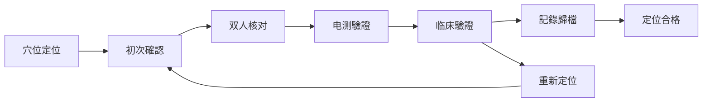
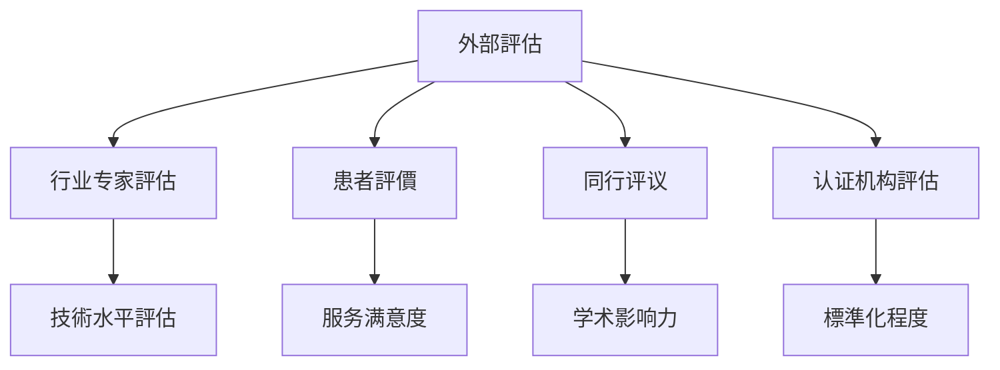

# 品質控制与標準化体系

# 管理

### 品質控制原則
1. **標準化操作**: 統一的技術規範和操作流程
2. **全程監控**: 从诊断到治疗的全過程品質控制
3. **持續改进**: 基于回饋和數據的品質提升機制
4. **安全第一**: 以患者安全为核心的品質保障体系

# 管理
```mermaid
graph TD
# 管理
    A --> C[培训认证部门]
    A --> D[監督評估部门]
# 管理
    
    B --> F[技術標準]
    B --> G[操作規範]
    B --> H[安全標準]
    
    C --> I[医师培训]
    C --> J[技能认证]
    C --> K[繼續教育]
    
    D --> L[日常監督]
    D --> M[品質审计]
    D --> N[投訴處理]
    
    E --> O[數據收集]
# 分析
    E --> Q[報告生成]
```

---

## 📋 技術操作標準

### 耳穴定位品質控制

#### 定位精度要求
# 方法
|----------|----------|----------|----------|
| 主要穴位 | ≤1mm | 显微镜测量 | 每月一次 |
| 次要穴位 | ≤2mm | 標準图谱比对 | 每周一次 |
| 新發現穴位 | ≤3mm | 专家评审確認 | 每次使用前 |

#### 定位驗證流程


### 消毒灭菌品質控制

#### 消毒效果监测標準
```
環境消毒品質標準：
├── 空气细菌总数 ≤500 CFU/m³
├── 物体表面细菌总数 ≤10 CFU/cm²
├── 手部消毒细菌总数 ≤5 CFU/cm²
└── 医疗器械灭菌合格率 100%
```

#### 消毒流程质控檢查表
# 方法
|----------|----------|----------|------|--------|
| 手部消毒 | 六步洗手法 | 现场观察 | 每次操作前 | 操作者 |
| 器械消毒 | 浸泡時間≥10分钟 | 计时器监测 | 每批器械 | 护士 |
| 耳部消毒 | 75%酒精棉球 | 观察涂擦范围 | 每个患者 | 操作者 |
| 環境消毒 | 紫外线照射≥30分钟 | 紫外线强度计 | 每日2次 | 后勤 |

---

# 管理

### 医师分级认证体系

#### 资质等级划分


#### 认证考核標準
# 知識
|------|----------|----------|----------|----------|
| 初级 | 80分以上 | 85分以上 | 3个月以上 | 20学时/年 |
| 中级 | 85分以上 | 90分以上 | 1年以上 | 30学时/年 |
| 高级 | 90分以上 | 95分以上 | 3年以上 | 40学时/年 |
| 专家 | 95分以上 | 98分以上 | 5年以上 | 50学时/年 |

### 培训品質監控

#### 培训效果評估体系
```
培训品質評估维度：
├── 理论掌握程度 - 笔试/口试評估
├── 操作技能水平 - 实操考核評估
# 分析
├── 患者满意度 - 服务品質評估
└── 持續學習态度 - 學習参与度評估
```

---

## 📊 临床疗效評估

### 疗效評價標準体系

#### 核心評價指标


#### 量化评分標準
| 評價等级 | 症状改善率 | 功能恢復度 | 生活品質提升 | 总体疗效 |
|----------|------------|------------|--------------|----------|
| 治愈 | ≥90% | 完全恢復 | 显著提升 | 临床治愈 |
| 显效 | 70-89% | 基本恢復 | 明显提升 | 显著有效 |
| 有效 | 30-69% | 部分恢復 | 有所提升 | 有效 |
| 無效 | <30% | 無改善 | 無变化 | 無效 |

### 随访品質控制

# 管理
```
随访時間节点：
├── 即时随访 - 治疗后24小时内
├── 短期随访 - 治疗后1-2周
├── 中期随访 - 治疗后1-3个月
├── 长期随访 - 治疗后6-12个月
└── 终身随访 - 某些特殊疾病
```

#### 随访完成率考核
| 随访类型 | 目標完成率 | 实际完成率 | 品質评级 | 改进措施 |
|----------|------------|------------|----------|----------|
| 即时随访 | 100% | | | |
| 短期随访 | ≥95% | | | |
| 中期随访 | ≥90% | | | |
| 长期随访 | ≥80% | | | |

---

## 🔍 監督檢查機制

### 内部品質审计

#### 审计內容清單
```
技術品質审计：
├── 病历完整性檢查
├── 操作規範性檢查
├── 消毒隔离檢查
├── 疗效記錄檢查
# 管理

服务品質审计：
├── 患者满意度调查
├── 投訴處理情况
├── 服务流程優化
├── 沟通技巧評估
└── 便民服务措施
```

#### 审计频率安排
| 审计类型 | 频率 | 审计人员 | 報告周期 |
|----------|------|----------|----------|
| 日常巡查 | 每日 | 质控专员 | 每日彙總 |
| 周度檢查 | 每周 | 科室负责人 | 每周報告 |
| 月度审计 | 每月 | 质控委员会 | 每月報告 |
| 季度評估 | 每季 | 院级领导 | 季度總結 |
| 年度评审 | 每年 | 外部专家 | 年度報告 |

### 外部品質評估

#### 第三方評估体系


---

## 📈 數據品質監控

### 數據收集標準

#### 數據品質控制要求
```
數據完整性要求：
├── 基本資訊完整率 ≥98%
├── 诊断資訊完整率 ≥95%
├── 治疗記錄完整率 ≥100%
├── 疗效評估完整率 ≥90%
└── 不良事件報告率 ≥100%
```

#### 數據品質評估指标
# 方法
|----------|----------|----------|----------|
| 准确性 | 數據真实准确 | 错误率<1% | 抽样核对 |
| 完整性 | 必填项完整 | 完整率>95% | 系統检测 |
| 及时性 | 數據录入及时 | 延遲<24小时 | 時間戳检测 |
| 一致性 | 逻辑一致性 | 逻辑错误<0.5% | 规则校验 |
| 規範性 | 格式統一規範 | 合规率>98% | 格式檢查 |

# 分析

# 方法
```
核心品質指标：
# 效率
├── 患者满意度 = (满意人数/调查人数) × 100%
├── 并发症发生率 = (并发症例数/总例数) × 100%
├── 重复治疗率 = (重复治疗例数/总例数) × 100%
└── 培训合格率 = (合格人数/参训人数) × 100%
```

---

# 管理

### 风险识别与評估

#### 风险等级分類
| 风险等级 | 定义 | 處理时限 | 责任层级 |
|----------|------|----------|----------|
| 一级风险 | 可能造成严重后果 | 立即處理 | 科室主任 |
| 二级风险 | 可能造成较大影响 | 24小时内 | 质控专员 |
| 三级风险 | 可能造成轻微影响 | 3天内 | 主治医师 |
| 四级风险 | 潜在风险因素 | 1周内 | 相關人员 |

#### 常见风险点识别
```
技術风险：
├── 穴位定位错误
├── 刺激强度不当
├── 消毒不彻底
├── 适应症選擇错误
└── 操作不規範

# 管理
├── 人员资质不符
├── 培训不到位
├── 監督缺失
├── 記錄不完整
└── 沟通不充分
```

# 管理

#### 突发事件處理流程
```mermaid
graph TD
    A[突发事件] --> B[立即評估]
    B --> C[啟動预案]
    C --> D[紧急处置]
    D --> E[報告上级]
# 分析
    F --> G[改进措施]
```

#### 应急预案清單
1. **晕针应急预案**
2. **过敏反应应急预案**
3. **感染事件应急预案**
4. **医疗纠纷应急预案**
5. **设备故障应急预案**

---

## 🔄 持續改进機制

### PDCA循环應用程式

#### 品質改进循环
```mermaid
graph TD
    A[Plan 計劃] --> B[Do 执行]
    B --> C[Check 檢查]
    C --> D[Act 處理]
    D --> A
    
    A --> A1[問題识别]
    A --> A2[目標设定]
    A --> A3[方案制定]
    
    B --> B1[组织实施]
    B --> B2[過程監控]
    B --> B3[數據收集]
    
    C --> C1[效果評估]
# 分析
    C --> C3[經驗總結]
    
    D --> D1[標準化成功經驗]
    D --> D2[解決存在問題]
    D --> D3[制定新計劃]
```

### 品質改进專案

# 管理
```
專案名称：_________________________
專案负责人：_______________________
專案周期：____年__月__日 - ____年__月__日

# 分析
___________________________________________
___________________________________________

改进目標：
___________________________________________
___________________________________________

实施步骤：
1. _________________________________________
2. _________________________________________
3. _________________________________________
4. _________________________________________

预期效果：
___________________________________________
___________________________________________

評估標準：
___________________________________________
___________________________________________
```

---

## 📋 品質考核体系

### 绩效考核指标

#### KPI指标体系
| 考核维度 | 权重 | 具体指标 | 目標值 | 考核周期 |
|----------|------|----------|--------|----------|
# 效率
| 服务品質 | 30% | 患者满意度 | ≥95% | 月度 |
# 效率
| 學習發展 | 10% | 培训完成率 | 100% | 季度 |

### 奖惩機制

#### 品質奖惩標準
```
奖励措施：
├── 品質标兵 - 年度评选，奖励5000元
├── 技能大赛 - 一等奖3000元，二等奖2000元
├── 優秀提案 - 被采纳奖励1000-3000元
└── 全勤全优 - 月度奖励500元

惩罚措施：
├── 轻微违规 - 口头警告，記錄在案
├── 一般违规 - 书面警告，扣罚当月绩效10%
├── 严重违规 - 停职培训，扣罚当月绩效30%
└── 重大违规 - 调离岗位，直至解除合同
```

---

## 🔗 相關文檔連結

# 方法
# 專業知識
# 指南
# 指南

---

# 管理

**质控委员会**: 主任委员 XXX 副主任医师
**质控专员**: 质控经理 XXX 主管护师
**技術支持**: 資訊科 XXX 工程师
**投訴热线**: 400-XXX-XXXX
**邮箱**: quality@ear-therapy-hospital.com

---

*本文檔为品質控制的核心指导檔案，全体人员必须严格遵守执行*
# 更新