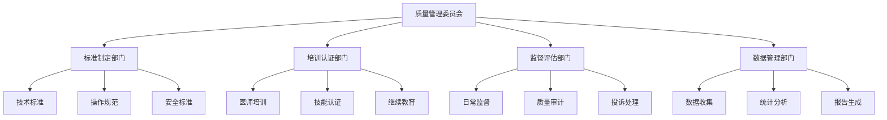
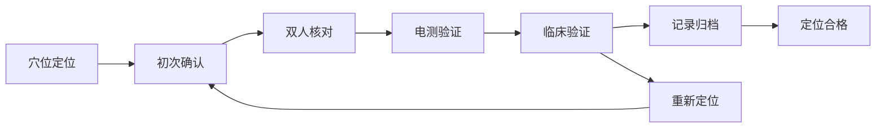
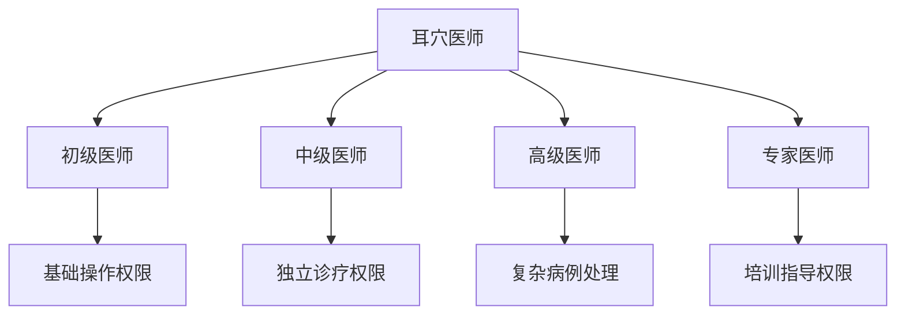
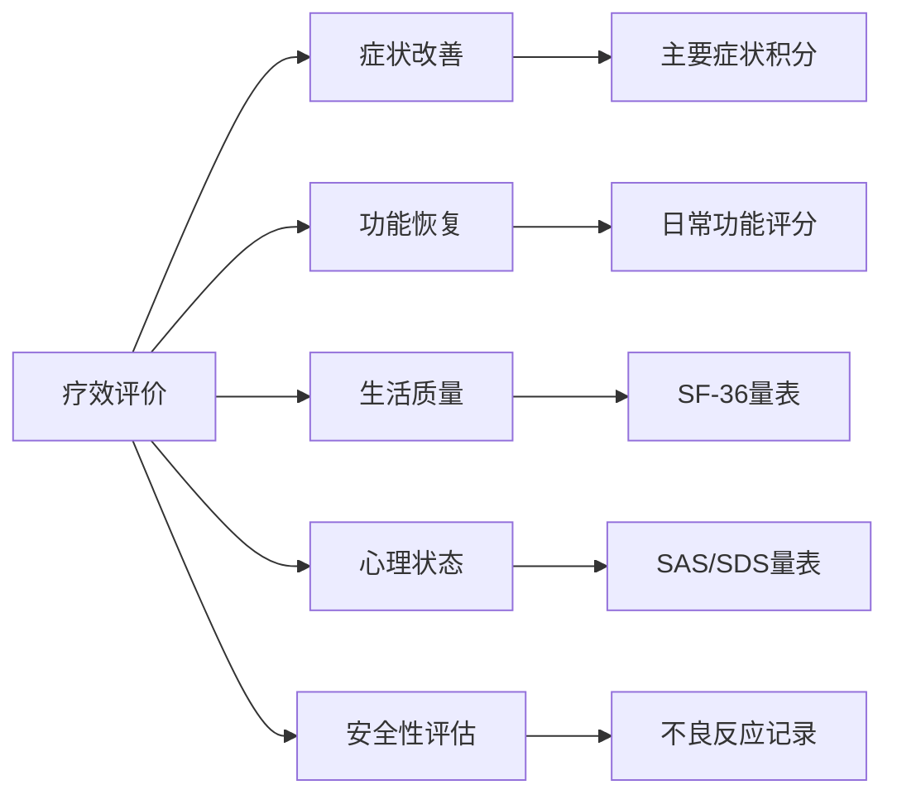
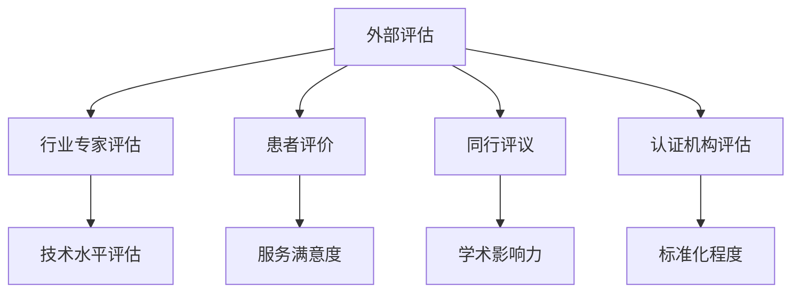
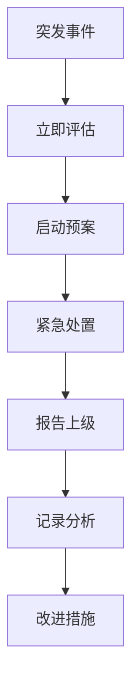
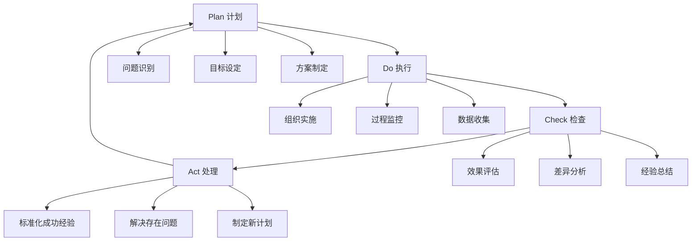

# 质量控制与标准化体系

## 🎯 质量管理概述

### 质量控制原则
1. **标准化操作**: 统一的技术规范和操作流程
2. **全程监控**: 从诊断到治疗的全过程质量控制
3. **持续改进**: 基于反馈和数据的质量提升机制
4. **安全第一**: 以患者安全为核心的质量保障体系

### 质量管理体系架构


---

## 📋 技术操作标准

### 耳穴定位质量控制

#### 定位精度要求
| 穴位类别 | 允许误差 | 检测方法 | 质控频率 |
|----------|----------|----------|----------|
| 主要穴位 | ≤1mm | 显微镜测量 | 每月一次 |
| 次要穴位 | ≤2mm | 标准图谱比对 | 每周一次 |
| 新发现穴位 | ≤3mm | 专家评审确认 | 每次使用前 |

#### 定位验证流程


### 消毒灭菌质量控制

#### 消毒效果监测标准
```
环境消毒质量标准：
├── 空气细菌总数 ≤500 CFU/m³
├── 物体表面细菌总数 ≤10 CFU/cm²
├── 手部消毒细菌总数 ≤5 CFU/cm²
└── 医疗器械灭菌合格率 100%
```

#### 消毒流程质控检查表
| 检查项目 | 检查标准 | 检查方法 | 频次 | 责任人 |
|----------|----------|----------|------|--------|
| 手部消毒 | 六步洗手法 | 现场观察 | 每次操作前 | 操作者 |
| 器械消毒 | 浸泡时间≥10分钟 | 计时器监测 | 每批器械 | 护士 |
| 耳部消毒 | 75%酒精棉球 | 观察涂擦范围 | 每个患者 | 操作者 |
| 环境消毒 | 紫外线照射≥30分钟 | 紫外线强度计 | 每日2次 | 后勤 |

---

## 👥 人员资质管理

### 医师分级认证体系

#### 资质等级划分


#### 认证考核标准
| 等级 | 理论知识 | 操作技能 | 临床经验 | 继续教育 |
|------|----------|----------|----------|----------|
| 初级 | 80分以上 | 85分以上 | 3个月以上 | 20学时/年 |
| 中级 | 85分以上 | 90分以上 | 1年以上 | 30学时/年 |
| 高级 | 90分以上 | 95分以上 | 3年以上 | 40学时/年 |
| 专家 | 95分以上 | 98分以上 | 5年以上 | 50学时/年 |

### 培训质量监控

#### 培训效果评估体系
```
培训质量评估维度：
├── 理论掌握程度 - 笔试/口试评估
├── 操作技能水平 - 实操考核评估
├── 临床应用能力 - 病例分析评估
├── 患者满意度 - 服务质量评估
└── 持续学习态度 - 学习参与度评估
```

---

## 📊 临床疗效评估

### 疗效评价标准体系

#### 核心评价指标


#### 量化评分标准
| 评价等级 | 症状改善率 | 功能恢复度 | 生活质量提升 | 总体疗效 |
|----------|------------|------------|--------------|----------|
| 治愈 | ≥90% | 完全恢复 | 显著提升 | 临床治愈 |
| 显效 | 70-89% | 基本恢复 | 明显提升 | 显著有效 |
| 有效 | 30-69% | 部分恢复 | 有所提升 | 有效 |
| 无效 | <30% | 无改善 | 无变化 | 无效 |

### 随访质量控制

#### 随访管理体系
```
随访时间节点：
├── 即时随访 - 治疗后24小时内
├── 短期随访 - 治疗后1-2周
├── 中期随访 - 治疗后1-3个月
├── 长期随访 - 治疗后6-12个月
└── 终身随访 - 某些特殊疾病
```

#### 随访完成率考核
| 随访类型 | 目标完成率 | 实际完成率 | 质量评级 | 改进措施 |
|----------|------------|------------|----------|----------|
| 即时随访 | 100% | | | |
| 短期随访 | ≥95% | | | |
| 中期随访 | ≥90% | | | |
| 长期随访 | ≥80% | | | |

---

## 🔍 监督检查机制

### 内部质量审计

#### 审计内容清单
```
技术质量审计：
├── 病历完整性检查
├── 操作规范性检查
├── 消毒隔离检查
├── 疗效记录检查
└── 安全管理检查

服务质量审计：
├── 患者满意度调查
├── 投诉处理情况
├── 服务流程优化
├── 沟通技巧评估
└── 便民服务措施
```

#### 审计频率安排
| 审计类型 | 频率 | 审计人员 | 报告周期 |
|----------|------|----------|----------|
| 日常巡查 | 每日 | 质控专员 | 每日汇总 |
| 周度检查 | 每周 | 科室负责人 | 每周报告 |
| 月度审计 | 每月 | 质控委员会 | 每月报告 |
| 季度评估 | 每季 | 院级领导 | 季度总结 |
| 年度评审 | 每年 | 外部专家 | 年度报告 |

### 外部质量评估

#### 第三方评估体系


---

## 📈 数据质量监控

### 数据收集标准

#### 数据质量控制要求
```
数据完整性要求：
├── 基本信息完整率 ≥98%
├── 诊断信息完整率 ≥95%
├── 治疗记录完整率 ≥100%
├── 疗效评估完整率 ≥90%
└── 不良事件报告率 ≥100%
```

#### 数据质量评估指标
| 指标类型 | 评估内容 | 标准要求 | 检测方法 |
|----------|----------|----------|----------|
| 准确性 | 数据真实准确 | 错误率<1% | 抽样核对 |
| 完整性 | 必填项完整 | 完整率>95% | 系统检测 |
| 及时性 | 数据录入及时 | 延迟<24小时 | 时间戳检测 |
| 一致性 | 逻辑一致性 | 逻辑错误<0.5% | 规则校验 |
| 规范性 | 格式统一规范 | 合规率>98% | 格式检查 |

### 统计分析规范

#### 质量指标计算方法
```
核心质量指标：
├── 治疗有效率 = (有效例数/总例数) × 100%
├── 患者满意度 = (满意人数/调查人数) × 100%
├── 并发症发生率 = (并发症例数/总例数) × 100%
├── 重复治疗率 = (重复治疗例数/总例数) × 100%
└── 培训合格率 = (合格人数/参训人数) × 100%
```

---

## ⚠️ 风险管理

### 风险识别与评估

#### 风险等级分类
| 风险等级 | 定义 | 处理时限 | 责任层级 |
|----------|------|----------|----------|
| 一级风险 | 可能造成严重后果 | 立即处理 | 科室主任 |
| 二级风险 | 可能造成较大影响 | 24小时内 | 质控专员 |
| 三级风险 | 可能造成轻微影响 | 3天内 | 主治医师 |
| 四级风险 | 潜在风险因素 | 1周内 | 相关人员 |

#### 常见风险点识别
```
技术风险：
├── 穴位定位错误
├── 刺激强度不当
├── 消毒不彻底
├── 适应症选择错误
└── 操作不规范

管理风险：
├── 人员资质不符
├── 培训不到位
├── 监督缺失
├── 记录不完整
└── 沟通不充分
```

### 应急预案管理

#### 突发事件处理流程


#### 应急预案清单
1. **晕针应急预案**
2. **过敏反应应急预案**
3. **感染事件应急预案**
4. **医疗纠纷应急预案**
5. **设备故障应急预案**

---

## 🔄 持续改进机制

### PDCA循环应用

#### 质量改进循环


### 质量改进项目

#### 改进项目管理模板
```
项目名称：_________________________
项目负责人：_______________________
项目周期：____年__月__日 - ____年__月__日

现状分析：
___________________________________________
___________________________________________

改进目标：
___________________________________________
___________________________________________

实施步骤：
1. _________________________________________
2. _________________________________________
3. _________________________________________
4. _________________________________________

预期效果：
___________________________________________
___________________________________________

评估标准：
___________________________________________
___________________________________________
```

---

## 📋 质量考核体系

### 绩效考核指标

#### KPI指标体系
| 考核维度 | 权重 | 具体指标 | 目标值 | 考核周期 |
|----------|------|----------|--------|----------|
| 医疗质量 | 40% | 治疗有效率 | ≥90% | 月度 |
| 服务质量 | 30% | 患者满意度 | ≥95% | 月度 |
| 运营效率 | 20% | 日均诊疗量 | ≥20人 | 月度 |
| 学习发展 | 10% | 培训完成率 | 100% | 季度 |

### 奖惩机制

#### 质量奖惩标准
```
奖励措施：
├── 质量标兵 - 年度评选，奖励5000元
├── 技能大赛 - 一等奖3000元，二等奖2000元
├── 优秀提案 - 被采纳奖励1000-3000元
└── 全勤全优 - 月度奖励500元

惩罚措施：
├── 轻微违规 - 口头警告，记录在案
├── 一般违规 - 书面警告，扣罚当月绩效10%
├── 严重违规 - 停职培训，扣罚当月绩效30%
└── 重大违规 - 调离岗位，直至解除合同
```

---

## 🔗 相关文档链接

- [技术操作规范](../03_刺激方法/刺激技术操作.md)
- [安全操作手册](3%20Resources/01-Tech/🏥%20专业知识/耳穴知识库/06_安全规范/安全操作规范.md)
- [临床路径指南](诊疗标准化模板.md)
- [培训教材大纲](../08_实践指南/培训教育体系.md)

---

## 📞 质量管理联系

**质控委员会**: 主任委员 XXX 副主任医师
**质控专员**: 质控经理 XXX 主管护师
**技术支持**: 信息科 XXX 工程师
**投诉热线**: 400-XXX-XXXX
**邮箱**: quality@ear-therapy-hospital.com

---

*本文档为质量控制的核心指导文件，全体人员必须严格遵守执行*
*文档版本：V2.0 更新日期：2026-01-25*