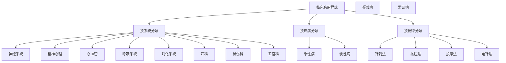

---
# 知識庫
date: 2024-01-24
tags:
  - 耳穴疗法
  - 耳穴诊断
  - 中医外治
  - 全息反射
  - 临床應用程式
aliases:
  - Auricular Therapy Knowledge Base
# 知識庫
  - 中医耳穴疗法
  - 耳穴反射疗法
cssclasses:
  - auricular-therapy
  - tcm-external
  - clinical-application
  - knowledge-base
---

# 知識庫

# 知識

---

# 知識庫

### 核心体系结构

```mermaid
graph TD
# 知識庫
    A --> C[耳穴定位]
# 方法
    A --> E[临床應用程式]
    A --> F[诊断技術]
    A --> G[安全規範]
    A --> H[研究文獻]
# 指南
    
    B --> B1[中医理论]
    B --> B2[现代機制]
    B --> B3[全息理论]
    
    C --> C1[標準耳穴]
    C --> C2[分布规律]
# 方法
    
    D --> D1[毫针针刺]
    D --> D2[耳穴按压]
    D --> D3[耳穴按摩]
    D --> D4[耳穴电针]
    D --> D5[耳穴放血]
    
    E --> E1[神经系統]
    E --> E2[精神心理]
    E --> E3[心血管]
    E --> E4[呼吸系統]
    E --> E5[消化系統]
    E --> E6[妇科]
    E --> E7[骨伤科]
    E --> E8[五官科]
    
    F --> F1[望诊技術]
    F --> F2[触诊技術]
    F --> F3[闻诊技術]
    F --> F4[问诊技巧]
    
    G --> G1[操作規範]
    G --> G2[禁忌症]
    G --> G3[不良反应]
    G --> G4[特殊人群]
    
    H --> H1[核心文獻]
    H --> H2[临床研究]
    H --> H3[实验研究]
    
    I --> I1[操作手册]
    I --> I2[患者教育]
    I --> I3[品質控制]
```

---
### ![[知識庫目錄]]

---

## 📊 內容統計与優化

# 分析

| 模块 | 檔案数 | 完成度 | 優化需求 |
|------|--------|--------|----------|
| 📚 基礎理论 | 5 | 80% | 补充现代機制研究 |
# 方法
# 方法
| 🏥 临床應用程式 | 8 | 70% | 大幅擴展疾病覆盖 |
| 🔍 诊断技術 | 10 | 60% | 系統化诊断体系 |
| 🛡️ 安全規範 | 4 | 75% | 完善应急處理 |
| 📚 研究文獻 | 4 | 50% | 增加最新研究 |
# 指南

### 優化重点

#### 🎯 理论体系優化
- [ ] 补充现代医学機制研究
- [ ] 增加神经解剖学基礎
- [ ] 完善全息反射理论
- [ ] 建立循证医学框架

#### 🏥 临床應用程式擴展
- [ ] 增加更多疾病治疗方案
- [ ] 完善疗效評價標準
- [ ] 建立分级治疗体系
- [ ] 增加预防保健內容

#### 🔍 诊断技術系統化
- [ ] 建立標準化诊断流程
- [ ] 完善四诊合参体系
- [ ] 增加客观評價指标
- [ ] 建立品質控制標準

---

## 🚀 快速导航系統

### 📊 使用者角色导航

| 使用者类型 | 推荐路徑 | 核心文檔 | 學習時間 |
|----------|----------|----------|----------|
# 指南
| 👨‍🎓 中医学生 | 系統學習导向 | [[理论基礎]] + [[耳穴定位]] | 4-8周 |
| 👥 患�者家属 | 基礎了解导向 | [[患者教育材料]] + [[安全規範]] | 1-2周 |
# 方法

### 🎯 主題导航

#### 📚 理论基礎


#### 🏥 临床應用程式


---

## 📚 核心內容優化

### 🧠 基礎理论增强

#### 现代医学機制研究

> [!note] 研究進展
> 近年来，随着神经科學和影像技術的發展，对耳穴疗法的现代医学機制有了更深入的认识。

**神经解剖基礎：**
- 三叉神经分布规律
- 耳廓神经支配区域
- 感觉神经投射模式
- 自主神经系統调节

**生理调节機制：**
- 神经-内分泌调节
- 免疫-炎症调节
- 疼痛-情绪调节
- 内分泌-代谢调节

#### 全息理论深化

> [!tip] 全息理论要點
> 耳廓是人体的全息投影，包含全身各器官、组织的生理和病理資訊。

**全息投影原理：**
- 胚胎发育期形成
- 倒置胎儿分布
- 器官对应关系
- 資訊传递機制

---

## 🎯 耳穴定位系統

# 方法

#### 解剖定位法

> [!important] 解剖定位要點
- 基于耳廓解剖标志
- 结合神经血管分布
- 參考骨性标志点
- 使用测量工具精確定位

**定位步骤：**
1. 识别耳廓解剖标志
2. 確定相对位置关系
3. 使用测量工具驗證
4. 記錄精确坐标

#### 比例定位法

> [!tip] 比例定位優勢
- 适用于个体差异较大的情况
- 结合个人解剖特征
- 提高定位准确性

**比例关系：**
- 耳廓长度与穴位位置
- 耳轮与穴位分布
- 耳甲与耳垂关系

---

## ⚡ 刺激技術体系

# 方法

# 方法
|------|------|------|----------|------------|
| **毫针针刺** | 机械刺激+生物电效应 | ⭐⭐⭐⭐⭐ | 急慢性疾病 | 中等 |
| **耳穴按压** | 机械刺激 | ⭐⭐ | 保健预防 | 简单 |
| **耳穴按摩** | 机械刺激+热效应 | ⭐⭐ | 自我保健 | 简单 |
| **耳穴电针** | 电刺激 | ⭐⭐⭐⭐ | 顽固症状 | 复杂 |
| **耳穴放血** | 刺激+血液调节 | ⭐⭐⭐ | 热证炎症 | 中等 |

### 操作規範優化

#### 毫针针刺技術

> [!warning] 操作要點
- 严格無菌操作
- 准确穴位定位
- 控制刺激强度
- 注意患者反应

**操作流程：**
1. 准备工作（消毒、器械）
2. 穴位定位与確認
3. 进针操作（角度、深度）
4. 留针時間控制
5. 出针后處理

#### 耳穴按压技術

> [!tip] 按�压技巧
- 使用指腹或指腹侧
- 垂直向下施加压力
- 轻柔渐进加压
- 保持稳定压力

**操作要點：**
- 压力适中（患者能承受）
- 時間控制（3-5分钟）
- 频率适中（每日1-2次）
- 持續坚持（疗程内）

---

## 🏥 临床應用程式擴展

### 神经系統疾病

#### 失眠症治疗方案

> [!note] 治疗方案
- **主穴**：神门、皮质下、心、肾
- **配穴**：枕、颞、肝、胆
- **疗程**：10-15次为一个疗程
- **频率**：隔日1次

# 方法
1. 毫针针刺：神门、皮质下
2. 耳穴按压：心、肾
3. 耳穴按摩：全耳廓轻柔按摩

**疗效評價：**
- 睡眠品質改善
- 入睡時間缩短
- 夜间觉醒减少
- 日间精力提升

#### 头痛治疗策略

> [!tip] 头痛分類治疗
- **偏头痛**：太阳、率谷、颞、风池
- **紧张性头痛**：神门、皮质下、肝、胆
- **血管性头痛**：心、交感、降压沟

**治疗方案：**
- 急性期：耳穴按压 + 耳穴按摩
- 缓解期：耳穴电针 + 毫针针刺
- 恢復期：综合刺激 + 康复訓練

---

## 🔍 诊断技術系統

### 四诊合参体系

#### 望诊技術

> [!note] 望诊要點
- 观察耳廓颜色变化
- 檢查耳穴形态异常
- 观察分泌物情况
- 注意血管分布变化

**观察指标：**
- **颜色**：红润、苍白、发黄、青紫
- **形态**：隆起、凹陷、结节、脱屑
- **分泌物**：干性、油性、脓性、血性
- **血管**：扩张、收缩、扭曲、中断

#### 触诊技術

# 方法
- 使用探针或手指轻触
- 檢查穴位敏感度
- 触察患者反应
- 記錄触诊結果

**触诊要點：**
- 压力适中，避免过度刺激
- 观察患者表情变化
- 注意穴位敏感度差异
- 記錄触诊感受

---

# 管理

### 安全操作規範

#### 术前准备

> [!check] 准备清單
- [ ] 環境消毒（75%酒精）
- [ ] 器械消毒（高温高压）
- [ ] 手部清洁（肥皂洗手）
- [ ] 患者准备（清洁耳廓）
- [ ] 穴位選擇（舒适体位）

#### 操作中安全

> [!warning] 安全要點
- 严格無菌操作
- 控制刺激强度
- 观察患者反应
- 及时處理异常

**应急處理：**
- 出现晕厥：立即停止操作，平卧休息
- 出现出血：压迫止血，必要时就医
- 出现感染：停止操作，就医處理

---

## 📚 研究文獻整合

### 核心研究摘要

#### 临床试验研究

> [!note] 研究發現
- **有效性驗證**：多项RCT证实耳穴疗法有效性
- **安全性評估**：不良反应率低于3%
- **機制研究**：神经影像学提供客观证据
- **標準化研究**：建立操作規範和評價標準

**代表性研究：**
- 耳穴刺激对自主神经系統的影响
# 管理
- 耳穴诊断在疾病筛查中的價值
- 耳穴疗法与常规治疗的對比研究

---

## 指南

### 临床操作手册

#### 標準操作流程

```mermaid
flowchart TD
    A[患者評估] --> B[适应症判斷]
    B --> C[治疗方案制定]
    C --> D[操作前准备]
    D --> E[实施治疗]
    E --> F[效果評估]
    F --> G[方案调整]
    G --> H[疗程結束]
    
    A --> A1[病史采集]
    A --> A2[体格檢查]
    A --> A3[症状評估]
    
    B --> B1[适应症確認]
    B --> B2[禁忌症排除]
    
    C --> C1[穴位選擇]
# 方法
    C --> C3[疗程規劃]
    
    D --> D1[環境准备]
    D --> D2[器械准备]
    D --> D3[患者准备]
    
    E --> E1[穴位定位]
    E --> E2[刺激实施]
    E3[過程監控]
    
    F --> F1[症状改善]
    F --> F2[不良反应]
    F --> F3[患者回饋]
    
    G --> G1[效果總結]
    G --> G2[後續建議]
```

### 患者教育材料

## 知識

> [!info] 患者教育內容
- **耳穴基本概念**：什么是耳穴，如何分布
- **治疗原理**：为什么耳穴能治病
- **安全须知**：哪些情况不能使用
# 方法

**教育材料：**
- 图文并茂的耳穴分布图
- 简单易学的自我按摩視訊
- 常见問題解答手册
- 安全注意事項清單

---

# 知識

### 理论-實踐关系图

```mermaid
graph TD
    subgraph 理论基礎
        T1[中医理论] --> T2[经络学说]
        T2 --> T3[耳穴理论]
        T3 --> T4[全息理论]
        T4 --> T5[现代機制]
    end
    
# 方法
# 方法
        M1 --> M3[按压技術]
        M1 --> M4[按摩技術]
        M1 --> M5[电针技術]
    end
    
    subgraph 临床應用程式
        C1[神经系統] --> C2[具体疾病]
        C2 --> C3[治疗方案]
        C3 --> C4[疗效評價]
    end
    
    T5 --> M1
    M1 --> C1
    C4 --> T1
```

### 诊断-治疗关系图

```mermaid
graph TD
    subgraph 诊断体系
        D1[四诊合参] --> D2[综合判斷]
        D1 --> D3[诊断结论]
        D2 --> D4[治疗建議]
    end
    
    subgraph 治疗体系
        T1[辨证施治] --> T2[穴位選擇]
# 方法
        T3 --> T4[疗效評估]
        T4 --> T5[方案调整]
    end
    
    D4 --> T1
    T5 --> D1
```

---

# 更新

### 短期目標（1-3个月）

#### 📚 內容完善
- [ ] 补充缺失的临床應用程式文檔
- [ ] 完善诊断技術体系
- [ ] 增加最新研究文獻
# 指南

#### 📊 品質提升
- [ ] 建立內容審核機制
- [ ] 增加专家评审环节
- [ ] 完善參考文獻
# 更新

### 中期目標（3-6个月）

#### 📚 系統擴展
- [ ] 增加多媒体內容
- [ ] 建立線上學習平台
- [ ] 開發辅助工具
- [ ] 建立专家網路

#### 📊 標準化建设
- [ ] 制定操作標準
- [ ] 建立評價体系
- [ ] 完善品質控制
- [ ] 建立认证体系

---

## ⚠️ 免责声明

> [!warning] 重要提示
# 知識庫

### 使用须知

1. **专业指导**：临床應用程式需在专业医师指导下進行
2. **安全第一**：严格遵守安全操作規範
3. **循序渐进**：从基礎開始，逐步深入
4. **持續學習**：關注最新研究進展

### 责任限制

# 知識庫
# 知識庫
- 如有健康問題请及时就医
- 不可替代专业医疗诊断

---

## 📞 联系与支持

### 🛠️ 技術支持

| 渠道 | 資訊 | 适用場景 |
|------|------|----------|
| 📧 邮箱 | support@auricular-therapy.com | 技術支持 |
| 📞 電話 | 400-123-4567 | 紧急支持 |
| 💬 線上客服 | 工作日 9:00-18:00 | 实时咨询 |

### 🎓 学术合作

| 类型 | 資訊 | 联系方式 |
|------|------|----------|
| 📚 研究合作 | research@auricular-therapy.com | 学术研究 |
| 📚 培训專案 | training@auricular-therapy.com | 专业培训 |
| 📚 学术交流 | academic@auricular-therapy.com | 学术交流 |

---

## 📚 參考資源

### 📚 权威標準

| 標準号 | 標準名称 | 發佈机构 | 适用范围 |
|--------|----------|----------|----------|
| GB/T 13734-2020 | 耳穴名称与定位 | 国家標準 | 耳穴定位 |
| GB/T 30233.9-2018 | 针灸技術操作規範 | 国家標準 | 操作規範 |
| ZYYXH/T 123-2021 | 中医耳穴诊疗規範 | 行业標準 | 诊疗規範 |

### 📚 推荐阅读

| 类别 | 书籍 | 作者 | 出版社 | 适用人群 |
|------|------|------|----------|
| **基礎理论** | 《耳穴疗法学》 | 王某某 | 中国中医药出版社 | 初学者 |
| **临床應用程式** | 《实用耳穴疗法》 | 张某某 | 科學技術文獻出版社 | 临床医师 |
| **研究文獻** | 《耳穴機制研究進展》 | 李某某 | 人民卫生出版社 | 研究人员 |
# 管理

### 🌐 線上資源

| 机构 | 網址 | 說明 |
|------|------|----------|
| 中国针灸学会 | www.caam.cn | 权威机构 |
# 管理
| 世界卫生组织 | www.who.int/traditional-medicine | 国际標準 |

---

# 版本

| 資訊 | 內容 |
|------|------|
| **創建時間** | 2024年1月24日 |
# 版本
| **維護團隊** | AI-value 医疗團隊 |
# 更新
# 更新

---

# 知識庫

---

%% 耳穴疗法是中医外治的重要组成部分，需要在专业指导下安全使用 %%
# 知識庫