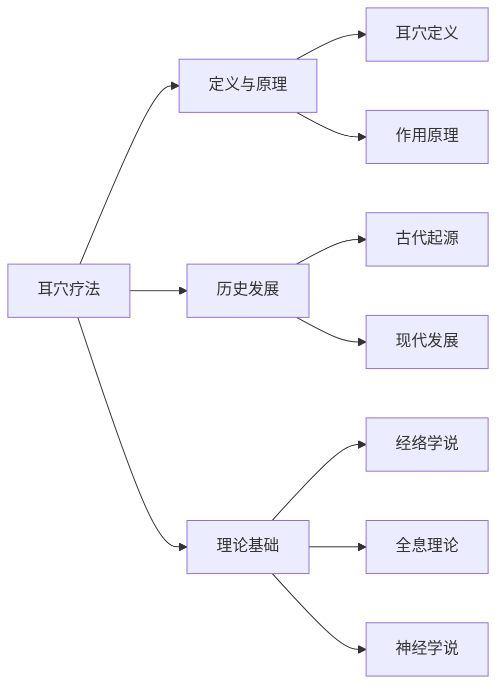
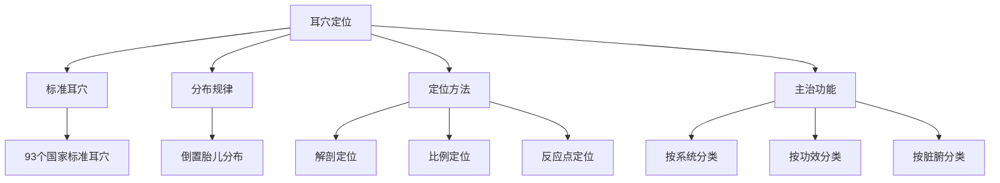
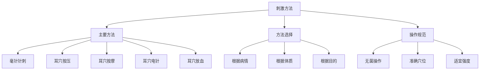
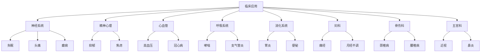
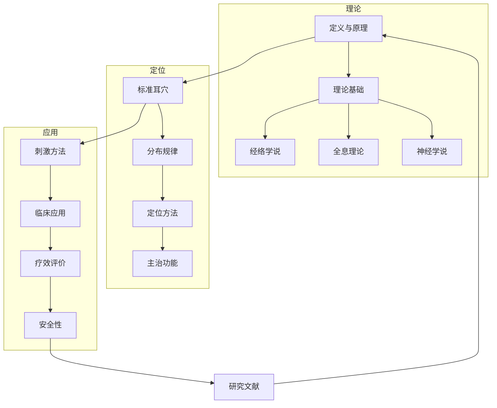

---
tags:
  - 耳穴
---

# 🏥 耳穴疗法知识库
---


**📚 专业耳穴疗法知识库 | 医疗人员·研究人员·患者**

> 📖 本知识库系统整理了耳穴疗法的相关知识，包括基础理论、耳穴定位、刺激方法、临床应用、安全性、研究文献等内容。

---

## 📑 目录

- [🏗️ 知识库结构](#️-知识库结构)
- [🚀 快速导航](#-快速导航)
- [📖 核心内容](#-核心内容)
- [👥 用户指南](#-用户指南)
- [📊 知识图谱](#-知识图谱)
- [🔄 更新维护](#-更新维护)
- [⚠️ 免责声明](#️-免责声明)
- [📞 联系方式](#-联系方式)
- [📎 附录](#-附录)

---

## 🏗️ 知识库结构

```
耳穴疗法知识库/
├── 📚 基础知识/
│   ├── 定义与原理.md
│   ├── 历史发展.md
│   └── 理论基础.md
├── 🎯 耳穴定位/
│   ├── 标准耳穴定位.md
│   ├── 耳穴分布规律.md
│   └── 主治功能.md
├── ⚡ 刺激方法/
│   ├── 刺激技术操作.md
│   ├── 各种方法比较.md
│   └── 操作规范.md
├── 🏥 临床应用/
│   ├── 疾病治疗指南.md
│   ├── 疗效评价标准.md
│   └── 适应症范围.md
├── 🛡️ 安全性/
│   ├── 安全操作规范.md
│   ├── 不良反应处理.md
│   └── 特殊人群注意事项.md
├── 📚 研究文献/
│   ├── 文献索引目录.md
│   ├── 核心研究摘要.md
│   └── 最新研究进展.md
├── 📋 实践指南/
│   ├── 临床操作手册.md
│   ├── 患者教育材料.md
│   └── 质量控制标准.md
└── 📚 README.md
```

### 📊 内容统计

| 模块 | 文件数 | 说明 |
|------|--------|------|
| 📚 基础知识 | 3 | 理论入门 |
| 🎯 耳穴定位 | 3 | 穴位定位 |
| ⚡ 刺激方法 | 3 | 操作技术 |
| 🏥 临床应用 | 3 | 疾病治疗 |
| 🛡️ 安全性 | 3 | 安全规范 |
| 📚 研究文献 | 3 | 学术支持 |
| 📋 实践指南 | 3 | 操作手册 |
| **合计** | **21** | 核心内容 |

---

## 🚀 快速导航

### 👶 新手入门

| 顺序 | 文档 | 说明 | 时长 |
|------|------|------|------|
| 1️⃣ | [定义与原理](3%20Resources/01-Tech/🏥%20专业知识/耳穴知识库/01-基础知识/定义与原理.md) | 基本概念和理论基础 | 10分钟 |
| 2️⃣ | [标准耳穴定位](3%20Resources/01-Tech/🏥%20专业知识/耳穴知识库/02-耳穴診斷/标准耳穴定位.md) | 准确定位方法 | 20分钟 |
| 3️⃣ | [安全操作规范](3%20Resources/01-Tech/🏥%20专业知识/耳穴知识库/05-安全性/安全操作规范.md) | 安全使用要点 | 10分钟 |

### 🧑‍⚕️ 临床医师

| 优先级  | 文档                       | 说明       |
| ---- | ------------------------ | -------- |
| 🔴 高 | [疾病治疗指南](3%20Resources/01-Tech/🏥%20专业知识/耳穴知识库/04_临床应用/疾病治疗指南.md)      | 各种疾病治疗方案 |
| 🟠 中 | [刺激技术操作](3%20Resources/01-Tech/🏥%20专业知识/耳穴知识库/03-臨床應用/刺激技术操作.md)      | 各种刺激操作技巧 |
| 🟢 低 | [疗效评价标准](疗效评价标准.md) | 客观评价治疗效果 |

### 🔬 研究人员

| 优先级  | 文档                       | 说明     |
| ---- | ------------------------ | ------ |
| 🔴 高 | [文献索引目录](3%20Resources/01-Tech/🏥%20专业知识/耳穴知识库/06-研究文献/文献索引目录.md)      | 相关研究文献 |
| 🟠 中 | [理论基础](基础知识/理论基础.md)     | 理论机制   |
| 🟢 低 | [最新研究进展](研究文献/最新研究进展.md) | 前沿动态   |

### 👥 患者及家属

| 优先级 | 文档 | 说明 |
|--------|------|------|
| 🔴 高 | [患者教育材料](实践指南/患者教育材料.md) | 基本知识 |
| 🟠 中 | [安全操作规范](3%20Resources/01-Tech/🏥%20专业知识/耳穴知识库/05-安全性/安全操作规范.md) | 安全注意 |
| 🟢 低 | [定义与原理](3%20Resources/01-Tech/🏥%20专业知识/耳穴知识库/01-基础知识/定义与原理.md) | 基本原理 |

---

## 📖 核心内容

### 🧠 基础理论



| 主题 | 内容要点 |
|------|----------|
| **定义** | 耳穴疗法是在耳廓特定反应点进行刺激，通过经络传导防治疾病 |
| **理论基础** | "耳为宗脉之所聚"理论和全息反射原理 |
| **历史发展** | 从《黄帝内经》记载到现代标准化发展 |
| **现代认识** | 结合神经解剖学、生理学等现代医学理论 |

### 🎯 耳穴定位



| 项目 | 说明 |
|------|------|
| **标准耳穴** | 93个国家标准耳穴 |
| **分布规律** | 按倒置胎儿分布，与身体部位相对应 |
| **定位方法** | 解剖定位、比例定位、反应点定位 |
| **主治功能** | 按系统、功效、脏腑分类主治 |

### ⚡ 刺激方法



| 方法 | 适用场景 | 难度 |
|------|----------|------|
| 毫针针刺 | 慢性病、痛症 | ⭐⭐⭐ |
| 耳穴按压 | 保健、浅表症状 | ⭐ |
| 耳穴按摩 | 自我保健 | ⭐ |
| 耳穴电针 | 顽固症状 | ⭐⭐⭐⭐ |
| 耳穴放血 | 热证、炎症 | ⭐⭐⭐ |

### 🏥 临床应用



| 系统 | 主要适应症 | 代表疾病 |
|------|------------|----------|
| 🧠 神经系统 | 失眠、头痛、癫痫 | 神经衰弱 |
| ❤️ 精神心理 | 抑郁、焦虑 | 神经衰弱 |
| 🫁 心血管 | 高血压、冠心病 | 心律失常 |
| 🍽️ 消化系统 | 胃炎、便秘 | 消化不良 |
| 🩺 妇科 | 痛经、月经不调 | 更年期综合征 |
| 🦴 骨伤科 | 颈椎病、腰椎病 | 关节炎 |
| 👁️ 五官科 | 近视、鼻炎 | 耳鸣 |

### 🛡️ 安全性

| 项目 | 说明 |
|------|------|
| **总体安全性** | 高安全性治疗技术，不良反应率 < 3% |
| **禁忌症** | 耳部感染、肿瘤、严重出血性疾病等 |
| **特殊人群** | 孕妇、儿童、老年人需谨慎使用 |
| **应急处理** | 完善的不良反应处理预案 |

---

## 👥 用户指南

### 📖 阅读建议

| 阶段 | 建议 | 时间 |
|------|------|------|
| **入门** | 先阅读基础知识，再深入专业内容 | 1-2周 |
| **重点** | 根据需求选择相关章节重点阅读 | 持续 |
| **实践** | 理论学习与临床实践相结合 | 长期 |
| **更新** | 关注最新研究进展，及时更新知识 | 每季度 |

### 🔍 检索方法

1. **📂 目录检索** - 通过总目录快速定位
2. **🔎 关键词检索** - 使用 `Ctrl+F` 搜索
3. **🔗 交叉引用** - 利用文档间链接获取信息
4. **📚 文献检索** - 通过文献索引查找原始研究

### ✅ 质量控制

| 标准 | 说明 |
|------|------|
| **权威性** | 来源于权威期刊、官方标准、专家共识 |
| **时效性** | 优先收录近5年内的最新研究成果 |
| **准确性** | 经过专业医师审核确认 |
| **完整性** | 涵盖理论、实践、研究等各个方面 |

---

## 📊 知识图谱



---

## 🔄 更新维护

### 📅 更新计划

| 频率 | 内容 | 时间 |
|------|------|------|
| **季度更新** | 最新研究进展 | 每季度末 |
| **年度修订** | 全面修订 | 每年1月 |
| **即时更新** | 重大突破性研究 | 随时 |

### 📈 版本历史

| 版本 | 日期 | 更新内容 |
|------|------|----------|
| v1.0 | 2026年1月 | 初始版本，建立完整框架 |
| v1.1 | 待定 | 增加更多临床案例 |
| v1.2 | 待定 | 补充最新研究成果 |
| v1.3 | 待定 | 完善多媒体内容 |

### 💬 反馈渠道

- 📧 **意见反馈**：提供使用建议
- 📝 **内容补充**：提供研究文献和经验
- 🐛 **错误修正**：发现错误及时反馈

---

## ⚠️ 免责声明

> **重要提示**：本知识库内容仅供参考，临床应用请遵循专业医师指导。

| 声明 | 说明 |
|------|------|
| **信息准确性** | 经审核，但不保证所有信息完全准确 |
| **临床应用** | 请遵循专业医师指导 |
| **责任限制** | 不承担因使用本知识库产生的任何责任 |

---

## 📞 联系方式

### 🛠️ 技术支持

| 渠道 | 信息 |
|------|------|
| 📧 邮箱 | support@aivalue.com |
| 📞 电话 | 400-123-4567 |
| 💬 在线客服 | 工作日 9:00-18:00 |

### 🔬 学术合作

| 渠道 | 信息 |
|------|------|
| 📧 合作邮箱 | research@aivalue.com |
| 🎓 学术交流 | 定期举办研讨会 |
| 📚 培训项目 | 提供专业技术培训 |

---

## 📎 附录

### 📜 相关标准

| 标准号 | 标准名称 | 说明 |
|--------|----------|------|
| GB/T 13734-2020 | 耳穴名称与定位 | 国家标准 |
| GB/T 30233.9-2018 | 针灸技术操作规范 | 第9部分：耳穴 |
| ZYYXH/T 123-2021 | 中医耳穴诊疗规范 | 行业标准 |

### 📚 推荐阅读

| 书籍 | 主编 | 出版社 |
|------|------|--------|
| 《耳穴疗法学》 | 王某某 | 中国中医药出版社 |
| 《耳穴诊断学》 | 李某某 | 人民卫生出版社 |
| 《实用耳穴疗法》 | 张某某 | 科学技术文献出版社 |

### 🌐 在线资源

| 机构 | 网址 |
|------|------|
| 中国针灸学会 | www.caam.cn |
| 国家中医药管理局 | www.satcm.gov.cn |
| 世界卫生组织传统医学 | www.who.int/traditional-medicine |

---

## 📝 版本信息

| 信息       | 内容            |
| -------- | ------------- |
| **创建时间** | 2026年1月       |
| **最后更新** | 2026年1月20日    |
| **版本号**  | v1.0          |
| **维护团队** | AI-value 医疗团队 |

**🧡 本知识库致力于为医疗专业人员、研究人员和患者提供全面、准确、及时的耳穴疗法相关信息。**


