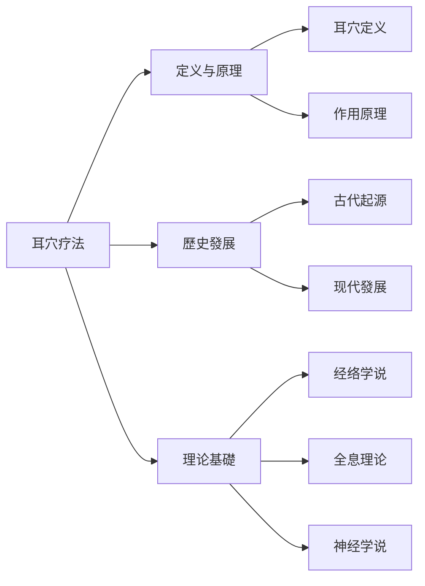
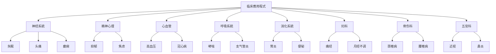

---
tags:
  - 耳穴
---

# 知識庫
---


# 版本

# 知識庫

# 知識庫

---

## 📑 目錄

# 知識庫
- [🚀 快速导航](#-快速导航)
- [📖 核心內容](#-核心內容)
# 指南
# 知識
# 更新
- [⚠️ 免责声明](#️-免责声明)
- [📞 联系方式](#-联系方式)
- [📎 附录](#-附录)

---

# 知識庫

```
# 知識庫
# 知識
│   ├── 定义与原理.md
│   ├── 歷史發展.md
│   └── 理论基礎.md
├── 🎯 耳穴定位/
│   ├── 標準耳穴定位.md
│   ├── 耳穴分布规律.md
│   └── 主治功能.md
# 方法
│   ├── 刺激技術操作.md
# 方法
│   └── 操作規範.md
├── 🏥 临床應用程式/
# 指南
│   ├── 疗效評價標準.md
│   └── 适应症范围.md
├── 🛡️ 安全性/
│   ├── 安全操作規範.md
│   ├── 不良反应處理.md
│   └── 特殊人群注意事項.md
├── 📚 研究文獻/
│   ├── 文獻索引目錄.md
│   ├── 核心研究摘要.md
│   └── 最新研究進展.md
# 指南
│   ├── 临床操作手册.md
│   ├── 患者教育材料.md
│   └── 品質控制標準.md
└── 📚 README.md
```

### 📊 內容統計

| 模块 | 檔案数 | 說明 |
|------|--------|------|
# 知識
| 🎯 耳穴定位 | 3 | 穴位定位 |
# 方法
| 🏥 临床應用程式 | 3 | 疾病治疗 |
| 🛡️ 安全性 | 3 | 安全規範 |
| 📚 研究文獻 | 3 | 学术支持 |
# 指南
| **合计** | **21** | 核心內容 |

---

## 🚀 快速导航

### 👶 新手入门

| 顺序 | 文檔 | 說明 | 时长 |
|------|------|------|------|
# 專業知識
# 專業知識
# 專業知識

### 🧑‍⚕️ 临床医师

| 優先級  | 文檔                       | 說明       |
| ---- | ------------------------ | -------- |
# 專業知識
# 專業知識
| 🟢 低 | [疗效評價標準](疗效評價標準.md) | 客观評價治疗效果 |

### 🔬 研究人员

| 優先級  | 文檔                       | 說明     |
| ---- | ------------------------ | ------ |
# 專業知識
# 知識
| 🟢 低 | [最新研究進展](研究文獻/最新研究進展.md) | 前沿動態   |

### 👥 患者及家属

| 優先級 | 文檔 | 說明 |
|--------|------|------|
# 知識
# 專業知識
# 專業知識

---

## 📖 核心內容

### 🧠 基礎理论



| 主題 | 內容要點 |
|------|----------|
| **定义** | 耳穴疗法是在耳廓特定反应点進行刺激，通過经络传导防治疾病 |
| **理论基礎** | "耳为宗脉之所聚"理论和全息反射原理 |
| **歷史發展** | 从《黄帝内经》记载到现代標準化發展 |
| **现代认识** | 结合神经解剖学、生理学等现代医学理论 |

### 🎯 耳穴定位

```mermaid
graph TD
    A[耳穴定位] --> B[標準耳穴]
    A --> C[分布规律]
# 方法
    A --> E[主治功能]

    B --> B1[93个国家標準耳穴]
    C --> C1[倒置胎儿分布]
    D --> D1[解剖定位]
    D --> D2[比例定位]
    D --> D3[反应点定位]
    E --> E1[按系統分類]
    E --> E2[按功效分類]
    E --> E3[按脏腑分類]
```

| 專案 | 說明 |
|------|------|
| **標準耳穴** | 93个国家標準耳穴 |
| **分布规律** | 按倒置胎儿分布，与身体部位相对应 |
# 方法
| **主治功能** | 按系統、功效、脏腑分類主治 |

# 方法

```mermaid
graph TD
# 方法
# 方法
    A --> D[操作規範]

    B --> B1[毫针针刺]
    B --> B2[耳穴按压]
    B --> B3[耳穴按摩]
    B --> B4[耳穴电针]
    B --> B5[耳穴放血]

    C --> C1[根据病情]
    C --> C2[根据体质]
    C --> C3[根据目的]

    D --> D1[無菌操作]
    D --> D2[准确穴位]
    D --> D3[适宜强度]
```

# 方法
|------|----------|------|
| 毫针针刺 | 慢性病、痛症 | ⭐⭐⭐ |
| 耳穴按压 | 保健、浅表症状 | ⭐ |
| 耳穴按摩 | 自我保健 | ⭐ |
| 耳穴电针 | 顽固症状 | ⭐⭐⭐⭐ |
| 耳穴放血 | 热证、炎症 | ⭐⭐⭐ |

### 🏥 临床應用程式



| 系統 | 主要适应症 | 代表疾病 |
|------|------------|----------|
| 🧠 神经系統 | 失眠、头痛、癫痫 | 神经衰弱 |
| ❤️ 精神心理 | 抑郁、焦虑 | 神经衰弱 |
| 🫁 心血管 | 高血压、冠心病 | 心律失常 |
| 🍽️ 消化系統 | 胃炎、便秘 | 消化不良 |
| 🩺 妇科 | 痛经、月经不调 | 更年期综合征 |
| 🦴 骨伤科 | 颈椎病、腰椎病 | 关节炎 |
| 👁️ 五官科 | 近视、鼻炎 | 耳鸣 |

### 🛡️ 安全性

| 專案 | 說明 |
|------|------|
| **总体安全性** | 高安全性治疗技術，不良反应率 < 3% |
| **禁忌症** | 耳部感染、肿瘤、严重出血性疾病等 |
| **特殊人群** | 孕妇、儿童、老年人需谨慎使用 |
| **应急處理** | 完善的不良反应處理预案 |

---

# 指南

### 📖 阅读建議

| 階段 | 建議 | 時間 |
|------|------|------|
# 知識
| **重点** | 根据需求選擇相關章节重点阅读 | 持續 |
| **實踐** | 理论學習与临床實踐相结合 | 长期 |
# 知識

# 方法

1. **📂 目錄檢索** - 通過总目錄快速定位
2. **🔎 關鍵词檢索** - 使用 `Ctrl+F` 搜尋
3. **🔗 交叉引用** - 利用文檔间連結获取資訊
4. **📚 文獻檢索** - 通過文獻索引尋找原始研究

### ✅ 品質控制

| 標準 | 說明 |
|------|------|
| **权威性** | 来源于权威期刊、官方標準、专家共识 |
| **时效性** | 优先收录近5年内的最新研究成果 |
| **准确性** | 經過专业医师審核確認 |
| **完整性** | 涵盖理论、實踐、研究等各个方面 |

---

# 知識

```mermaid
graph TD
    subgraph 理论
    T1[定义与原理] --> T2[理论基礎]
    T2 --> T3[经络学说]
    T2 --> T4[全息理论]
    T2 --> T5[神经学说]
    end

    subgraph 定位
    L1[標準耳穴] --> L2[分布规律]
# 方法
    L3 --> L4[主治功能]
    end

    subgraph 應用程式
# 方法
    A2 --> A3[疗效評價]
    A3 --> A4[安全性]
    end

    T1 --> L1
    L1 --> A1
    A4 --> R[研究文獻]
    R --> T1
```

---

# 更新

# 更新

| 频率 | 內容 | 時間 |
|------|------|------|
# 更新
| **年度修订** | 全面修订 | 每年1月 |
# 更新

# 版本

# 更新
|------|------|----------|
# 版本
| v1.1 | 待定 | 增加更多临床案例 |
| v1.2 | 待定 | 补充最新研究成果 |
| v1.3 | 待定 | 完善多媒体內容 |

### 💬 回饋渠道

- 📧 **意見回饋**：提供使用建議
- 📝 **內容补充**：提供研究文獻和經驗
- 🐛 **错误修正**：發現错误及时回饋

---

## ⚠️ 免责声明

# 知識庫

| 声明 | 說明 |
|------|------|
| **資訊准确性** | 经審核，但不保证所有資訊完全准确 |
| **临床應用程式** | 请遵循专业医师指导 |
# 知識庫

---

## 📞 联系方式

### 🛠️ 技術支持

| 渠道 | 資訊 |
|------|------|
| 📧 邮箱 | support@aivalue.com |
| 📞 電話 | 400-123-4567 |
| 💬 線上客服 | 工作日 9:00-18:00 |

### 🔬 学术合作

| 渠道 | 資訊 |
|------|------|
| 📧 合作邮箱 | research@aivalue.com |
| 🎓 学术交流 | 定期举办研讨会 |
| 📚 培训專案 | 提供专业技術培训 |

---

## 📎 附录

### 📜 相關標準

| 標準号 | 標準名称 | 說明 |
|--------|----------|------|
| GB/T 13734-2020 | 耳穴名称与定位 | 国家標準 |
| GB/T 30233.9-2018 | 针灸技術操作規範 | 第9部分：耳穴 |
| ZYYXH/T 123-2021 | 中医耳穴诊疗規範 | 行业標準 |

### 📚 推荐阅读

| 书籍 | 主编 | 出版社 |
|------|------|--------|
| 《耳穴疗法学》 | 王某某 | 中国中医药出版社 |
| 《耳穴诊断学》 | 李某某 | 人民卫生出版社 |
| 《实用耳穴疗法》 | 张某某 | 科學技術文獻出版社 |

### 🌐 線上資源

| 机构 | 網址 |
|------|------|
| 中国针灸学会 | www.caam.cn |
# 管理
| 世界卫生组织传统医学 | www.who.int/traditional-medicine |

---

# 版本

| 資訊       | 內容            |
| -------- | ------------- |
| **創建時間** | 2026年1月       |
# 更新
# 版本
| **維護團隊** | AI-value 医疗團隊 |

# 知識庫


