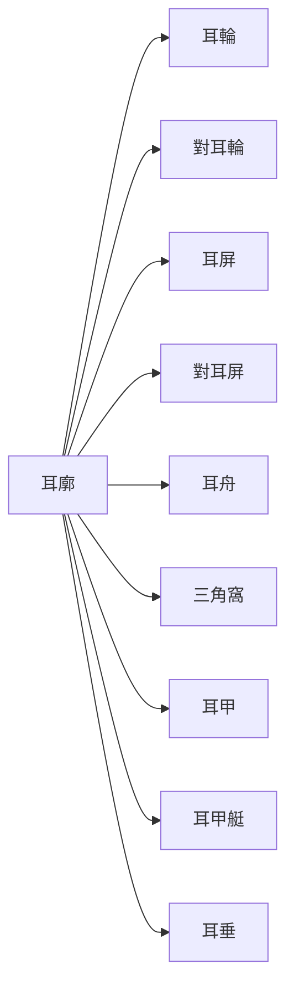
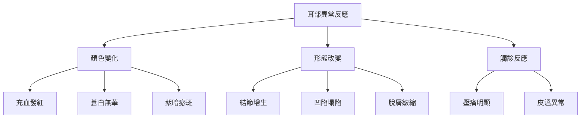
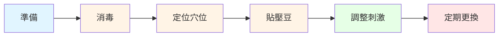

# 耳診知識

> [!info] 概述
> 耳診（耳穴診斷）是中醫特色診斷方法之一，透過觀察耳廓的反應點來判斷人體的健康狀況。

---

## 🌟 核心理念

### 什麼是耳診？

耳診是中醫「望診」的一種，基於以下理論基礎：

| 理論 | 說明 |
|------|------|
| **全息理論** | 耳廓是人體的縮影，身體各部位在耳部有對應點 |
| **經絡理論** | 耳部與十二經脈、奇經八脈密切相關 |
| **神經反射理論** | 耳部神經分佈豐富，與全身神經系統相連 |

### 耳診的特點

| 特點 | 說明 |
|------|------|
| **非侵入性** | 無需儀器檢查，簡單觀察即可 |
| **整體性** | 能反映全身各系統的健康狀況 |
| **預防性** | 可早期發現潛在的健康問題 |
| **輔助性** | 可與其他診斷方法相互參考 |

---

## 🗺️ 耳部解剖與對應

### 耳廓分區

### 常見對應部位

| 身體部位 | 耳部對應位置 | 說明 |
|----------|--------------|------|
| **大腦** | 對耳屏上緣 | 思維、記憶、情緒相關 |
| **心臟** | 耳甲腔正中 | 心血管系統 |
| **肺** | 心穴下方 | 呼吸系統 |
| **胃** | 耳輪腳消失處 | 消化系統 |
| **肝** | 耳甲艇後緣 | 代謝、情緒調節 |
| **腎** | 對耳輪上腳 | 泌尿、生殖、骨質相關 |
| **腸** | 耳輪腳處 | 消化排泄功能 |
| **脊柱** | 對耳屏內側 | 骨骼肌肉系統 |

---

## 🩺 診斷方法

### 觀察要點

| 項目 | 正常狀態 | 異常表現 | 可能意義 |
|------|----------|----------|----------|
| **顏色** | 粉紅色、有光澤 | 發紅/蒼白/紫暗 | 炎症/貧血/血瘀 |
| **形狀** | 平整、光滑 | 凸起/凹陷/結節 | 腫瘤/增生/虧損 |
| **溫度** | 與體溫一致 | 局部發熱/發涼 | 急性炎症/氣虛寒凝 |
| **壓痛** | 無明顯壓痛 | 壓痛明顯 | 相應部位有問題 |
| **脫屑** | 無明顯脫屑 | 脫屑明顯 | 體內濕熱/代謝異常 |

### 常見病理反應

---

## 📋 常見疾病耳診表現

### 消化系統

| 疾病 | 耳部表現 | 對應穴位 |
|------|----------|----------|
| **胃炎** | 胃穴充血、有壓痛 | 胃穴 |
| **消化不良** | 胃、小腸穴見白色脫屑 | 胃、小腸穴 |
| **便秘** | 直腸穴見結節 | 直腸穴、大腸穴 |
| **腹瀉** | 小腸、大腸穴水腫 | 小腸、大腸穴 |

### 呼吸系統

| 疾病 | 耳部表現 | 對應穴位 |
|------|----------|----------|
| **支氣管炎** | 氣管穴充血、結節 | 氣管、肺穴 |
| **咳嗽** | 氣管穴紅腫 | 氣管穴 |
| **氣喘** | 肺穴見白色脫屑 | 肺穴、平喘穴 |

### 心血管系統

| 疾病 | 耳部表現 | 對應穴位 |
|------|----------|----------|
| **高血壓** | 心穴、降壓溝充血 | 心穴、降壓溝 |
| **心悸** | 心穴壓痛明顯 | 心穴、神門穴 |
| **心絞痛** | 心穴見紫暗色 | 心穴、胸穴 |

### 神經與骨骼系統

| 疾病 | 耳部表現 | 對應穴位 |
|------|----------|----------|
| **頭痛** | 額、顳穴充血 | 額、顳、神門穴 |
| **頸椎病** | 頸椎穴見結節 | 頸椎、肩穴 |
| **腰椎病** | 腰骶椎穴凹陷 | 腰骶椎穴 |
| **關節炎** | 對應關節穴壓痛 | 相應關節穴 |

---

## 💆 耳穴治療

### 治療原則

| 原則 | 說明 |
|------|------|
| **辨證取穴** | 根據體質和症狀選擇穴位 |
| **雙側取穴** | 一般雙耳同時取穴 |
| **主配結合** | 主穴加配穴增強效果 |
| **輕柔操作** | 避免過度刺激造成疼痛 |

### 常用治療方法

| 方法 | 說明 | 適應症 |
|------|------|----------|
| **耳穴壓豆** | 使用王不留行籽貼壓 | 慢性病、保健養生 |
| **耳穴貼磁** | 磁珠貼於穴位 | 疼痛、失眠 |
| **耳穴針刺** | 針刺耳穴 | 急性疼痛、中風恢復 |
| **耳穴埋針** | 皮內針埋於穴位 | 持續治療需求 |
| **耳穴按摩** | 自我按摩耳廓 | 日常保健、放鬆 |

### 耳穴壓豆操作

**操作步驟：**

1. **準備材料**
   - 王不留行籽或磁珠
   - 膠布（醫用膠帶）
   - 酒精棉球

2. **消毒穴位**
   - 用酒精棉球清潔耳廓
   - 待乾後操作

3. **定位貼壓**
   - 找準對應穴位
   - 用鑷子夾取壓豆
   - 貼於穴位上

4. **自我按摩**
   - 每日按壓 3-5 次
   - 每次 1-2 分鐘
   - 以感覺酸脹為度

5. **定期更換**
   - 每 3-5 天更換一次
   - 雙耳交替使用

---

## 🧘 日常耳穴保健

### 耳部按摩手法

| 手法 | 操作 | 功效 |
|------|------|------|
| **揉耳輪** | 拇指和食指夾住耳輪 | 提神醒腦、強化免疫 |
| **拉耳垂** | 輕輕下拉耳垂 | 預防頭痛、明目 |
| **捏三角窩** | 捏按耳部三角窩 | 安神助眠 |
| **推耳甲** | 用指腹推按耳甲腔 | 調和內臟 |
| **搓全耳** | 雙手掌搓熱捂耳 | 放鬆全身、促進循環 |

### 健康養生穴位

| 穴位 | 位置 | 主要功效 | 適合人群 |
|------|------|----------|----------|
| **神門穴** | 三角窩後 1/3 處 | 安神定志、改善睡眠 | 失眠、焦慮者 |
| **交感穴** | 對耳輪下腳內側 | 調節自主神經、緩解疼痛 | 焦慮、胃痛者 |
| **內分泌穴** | 屏間切跡處 | 調節內分泌、月經不調 | 內分泌失調者 |
| **腎穴** | 對耳輪上腳處 | 補腎強身、改善記憶 | 腎虛、記憶力差者 |
| **肝穴** | 耳甲艇後緣 | 疏肝理氣、緩解壓力 | 肝鬱、情緒不佳者 |

---

## ⚠️ 注意事項與禁忌

### 注意事項

| 項目 | 說明 |
|------|------|
| **消毒徹底** | 操作前後必須消毒耳廓 |
| **避免感染** | 保持耳部清潔乾燥 |
| **輕柔操作** | 避免過度用力造成損傷 |
| **過敏測試** | 膠布過敏者需選擇其他材料 |
| **定期檢查** | 觀察貼壓部位是否有紅腫過敏 |

### 禁忌情況

| 情況 | 說明 |
|------|------|
| **耳部潰瘍** | 有開放性傷口時不宜治療 |
| **外耳炎** | 耳部有炎症時暫停治療 |
| **嚴重心臟病** | 強刺激可能誘發問題 |
| **妊娠期** | 某些穴位需慎用或禁用 |
| **膠布過敏** | 選擇其他固定方式 |

---

## 📚 相關資源

### 內部連結

- [[2 Areas/個人成長/健康管理]] - 個人健康管理相關
- [[3 Resources/健康知識體系]] - 健康知識彙整
- [[5 Zettels/💡 fleeting/養生-閃念]] - 養生相關閃念筆記

### 推薦閱讀

| 書籍 | 作者 | 說明 |
|------|------|------|
| 《耳穴療法大全》 | 王國祥 | 耳穴理論與實踐 |
| 《中醫耳診學》 | 劉煥亭 | 耳診診斷方法 |
| 《實用耳穴療法》 | 張穎 | 臨床應用指南 |

### 外部資源

| 資源 | 連結 | 說明 |
|------|------|------|
| 世界針灸學會聯合會 | https://www.ias-world.org/ | 國際針灸組織 |
| 中醫藥管理局 | http://www.satcm.gov.cn/ | 官方中醫資訊 |

---

## 🔬 科學研究與發展

### 研究現狀

| 研究方向 | 發現 |
|----------|------|
| **神經生理學** | 耳穴與迷走神經的連接機制 |
| **影像學研究** | fMRI 顯示耳穴刺激的大腦反應區域 |
| **臨床試驗** | 耳穴療法在疼痛管理、失眠等方面的效果 |

### 未來發展

- **標準化** - 建立更標準化的穴位定位和操作規範
- **機制研究** - 深入研究耳穴作用的神經和生理機制
- **技術整合** - 結合現代技術（如生物回饋）增強效果
- **國際推廣** - 促進中醫耳診在全球的認可和應用

---

> [!tip] 使用建議
> 耳診是中醫診斷的重要方法之一，但不應取代現代醫學的必要檢查。如有健康問題，請諮詢專業醫師。

---

*建立日期：2026-01-22*
*最後更新：2026-01-22*
*標籤：#耳診 #中醫 #針灸 #養生 #健康知識*
