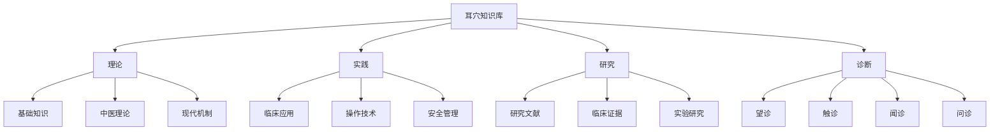
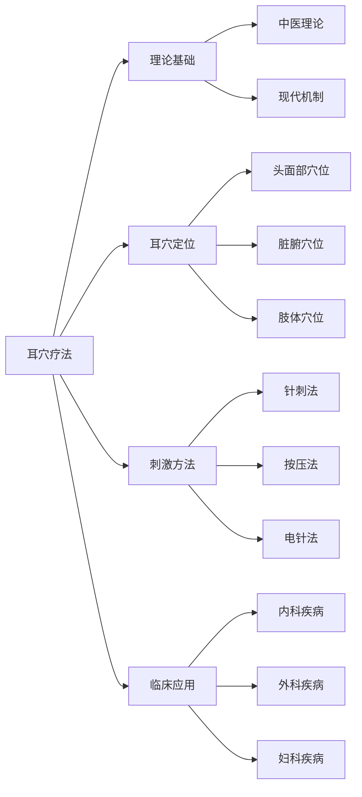
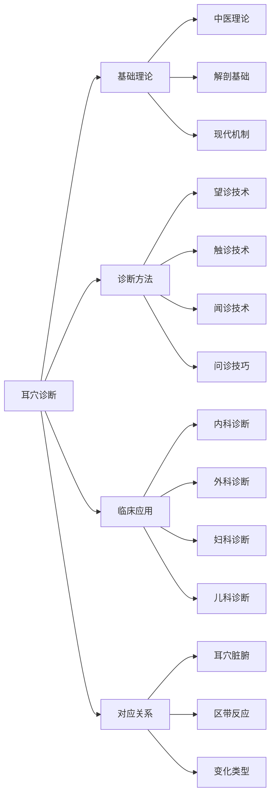
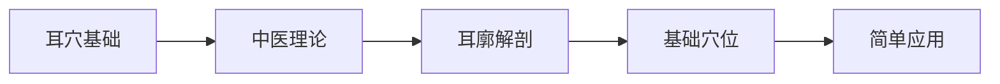
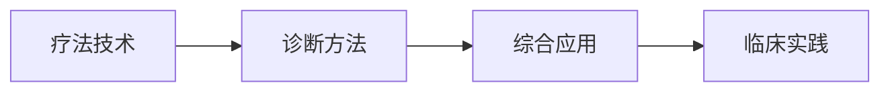

# 🏠 耳穴知识库 - 整合索引

> 📍 **知识库导航中心** | 🔄 **最后更新**：2026-01-25 | 📊 **笔记数量**：100+

---

## 📚 知识库概述

耳穴知识库是 AI-value 系统中的专业知识模块，整合了耳穴疗法和耳穴诊断两大领域。

### 🎯 双轨体系

```
耳穴知识库
├── 耳穴疗法 (Auricular Therapy)
│   ├── 刺激方法与操作规范
│   ├── 临床疾病治疗应用
│   └── 安全性管理
│
└── 耳穴诊断 (Auricular Diagnosis)
    ├── 望诊、触诊、闻诊方法
    ├── 疾病诊断应用
    └── 脏腑对应关系
```

### 📊 内容统计

| 分类 | 主题数 | 笔记数量 | 说明 |
|------|--------|----------|------|
| 耳穴疗法 | 6 | 50+ | 治疗相关 |
| 耳穴诊断 | 5 | 45+ | 诊断相关 |
| 共享资源 | 3 | 10+ | 基础理论 |

---

## 🧭 快速导航

### 📖 核心入口

| 入口 | 说明 | 适合人群 |
|------|------|----------|
| [[3 Resources/01-Tech/🏥 专业知识/耳穴知识库/01-基础知识/耳穴疗法概述]] | 疗法基础理论与概念 | 所有学习者 |
| [[耳穴诊断概论]] | 诊断基本理论与原则 | 诊断学习者 |
| [[耳穴定位总论]] | 耳穴分布与定位方法 | 所有学习者 |

### 🎯 专题内容地图 (MOCs)

#### 疗法方向 (Therapy)

| MOC | 主题 | 笔记数 | 说明 |
|-----|------|--------|------|
| [[3 Resources/01-Tech/🏥 专业知识/耳穴知识库/00-MOCs/MOC-基础知识]] | 理论基础与历史发展 | 8 | 基础理论 |
| [[3 Resources/01-Tech/🏥 专业知识/耳穴知识库/00-MOCs/MOC-耳穴定位]] | 耳穴定位与主治功能 | 12 | 穴位知识 |
| [[MOC-刺激方法]] | 刺激技术与操作规范 | 10 | 操作技术 |
| [[3 Resources/01-Tech/🏥 专业知识/耳穴知识库/00-MOCs/MOC-临床应用]] | 疾病治疗与疗效评价 | 15 | 临床应用 |
| [[MOC-安全性]] | 安全操作与不良反应 | 6 | 安全管理 |
| [[MOC-研究文献]] | 文献资料与参考资料 | 8 | 研究支持 |

#### 诊断方向 (Diagnosis)

| MOC | 主题 | 笔记数 | 说明 |
|-----|------|--------|------|
| [[MOC-诊断基础]] | 耳穴诊断理论基础 | 12 | 诊断理论 |
| [[MOC-诊断方法]] | 各种诊断技术方法 | 10 | 四诊技术 |
| [[MOC-诊断定位]] | 耳穴定位与对应关系 | 15 | 穴位对应 |
| [[MOC-诊断应用]] | 各种疾病诊断应用 | 18 | 临床诊断 |
| [[MOC-对应关系]] | 耳穴与脏腑对应关系 | 8 | 对应理论 |

---

## 🏷️ 标签系统

### 📂 知识分类



### 🏷️ 标签清单

| 标签 | 用途 | 示例 |
|------|------|------|
| `#theory` | 理论知识 | 基础理论、中医理论 |
| `#practice` | 实践应用 | 临床应用、操作技术 |
| `#research` | 研究文献 | 文献资料、研究成果 |
| `#safety` | 安全相关 | 不良反应、注意事项 |
| `#anatomy` | 解剖相关 | 耳廓结构、穴位位置 |
| `#technique` | 技术方法 | 针刺法、按压法 |
| `#diagnosis` | 诊断方法 | 望诊、触诊、闻诊 |
| `#disease` | 疾病治疗 | 具体疾病治疗方案 |
| `#acupoint` | 穴位知识 | 穴位定位、功能主治 |
| `#correspondence` | 对应关系 | 耳穴脏腑对应 |

---

## 🔍 快速查找

### 👥 按用户角色

| 角色 | 推荐入口 | 说明 |
|------|----------|------|
| 🧑‍⚕️ **临床医师** | [[临床应用指南]] / [[诊断方法]] | 快速诊断与治疗 |
| 👨‍🎓 **研究人员** | [[研究文献MOC]] / [[实验方法]] | 学术研究支持 |
| 🎓 **中医学生** | [[基础知识MOC]] / [[诊断基础]] | 系统学习 |
| 👥 **患者家属** | [[患者教育材料]] / [[常见问题]] | 基础了解 |

### 🩺 按临床应用

#### 疗法应用（治疗）

| 系统 | 主要耳穴 | 参考文档 |
|------|----------|----------|
| 🧠 神经系统 | 神门、皮质下、肾 | [[失眠症治疗]]、[[头痛治疗]] |
| ❤️ 心血管系统 | 心、交感、降压沟 | [[高血压治疗]]、[[冠心病治疗]] |
| 🫁 呼吸系统 | 肺、气管、咽喉 | [[哮喘治疗]]、[[支气管炎治疗]] |
| 🍽️ 消化系统 | 胃、脾、大肠 | [[胃炎治疗]]、[[便秘治疗]] |

#### 诊断应用（诊断）

| 系统 | 主要耳穴 | 参考文档 |
|------|----------|----------|
| 🧠 神经系统 | 神门、肾、皮质下 | [[神经精神疾病耳穴诊断]] |
| ❤️ 心血管系统 | 心、心包、皮质下、交感 | [[心血管疾病耳穴诊断]] |
| 🫁 呼吸系统 | 肺、气管、咽喉、内鼻 | [[呼吸系统疾病耳穴诊断]] |
| 🍽️ 消化系统 | 胃、脾、小肠、大肠 | [[消化系统疾病耳穴诊断]] |

### 📊 按诊断方法

| 方法 | 适用疾病 | 难度 | 参考文档 |
|------|----------|------|----------|
| **望诊** | 各种疾病 | ⭐⭐ | [[耳穴望诊方法]] |
| **触诊** | 急慢性疾病 | ⭐⭐⭐ | [[耳穴触诊技术]] |
| **闻诊** | 内分泌、呼吸系统 | ⭐⭐ | [[耳穴闻诊方法]] |
| **问诊** | 各种疾病 | ⭐ | [[耳穴问诊技巧]] |

---

## 📈 知识图谱

### 疗法知识图谱



### 诊断知识图谱



---

## 🎓 学习路径

### 初学者路径（1-2周）



**学习目标：**
- 📖 掌握耳穴基本概念
- 🧠 理解中医理论基础
- 🎯 认识主要耳穴位置
- 📋 能进行简单应用

### 进阶路径（2-4周）



**学习目标：**
- 🎯 掌握各种刺激技术
- 🔍 掌握诊断方法
- 🏥 建立临床思维
- 📋 能独立操作

### 专家路径（4-8周）


**学习目标：**
- 🏆 成为领域专家
- 📚 建立个人体系
- 🔬 参与学术研究
- 📖 编撰专业资料

---

## 🔄 最近更新

### 本周新增

| 类型 | 文档 | 说明 |
|------|------|------|
| ✅ 疗法 | [[3 Resources/01-Tech/🏥 专业知识/耳穴知识库/01-基础知识/耳穴疗法概述]] | 完善基础理论 |
| ✅ 疗法 | [[失眠症治疗指南]] | 新增临床方案 |
| ✅ 诊断 | [[耳穴诊断概论]] | 诊断基本理论 |
| ✅ 诊断 | [[耳穴望诊方法]] | 望诊技术介绍 |
| ✅ 安全 | [[安全性操作规范]] | 更新安全标准 |

### 更新中

| 类型 | 文档 | 状态 |
|------|------|------|
| 🔄 诊断 | [[呼吸系统疾病耳穴诊断]] | 编写中 |
| 🔄 诊断 | [[消化系统疾病耳穴诊断]] | 编写中 |
| 🔄 诊断 | [[神经精神疾病耳穴诊断]] | 编写中 |
| 🔄 诊断 | [[妇科疾病耳穴诊断]] | 编写中 |
| 🔄 疗法 | [[耳穴机制研究进展]] | 整理中 |
| 🔄 疗法 | [[儿童耳穴应用]] | 补充中 |

### 待计划

| 类型 | 文档 | 计划时间 |
|------|------|----------|
| 📝 诊断 | [[儿科疾病耳穴诊断]] | 1周后 |
| 📝 诊断 | [[内分泌疾病耳穴诊断]] | 2周后 |
| 📝 诊断 | [[骨科疾病耳穴诊断]] | 3周后 |
| 📝 诊断 | [[五官科疾病耳穴诊断]] | 4周后 |
| 📝 疗法 | [[耳穴设备对比]] | 待定 |

---

## 💡 核心要点

### 🎯 疗法核心原则

- **辨证施治**：根据病情选择合适耳穴
- **刺激适度**：控制刺激强度和时间
- **疗程规划**：制定合理治疗周期
- **观察反馈**：及时调整治疗方案

### 🔍 诊断核心原则

- **整体观念**：从整体角度综合分析
- **四诊合参**：望闻问切综合判断
- **动态观察**：注意耳穴变化
- **客观记录**：科学记录诊断结果

### 📊 对应要点

- **脏腑对应**：耳穴与脏腑的精确对应
- **区带反应**：不同区带与器官对应
- **变化类型**：颜色、形态、质地变化意义
- **综合判断**：多种方法综合分析

---

## ⚠️ 注意事项

### 安全警告

> **重要提示**：耳穴疗法和诊断不能替代正规医疗。如有健康问题，请咨询专业医师。

### 使用须知

1. **诊断与治疗分离**：诊断用于评估，治疗用于干预
2. **专业培训**：建议在专业指导下学习
3. **卫生规范**：操作时注意消毒和卫生
4. **禁忌症**：了解耳穴疗法的禁忌情况

### 常见问题

| 问题 | 解答 |
|------|------|
| 耳穴疗法安全吗？ | 在正确操作下是安全的，需注意禁忌症 |
| 诊断准确吗？ | 需结合其他诊断方法综合判断 |
| 需要学习多久？ | 基础应用约2-4周，专家水平需数月 |
| 可以自学吗？ | 可以自学，但实践需在指导下进行 |

---

## 📞 相关链接

### 内部链接

- [[耳穴疗法知识库]] - 治疗导向
- [[耳穴诊断知识库]] - 诊断导向
- [[3 Resources/01-Tech/🏥 专业知识/耳穴知识库/耳穴知识库|耳穴知识库]]- 系统主文档
- [[习惯养成]] - 复盘和记录方法

### 外部资源

- 中医耳穴疗法相关研究
- 耳穴诊断标准化研究
- 临床实践指南

---

## 📝 版本信息

| 信息 | 内容 |
|------|------|
| **创建时间** | 2026-01-25 |
| **整合版本** | v1.0 |
| **来源文档** | README 1.md, README 2.md |
| **维护状态** | 持续更新中 |

---

> 💡 **提示**：使用 `Ctrl/Cmd + O` 快速打开文件，使用 `Ctrl/Cmd + Shift + F` 全局搜索

**🌟 开始探索**：
- 从 [[3 Resources/01-Tech/🏥 专业知识/耳穴知识库/01-基础知识/耳穴疗法概述]] 开始学习疗法
- 从 [[耳穴诊断概论]] 开始学习诊断
- 从 [[耳穴定位总论]] 学习基础穴位

---

*整合自 [[3 Resources/01-Tech/🏥 专业知识/耳穴知识库/README 1]] 和 [[README 2]] | 耳穴知识库团队维护*
