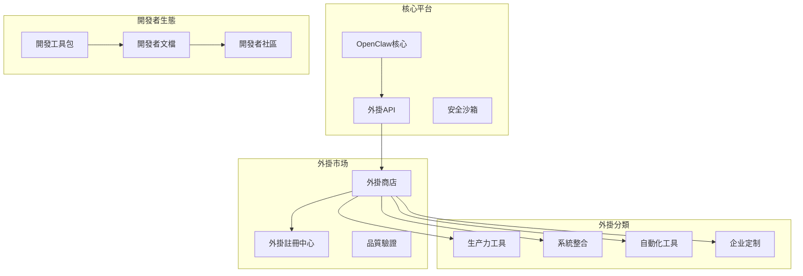

# OpenClaw外掛生態

## 生態系統概览

### 外掛架構設計


## 一、整合服务外掛

### 1. 通讯協作类

#### Slack外掛
```python
# plugins/slack/slack_plugin.py
from openclaw.plugins import BasePlugin
from slack_sdk import WebClient

class SlackPlugin(BasePlugin):
    """Slack整合外掛"""
    
    metadata = PluginMetadata(
        name="slack-integration",
        version="1.2.0",
        description="Slack訊息和通知整合",
        category="communication",
        tags=["slack", "messaging", "notifications"]
    )
    
    config_schema = {
        "bot_token": {"type": "string", "required": True},
        "default_channel": {"type": "string", "required": False}
    }
    
    async def execute(self, inputs: Dict, context: ExecutionContext) -> Dict:
        action = inputs.get("action")
        client = WebClient(token=self.config["bot_token"])
        
        if action == "send_message":
            channel = inputs.get("channel", self.config["default_channel"])
            result = await client.chat_postMessage(
                channel=channel,
                text=inputs["message"],
                blocks=inputs.get("blocks", [])
            )
            return {
                "message_id": result["message"]["ts"],
                "channel": result["channel"]
            }
            
        elif action == "upload_file":
            result = await client.files_upload_v2(
                channel=inputs["channel"],
                file=inputs["file_path"],
                initial_comment=inputs.get("comment", "")
            )
            return {"file_id": result["file"]["id"]}
```

#### 钉钉外掛
```python
# plugins/dingtalk/dingtalk_plugin.py
import requests
import json

class DingTalkPlugin(BasePlugin):
    """钉钉整合外掛"""
    
    metadata = PluginMetadata(
        name="dingtalk-integration",
        version="1.0.0",
        description="钉钉机器人訊息發送",
        category="communication",
        tags=["dingtalk", "robot", "notifications"]
    )
    
    async def execute(self, inputs: Dict, context: ExecutionContext) -> Dict:
        webhook_url = self.config["webhook_url"]
        message = inputs["message"]
        
        # 不同訊息类型支持
        if inputs.get("type") == "markdown":
            payload = {
                "msgtype": "markdown",
                "markdown": {
                    "title": inputs.get("title", "通知"),
                    "text": message
                }
            }
        else:  # text
            payload = {
                "msgtype": "text",
                "text": {"content": message}
            }
        
        response = requests.post(
            webhook_url,
            json=payload,
            headers={"Content-Type": "application/json"}
        )
        
        return {
            "success": response.status_code == 200,
            "response": response.json()
        }
```

### 2. 電子郵件外掛

#### Gmail外掛
```python
# plugins/gmail/gmail_plugin.py
from googleapiclient.discovery import build
from google_auth_oauthlib.flow import InstalledAppFlow

class GmailPlugin(BasePlugin):
    """Gmail整合外掛"""
    
    async def send_email(self, inputs: Dict, context: ExecutionContext) -> Dict:
        """發送電子郵件"""
        message = EmailMessage()
        message.set_content(inputs["body"])
        message["Subject"] = inputs["subject"]
        message["To"] = inputs["to"]
        message["From"] = self.config["email"]
        
        # 新增附件
        if "attachments" in inputs:
            for file_path in inputs["attachments"]:
                with open(file_path, "rb") as f:
                    message.add_attachment(
                        f.read(),
                        maintype="application",
                        subtype="octet-stream",
                        filename=os.path.basename(file_path)
                    )
        
        # 發送電子郵件
        service = build("gmail", "v1", credentials=self.credentials)
        encoded_message = base64.urlsafe_b64encode(message.as_bytes()).decode()
        
        result = service.users().messages().send(
            userId="me",
            body={"raw": encoded_message}
        ).execute()
        
        return {"message_id": result["id"]}
```

## 二、數據處理外掛

### 1. 文檔處理

#### PDF處理外掛
```python
# plugins/pdf_processor/pdf_plugin.py
from PyPDF2 import PdfReader, PdfWriter
import pdfplumber

class PDFProcessorPlugin(BasePlugin):
    """PDF文檔處理外掛"""
    
    metadata = PluginMetadata(
        name="pdf-processor",
        version="2.0.0",
        description="PDF文檔提取、合并、拆分處理",
        category="data-processing",
        tags=["pdf", "documents", "extract"]
    )
    
    async def extract_text(self, inputs: Dict, context: ExecutionContext) -> Dict:
        """提取PDF文本"""
        file_path = inputs["file_path"]
        output_path = inputs.get("output_path", file_path + ".txt")
        
        with pdfplumber.open(file_path) as pdf:
            text = ""
            for page in pdf.pages:
                page_text = page.extract_text()
                text += page_text + "\n"
        
        # 儲存結果
        with open(output_path, "w", encoding="utf-8") as f:
            f.write(text)
        
        return {
            "text_length": len(text),
            "output_path": output_path,
            "page_count": len(pdf.pages)
        }
    
    async def merge_pdfs(self, inputs: Dict, context: ExecutionContext) -> Dict:
        """合并PDF文檔"""
        pdf_files = inputs["pdf_files"]
        output_path = inputs["output_path"]
        
        merger = PdfWriter()
        for pdf_file in pdf_files:
            with open(pdf_file, "rb") as f:
                reader = PdfReader(f)
                for page in reader.pages:
                    merger.add_page(page)
        
        with open(output_path, "wb") as f:
            merger.write(f)
        
        return {
            "merged_file": output_path,
            "input_files": pdf_files,
            "total_pages": merger.getNumPages()
        }
```

#### Excel處理外掛
```python
# plugins/excel_processor/excel_plugin.py
import pandas as pd
from openpyxl import load_workbook

class ExcelProcessorPlugin(BasePlugin):
    """Excel表格處理外掛"""
    
    async def read_excel(self, inputs: Dict, context: ExecutionContext) -> Dict:
        """讀取Excel檔案"""
        file_path = inputs["file_path"]
        sheet_name = inputs.get("sheet_name", None)
        
        # 讀取Excel
        df = pd.read_excel(
            file_path, 
            sheet_name=sheet_name,
            engine="openpyxl"
        )
        
        # 转换为表格數據
        data = df.to_dict("records")
        
        return {
            "data": data,
            "rows": len(df),
            "columns": len(df.columns),
            "column_names": list(df.columns)
        }
    
    async def write_excel(self, inputs: Dict, context: ExecutionContext) -> Dict:
        """寫入Excel檔案"""
        data = inputs["data"]
        output_path = inputs["output_path"]
        
        df = pd.DataFrame(data)
        df.to_excel(output_path, index=False, engine="openpyxl")
        
        return {
            "output_file": output_path,
            "rows_written": len(df),
            "columns": len(df.columns)
        }
```

### 2. 數據转换

#### CSV處理外掛
```python
# plugins/csv_processor/csv_plugin.py
import csv
import json
from io import StringIO

class CSVProcessorPlugin(BasePlugin):
    """CSV數據處理外掛"""
    
    async def csv_to_json(self, inputs: Dict, context: ExecutionContext) -> Dict:
        """CSV转JSON"""
        csv_content = inputs["csv_content"]
        output_path = inputs.get("output_path", None)
        
        # 解析CSV
        reader = csv.DictReader(StringIO(csv_content))
        data = list(reader)
        
        # 转换为JSON
        json_data = json.dumps(data, ensure_ascii=False, indent=2)
        
        # 儲存或返回結果
        if output_path:
            with open(output_path, "w", encoding="utf-8") as f:
                f.write(json_data)
            return {"output_path": output_path, "records": len(data)}
        else:
            return {"json_data": json_data, "records": len(data)}
    
    async def json_to_csv(self, inputs: Dict, context: ExecutionContext) -> Dict:
        """JSON转CSV"""
        json_data = json.loads(inputs["json_content"])
        output_path = inputs.get("output_path")
        
        # 转换为CSV
        if not json_data:
            return {"output": "empty", "records": 0}
        
        # 寫入CSV
        if output_path:
            with open(output_path, "w", newline="", encoding="utf-8") as csvfile:
                fieldnames = json_data[0].keys()
                writer = csv.DictWriter(csvfile, fieldnames=fieldnames)
                writer.writeheader()
                writer.writerows(json_data)
        
            return {"output_path": output_path, "records": len(json_data)}
        else:
            # 返回CSV字符串
            output = StringIO()
            fieldnames = json_data[0].keys()
            writer = csv.DictWriter(output, fieldnames=fieldnames)
            writer.writeheader()
            writer.writerows(json_data)
            
            return {
                "csv_content": output.getvalue(),
                "records": len(json_data)
            }
```

## 三、Web自動化外掛

### 1. Web抓取

#### 網頁抓取外掛
```python
# plugins/web_scraper/scraper_plugin.py
from playwright.async_api import async_playwright
from bs4 import BeautifulSoup
import asyncio

class WebScraperPlugin(BasePlugin):
    """網頁數據抓取外掛"""
    
    async def scrape_page(self, inputs: Dict, context: ExecutionContext) -> Dict:
        """抓取網頁數據"""
        url = inputs["url"]
        selectors = inputs["selectors"]
        wait_for = inputs.get("wait_for")
        
        async with async_playwright() as p:
            browser = await p.chromium.launch(headless=True)
            page = await browser.new_page()
            
            # 导航到頁面
            await page.goto(url, wait_until="networkidle")
            
            # 等待特定元素
            if wait_for:
                await page.wait_for_selector(wait_for)
            
            # 提取數據
            data = {}
            for key, selector in selectors.items():
                try:
                    elements = await page.query_selector_all(selector)
                    if len(elements) == 1:
                        data[key] = await elements[0].text_content()
                    else:
                        data[key] = [
                            await el.text_content() for el in elements
                        ]
                except Exception as e:
                    data[key] = None
                    context.log(f"元素提取失败 {key}: {e}")
            
            await browser.close()
        
        return data
    
    async def pagination_scrape(self, inputs: Dict, context: ExecutionContext) -> Dict:
        """分页數據抓取"""
        url = inputs["url"]
        item_selector = inputs["item_selector"]
        next_selector = inputs["next_selector"]
        max_pages = inputs.get("max_pages", 10)
        
        all_data = []
        current_page = 1
        
        async with async_playwright() as p:
            browser = await p.chromium.launch(headless=True)
            page = await browser.new_page()
            
            await page.goto(url, wait_until="networkidle")
            
            while current_page <= max_pages:
                # 抓取当前页數據
                items = await page.query_selector_all(item_selector)
                for item in items:
                    item_data = await item.text_content()
                    all_data.append(item_data)
                
                # 尋找下一页按鈕
                next_button = await page.query_selector(next_selector)
                if not next_button:
                    break
                
                await next_button.click()
                await page.wait_for_load_state("networkidle")
                current_page += 1
        
        return {
            "data": all_data,
            "pages_scraped": current_page,
            "total_items": len(all_data)
        }
```

#### 表单填寫外掛
```python
# plugins/form_filler/form_filler_plugin.py
class FormFillerPlugin(BasePlugin):
    """表单自動填寫外掛"""
    
    async def fill_form(self, inputs: Dict, context: ExecutionContext) -> Dict:
        """填寫網頁表单"""
        url = inputs["url"]
        form_data = inputs["form_data"]
        submit_selector = inputs["submit_selector"]
        
        async with async_playwright() as p:
# 顯示
            page = await browser.new_page()
            
            await page.goto(url, wait_until="networkidle")
            
            # 填寫表单字段
            field_mapping = inputs.get("field_mapping", {})
            for field_name, field_value in form_data.items():
                selector = field_mapping.get(field_name, f"#{field_name}")
                try:
                    await page.fill(selector, str(field_value))
                except Exception as e:
                    context.log(f"字段填寫失败 {field_name}: {e}")
            
            # 處理選擇框等特殊元素
            if "selects" in inputs:
                for select_selector, value in inputs["selects"].items():
                    await page.select_option(select_selector, value)
            
            # 處理复选框和单选按鈕
            if "checkboxes" in inputs:
                for checkbox_selector, checked in inputs["checkboxes"].items():
                    if checked:
                        await page.check(checkbox_selector)
                    else:
                        await page.uncheck(checkbox_selector)
            
            # 提交表单
            if submit_selector:
                await page.click(submit_selector)
                # 等待頁面跳转或加载完成
                await page.wait_for_load_state("networkidle")
                
                # 檢查是否有成功标识
                success_selector = inputs.get("success_selector")
                if success_selector:
                    success_element = await page.query_selector(success_selector)
                    success = success_element is not None
                    
                    return {
                        "success": success,
                        "current_url": page.url
                    }
            
            browser.close()
        
        return {"success": False, "error": "Submit failed"}
```

## 四、系統工具外掛

### 1. 檔案操作

#### 檔案同步外掛
```python
# plugins/file_sync/file_sync_plugin.py
import os
import shutil
import aiofiles
from pathlib import Path
import hashlib

class FileSyncPlugin(BasePlugin):
    """檔案同步外掛"""
    
    async def calculate_file_hash(self, file_path: str) -> str:
        """計算檔案哈希值"""
        hash_md5 = hashlib.md5()
        async with aiofiles.open(file_path, "rb") as f:
            for chunk in iter(lambda: f.read(4096), b""):
                hash_md5.update(chunk)
        return hash_md5.hexdigest()
    
    async def sync_directories(self, inputs: Dict, context: ExecutionContext) -> Dict:
        """同步目錄檔案"""
        source_dir = inputs["source_dir"]
        target_dir = inputs["target_dir"]
        pattern = inputs.get("pattern", "**/*")
        exclude_patterns = inputs.get("exclude", [])
        
        # 扫描源目錄
        source_files = list(Path(source_dir).rglob(pattern))
        
        synced_files = []
        errors = []
        
        for source_file in source_files:
            # 檢查排除模式
            if any(source_file.match(exclude) for exclude in exclude_patterns):
                continue
            
            if source_file.is_file():
                # 構建目標路徑
                relative_path = source_file.relative_to(source_dir)
                target_file = Path(target_dir) / relative_path
                
                try:
                    # 創建目標目錄
                    target_file.parent.mkdir(parents=True, exist_ok=True)
                    
# 修改
                    if not target_file.exists():
                        # 新檔案，直接複製
                        shutil.copy2(source_file, target_file)
                    else:
                        # 檢查是否有变化
                        source_hash = await self.calculate_file_hash(str(source_file))
                        target_hash = await self.calculate_file_hash(str(target_file))
                        
                        if source_hash != target_hash:
# 更新
                            shutil.copy2(source_file, target_file)
                    
                    synced_files.append(str(relative_path))
                    
                except Exception as e:
                    errors.append({
                        "file": str(relative_path),
                        "error": str(e)
                    })
        
        return {
            "synced_files": synced_files,
            "error_count": len(errors),
            "errors": errors
        }
```

### 2. 系統監控

#### 網路監控外掛
```python
# plugins/network_monitor/network_plugin.py
import aiohttp
import asyncio
import time

class NetworkMonitorPlugin(BasePlugin):
    """網路監控外掛"""
    
    async def check_connectivity(self, inputs: Dict, context: ExecutionContext) -> Dict:
        """檢查網路连通性"""
        targets = inputs["targets"]  # [{"url": "https://example.com", "timeout": 10}]
        
        results = []
        concurrent_limit = 10
        
        async with aiohttp.ClientSession() as session:
            semaphore = asyncio.Semaphore(concurrent_limit)
            
            async def check_target(target):
                async with semaphore:
                    start_time = time.time()
                    timeout = target.get("timeout", 10)
                    
                    try:
                        async with session.get(
                            target["url"],
                            timeout=aiohttp.ClientTimeout(total=timeout)
                        ) as response:
                            status_code = response.status
                            response_time = (time.time() - start_time) * 1000
                            
                            return {
                                "url": target["url"],
                                "status": "success",
                                "status_code": status_code,
                                "response_time_ms": round(response_time, 2),
                                "timestamp": time.time()
                            }
                    except asyncio.TimeoutError:
                        return {
                            "url": target["url"],
                            "status": "timeout",
                            "error": "Request timeout",
                            "timestamp": time.time()
                        }
                    except Exception as e:
                        return {
                            "url": target["url"],
                            "status": "error",
                            "error": str(e),
                            "timestamp": time.time()
                        }
            
            # 并发檢查所有目標
            tasks = [check_target(target) for target in targets]
            results = await asyncio.gather(*tasks)
        
        # 統計結果
        success_count = sum(1 for r in results if r["status"] == "success")
        
        return {
            "checks": results,
            "total_targets": len(targets),
            "successful_checks": success_count,
            "success_rate": success_count / len(targets) if targets else 0,
            "check_timestamp": time.time()
        }
```

## 五、開發工具与SDK

### 1. 外掛開發SDK

#### 基礎開發模板
```python
# openclaw_sdk/plugin_template.py
from openclaw.plugins import BasePlugin, PluginMetadata
from openclaw_sdk.exceptions import PluginError
from openclaw_sdk.logging import get_logger

logger = get_logger(__name__)

class CustomPluginTemplate(BasePlugin):
    """自定义外掛開發模板"""
    
    # 外掛元數據
    metadata = PluginMetadata(
        name="custom-plugin-template",
        version="1.0.0",
        description="外掛開發模板",
        category="custom",
        tags=["template", "development"]
    )
    
# 配置
    config_schema = {
        "api_endpoint": {"type": "string", "required": True},
        "auth_token": {"type": "string", "required": False},
        "timeout": {"type": "integer", "default": 30}
    }
    
    def __init__(self, config: dict = None):
        super().__init__(config)
        logger.info(f"初始化外掛: {self.metadata.name}")
    
    async def execute(self, inputs: Dict, context: ExecutionContext) -> Dict:
        """执行外掛逻辑"""
        logger.info(f"执行外掛: {context.workflow_id}")
        
        try:
            # 驗證輸入参数
            self._validate_inputs(inputs)
            
            # 执行核心逻辑
            result = await self._execute_core(inputs, context)
            
            # 驗證輸出結果
            self._validate_output(result)
            
            logger.info(f"外掛执行成功: {context.execution_id}")
            return result
            
        except Exception as e:
            logger.error(f"外掛执行失败: {e}")
            raise PluginError(f"执行失败: {e}")
    
    async def _execute_core(self, inputs: Dict, context: ExecutionContext) -> Dict:
        """核心执行逻辑"""
        # 實現你的具体业务逻辑
        return {
            "status": "success",
            "message": "模板外掛执行完成",
            "inputs_received": inputs
        }
    
    def _validate_inputs(self, inputs: Dict):
        """輸入驗證"""
        required_fields = {"action", "parameters"}
        missing = required_fields - set(inputs.keys())
        if missing:
            raise PluginError(f"缺少必需参数: {missing}")
    
    def _validate_output(self, output: Dict):
        """輸出驗證"""
        if not output or "status" not in output:
            raise PluginError("輸出必须包含status字段")
```

#### 外掛測試框架
```python
# openclaw_sdk/testing/plugin_tester.py
import asyncio
from pytest import fixture, mark
from openclaw_sdk.testing import PluginTestHarness

@fixture
def test_config():
    return {
        "api_endpoint": "https://api.example.com",
        "timeout": 10
    }

@fixture
def test_inputs():
    return {
        "action": "test_action",
        "parameters": {"test": "value"}
    }

class TestCustomPlugin:
    """外掛測試类"""
    
    @mark.asyncio
    async def test_plugin_success(self, test_config, test_inputs):
        """測試外掛正常执行"""
        plugin = CustomPluginTemplate(test_config)
        
        # 創建測試上下文
        harness = PluginTestHarness()
        context = harness.create_mock_context()
        
        # 执行外掛
        result = await plugin.execute(test_inputs, context)
        
        # 驗證結果
        assert result["status"] == "success"
        assert "message" in result
    
    @mark.asyncio
    async def test_plugin_error_handling(self, test_config):
        """測試错误處理"""
        plugin = CustomPluginTemplate(test_config)
        
        # 提供無效輸入
        invalid_inputs = {"invalid": "data"}
        context = PluginTestHarness().create_mock_context()
        
        # 执行外掛并期望抛出异常
        with pytest.raises(PluginError):
            await plugin.execute(invalid_inputs, context)
```

### 2. 外掛開發工具

#### CLI開發工具
```bash
# 安裝開發工具
pip install openclaw-cli

# 創建新外掛專案
openclaw create-plugin my-awesome-plugin --template basic

# 外掛專案结构
my-awesome-plugin/
├── src/
│   └── my_awesome_plugin/
│       ├── __init__.py
│       ├── plugin.py
│       └── utils.py
├── tests/
│   └── test_plugin.py
├── README.md
├── setup.py
# 配置
```

# 配置
```yaml
# my-awesome-plugin/openclaw.yaml
name: my-awesome-plugin
version: 1.0.0
description: 我的超棒外掛
author: Your Name <your.email@example.com>

# 依赖
dependencies:
  - requests>=2.25.0
  - pydantic>=1.8.0

# 权限需求
permissions:
  - network
  - file_read

# 資源限制
resources:
  memory: 256MB
  cpu_time: 30s

# 分類和標籤
category: data-processing
tags:
  - data
  - processing
  - automation
```

## 外掛市场与分发

### 外掛市场API
```python
# marketplace/api/client.py
class PluginMarketplaceClient:
    """外掛市场客户端"""
    
    def __init__(self, base_url: str = "https://marketplace.openclaw.dev"):
        self.base_url = base_url
        self.session = aiohttp.ClientSession()
    
    async def search_plugins(self, query: str, category: str = None) -> List[Plugin]:
        """搜尋外掛"""
        params = {"q": query}
        if category:
            params["category"] = category
        
        async with self.session.get(f"{self.base_url}/api/plugins", params=params) as resp:
            data = await resp.json()
            return [Plugin(**item) for item in data["plugins"]]
    
    async def install_plugin(self, plugin_id: str) -> bool:
        """安裝外掛"""
        async with self.session.post(f"{self.base_url}/api/plugins/{plugin_id}/install") as resp:
            return resp.status == 200
    
    async def submit_plugin(self, plugin_package: bytes) -> UploadResult:
        """提交外掛到市场"""
        data = aiohttp.FormData()
        data.add_field("plugin", plugin_package, filename="plugin.opc", content_type="application/octet-stream")
        
        async with self.session.post(f"{self.base_url}/api/plugins/submit", data=data) as resp:
            return UploadResult(**await resp.json())
```

## 相關文檔

- [[OpenClaw專案]] - 專案总览
- [[OpenClaw技術架構]] - 系統設計
# 指南
# 指南
# 指南

---
*創建時間: 2024-01-30*
# 更新
*分類: 3 Resources*