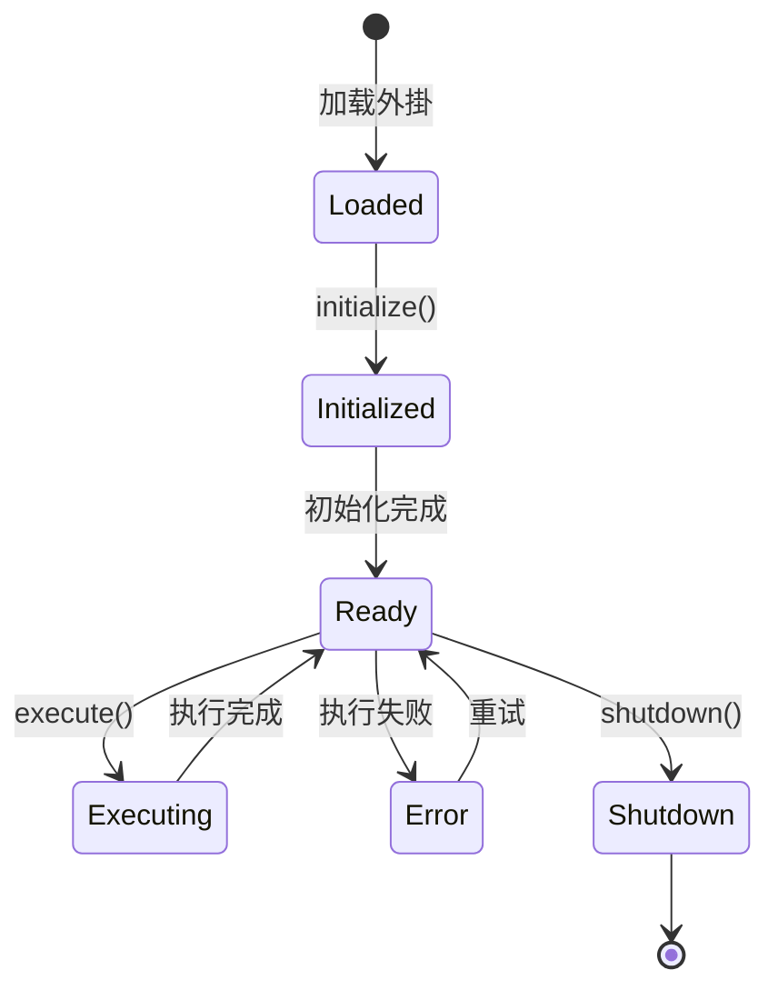

---
# 指南
status: active
priority: high
tags: [clawdbot, plugins, development, tutorial]
aliases: [外掛開發, Plugin開發]
created: 2026-01-31
modified: 2026-01-31
---

# 指南

# 指南

## 📋 目錄

- [外掛概述](#外掛概述)
- [開發環境搭建](#開發環境搭建)
- [第一个外掛](#第一个外掛)
- [外掛架構](#外掛架構)
- [核心API](#核心api)
- [进阶功能](#进阶功能)
- [測試与除錯](#測試与除錯)
- [打包与發佈](#打包与發佈)
- [最佳實踐](#最佳實踐)

---

## 外掛概述

### 什么是外掛？

ClawdBot 外掛是独立的 Python 包，可以擴展平台的核心功能。每个外掛提供特定的功能，如數據源連接、數據處理、通知發送等。

### 外掛类型

| 类型 | 說明 | 示例 |
|------|------|------|
| **數據源外掛** | 連接外部數據源 | MySQL, MongoDB, API |
| **處理器外掛** | 處理和转换數據 | 數據清洗、格式转换 |
| **动作外掛** | 执行特定操作 | 發送電子郵件、上傳檔案 |
| **整合外掛** | 整合第三方服务 | Slack, GitHub, Jira |
| **UI外掛** | 擴展Web界面 | 自定义仪表盘 |

### 外掛结构

```
my-plugin/
├── plugin/                    # 外掛主包
│   ├── __init__.py
│   ├── core.py                # 核心逻辑
# 配置
│   └── utils.py               # 工具函数
├── tests/                     # 測試檔案
│   ├── __init__.py
│   └── test_core.py
├── static/                    # 静态資源（UI外掛）
├── templates/                 # 模板檔案
├── manifest.yaml              # 外掛清單
├── requirements.txt           # 依赖
├── setup.py                   # 安裝腳本
├── README.md                  # 文檔
└── LICENSE                    # 许可证
```

---

## 開發環境搭建

### 1. 環境要求

- Python 3.9+
- ClawdBot CLI
- Git

### 2. 安裝開發工具

```bash
# 安裝 ClawdBot CLI
pip install clawdbot-cli

# 安裝開發依赖
pip install clawdbot-dev-tools

# 驗證安裝
clawdbot --version
```

### 3. 創建外掛專案

```bash
# 使用模板創建外掛
clawdbot plugin create my-awesome-plugin

# 进入專案目錄
cd my-awesome-plugin

# 查看
ls -la
```

生成的專案结构：

```
my-awesome-plugin/
# 配置
├── my_awesome_plugin/         # 外掛包
│   ├── __init__.py
│   └── plugin.py
├── tests/
├── manifest.yaml
├── setup.py
├── requirements.txt
└── README.md
```

### 4. 本地開發環境

```bash
# 創建虚拟環境
python -m venv venv

# 激活虚拟環境
source venv/bin/activate  # Linux/Mac
# venv\Scripts\activate   # Windows

# 安裝依赖
pip install -r requirements.txt

# 安裝外掛（開發模式）
pip install -e .
```

---

## 第一个外掛

### 外掛清單（manifest.yaml）

```yaml
# manifest.yaml
name: my-awesome-plugin
display_name: 我的超棒外掛
version: "0.1.0"
description: 一个简单的示例外掛
author: Your Name <your@email.com>
license: MIT

# 外掛类型
type: processor

# 相容性
clawdbot:
  min_version: "2.0.0"
  max_version: "2.99.0"

# 权限需求
permissions:
  - network: ["api.example.com"]
  - filesystem:
      read: ["./data/*"]

# 配置
config_schema:
  api_key:
    type: string
    required: true
    description: API密钥
  timeout:
    type: integer
    default: 30
    description: 超时時間（秒）

# 入口点
entry_point: my_awesome_plugin.plugin:MyAwesomePlugin
```

### 外掛主类

```python
# my_awesome_plugin/plugin.py
from clawdbot.plugins import BasePlugin, PluginContext, PluginResult
from typing import Dict, Any

class MyAwesomePlugin(BasePlugin):
    """我的第一个外掛"""

    # 外掛元數據
    metadata = {
        "name": "my-awesome-plugin",
        "version": "0.1.0",
        "description": "一个简单的示例外掛"
    }

    def __init__(self, config: Dict[str, Any]):
        """初始化外掛"""
        super().__init__(config)

# 配置
        self.api_key = config.get("api_key")
        self.timeout = config.get("timeout", 30)

        # 初始化其他資源
        self.client = None

    async def initialize(self, context: PluginContext):
        """外掛初始化（可选）"""
        # 在这里执行一次性初始化操作
        self.logger.info("外掛初始化中...")

        # 初始化客户端
        self.client = await self.create_client()

    async def execute(
        self,
        inputs: Dict[str, Any],
        context: PluginContext
    ) -> PluginResult:
        """
        执行外掛核心逻辑

        Args:
            inputs: 輸入數據
            context: 执行上下文

        Returns:
            PluginResult: 执行結果
        """
        try:
            # 處理輸入數據
            processed_data = await self.process_data(inputs)

            # 返回成功結果
            return PluginResult(
                success=True,
                data=processed_data,
                message="處理成功"
            )

        except Exception as e:
            # 返回失败結果
            self.logger.error(f"外掛执行失败: {e}")
            return PluginResult(
                success=False,
                error=str(e),
                message="處理失败"
            )

    async def process_data(self, data: Dict[str, Any]) -> Dict[str, Any]:
        """處理數據（示例實現）"""
        # 这里實現你的业务逻辑
        result = {
            "original": data,
            "processed": f"已處理: {data}",
            "timestamp": self.get_current_timestamp()
        }
        return result

    async def shutdown(self, context: PluginContext):
        """外掛清理（可选）"""
        self.logger.info("外掛關閉中...")

        # 清理資源
        if self.client:
            await self.client.close()

# 方法
    async def create_client(self):
        """創建客户端"""
        # 實現客户端創建逻辑
        return SomeAPIClient(self.api_key, timeout=self.timeout)

    def get_current_timestamp(self) -> str:
        """获取当前時間戳"""
        from datetime import datetime
        return datetime.now().isoformat()
```

### 測試外掛

```python
# tests/test_plugin.py
import pytest
from my_awesome_plugin.plugin import MyAwesomePlugin

@pytest.fixture
async def plugin():
    """創建外掛实例"""
    config = {
        "api_key": "test_key",
        "timeout": 10
    }
    plugin = MyAwesomePlugin(config)
    await plugin.initialize(None)
    yield plugin
    await plugin.shutdown(None)

@pytest.mark.asyncio
async def test_plugin_execute(plugin):
    """測試外掛执行"""
    inputs = {
        "message": "Hello, World!"
    }

    result = await plugin.execute(inputs, None)

    assert result.success is True
    assert "processed" in result.data
    assert "timestamp" in result.data

@pytest.mark.asyncio
async def test_plugin_error_handling(plugin):
    """測試错误處理"""
    # 传入無效輸入
    result = await plugin.execute({}, None)

    # 驗證错误處理
    assert result.success is False
    assert result.error is not None
```

運行測試：

```bash
# 安裝測試依赖
pip install pytest pytest-asyncio

# 運行測試
pytest tests/

# 查看
pytest tests/ -v
```

---

## 外掛架構

### 核心类图

```
BasePlugin (抽象基类)
    │
    ├── metadata (元數據)
# 配置
    ├── logger (日志器)
    │
    ├── initialize(ctx)      # 初始化
    ├── execute(inputs, ctx) # 执行
    └── shutdown(ctx)       # 清理
           │
           ▼
    MyPlugin (你的外掛)
```

### 生命周期



### 执行流程

```
使用者请求
    │
    ▼
驗證輸入
    │
    ▼
調用 execute()
    │
    ├─► 获取數據
    │   │
    │   ▼
    │  處理數據
    │   │
    │   ▼
    │  返回結果
    │
    └─► 错误處理
        │
        ▼
    返回错误結果
```

---

## 核心API

# 配置

```python
class MyPlugin(BasePlugin):
    def __init__(self, config: Dict[str, Any]):
# 配置
        self.api_key = config.get("api_key")
        self.timeout = config.get("timeout", 30)

        # 带默认值和驗證
        self.max_retries = self.get_config(
            key="max_retries",
            default=3,
            validator=lambda x: x > 0
        )

# 配置
        db_config = self.get_nested_config("database", {})

# 配置
        self.validate_config(config)
```

### 2. 日志API

```python
class MyPlugin(BasePlugin):
    async def execute(self, inputs, context):
        # 不同级别的日志
        self.logger.debug("除錯資訊")
        self.logger.info("處理開始")
        self.logger.warning("警告資訊")
        self.logger.error("错误資訊")
        self.logger.critical("严重错误")

        # 结构化日志
        self.logger.info(
            "處理完成",
            extra={
                "task_id": context.task_id,
                "duration": 1.5,
                "items_processed": 100
            }
        )
```

### 3. 上下文API

```python
class MyPlugin(BasePlugin):
    async def execute(self, inputs, context):
        # 获取任務資訊
        task_id = context.task_id
        task_type = context.task_type

        # 获取使用者資訊
        user_id = context.user_id
        user_permissions = context.permissions

        # 访问共享儲存
        shared_data = await context.get_shared_data("key")
        await context.set_shared_data("key", value)

# 更新
        await context.send_progress(50, "正在處理...")

        # 發送通知
        await context.send_notification({
            "type": "info",
            "message": "處理完成"
        })
```

### 4. 資料庫API

```python
class MyPlugin(BasePlugin):
    async def execute(self, inputs, context):
        # 查詢數據
        results = await context.db.query(
            "SELECT * FROM users WHERE id = %s",
            [user_id]
        )

        # 插入數據
        await context.db.execute(
            "INSERT INTO logs (message, created_at) VALUES (%s, NOW())",
            ["Log message"]
        )

        # 事务操作
        async with context.db.transaction() as tx:
            await tx.execute("UPDATE users SET name = %s WHERE id = %s", ["John", 1])
            await tx.execute("INSERT INTO audit (action) VALUES (%s)", ["update"])
```

### 5. 網路API

```python
class MyPlugin(BasePlugin):
    async def execute(self, inputs, context):
        # HTTP GET 请求
        response = await context.http.get(
            "https://api.example.com/data",
            headers={"Authorization": f"Bearer {self.api_key}"}
        )
        data = response.json()

        # HTTP POST 请求
        response = await context.http.post(
            "https://api.example.com/submit",
            json={"key": "value"}
        )

        # 带重试的请求
        response = await context.http.get(
            "https://api.example.com/data",
            retries=3,
            backoff=2  # 指数退避
        )
```

---

## 进阶功能

### 1. 异步任務

```python
class AsyncPlugin(BasePlugin):
    async def execute(self, inputs, context):
        # 并发执行多個任務
        results = await asyncio.gather(
            self.fetch_data_1(),
            self.fetch_data_2(),
            self.fetch_data_3()
        )

        # 使用队列處理大量任務
        queue = asyncio.Queue()

        # 生产者
        await self.produce_tasks(queue, inputs)

        # 消费者（多個worker）
        workers = [
            self.process_tasks(queue) for _ in range(5)
        ]
        await asyncio.gather(*workers)
```

### 2. 流式處理

```python
class StreamPlugin(BasePlugin):
    async def execute(self, inputs, context):
        # 流式讀取大檔案
        async for line in self.read_stream(inputs["file_path"]):
            processed = await self.process_line(line)

# 更新
            await context.send_progress(
                progress=0.5,
                message=f"已處理: {processed}"
            )

    async def read_stream(self, file_path):
        """异步讀取檔案流"""
        async with aiofiles.open(file_path, 'r') as f:
            async for line in f:
                yield line.strip()
```

### 3. 缓存機制

```python
class CachedPlugin(BasePlugin):
    def __init__(self, config):
        super().__init__(config)
        self.cache_enabled = config.get("cache_enabled", True)
        self.cache_ttl = config.get("cache_ttl", 3600)

    async def execute(self, inputs, context):
        # 檢查缓存
        cache_key = self.generate_cache_key(inputs)

        if self.cache_enabled:
            cached_result = await context.cache.get(cache_key)
            if cached_result:
                self.logger.info("从缓存返回結果")
                return PluginResult(success=True, data=cached_result)

        # 执行实际處理
        result = await self.process_data(inputs)

        # 儲存到缓存
        if self.cache_enabled:
            await context.cache.set(cache_key, result, ttl=self.cache_ttl)

        return PluginResult(success=True, data=result)
```

### 4. 错误重试

```python
class RetryPlugin(BasePlugin):
    async def execute(self, inputs, context):
        max_retries = 3
        retry_delay = 1

        for attempt in range(max_retries):
            try:
                result = await self.call_external_api(inputs)
                return PluginResult(success=True, data=result)

            except TemporaryError as e:
                if attempt < max_retries - 1:
                    self.logger.warning(f"重试 {attempt + 1}/{max_retries}: {e}")
                    await asyncio.sleep(retry_delay * (2 ** attempt))  # 指数退避
                else:
                    raise

        raise MaxRetriesExceeded("超过最大重试次数")
```

### 5. 批處理

```python
class BatchPlugin(BasePlugin):
    async def execute(self, inputs, context):
        items = inputs["items"]
        batch_size = 100

        # 分批處理
        for i in range(0, len(items), batch_size):
            batch = items[i:i + batch_size]

            # 處理批次
            await self.process_batch(batch)

            # 發送进度
            progress = ((i + batch_size) / len(items)) * 100
            await context.send_progress(
                progress=min(progress, 100),
                message=f"已處理 {min(i + batch_size, len(items))}/{len(items)} 项"
            )
```

---

## 測試与除錯

### 单元測試

```python
import pytest
from unittest.mock import AsyncMock, patch

class TestMyPlugin:
    @pytest.fixture
    def plugin_config(self):
        return {
            "api_key": "test_key",
            "timeout": 10
        }

    @pytest.fixture
    async def plugin(self, plugin_config):
        plugin = MyPlugin(plugin_config)
        await plugin.initialize(None)
        yield plugin
        await plugin.shutdown(None)

    @pytest.mark.asyncio
    async def test_success_case(self, plugin):
        inputs = {"data": "test"}
        result = await plugin.execute(inputs, None)

        assert result.success is True
        assert "processed" in result.data

    @pytest.mark.asyncio
    async def test_error_case(self, plugin):
        inputs = {}
        result = await plugin.execute(inputs, None)

        assert result.success is False

    @pytest.mark.asyncio
    @patch('my_plugin.ExternalAPI')
    async def test_external_api_call(self, mock_api, plugin):
        # Mock 外部API
        mock_api.return_value.fetch_data = AsyncMock(return_value={"data": "test"})

        inputs = {"id": 123}
        result = await plugin.execute(inputs, None)

        assert result.success is True
        mock_api.assert_called_once()
```

### 整合測試

```python
@pytest.mark.integration
class TestPluginIntegration:
    async def test_full_workflow(self):
        # 創建真实的上下文
        context = await self.create_test_context()

        plugin = MyPlugin(self.config)
        await plugin.initialize(context)

        try:
            # 执行完整流程
            inputs = self.create_test_inputs()
            result = await plugin.execute(inputs, context)

            assert result.success is True

            # 驗證資料庫狀態
            records = await context.db.query("SELECT * FROM results WHERE task_id = %s", [context.task_id])
            assert len(records) > 0

        finally:
            await plugin.shutdown(context)
```

### 除錯技巧

```python
class DebugPlugin(BasePlugin):
    async def execute(self, inputs, context):
        # 启用詳細日志
        self.logger.setLevel(logging.DEBUG)

        # 列印除錯資訊
        self.logger.debug(f"輸入: {inputs}")
# 配置

        # 使用 pdb 除錯
        import pdb; pdb.set_trace()

# 分析
        import time
        start = time.time()

        # ... 执行逻辑 ...

        duration = time.time() - start
        self.logger.info(f"执行耗时: {duration:.2f}秒")
```

---

## 打包与發佈

### 1. 打包外掛

```bash
# 更新
# 更新

# 2. 構建分发包
clawdbot plugin build

# 这将生成：
# dist/my-awesome-plugin-1.0.0.tar.gz
# dist/my-awesome-plugin-1.0.0.whl

# 3. 驗證包
clawdbot plugin validate dist/my-awesome-plugin-1.0.0.whl
```

### 2. 本地測試

```bash
# 安裝打包好的外掛
pip install dist/my-awesome-plugin-1.0.0.whl

# 在 ClawdBot 中加载外掛
clawdbot plugin install my-awesome-plugin --local

# 測試外掛
clawdbot plugin test my-awesome-plugin
```

### 3. 發佈到外掛市场

```bash
# 1. 登入外掛市场
clawdbot plugin login

# 2. 發佈外掛
clawdbot plugin publish dist/my-awesome-plugin-1.0.0.whl

# 發佈成功后，使用者可以这样安裝：
# clawdbot plugin install my-awesome-plugin
```

### 4. 持續整合

```yaml
# .github/workflows/ci.yml
name: CI

on: [push, pull_request]

jobs:
  test:
    runs-on: ubuntu-latest
    steps:
      - uses: actions/checkout@v2

      - name: Set up Python
        uses: actions/setup-python@v2
        with:
          python-version: '3.9'

      - name: Install dependencies
        run: |
          pip install -r requirements.txt
          pip install pytest pytest-asyncio

      - name: Run tests
        run: pytest tests/ -v

      - name: Build plugin
        run: clawdbot plugin build
```

---

## 最佳實踐

### 1. 代碼品質

```python
# ✅ 好的實踐
class WellStructuredPlugin(BasePlugin):
    """清晰的文檔字符串"""

    async def process_data(self, data: Dict[str, Any]) -> Dict[str, Any]:
        """
        處理輸入數據

        Args:
            data: 輸入數據字典

        Returns:
            處理后的數據

        Raises:
            ValueError: 当數據格式不正确时
        """
        # 實現逻辑
        pass

# ❌ 避免的做法
class BadPlugin(BasePlugin):
    def process_data(self, data):  # 缺少类型注解
        # 處理數據  # 缺少文檔字符串
        pass
```

### 2. 错误處理

```python
class RobustPlugin(BasePlugin):
    async def execute(self, inputs, context):
        try:
            result = await self.process(inputs)

        except ValidationError as e:
            # 业务逻辑错误
            return PluginResult(
                success=False,
                error_code="VALIDATION_ERROR",
                message=f"輸入驗證失败: {e}"
            )

        except NetworkError as e:
            # 網路错误
            self.logger.error(f"網路错误: {e}")
            return PluginResult(
                success=False,
                error_code="NETWORK_ERROR",
                message="網路連接失败，请稍后重试"
            )

        except Exception as e:
            # 未预期的错误
            self.logger.exception(f"未知错误: {e}")
            return PluginResult(
                success=False,
                error_code="INTERNAL_ERROR",
# 管理
            )
```

### 3. 效能優化

```python
class OptimizedPlugin(BasePlugin):
    # 使用类变量缓存不变數據
    STATIC_DATA = self.load_static_data()

    async def execute(self, inputs, context):
        # 使用异步IO
        async with aiohttp.ClientSession() as session:
            result = await session.get(url)

        # 使用生成器處理大數據
        for item in self.process_generator(large_data):
            yield item

        # 批量操作資料庫
        await self.batch_insert(items, batch_size=100)
```

### 4. 安全實踐

```python
class SecurePlugin(BasePlugin):
    async def execute(self, inputs, context):
        # 驗證輸入
        if not self.validate_inputs(inputs):
            raise ValidationError("無效輸入")

        # 清理敏感數據
        safe_inputs = self.sanitize(inputs)

        # 使用参数化查詢
        await context.db.query(
            "SELECT * FROM users WHERE id = %s",
            [user_id]  # 参数化
        )

        # 不記錄敏感資訊
        self.logger.info(f"處理请求: {task_id}")  # 不記錄完整inputs
```

### 5. 文檔

```python
class DocumentedPlugin(BasePlugin):
    """
    我的超棒外掛

    這個外掛實現了以下功能：
    - 功能1
    - 功能2
    - 功能3

# 配置
        api_key (str): API密钥
        timeout (int): 超时時間（秒）

    示例：
        >>> plugin = MyPlugin({"api_key": "xxx"})
        >>> result = await plugin.execute({"data": "test"}, context)
    """

    def example_usage(self):
        """
        提供使用示例

        示例代碼：
        ```python
        inputs = {"key": "value"}
        result = await plugin.execute(inputs, context)
        ```
        """
        pass
```

---

## 參考资料

### 官方文檔
- [外掛API文檔](https://docs.clawdbot.dev/plugins/api)
# 指南
- [最佳實踐](https://docs.clawdbot.dev/plugins/best-practices)

### 示例外掛
- [官方外掛仓库](https://github.com/clawdbot/plugins)
- [社區外掛](https://marketplace.clawdbot.dev)

### 相關文檔
# 指南
- [[外掛安全規範]] - 外掛安全開發規範
# 指南

---

*創建時間: 2026-01-31*
# 更新
*分類: 3 Resources*
