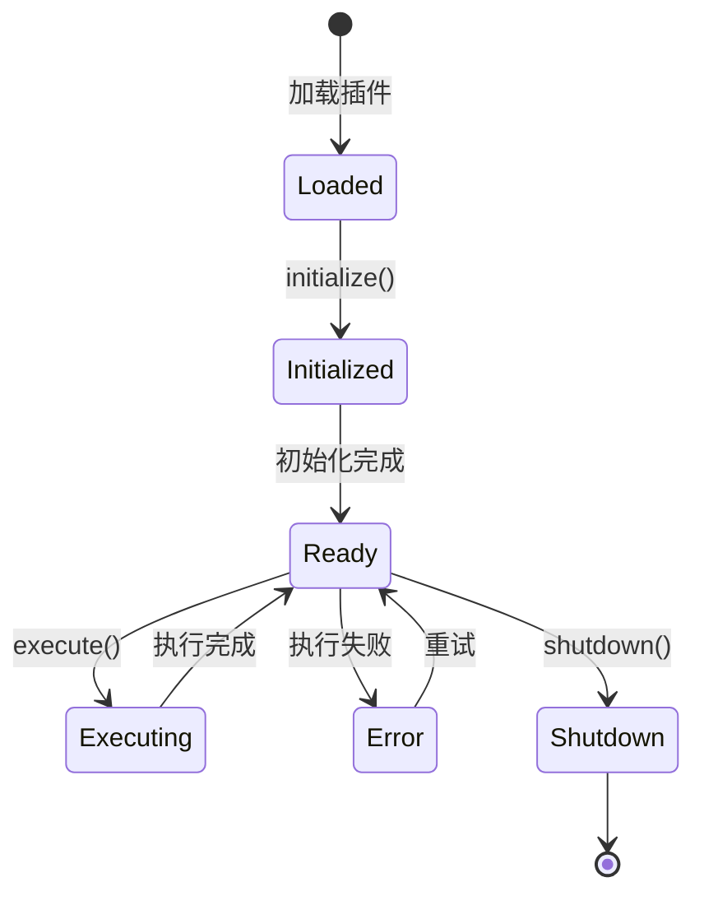

# 插件开发指南

> 本指南将帮助您从零开始开发 ClawdBot 插件，扩展平台功能。

## 📋 目录

- [插件概述](#插件概述)
- [开发环境搭建](#开发环境搭建)
- [第一个插件](#第一个插件)
- [插件架构](#插件架构)
- [核心API](#核心api)
- [进阶功能](#进阶功能)
- [测试与调试](#测试与调试)
- [打包与发布](#打包与发布)
- [最佳实践](#最佳实践)

---

## 插件概述

### 什么是插件？

ClawdBot 插件是独立的 Python 包，可以扩展平台的核心功能。每个插件提供特定的功能，如数据源连接、数据处理、通知发送等。

### 插件类型

| 类型 | 说明 | 示例 |
|------|------|------|
| **数据源插件** | 连接外部数据源 | MySQL, MongoDB, API |
| **处理器插件** | 处理和转换数据 | 数据清洗、格式转换 |
| **动作插件** | 执行特定操作 | 发送邮件、上传文件 |
| **集成插件** | 集成第三方服务 | Slack, GitHub, Jira |
| **UI插件** | 扩展Web界面 | 自定义仪表盘 |

### 插件结构

```
my-plugin/
├── plugin/                    # 插件主包
│   ├── __init__.py
│   ├── core.py                # 核心逻辑
│   ├── config.py              # 配置处理
│   └── utils.py               # 工具函数
├── tests/                     # 测试文件
│   ├── __init__.py
│   └── test_core.py
├── static/                    # 静态资源（UI插件）
├── templates/                 # 模板文件
├── manifest.yaml              # 插件清单
├── requirements.txt           # 依赖
├── setup.py                   # 安装脚本
├── README.md                  # 文档
└── LICENSE                    # 许可证
```

---

## 开发环境搭建

### 1. 环境要求

- Python 3.9+
- ClawdBot CLI
- Git

### 2. 安装开发工具

```bash
# 安装 ClawdBot CLI
pip install clawdbot-cli

# 安装开发依赖
pip install clawdbot-dev-tools

# 验证安装
clawdbot --version
```

### 3. 创建插件项目

```bash
# 使用模板创建插件
clawdbot plugin create my-awesome-plugin

# 进入项目目录
cd my-awesome-plugin

# 查看项目结构
ls -la
```

生成的项目结构：

```
my-awesome-plugin/
├── .clawdbot/                # ClawdBot配置
├── my_awesome_plugin/         # 插件包
│   ├── __init__.py
│   └── plugin.py
├── tests/
├── manifest.yaml
├── setup.py
├── requirements.txt
└── README.md
```

### 4. 本地开发环境

```bash
# 创建虚拟环境
python -m venv venv

# 激活虚拟环境
source venv/bin/activate  # Linux/Mac
# venv\Scripts\activate   # Windows

# 安装依赖
pip install -r requirements.txt

# 安装插件（开发模式）
pip install -e .
```

---

## 第一个插件

### 插件清单（manifest.yaml）

```yaml
# manifest.yaml
name: my-awesome-plugin
display_name: 我的超棒插件
version: "0.1.0"
description: 一个简单的示例插件
author: Your Name <your@email.com>
license: MIT

# 插件类型
type: processor

# 兼容性
clawdbot:
  min_version: "2.0.0"
  max_version: "2.99.0"

# 权限需求
permissions:
  - network: ["api.example.com"]
  - filesystem:
      read: ["./data/*"]

# 配置项
config_schema:
  api_key:
    type: string
    required: true
    description: API密钥
  timeout:
    type: integer
    default: 30
    description: 超时时间（秒）

# 入口点
entry_point: my_awesome_plugin.plugin:MyAwesomePlugin
```

### 插件主类

```python
# my_awesome_plugin/plugin.py
from clawdbot.plugins import BasePlugin, PluginContext, PluginResult
from typing import Dict, Any

class MyAwesomePlugin(BasePlugin):
    """我的第一个插件"""

    # 插件元数据
    metadata = {
        "name": "my-awesome-plugin",
        "version": "0.1.0",
        "description": "一个简单的示例插件"
    }

    def __init__(self, config: Dict[str, Any]):
        """初始化插件"""
        super().__init__(config)

        # 从配置中读取参数
        self.api_key = config.get("api_key")
        self.timeout = config.get("timeout", 30)

        # 初始化其他资源
        self.client = None

    async def initialize(self, context: PluginContext):
        """插件初始化（可选）"""
        # 在这里执行一次性初始化操作
        self.logger.info("插件初始化中...")

        # 初始化客户端
        self.client = await self.create_client()

    async def execute(
        self,
        inputs: Dict[str, Any],
        context: PluginContext
    ) -> PluginResult:
        """
        执行插件核心逻辑

        Args:
            inputs: 输入数据
            context: 执行上下文

        Returns:
            PluginResult: 执行结果
        """
        try:
            # 处理输入数据
            processed_data = await self.process_data(inputs)

            # 返回成功结果
            return PluginResult(
                success=True,
                data=processed_data,
                message="处理成功"
            )

        except Exception as e:
            # 返回失败结果
            self.logger.error(f"插件执行失败: {e}")
            return PluginResult(
                success=False,
                error=str(e),
                message="处理失败"
            )

    async def process_data(self, data: Dict[str, Any]) -> Dict[str, Any]:
        """处理数据（示例实现）"""
        # 这里实现你的业务逻辑
        result = {
            "original": data,
            "processed": f"已处理: {data}",
            "timestamp": self.get_current_timestamp()
        }
        return result

    async def shutdown(self, context: PluginContext):
        """插件清理（可选）"""
        self.logger.info("插件关闭中...")

        # 清理资源
        if self.client:
            await self.client.close()

    # 辅助方法
    async def create_client(self):
        """创建客户端"""
        # 实现客户端创建逻辑
        return SomeAPIClient(self.api_key, timeout=self.timeout)

    def get_current_timestamp(self) -> str:
        """获取当前时间戳"""
        from datetime import datetime
        return datetime.now().isoformat()
```

### 测试插件

```python
# tests/test_plugin.py
import pytest
from my_awesome_plugin.plugin import MyAwesomePlugin

@pytest.fixture
async def plugin():
    """创建插件实例"""
    config = {
        "api_key": "test_key",
        "timeout": 10
    }
    plugin = MyAwesomePlugin(config)
    await plugin.initialize(None)
    yield plugin
    await plugin.shutdown(None)

@pytest.mark.asyncio
async def test_plugin_execute(plugin):
    """测试插件执行"""
    inputs = {
        "message": "Hello, World!"
    }

    result = await plugin.execute(inputs, None)

    assert result.success is True
    assert "processed" in result.data
    assert "timestamp" in result.data

@pytest.mark.asyncio
async def test_plugin_error_handling(plugin):
    """测试错误处理"""
    # 传入无效输入
    result = await plugin.execute({}, None)

    # 验证错误处理
    assert result.success is False
    assert result.error is not None
```

运行测试：

```bash
# 安装测试依赖
pip install pytest pytest-asyncio

# 运行测试
pytest tests/

# 查看详细输出
pytest tests/ -v
```

---

## 插件架构

### 核心类图

```
BasePlugin (抽象基类)
    │
    ├── metadata (元数据)
    ├── config (配置)
    ├── logger (日志器)
    │
    ├── initialize(ctx)      # 初始化
    ├── execute(inputs, ctx) # 执行
    └── shutdown(ctx)       # 清理
           │
           ▼
    MyPlugin (你的插件)
```

### 生命周期



### 执行流程

```
用户请求
    │
    ▼
验证输入
    │
    ▼
调用 execute()
    │
    ├─► 获取数据
    │   │
    │   ▼
    │  处理数据
    │   │
    │   ▼
    │  返回结果
    │
    └─► 错误处理
        │
        ▼
    返回错误结果
```

---

## 核心API

### 1. 配置API

```python
class MyPlugin(BasePlugin):
    def __init__(self, config: Dict[str, Any]):
        # 获取配置值
        self.api_key = config.get("api_key")
        self.timeout = config.get("timeout", 30)

        # 带默认值和验证
        self.max_retries = self.get_config(
            key="max_retries",
            default=3,
            validator=lambda x: x > 0
        )

        # 获取嵌套配置
        db_config = self.get_nested_config("database", {})

        # 验证必需配置
        self.validate_config(config)
```

### 2. 日志API

```python
class MyPlugin(BasePlugin):
    async def execute(self, inputs, context):
        # 不同级别的日志
        self.logger.debug("调试信息")
        self.logger.info("处理开始")
        self.logger.warning("警告信息")
        self.logger.error("错误信息")
        self.logger.critical("严重错误")

        # 结构化日志
        self.logger.info(
            "处理完成",
            extra={
                "task_id": context.task_id,
                "duration": 1.5,
                "items_processed": 100
            }
        )
```

### 3. 上下文API

```python
class MyPlugin(BasePlugin):
    async def execute(self, inputs, context):
        # 获取任务信息
        task_id = context.task_id
        task_type = context.task_type

        # 获取用户信息
        user_id = context.user_id
        user_permissions = context.permissions

        # 访问共享存储
        shared_data = await context.get_shared_data("key")
        await context.set_shared_data("key", value)

        # 发送进度更新
        await context.send_progress(50, "正在处理...")

        # 发送通知
        await context.send_notification({
            "type": "info",
            "message": "处理完成"
        })
```

### 4. 数据库API

```python
class MyPlugin(BasePlugin):
    async def execute(self, inputs, context):
        # 查询数据
        results = await context.db.query(
            "SELECT * FROM users WHERE id = %s",
            [user_id]
        )

        # 插入数据
        await context.db.execute(
            "INSERT INTO logs (message, created_at) VALUES (%s, NOW())",
            ["Log message"]
        )

        # 事务操作
        async with context.db.transaction() as tx:
            await tx.execute("UPDATE users SET name = %s WHERE id = %s", ["John", 1])
            await tx.execute("INSERT INTO audit (action) VALUES (%s)", ["update"])
```

### 5. 网络API

```python
class MyPlugin(BasePlugin):
    async def execute(self, inputs, context):
        # HTTP GET 请求
        response = await context.http.get(
            "https://api.example.com/data",
            headers={"Authorization": f"Bearer {self.api_key}"}
        )
        data = response.json()

        # HTTP POST 请求
        response = await context.http.post(
            "https://api.example.com/submit",
            json={"key": "value"}
        )

        # 带重试的请求
        response = await context.http.get(
            "https://api.example.com/data",
            retries=3,
            backoff=2  # 指数退避
        )
```

---

## 进阶功能

### 1. 异步任务

```python
class AsyncPlugin(BasePlugin):
    async def execute(self, inputs, context):
        # 并发执行多个任务
        results = await asyncio.gather(
            self.fetch_data_1(),
            self.fetch_data_2(),
            self.fetch_data_3()
        )

        # 使用队列处理大量任务
        queue = asyncio.Queue()

        # 生产者
        await self.produce_tasks(queue, inputs)

        # 消费者（多个worker）
        workers = [
            self.process_tasks(queue) for _ in range(5)
        ]
        await asyncio.gather(*workers)
```

### 2. 流式处理

```python
class StreamPlugin(BasePlugin):
    async def execute(self, inputs, context):
        # 流式读取大文件
        async for line in self.read_stream(inputs["file_path"]):
            processed = await self.process_line(line)

            # 发送进度更新
            await context.send_progress(
                progress=0.5,
                message=f"已处理: {processed}"
            )

    async def read_stream(self, file_path):
        """异步读取文件流"""
        async with aiofiles.open(file_path, 'r') as f:
            async for line in f:
                yield line.strip()
```

### 3. 缓存机制

```python
class CachedPlugin(BasePlugin):
    def __init__(self, config):
        super().__init__(config)
        self.cache_enabled = config.get("cache_enabled", True)
        self.cache_ttl = config.get("cache_ttl", 3600)

    async def execute(self, inputs, context):
        # 检查缓存
        cache_key = self.generate_cache_key(inputs)

        if self.cache_enabled:
            cached_result = await context.cache.get(cache_key)
            if cached_result:
                self.logger.info("从缓存返回结果")
                return PluginResult(success=True, data=cached_result)

        # 执行实际处理
        result = await self.process_data(inputs)

        # 保存到缓存
        if self.cache_enabled:
            await context.cache.set(cache_key, result, ttl=self.cache_ttl)

        return PluginResult(success=True, data=result)
```

### 4. 错误重试

```python
class RetryPlugin(BasePlugin):
    async def execute(self, inputs, context):
        max_retries = 3
        retry_delay = 1

        for attempt in range(max_retries):
            try:
                result = await self.call_external_api(inputs)
                return PluginResult(success=True, data=result)

            except TemporaryError as e:
                if attempt < max_retries - 1:
                    self.logger.warning(f"重试 {attempt + 1}/{max_retries}: {e}")
                    await asyncio.sleep(retry_delay * (2 ** attempt))  # 指数退避
                else:
                    raise

        raise MaxRetriesExceeded("超过最大重试次数")
```

### 5. 批处理

```python
class BatchPlugin(BasePlugin):
    async def execute(self, inputs, context):
        items = inputs["items"]
        batch_size = 100

        # 分批处理
        for i in range(0, len(items), batch_size):
            batch = items[i:i + batch_size]

            # 处理批次
            await self.process_batch(batch)

            # 发送进度
            progress = ((i + batch_size) / len(items)) * 100
            await context.send_progress(
                progress=min(progress, 100),
                message=f"已处理 {min(i + batch_size, len(items))}/{len(items)} 项"
            )
```

---

## 测试与调试

### 单元测试

```python
import pytest
from unittest.mock import AsyncMock, patch

class TestMyPlugin:
    @pytest.fixture
    def plugin_config(self):
        return {
            "api_key": "test_key",
            "timeout": 10
        }

    @pytest.fixture
    async def plugin(self, plugin_config):
        plugin = MyPlugin(plugin_config)
        await plugin.initialize(None)
        yield plugin
        await plugin.shutdown(None)

    @pytest.mark.asyncio
    async def test_success_case(self, plugin):
        inputs = {"data": "test"}
        result = await plugin.execute(inputs, None)

        assert result.success is True
        assert "processed" in result.data

    @pytest.mark.asyncio
    async def test_error_case(self, plugin):
        inputs = {}
        result = await plugin.execute(inputs, None)

        assert result.success is False

    @pytest.mark.asyncio
    @patch('my_plugin.ExternalAPI')
    async def test_external_api_call(self, mock_api, plugin):
        # Mock 外部API
        mock_api.return_value.fetch_data = AsyncMock(return_value={"data": "test"})

        inputs = {"id": 123}
        result = await plugin.execute(inputs, None)

        assert result.success is True
        mock_api.assert_called_once()
```

### 集成测试

```python
@pytest.mark.integration
class TestPluginIntegration:
    async def test_full_workflow(self):
        # 创建真实的上下文
        context = await self.create_test_context()

        plugin = MyPlugin(self.config)
        await plugin.initialize(context)

        try:
            # 执行完整流程
            inputs = self.create_test_inputs()
            result = await plugin.execute(inputs, context)

            assert result.success is True

            # 验证数据库状态
            records = await context.db.query("SELECT * FROM results WHERE task_id = %s", [context.task_id])
            assert len(records) > 0

        finally:
            await plugin.shutdown(context)
```

### 调试技巧

```python
class DebugPlugin(BasePlugin):
    async def execute(self, inputs, context):
        # 启用详细日志
        self.logger.setLevel(logging.DEBUG)

        # 打印调试信息
        self.logger.debug(f"输入: {inputs}")
        self.logger.debug(f"配置: {self.config}")

        # 使用 pdb 调试
        import pdb; pdb.set_trace()

        # 性能分析
        import time
        start = time.time()

        # ... 执行逻辑 ...

        duration = time.time() - start
        self.logger.info(f"执行耗时: {duration:.2f}秒")
```

---

## 打包与发布

### 1. 打包插件

```bash
# 1. 更新版本号
# 在 manifest.yaml 中更新 version: "1.0.0"

# 2. 构建分发包
clawdbot plugin build

# 这将生成：
# dist/my-awesome-plugin-1.0.0.tar.gz
# dist/my-awesome-plugin-1.0.0.whl

# 3. 验证包
clawdbot plugin validate dist/my-awesome-plugin-1.0.0.whl
```

### 2. 本地测试

```bash
# 安装打包好的插件
pip install dist/my-awesome-plugin-1.0.0.whl

# 在 ClawdBot 中加载插件
clawdbot plugin install my-awesome-plugin --local

# 测试插件
clawdbot plugin test my-awesome-plugin
```

### 3. 发布到插件市场

```bash
# 1. 登录插件市场
clawdbot plugin login

# 2. 发布插件
clawdbot plugin publish dist/my-awesome-plugin-1.0.0.whl

# 发布成功后，用户可以这样安装：
# clawdbot plugin install my-awesome-plugin
```

### 4. 持续集成

```yaml
# .github/workflows/ci.yml
name: CI

on: [push, pull_request]

jobs:
  test:
    runs-on: ubuntu-latest
    steps:
      - uses: actions/checkout@v2

      - name: Set up Python
        uses: actions/setup-python@v2
        with:
          python-version: '3.9'

      - name: Install dependencies
        run: |
          pip install -r requirements.txt
          pip install pytest pytest-asyncio

      - name: Run tests
        run: pytest tests/ -v

      - name: Build plugin
        run: clawdbot plugin build
```

---

## 最佳实践

### 1. 代码质量

```python
# ✅ 好的实践
class WellStructuredPlugin(BasePlugin):
    """清晰的文档字符串"""

    async def process_data(self, data: Dict[str, Any]) -> Dict[str, Any]:
        """
        处理输入数据

        Args:
            data: 输入数据字典

        Returns:
            处理后的数据

        Raises:
            ValueError: 当数据格式不正确时
        """
        # 实现逻辑
        pass

# ❌ 避免的做法
class BadPlugin(BasePlugin):
    def process_data(self, data):  # 缺少类型注解
        # 处理数据  # 缺少文档字符串
        pass
```

### 2. 错误处理

```python
class RobustPlugin(BasePlugin):
    async def execute(self, inputs, context):
        try:
            result = await self.process(inputs)

        except ValidationError as e:
            # 业务逻辑错误
            return PluginResult(
                success=False,
                error_code="VALIDATION_ERROR",
                message=f"输入验证失败: {e}"
            )

        except NetworkError as e:
            # 网络错误
            self.logger.error(f"网络错误: {e}")
            return PluginResult(
                success=False,
                error_code="NETWORK_ERROR",
                message="网络连接失败，请稍后重试"
            )

        except Exception as e:
            # 未预期的错误
            self.logger.exception(f"未知错误: {e}")
            return PluginResult(
                success=False,
                error_code="INTERNAL_ERROR",
                message="内部错误，请联系管理员"
            )
```

### 3. 性能优化

```python
class OptimizedPlugin(BasePlugin):
    # 使用类变量缓存不变数据
    STATIC_DATA = self.load_static_data()

    async def execute(self, inputs, context):
        # 使用异步IO
        async with aiohttp.ClientSession() as session:
            result = await session.get(url)

        # 使用生成器处理大数据
        for item in self.process_generator(large_data):
            yield item

        # 批量操作数据库
        await self.batch_insert(items, batch_size=100)
```

### 4. 安全实践

```python
class SecurePlugin(BasePlugin):
    async def execute(self, inputs, context):
        # 验证输入
        if not self.validate_inputs(inputs):
            raise ValidationError("无效输入")

        # 清理敏感数据
        safe_inputs = self.sanitize(inputs)

        # 使用参数化查询
        await context.db.query(
            "SELECT * FROM users WHERE id = %s",
            [user_id]  # 参数化
        )

        # 不记录敏感信息
        self.logger.info(f"处理请求: {task_id}")  # 不记录完整inputs
```

### 5. 文档

```python
class DocumentedPlugin(BasePlugin):
    """
    我的超棒插件

    这个插件实现了以下功能：
    - 功能1
    - 功能2
    - 功能3

    配置项：
        api_key (str): API密钥
        timeout (int): 超时时间（秒）

    示例：
        >>> plugin = MyPlugin({"api_key": "xxx"})
        >>> result = await plugin.execute({"data": "test"}, context)
    """

    def example_usage(self):
        """
        提供使用示例

        示例代码：
        ```python
        inputs = {"key": "value"}
        result = await plugin.execute(inputs, context)
        ```
        """
        pass
```

---

## 参考资料

### 官方文档
- [插件API文档](https://docs.clawdbot.dev/plugins/api)
- [插件市场指南](https://docs.clawdbot.dev/plugins/marketplace)
- [最佳实践](https://docs.clawdbot.dev/plugins/best-practices)

### 示例插件
- [官方插件仓库](https://github.com/clawdbot/plugins)
- [社区插件](https://marketplace.clawdbot.dev)

### 相关文档
- [[ClawdBot完整指南]] - ClawdBot 完整使用指南
- [[插件安全规范]] - 插件安全开发规范
- [[性能优化实践]] - 插件性能优化指南

---

*创建时间: 2026-01-31*
*最后更新: 2026-01-31*
*分类: 3 Resources*
