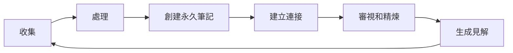

# Zettelkasten 工作流

> 一種基於連接的知識管理系統，通過卡片筆記構建知識網絡

---

## 📖 基礎概念

### Zettelkasten 是什麼？

Zettelkasten（德語「卡片盒」）是由德國社會學家 Niklas Luhmann 發展的知識管理方法。核心思想是：

- **原子化筆記**：每個筆記只包含一個想法
- **雙向鏈接**：在相關筆記之間建立連接
- **有機成長**：知識網絡隨時間自然演化
- **意外發現**：通過連接產生新見解

### 核心原則

| 原則 | 說明 | 示例 |
|------|------|------|
| **原子性** | 每個筆記只表達一個想法 | 將「學習方法」拆分為多個具體筆記 |
| **自主性** | 筆記可獨立理解 | 不依賴外部上下文 |
| **連接性** | 通過鏈接建立關係 | [[20240126001]] → [[20240126002]] |
| **成長性** | 系統持續演化 | 定期添加新筆記和連接 |

---

## 🏗️ 筆記類型

### 1. 永久筆記 (Permanent Notes)

**特點**：
- 包含完整的、獨立的想法
- 使用持久標識符（日期或編號）
- 是系統的核心構建塊

**示例標識符**：
- `202401261234` (YYYYMMDDHHMM)
- `20240126-01` (日期-序號)
- 自定義編號系統

**示例內容**：
```markdown
---
title: 間隔重複提升記憶效率
type: permanent
created: 2024-01-26
---

# 間隔重複提升記憶效率

間隔重複是一種學習策略，通過在增長的時間間隔內複習材料來提高長期記憶。

## 核心原理
- 遺忘曲線：艾賓浩斯研究表明記憶會隨時間衰減
- 最佳複習時間點：在即將遺忘前進行複習

## 實踐方法
- 使用 Anki 等工具自動化間隔重複
- 初期間隔較短（1天、3天），逐漸增長

## 相關筆記
- [[20240125001 艾賓浩斯遺忘曲線]]
- [[20240124001 主動回憶策略]]

## 參考資料
- SuperMemo 算法研究
```

### 2. 文獻筆記 (Literature Notes)

**特點**：
- 從來源提取的原始資訊
- 包含來源引用
- 未經深度處理

**示例**：
```markdown
---
title: 文獻筆記 - Make It Stick
type: literature
source: Brown et al. (2014). Make It Stick
created: 2024-01-26
---

# 文獻筆記：Make It Stick

> "主動學習比被動重複更有效。測試自己能強化記憶，而不僅僅是評估學習。" (p. 3)

要點：
- 測試效應：主動回憶促進學習
- 錯誤有價值：犯錯是學習的一部分

標籤：#[[學習科學]] #[[主動學習]]
```

### 3. 項目筆記 (Project Notes)

**特點**：
- 關於特定項目的資訊
- 臨時性質，項目結束後可歸檔
- 不進入永久系統

**示例**：
```markdown
---
title: Python 學習計劃
type: project
status: active
due: 2024-06-01
---

# Python 學習計劃

## 目標
- 掌握 Python 基礎語法
- 完成三個實戰項目
- 通過 PCEP 認證

## 里程碑
- [ ] Week 1-2: 基礎語法
- [ ] Week 3-4: 數據結構
- [ ] Week 5-6: 函數和模塊

## 資源
- Python 官方文檔
- Automate the Boring Stuff

## 輸出筆記
- 完成後轉化為永久筆記
```

### 4. 結構筆記 (Structure Notes)

**特點**：
- 提供某個主題的概覽
- 作為多個筆記的入口點
- 幫助導航知識網絡

**示例**：
```markdown
---
title: 學習科學
type: structure
created: 2024-01-26
---

# 學習科學

學習科學研究我們如何有效學習和記憶。

## 核心概念
- [[間隔重複]]
- [[主動回憶]]
- [[雙重編碼]]
- [[精細加工]]

## 應用領域
- 語言學習
- 技能培養
- 學術研究

## 相關結構筆記
- [[認知心理學]]
- [[教育技術]]

## 更新記錄
- 2024-01-26: 創建
```

### 5. 概念筆記 (Concept Notes)

**特點**：
- 定義和解釋特定概念
- 提供清晰的理解框架
- 作為其他筆記的基礎

**示例**：
```markdown
---
title: 間隔重複
type: concept
created: 2024-01-26
---

# 間隔重複

## 定義
間隔重複（Spaced Repetition）是一種學習技巧，通過在系統性增長的時間間隔內複習學習材料來提高記憶保留。

## 理論基礎
- **遺忘曲線**：艾賓浩斯（1885）
- **間隔效應**：Ebbinghaus, Cepeda 等
- **認知負荷理論**：Sweller (1988)

## 實現方式
- **物理卡片**：傳統抽認卡
- **數字工具**：Anki, SuperMemo
- **集成系統**：Obsidian + 間隔重複外掛

## 最佳實踐
1. 複習間隔：1天、3天、7天、14天、30天
2. 卡片質量：一張卡片一個問題
3. 主動回憶：不看答案先思考

## 相關概念
- [[測試效應]]
- [[遺忘曲線]]
```

---

## 🔄 工作流程

### 每日流程



### 步驟詳解

#### 1. 收集 (Collect)

**目標**：快速捕獲想法，不中斷思考

**方法**：
- 使用 [[0 Inbox|Inbox]] 文件夾
- 移動端快速筆記（Apple Notes, Google Keep）
- 語音輸入
- 瀏覽器書籤和剪藏

**原則**：
- 不要過濾，先記錄
- 保持簡潔，關鍵詞即可
- 標注來源（如果適用）

#### 2. 處理 (Process)

**目標**：將原始想法轉化為永久筆記

**檢查清單**：
- [ ] 想法是否清晰明確？
- [ ] 是否與已有筆記重複？
- [ ] 是否可以拆分為多個筆記？
- [ ] 是否需要更多信息來支持？
- [ ] 是否有來源可以引用？

**處理動作**：
- **轉化為永久筆記**：如果是有價值的想法
- **創建文獻筆記**：如果來自特定來源
- **添加到項目筆記**：如果與當前項目相關
- **丟棄**：如果沒有價值或已過時

#### 3. 創建永久筆記 (Create Permanent Notes)

**格式模板**：
```markdown
---
title: {簡明標題}
type: permanent
created: {YYYY-MM-DD}
tags: #[[主題標籤]]
---

# {標題}

## 核心想法
{一個清晰、完整的想法}

## 解釋
{為什麼這很重要？如何運作？}

## 示例
{具體例子，說明概念}

## 應用
{如何使用？在什麼情況下？}

## 相關筆記
- [[{相關筆記1}]]
- [[{相關筆記2}]]

## 參考資料
- {來源引用}
```

**創建原則**：
1. **一個想法一個筆記**：保持聚焦
2. **完整表達**：筆記應能獨立理解
3. **使用自己的語言**：避免直接複製粘貼
4. **添加上下文**：說明為什麼這個想法重要

#### 4. 建立連接 (Link)

**目標**：構建知識網絡

**連接類型**：
- **直接連接**：筆記之間的直接關係
- **雙向連接**：相互引用的筆記
- **結構連接**：通過結構筆記組織
- **標籤連接**：通過標籤分組

**連接策略**：
1. **創建時連接**：在創建新筆記時，主動搜索相關筆記
2. **定期審視**：檢查未連接的筆記
3. **使用索引**：通過標籤和結構筆記導航
4. **意外連接**：允許非預期的連接產生

**搜索技巧**：
```bash
# 在 Obsidian 中搜索相關筆記
ctrl/cmd + p → 搜索關鍵詞

# 使用 Dataview 查找相關筆記
```dataview
LIST
WHERE file.tags
FLATTEN file.tags AS tag
WHERE contains(tag, "學習科學")
```

#### 5. 審視和精煉 (Review and Refine)

**目標**：保持系統的活性和質量

**審視頻率**：
- **每日**：處理 Inbox（5-10 分鐘）
- **每週**：審視新筆記和連接（30 分鐘）
- **每月**：深度審視某個主題（2-3 小時）
- **每季**：結構性審視（半天）

**審視內容**：
- [ ] 新筆記質量是否達標？
- [ ] 連接是否合理和必要？
- [ ] 是否有孤立的筆記需要連接？
- [ ] 是否有過時的筆記需要更新或歸檔？
- [ ] 是否有重複的筆記需要合併？

**精煉動作**：
- **合併**：將相似筆記合併
- **拆分**：將複雜筆記拆分
- **更新**：添加新信息或修正錯誤
- **歸檔**：將不再相關的筆記移入 [[4 Archives|Archives]]

#### 6. 生成見解 (Generate Insights)

**目標**：通過連接產生新想法

**方法**：
1. **隨機漫步**：從一個筆記開始，隨機跟隨鏈接
2. **結構探索**：從結構筆記開始，探索相關主題
3. **標籤導航**：通過標籤查看相關筆記群
4. **定期創作**：基於筆記寫作或創建內容

**見解捕獲**：
- 將新見解創建為新筆記
- 連接相關筆記
- 更新結構筆記

---

## 🛠️ 工具和技術

### Obsidian 配置

#### 1. 文件夾結構

```
📁 Knowledge/
├── 📁 0 Inbox/              # 臨時收集
├── 📁 1 Projects/           # 項目筆記
├── 📁 2 Areas/              # 領域筆記（可選）
├── 📁 3 Resources/          # 永久筆記主存儲
│   └── 📁 永久筆記/         # Zettelkasten 核心
├── 📁 4 Archives/           # 歸檔筆記
└── 📁 模板/                 # 筆記模板
```

#### 2. 必備外掛

| 外掛 | 用途 | 設置 |
|------|------|------|
| **Dataview** | 數據查詢 | 啟用基本查詢 |
| **Templater** | 模板管理 | 配置筆記模板 |
| **QuickAdd** | 快速輸入 | 設置捕獲快捷鍵 |
| **Graph Analysis** | 知識圖譜 | 可視化連接 |
| **Backlinks** | 反向鏈接 | 默認已啟用 |
| **Outgoing Links** | 外出鏈接 | 默認已啟用 |

#### 3. 模板示例

**永久筆記模板**：
```markdown
---
title: {{title}}
type: permanent
created: <% tp.date.now("YYYY-MM-DD") %>
tags: [[{{tag}}]]
---

# {{title}}

## 核心想法

<% tp.file.cursor(1) %>

## 解釋

## 示例

## 應用

## 相關筆記

## 參考資料
```

**快速捕獲模板**：
```markdown
---
title: {{title}}
type: temporary
created: <% tp.date.now("YYYY-MM-DD") %>
---

<% tp.file.cursor(1) %>

---
**來源**：
**相關標籤**：
```

### 符號系統

使用符號標記筆記類型和狀態：

| 符號 | 含義 | 用法 |
|------|------|------|
| `📌` | 重要 | 置於筆記標題前 |
| `🔄` | 進行中 | 表示正在發展的想法 |
| `✅` | 已完成 | 表示完整的想法 |
| `❓` | 待研究 | 需要更多信息 |
| `🔗` | 連接點 | 重要的連接節點 |

### 命名約定

#### 選項 1：日期標識符

```
202401261234 永久筆記標題.md
20240126-01 第二個永久筆記.md
20240126-L01 文獻筆記.md
```

**優點**：
- 自動排序
- 唯一標識
- 時間追蹤

**缺點**：
- 文件名較長
- 不直觀

#### 選項 2：標題命名

```
永久筆記標題.md
另一個永久筆記.md
```

**優點**：
- 簡潔直觀
- 易於搜索

**缺點**：
- 可能重複
- 無內置排序

**推薦組合**：
- 使用標題命名（主要）
- 在 frontmatter 中添加 created 日期
- 使用 Dataview 按日期排序

---

## 📊 與其他系統對比

### Zettelkasten vs PARA

| 維度 | Zettelkasten | PARA |
|------|-------------|------|
| **組織原則** | 主題連接 | 行動導向 |
| **筆記粒度** | 原子化 | 項目/資源級 |
| **連接方式** | 雙向鏈接 | 層級結構 |
| **主要用途** | 知識發現 | 項目管理 |
| **適用場景** | 研究、寫作 | 工作、生活管理 |

### 結合使用建議

```
📁 1 Projects/     ← PARA - 管理當前項目
📁 3 Resources/
└── 📁 永久筆記/   ← Zettelkasten - 存儲知識
```

**工作流程**：
1. **項目筆記**（PARA）：跟踪項目進度
2. **永久筆記**（Zettelkasten）：提取可重用的知識
3. **資源筆記**（PARA）：參考材料
4. **永久筆記**（Zettelkasten）：深度理解和連接

---

## 🎯 最佳實踐

### 1. 開始時保持簡單

```
❌ 不要：一開始就建立複雜的分類系統
✅ 應該：先從三個基本筆記類型開始
```

### 2. 專注於連接而非完美

```
❌ 不要：過度關注筆記的語法和格式
✅ 應該：優先建立筆記之間的連接
```

### 3. 定期審視而非即時完善

```
❌ 不要：每次創建都追求完美
✅ 應該：定期批量審視和改進
```

### 4. 使用自己的語言

```
❌ 不要：直接複製粘貼原文
✅ 應該：用自己的話重新表述
```

### 5. 連接多個來源

```
❌ 不要：只連接同來源的筆記
✅ 應該：跨領域建立連接
```

---

## 📈 進階技巧

### 1. 創建概念地圖

```dataviewjs
dv.header(2, "🗺️ 核心概念地圖");
const concepts = dv.pages('"3 Resources"')
  .where(p => p.type === 'concept');

concepts.forEach(c => {
  dv.paragraph(`### ${c.file.link}`);
  dv.paragraph(`連接：${c.file.inlinks.length} 個入鏈，${c.file.outlinks.length} 個出鏈`);
});
```

### 2. 使用 MOC (Map of Content)

創建索引筆記來組織大型主題：

```markdown
---
title: 學習科學 MOC
type: moc
---

# 學習科學 MOC

## 理論基礎
- [[遺忘曲線]]
- [[認知負荷理論]]
- [[建構主義]]

## 學習策略
- [[間隔重複]]
- [[主動回憶]]
- [[間隔練習]]

## 應用工具
- [[Anki 使用指南]]
- [[Obsidian 學習系統]]

## 最新更新
<% tp.date.last_modified() %>
```

### 3. 實施間隔重複審視

使用 Obsidian 的「每日筆記」來追蹤需要審視的筆記：

```markdown
---
date: 2024-01-26
---

# 今日審視

## 新筆記審視
```dataview
LIST
WHERE file.ctime >= date(today) - dur("1 day")
WHERE !contains(file.path, "Inbox")
```

## 隨機筆記審視
```dataview
LIST
FROM "3 Resources"
SORT file.mtime DESC
LIMIT 5
```

## 待連接筆記
```dataview
LIST
WHERE file.outlinks.length = 0
  AND contains(file.path, "永久筆記")
```


### 4. 雙向鏈接分析

定期檢查筆記的連接健康度：

```dataview
TABLE without ID
  file.link AS "筆記",
  file.inlinks.length AS "入鏈",
  file.outlinks.length AS "出鏈",
  (file.inlinks.length + file.outlinks.length) AS "總連接"
FROM "3 Resources/永久筆記"
WHERE (file.inlinks.length + file.outlinks.length) < 2
SORT (file.inlinks.length + file.outlinks.length) ASC
```

---

## 🐛 常見問題

### Q1: 如何避免創建過多筆記？

**A**：遵循「一個想法一個筆記」的原則，但不是一個句子一個筆記。思考：
- 這個想法是否獨立存在？
- 是否可以從其他筆記中分離？
- 將來是否可能獨立引用？

### Q2: 筆記找不到相關連接怎麼辦？

**A**：
1. 使用標籤來幫助發現
2. 定期使用搜索功能
3. 創建結構筆記作為樞紐
4. 接受一些筆記暫時孤立

### Q3: 如何處理過時的筆記？

**A**：
- **更新**：添加新信息，保留歷史
- **歸檔**：移到 [[4 Archives]] 但保留引用
- **刪除**：只有確定無用且無引用時

### Q4: Zettelkasten 適合日常任務管理嗎？

**A**：不適合。Zettelkasten 設計用於知識管理，不適合：
- 即時任務
- 項目跟踪
- 日程安排

對於這些，使用 [[PARA工作流]] 或專門的任務管理工具。

### Q5: 需要多少筆記才能看到效果？

**A**：
- **50-100 筆記**：開始看到一些連接
- **300-500 筆記**：網絡開始顯示價值
- **1000+ 筆記**：顯著的知識綜合能力

重點是持續性，不是數量。

---

## 📚 學習資源

### 經典資源
- [Niklas Luhmann 的卡片盒系統](https://luhmann.surge.sh/)
- [How to Take Smart Notes (Sönke Ahrens)](https://www.goodreads.com/book/show/44542997-how-to-take-smart-notes)
- [Zettelkasten.de](https://zettelkasten.de/)

### 現代應用
- [Obsidian 官方論壇 - Zettelkasten](https://forum.obsidian.md/c/zettelkasten/9)
- [Building a Second Brain (Tiago Forte)](https://www.buildingasecondbrain.com/)
- [Zettelkasten Method - Reddit](https://www.reddit.com/r/Zettelkasten/)

### 視頻教程
- [Zettelkasten 方法](https://www.youtube.com/results?search_query=zettelkasten)
- [Obsidian Zettelkasten Setup](https://www.youtube.com/results?search_query=obsidian+zettelkasten)

### 相關筆記
- [[3 Resources/03-Productivity/Methods/PARA工作流]]
- [[3 Resources/03-Productivity/Methods/Inbox 工作流]]
- [[3 Resources/03-Productivity/Methods/Dataview 使用指南]]

---

## ✅ 快速檢查清單

### 創建筆記時
- [ ] 是否只包含一個核心想法？
- [ ] 是否用我自己的語言寫作？
- [ ] 是否清晰可獨立理解？
- [ ] 是否添加了相關連接？
- [ ] 是否標記了適當的標籤？

### 定期審視
- [ ] Inbox 是否清空？
- [ ] 新筆記是否已處理？
- [ ] 是否發現了新的連接？
- [ ] 是否有筆記需要更新？
- [ ] 是否生成了新見解？

### 系統維護
- [ ] 工具設置是否正常？
- [ ] 模板是否需要更新？
- [ ] 文件夾結構是否合理？
- [ ] 是否需要添加新外掛？

---

> **提示**：Zettelkasten 的價值不在於系統本身，而在於持續的思考和連接。從簡單開始，保持一致性，系統會隨時間自然成長。
