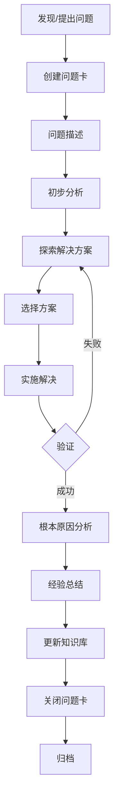

> [!summary] 问题卡简介
> 问题卡是一种结构化的问题追踪和解决方法，帮助你系统化地记录、分析和解决各种问题，并通过经验积累持续改进。

---

## 📋 什么是问题卡？

问题卡是一套系统化的问题管理框架，它通过结构化的模板帮助你：

- **记录问题**：清晰描述问题的症状、影响范围和复现步骤
- **分析问题**：深入探索可能的根本原因
- **探索方案**：比较多个解决方案，选择最优解
- **实施解决**：记录实施过程和验证结果
- **总结经验**：积累解决问题的知识和预防措施

### 核心原则

1. **结构化思考** - 强制按照固定流程分析问题
2. **多方案对比** - 不局限于第一个想法，探索多种可能性
3. **根本原因分析** - 使用 5 Whys 等方法深入挖掘
4. **经验积累** - 将问题和解决方案转化为可复用的知识

---

## 🎯 问题卡结构详解

### 1. 📋 问题基本信息

| 字段 | 说明 | 示例 |
|------|------|------|
| 问题标题 | 简洁明确的问题描述 | "API 接口响应超时" |
| 问题类型 | 问题所属类别 | 技术问题、流程问题、业务问题 |
| 优先级 | 问题的紧急程度 | 高/中/低 |
| 创建时间 | 问题发现的时间 | 2026-01-27 |
| 负责人 | 问题处理的主要责任人 | 张三 |

**使用技巧**：
- 问题标题应该包含关键信息，便于搜索
- 优先级设定要考虑影响范围和紧急程度
- 明确负责人可以避免责任不清

---

### 2. 🎯 问题描述

#### 问题描述
详细描述问题的症状和现象，包括：
- 发生了什么异常
- 正常情况下应该是什么样
- 问题的具体表现

#### 影响范围
评估问题对各方的影响：
- [ ] 个人 - 只影响自己
- [ ] 团队 - 影响整个团队
- [ ] 用户 - 影响最终用户
- [ ] 系统 - 影响系统整体运行

#### 预期行为 vs 实际行为
对比正常和异常的情况，明确问题所在。

#### 复现步骤
如果问题可以复现，详细记录步骤：
1. 第一步操作
2. 第二步操作
3. 第三步操作

**使用技巧**：
- 尽量量化问题（如：响应时间从 100ms 增加到 5s）
- 记录问题发生的环境和条件
- 如果问题随机发生，记录出现频率

---

### 3. 🔍 初步分析

#### 现象分析
根据问题描述，初步判断问题可能的原因类型：
- 技术层面：代码错误、配置问题、资源不足
- 流程层面：流程缺失、流程不合理
- 人员层面：沟通不畅、技能不足
- 外部层面：依赖服务故障、环境变化

#### 可能原因
列出 3 个最可能的原因，按可能性排序。

**使用技巧**：
- 不要急于下结论，保持开放思维
- 考虑多个维度的原因，不要局限于某一领域
- 可以使用鱼骨图（因果图）辅助分析

---

### 4. 🛠️ 解决方案探索

#### 方案对比框架

| 方案 | 思路 | 优点 | 缺点 | 实施难度 | 时效性 |
|------|------|------|------|----------|--------|
| 方案一 | ... | ... | ... | 简单/中等/困难 | 快速/中等/慢速 |
| 方案二 | ... | ... | ... | 简单/中等/困难 | 快速/中等/慢速 |
| 方案三 | ... | ... | ... | 简单/中等/困难 | 快速/中等/慢速 |

**使用技巧**：
- 至少探索 2-3 个方案
- 优先考虑能从根本上解决问题的方案
- 平衡短期缓解和长期根治
- 评估方案的风险和副作用

---

### 5. ✅ 实施方案

#### 选择的方案
记录最终选择的方案编号和选择理由。

#### 实施步骤
详细的实施步骤，包括：
1. 具体操作步骤
2. 需要的资源和支持
3. 涉及的人员和协调事项

#### 验证
- 验证方法或命令
- 验证结果：[ ] 成功 [ ] 失败
- 如果失败，返回探索方案阶段

**使用技巧**：
- 实施步骤要具体可执行
- 考虑回滚方案，以防实施失败
- 验证要充分，确保问题真正解决

---

### 6. 💡 根本原因分析

#### 5 Whys 方法
通过连续问"为什么"来深入挖掘问题的根本原因：

**问题根本原因**：...

- 为什么？（第一层原因）
- 为什么？（第二层原因）
- 为什么？（第三层原因）
- 为什么？（第四层原因）
- 为什么？（第五层根本原因）

**示例**：
```
问题：网站崩溃

为什么1？数据库连接池耗尽
为什么2？查询语句没有优化，导致大量慢查询
为什么3？没有对查询性能进行监控
为什么4：开发团队缺乏性能测试流程
为什么5：项目初期没有建立完整的质量保障体系
根本原因：缺乏完整的质量保障体系
```

**使用技巧**：
- 不要在表层原因停止
- 每一个"为什么"都要有证据支持
- 根本原因通常是系统性或流程性的问题
- 解决根本原因才能真正预防问题再次发生

---

### 7. 📚 经验总结

#### 关键经验
记录解决过程中学到的重要经验：
1. ...
2. ...
3. ...

#### 预防措施
如何避免类似问题再次发生：
- 流程改进
- 工具支持
- 培训教育
- 监控预警

#### 学到的知识
链接到相关的知识库：
- [[相关知识]]
- [[相关知识]]

**使用技巧**：
- 经验要具体，不要泛泛而谈
- 预防措施要可执行，有明确责任人
- 及时将经验转化为流程或文档

---

### 8. 📊 统计信息

| 字段 | 说明 |
|------|------|
| 创建时间 | 问题发现的时间 |
| 解决时间 | 问题解决的时间 |
| 耗时 | 从创建到解决的总时间 |
| 涉及资源 | 使用的人力、物力、财力 |
| 参考资料 | 相关文档、链接、工具 |

**使用技巧**：
- 记录耗时有助于评估问题解决效率
- 涉及资源有助于未来类似问题的资源规划

---

### 9. 🔗 相关链接

链接到相关的笔记、问题和项目：
- [[相关问题]] - 相关的其他问题卡
- [[相关笔记]] - 相关的知识库笔记
- [[相关项目]] - 问题所属的项目

**使用技巧**：
- 建立链接形成知识网络
- 方便后续查找和关联分析

---

## 🔄 问题卡工作流

### 完整流程



### 状态流转

| 状态 | 说明 | 触发条件 |
|------|------|----------|
| 新建 | 问题刚创建，开始分析 | 创建问题卡 |
| 分析中 | 正在进行原因分析和方案探索 | 开始初步分析 |
| 解决中 | 正在实施解决方案 | 开始实施 |
| 已解决 | 问题已解决，等待验证 | 验证成功 |
| 已关闭 | 问题完成总结，已归档 | 经验总结完成 |

---

## 🎯 问题卡使用场景

### 适合使用问题卡的情况

1. **技术问题**
   - Bug 修复
   - 性能问题
   - 集成问题
   - 配置问题

2. **流程问题**
   - 工作流程不畅
   - 效率低下
   - 质量问题
   - 协调困难

3. **业务问题**
   - 用户投诉
   - 功能缺陷
   - 体验问题
   - 转化率低

4. **学习问题**
   - 知识盲区
   - 技能不足
   - 理解偏差

### 不适合使用问题卡的情况

1. **日常任务** - 使用任务列表即可
2. **简单决策** - 不需要复杂的分析
3. **创意探索** - 使用创意笔记
4. **临时想法** - 使用 Inbox 收集

---

## 📂 问题卡在 PARA 中的位置

### 根据问题性质选择位置

| 位置 | 适用场景 | 示例 |
|------|----------|------|
| **1 Projects** | 当前项目中的问题 | "项目 X 性能优化问题" |
| **2 Areas** | 持续职责领域的问题 | "团队沟通效率问题" |
| **3 Resources** | 参考资料性质的问题 | "数据库性能优化最佳实践" |
| **4 Archives** | 已解决/过期的历史问题 | "2024 年 Q1 系统故障总结" |

### 命名规范

```
{问题类型}_{简短描述}_{日期}.md
```

示例：
- `技术问题_API响应超时_20260127.md`
- `流程问题_代码审查效率_20260127.md`
- `业务问题_用户登录失败_20260127.md`

---

## 💡 最佳实践

### 1. 及时创建
- 发现问题立即创建问题卡
- 不要等到问题恶化才开始记录
- 创建时间越早，记录的信息越准确

### 2. 客观描述
- 使用客观的语言，避免情绪化表达
- 基于事实和数据，而非主观判断
- 区分"症状"和"原因"

### 3. 深入分析
- 不要满足于表层原因
- 使用多种分析方法（5 Whys、鱼骨图、5M1E）
- 邀请多人参与分析，获得不同视角

### 4. 多方探索
- 不要局限于第一个想到的方案
- 比较至少 2-3 个方案
- 考虑短期缓解和长期根治

### 5. 彻底验证
- 验证要充分，不能只测试一次
- 考虑边界情况和异常场景
- 监控问题是否真正解决

### 6. 系统总结
- 经验要具体可操作
- 预防措施要有明确责任人
- 及时更新知识库和流程文档

### 7. 定期回顾
- 定期回顾已关闭的问题卡
- 检查预防措施是否有效
- 从历史问题中提取模式

---

## 🛠️ 高级技巧

### 1. 问题模板化
对于重复出现的问题，可以创建问题模板：
- 系统故障模板
- 用户投诉模板
- 性能问题模板

### 2. 问题分类体系
建立问题分类体系，便于统计分析：
- 按类型：技术、流程、业务
- 按影响：高、中、低
- 按频率：高频、偶发、罕见
- 按来源：内部、外部

### 3. 问题统计分析
定期统计分析问题数据：
- 问题数量趋势
- 问题解决效率
- 问题类型分布
- 根本原因模式

### 4. 知识图谱
将问题卡链接形成知识图谱：
- 问题 → 根本原因 → 相关知识
- 问题 → 解决方案 → 最佳实践
- 问题 → 预防措施 → 流程文档

### 5. 自动化工作流
结合 Obsidian 插件实现自动化：
- 自动创建问题卡
- 自动提醒未解决问题
- 自动生成统计报告

---

## 📚 相关资源

### 内部资源
- [[_templates/general/问题卡]] - 问题卡模板
- [[3 Resources/03-Productivity/Methods/PARA工作流]] - PARA 方法论
- [[Getting Things Done]] - GTD 方法论
- [[Inbox 工作流]] - Inbox 处理流程

### 外部资源
- [5 Whys 方法](https://en.wikipedia.org/wiki/5_Whys)
- [鱼骨图分析](https://en.wikipedia.org/wiki/Ishikawa_diagram)
- [根本原因分析](https://en.wikipedia.org/wiki/Root_cause_analysis)

---

## 🎓 学习建议

### 初学者
1. 从简单问题开始，熟悉问题卡结构
2. 重点关注问题描述和初步分析
3. 逐步尝试探索多个解决方案

### 进阶者
1. 深入掌握根本原因分析方法
2. 建立自己的问题分类体系
3. 开始统计分析问题模式

### 高级者
1. 创建自己的问题模板库
2. 建立问题知识图谱
3. 探索自动化工作流

---

## 🔗 快速链接

- 模板：[[_templates/general/问题卡]]
- 示例：[[问题卡_20260127]]

---

> [!tip] 记住
> 问题卡的价值不仅在于解决问题，更在于通过系统化的过程积累知识和经验，让每一次问题都成为成长的机会。

---

**创建时间**：2026-01-27
**最后更新**：2026-01-27
**状态**：[ ] 草稿 [ ] 完成 [ ] 需要更新
