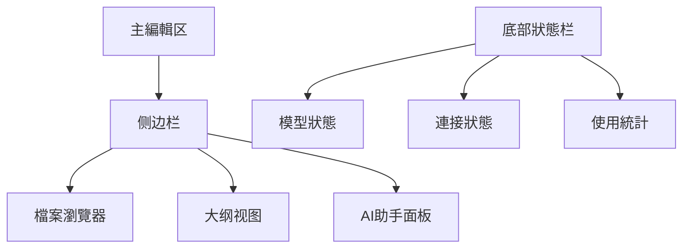

# 指南

# 配置

## 📖 概述

# 管理

## 🛠️ 環境准备

### 📋 前置要求
- ✅ **Obsidian安裝**：已安裝Obsidian 1.0.0+
# 配置
# 配置

# 配置
# 版本
|------|----------|------|
| **Obsidian** | 1.0.0+ | 主應用程式 |
| **AI外掛** | 最新版 | AI整合 |
| **API密钥** | 有效 | 雲端服务 |

# 配置

### 📦 核心AI外掛

#### 1. Text Generator
**功能**：强大的文本生成和AI助手
```bash
# 安裝步骤
1. 打開Obsidian設置
2. 进入"第三方外掛"
3. 關閉"安全模式"
4. 瀏覽社區外掛
5. 搜尋"Text Generator"
6. 点击安裝并启用
```

# 配置
```json
{
  "api_key": "your-api-key",
  "model": "gpt-oss:120b-cloud",
  "max_tokens": 2000,
  "temperature": 0.7,
  "endpoint": "https://api.gpt-oss.com/v1"
}
```

#### 2. Copilot
**功能**：智能代碼和文本补全
```bash
# 配置
- 支持多种AI模型
- 实时智能补全
- 上下文理解
- 自定义快捷键
```

#### 3. Smart Connections
# 知識
```bash
# 核心特性
- 自動建立筆記連接
- 智能內容推荐
- 语义搜尋
# 知識
```

# 配置

# 配置
```yaml
# 配置
api:
  provider: "openai-compatible"  # 相容OpenAI格式
  base_url: "https://api.gpt-oss.com/v1"
  api_key: "sk-your-api-key-here"
  model: "gpt-oss:120b-cloud"
  
# 生成参数
generation:
  max_tokens: 2000
  temperature: 0.7
  top_p: 0.9
  frequency_penalty: 0.0
  presence_penalty: 0.0
  
# 界面設置
ui:
  show_model_selector: true
  show_temperature_slider: true
  auto_generate_title: true
  confirm_before_generate: false
```

# 配置
```yaml
# 配置
api:
  provider: "ollama"
  base_url: "http://localhost:11434"
  model: "llama2:7b"
  
# 本地模型参数
generation:
  max_tokens: 1500
  temperature: 0.5
  top_p: 0.8
```

## 🎨 界面定制

### 📋 工作区布局

#### 推荐布局方案


# 配置
```css
/* AI面板樣式 */
.ai-panel {
  width: 300px;
  background: var(--background-secondary);
  border-right: 1px solid var(--background-modifier-border);
}

.ai-chat {
  height: 400px;
  overflow-y: auto;
  padding: 12px;
}

.ai-input {
  padding: 8px;
  border: 1px solid var(--background-modifier-border);
  border-radius: 4px;
}
```

### 🎯 快捷键設置

#### AI相關快捷键
| 快捷键 | 功能 | 說明 |
|--------|------|------|
| `Ctrl+Shift+A` | 打開AI助手 | 快速访问AI功能 |
| `Ctrl+Shift+G` | 生成文本 | 智能文本生成 |
| `Ctrl+Shift+C` | 智能补全 | 上下文补全 |
| `Ctrl+Shift+S` | 语义搜尋 | 智能內容搜尋 |
| `Ctrl+Shift+L` | 建立連接 | 智能筆記連接 |

# 配置

# 配置

#### GPT-oss:120b-cloud設置
```json
{
  "model_config": {
    "name": "gpt-oss:120b-cloud",
    "provider": "gpt-oss",
    "api_base": "https://api.gpt-oss.com/v1",
    "api_key": "your-api-key",
    "context_length": 4096,
    "capabilities": [
      "text-generation",
      "code-generation",
      "translation",
      "summarization"
    ]
  },
  "usage_limits": {
    "requests_per_minute": 60,
    "tokens_per_minute": 90000,
    "monthly_quota": 1000000
  }
}
```

# 管理
```bash
# 安全儲存API密钥
export GPT_OSS_API_KEY="sk-your-secure-key"
# 在Obsidian中使用環境变量
api_key: "${GPT_OSS_API_KEY}"
```

# 配置

#### Ollama整合設置
```yaml
# 配置
ollama:
  host: "localhost"
  port: 11434
  models:
    - name: "llama2:7b"
      size: "7B"
      context_length: 4096
    - name: "codellama:7b"
      size: "7B"
      context_length: 4096
    - name: "mistral:7b"
      size: "7B"
      context_length: 8192
```

#### 模型切換策略
```javascript
// 智能模型選擇逻辑
function selectModel(taskType, complexity) {
  if (taskType === 'code' && complexity === 'high') {
    return 'gpt-oss:120b-cloud';  // 复杂任務用雲端
  } else if (taskType === 'note' && complexity === 'low') {
    return 'llama2:7b';  // 简单任務用本地
  } else {
    return 'mistral:7b';  // 默认本地模型
  }
}
```

## 📝 智能筆記創建

# 配置

#### AI增强筆記模板
```markdown
---
title: {{title}}
created: {{date}}
tags: {{tags}}
ai_model: {{model}}
ai_generated: true
---

# {{title}}

## 🤖 AI生成內容

### 📋 概述
{{ai_generated_overview}}

### 🔍 關鍵要點
{{ai_generated_keypoints}}

### 📚 相關資源
{{ai_generated_resources}}

## 📝 人工补充

### 💭 个人思考
{{personal_thoughts}}

### 🔗 实际應用程式
{{practical_applications}}

### 📊 數據驗證
{{data_validation}}
```

# 工作流
```yaml
# 配置
workflows:
  auto_tag:
    enabled: true
    ai_suggested_tags: true
  auto_link:
    enabled: true
    similarity_threshold: 0.8
  auto_summarize:
    enabled: true
    max_length: 200
```

### 🧠 智能內容生成

#### 文本生成提示词模板
```prompt
# 管理

主題：{topic}
# 分析
深度：{depth}（基礎/詳細/专业）
风格：{style}（正式/轻松/技術）

要求：
1. 结构清晰，层次分明
2. 內容准确，有据可查
3. 语言流畅，易于理解
4. 包含实际應用程式案例

请生成符合要求的內容。
```

# 配置
```javascript
// 代碼生成設置
const codeGenerationConfig = {
  language: "python",
  style: "pep8",
  include_comments: true,
  include_tests: false,
  max_lines: 100,
  context_window: 2000
};
```

# 知識

### 🕸️ 自動連結建立

# 配置
```yaml
# 智能連接設置
smart_connections:
  auto_link:
    enabled: true
    threshold: 0.7
    max_links_per_note: 10
  
  semantic_search:
    enabled: true
    embedding_model: "text-embedding-ada-002"
    search_depth: 3
  
  knowledge_graph:
    enabled: true
    update_frequency: "daily"
    visualization: "force-directed"
```

#### 連結品質評估
```python
# 連結品質评分算法
def calculate_link_quality(note1, note2, similarity):
    factors = {
        'content_similarity': similarity * 0.4,
        'tag_overlap': calculate_tag_overlap(note1, note2) * 0.3,
        'temporal_proximity': calculate_temporal_proximity(note1, note2) * 0.2,
        'user_feedback': get_user_feedback(note1, note2) * 0.1
    }
    return sum(factors.values())
```

# 知識

# 配置
```json
{
  "graph_settings": {
    "layout": "force",
    "node_size": "degree",
    "edge_width": "similarity",
    "color_scheme": "category",
    "interactive": true,
    "3d_mode": false
  },
  "node_categories": {
    "concept": "#3498db",
    "person": "#e74c3c",
    "event": "#f39c12",
    "document": "#2ecc71"
  }
}
```

## 🔍 智能搜尋与檢索

# 配置

#### 搜尋引擎設置
```yaml
# 配置
semantic_search:
  enabled: true
  embedding_model: "text-embedding-3-small"
  vector_database: "chroma"
  search_algorithm: "cosine_similarity"
  results_limit: 20
  
# 搜尋優化
search_optimization:
  query_expansion: true
  synonym_matching: true
  context_weighting: 0.3
  recency_boost: 0.2
```

# 排序
```javascript
# 排序
function rankSearchResults(results, query) {
  return results.sort((a, b) => {
    const scoreA = calculateRelevanceScore(a, query);
    const scoreB = calculateRelevanceScore(b, query);
    return scoreB - scoreA;
  });
}

function calculateRelevanceScore(result, query) {
  return (
    result.semantic_similarity * 0.4 +
    result.text_match * 0.3 +
    result.tag_match * 0.2 +
    result.recency_score * 0.1
  );
}
```

## 📈 使用統計与優化

# 分析

# 配置
```yaml
# 使用統計設置
usage_analytics:
  enabled: true
  track_metrics:
    - "ai_requests_count"
    - "tokens_used"
    - "response_time"
    - "user_satisfaction"
  
  reporting:
    frequency: "weekly"
    format: "dashboard"
    export_options: ["csv", "json"]
```

#### 效能監控
```javascript
// 效能監控腳本
const performanceMonitor = {
  trackRequest: (startTime, endTime, tokens) => {
    const duration = endTime - startTime;
    const tokensPerSecond = tokens / (duration / 1000);
    
    return {
      duration,
      tokensPerSecond,
      cost: calculateCost(tokens)
    };
  },
  
  optimizeSettings: (metrics) => {
    if (metrics.averageResponseTime > 2000) {
      // 建議切換到更快的模型
      return suggestModelUpgrade();
    }
  }
};
```

### 🎯 个性化優化

# 配置
```json
{
  "user_preferences": {
    "writing_style": "professional",
    "content_depth": "detailed",
    "language": "chinese",
    "technical_level": "intermediate",
    "preferred_models": {
      "note_taking": "mistral:7b",
      "code_generation": "codellama:7b",
      "research": "gpt-oss:120b-cloud"
    }
  }
}
```

## 🔒 安全与隱私

### 🛡️ 數據保護設置

# 配置
```yaml
# 隱私保護設置
privacy:
  data_encryption: true
  local_processing: true
  cloud_backup: false
  audit_logging: true
  
# 敏感內容过滤
content_filtering:
  enabled: true
  blocked_categories: ["personal", "financial", "medical"]
  custom_rules: ["no_personal_identifiers"]
```

#### API密钥安全
```bash
# 配置
export OBSIDIAN_AI_API_KEY="your-secure-key"
export OLLAMA_HOST="localhost:11434"

# 配置
api_key: "$OBSIDIAN_AI_API_KEY"
ollama_host: "$OLLAMA_HOST"
```

## 🚀 高级功能

### 🤖 自定义AI助手

#### 助手角色定义
```json
{
  "ai_assistants": {
    "research_assistant": {
      "role": "学术研究助手",
# 分析
      "personality": "严谨、专业、耐心",
      "model": "gpt-oss:120b-cloud"
    },
    "coding_assistant": {
      "role": "編程助手",
      "expertise": ["代碼生成", "除錯", "優化"],
      "personality": "高效、准确、友好",
      "model": "codellama:7b"
    },
    "creative_assistant": {
      "role": "创意助手",
      "expertise": ["內容创作", "头脑风暴", "文案写作"],
      "personality": "创意、灵活、启发",
      "model": "mistral:7b"
    }
  }
}
```

# 工作流

# 工作流
```yaml
# 工作流
automated_workflows:
  daily_review:
    trigger: "daily 09:00"
    actions:
      - "summarize_yesterday_notes"
      - "suggest_today_topics"
      - "update_knowledge_graph"
  
  weekly_organization:
    trigger: "weekly monday 10:00"
    actions:
      - "identify_orphaned_notes"
      - "suggest_merging_opportunities"
      - "update_tag_taxonomy"
  
  monthly_optimization:
    trigger: "monthly 1st 10:00"
    actions:
      - "analyze_usage_patterns"
      - "suggest_model_optimizations"
      - "generate_performance_report"
```

## 📋 故障排除

### 🔧 常见問題解決

#### 連接問題
```bash
# 檢查API連接
curl -X GET "https://api.gpt-oss.com/v1/models" \
  -H "Authorization: Bearer $API_KEY"

# 檢查Ollama狀態
curl http://localhost:11434/api/tags
```

#### 效能問題
```javascript
// 效能優化建議
const optimizationTips = {
  slow_response: "考虑使用更快的本地模型",
  high_cost: "增加本地模型使用比例",
  poor_quality: "调整temperature和top_p参数",
  connection_error: "檢查網路和API密钥"
};
```

## 📚 擴展資源

### 📖 推荐阅读
- **Obsidian AI外掛官方文檔**
# 指南
# 配置
- **Ollama最佳實踐**

# 教程
# 教程
# 工作流
- **效能優化技巧**

### 💬 社區支持
- **Obsidian Discord社區**
- **AI外掛使用者群**
- **技術支持論壇**

---

# 配置

# 配置
# 更新
- [ ] AI外掛安裝并启用
# 配置
- [ ] 基礎設置完成并驗證

# 配置
# 工作流
- [ ] 智能連接設置
- [ ] 效能監控启用
- [ ] 安全隱私設置

# 配置
# 分析
- [ ] 个性化偏好設置
# 配置
- [ ] 備份和恢復設置

---

## 🎉 下一步

# 配置

1. **📝 創建第一个AI辅助筆記**
# 知識
3. **🔍 使用语义搜尋功能**
4. **📊 監控使用情况和效能**

> 💡 **提示**：建議先从基礎功能開始使用，逐步启用高级功能，以确保系統的稳定性和可靠性。

---

# 更新