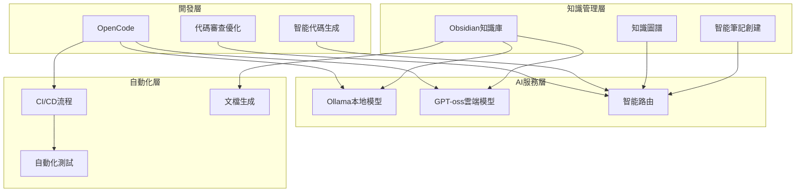

# 🔄 工作流整合指南

> 🎯 **章節目標**：整合所有組件打造完整AI增強工作流程 | ⏱️ **預計時間**：120分鐘 | 📊 **難度等級**：⭐⭐⭐⭐

## 📖 概述

本指南將詳細介紹如何將Obsidian、OpenCode、Ollama、GPT-oss:120b-cloud整合成一個完整的AI增強工作流程，實現知識管理、代碼開發、AI推理的無縫協作。

## 🏗️ 工作流程架構

### 🔄 整體流程圖


### 🎯 使用場景
| 場景 | 主要工具 | AI模型 | 預期收益 |
|------|----------|---------|----------|
| **知識管理** | Obsidian | 混合模型 | 效率提升50%+ |
| **代碼開發** | OpenCode | CodeLLaMA/GPT-oss | 開發時間減少40%+ |
| **技術文檔** | Obsidian+OpenCode | GPT-oss | 文檔質量提升60%+ |
| **學習研究** | Obsidian | Mistral/GPT-oss | 學習效率提升45%+ |

## 📝 知識管理工作流

### 🧠 智能筆記創建

#### 工作流程設計
```yaml
knowledge_management:
  # 筆記創建流程
  note_creation:
    trigger: "manual"
    steps:
      - name: "主題確定"
        ai_assistant: true
        model: "mistral:7b"
        prompt_template: "根據{topic}生成筆記大綱"
      
      - name: "內容生成"
        ai_assistant: true
        model: "gpt-oss:120b-cloud"
        context_sources:
          - "obsidian_vault"
          - "external_docs"
        prompt_template: "詳細闡述{outline}的內容"
      
      - name: "標籤推薦"
        ai_assistant: true
        model: "llama2:7b"
        prompt_template: "為筆記{title}推薦3-5個相關標籤"
      
      - name: "鏈接建立"
        ai_assistant: true
        model: "mistral:7b"
        similarity_threshold: 0.8
  
  # 知識組織流程
  knowledge_organization:
    trigger: "daily"
    steps:
      - name: "識別孤兒筆記"
        ai_assistant: true
        model: "mistral:7b"
      
      - name: "建議合併"
        ai_assistant: true
        model: "gpt-oss:120b-cloud"
        merge_threshold: 0.9
      
      - name: "更新知識圖譜"
        ai_assistant: true
        model: "local"
        update_frequency: "daily"
```

#### 實現腳本
```python
# knowledge_workflow.py
import json
import requests
from datetime import datetime
from pathlib import Path

class KnowledgeWorkflow:
    def __init__(self, obsidian_path, ai_config):
        self.obsidian_path = Path(obsidian_path)
        self.ai_config = ai_config
    
    def create_smart_note(self, topic, complexity="medium"):
        """創建智能筆記"""
        # 1. 生成大綱
        outline = self._generate_outline(topic, complexity)
        
        # 2. 生成內容
        content = self._generate_content(topic, outline, complexity)
        
        # 3. 推薦標籤
        tags = self._recommend_tags(topic, content)
        
        # 4. 建立鏈接
        links = self._establish_links(topic, content)
        
        # 5. 保存筆記
        note = self._format_note(topic, outline, content, tags, links)
        self._save_note(note)
        
        return note
    
    def _generate_outline(self, topic, complexity):
        """生成筆記大綱"""
        model = self._select_model("outline_generation", complexity)
        
        prompt = f"""
你是一個專業的知識管理助手。請為主題"{topic}"生成結構化的筆記大綱。

要求：
1. 結構清晰，層次分明
2. 邏輯完整，涵蓋全面
3. 重點突出，便於理解
4. 包含實際應用

請以Markdown格式輸出大綱。
"""
        
        response = self._call_ai(model, prompt)
        return response
    
    def _generate_content(self, topic, outline, complexity):
        """生成筆記內容"""
        model = self._select_model("content_generation", complexity)
        
        prompt = f"""
請基於以下大綱，為主題"{topic}"生成詳細內容：

大綱：
{outline}

要求：
1. 內容準確，有據可查
2. 語言流暢，易於理解
3. 包含實際案例和應用
4. 適當使用代碼示例（如適用）
"""
        
        response = self._call_ai(model, prompt)
        return response
    
    def _recommend_tags(self, topic, content):
        """推薦標籤"""
        model = "llama2:7b"
        
        prompt = f"""
基於以下筆記內容，推薦3-5個相關標籤：

主題：{topic}
內容摘要：{content[:500]}...

要求：
1. 標籤應該簡潔明確
2. 標籤應該與內容高度相關
3. 標籤應該便於搜索和分類
4. 用英文逗號分隔輸出
"""
        
        response = self._call_ai(model, prompt)
        return [tag.strip() for tag in response.split(',')]
    
    def _establish_links(self, topic, content):
        """建立筆記鏈接"""
        # 搜索相似筆記
        similar_notes = self._search_similar_notes(topic, content)
        
        # AI評估鏈接質量
        model = "mistral:7b"
        links = []
        
        for note in similar_notes:
            relevance = self._evaluate_link_relevance(topic, content, note)
            if relevance > 0.7:
                links.append({
                    "title": note["title"],
                    "path": note["path"],
                    "relevance": relevance
                })
        
        # 按相關度排序
        links.sort(key=lambda x: x["relevance"], reverse=True)
        return links[:10]
    
    def _format_note(self, topic, outline, content, tags, links):
        """格式化筆記"""
        now = datetime.now().isoformat()
        
        note = f"""---
title: {topic}
created: {now}
tags: {', '.join(tags)}
ai_generated: true
---

# {topic}

## 📋 大綱
{outline}

## 📝 詳細內容
{content}

## 🔗 相關筆記
"""
        
        for link in links:
            note += f"- [[{link['path']}|{link['title']}]]\n"
        
        note += f"""
## 🏷️ 標籤
{', '.join(tags)}
"""
        
        return note
    
    def _save_note(self, note):
        """保存筆記"""
        # 從筆記內容中提取標題
        title = note.split('\n')[3].split(': ')[1]
        
        # 安全的文件名
        safe_title = ''.join(c for c in title if c.isalnum() or c in (' ', '-', '_'))
        filename = f"{safe_title}.md"
        
        # 保存到知識庫
        filepath = self.obsidian_path / filename
        with open(filepath, 'w', encoding='utf-8') as f:
            f.write(note)
        
        print(f"筆記已保存：{filepath}")
        return filepath
    
    def _select_model(self, task_type, complexity):
        """選擇AI模型"""
        models = {
            "outline_generation": {
                "low": "llama2:7b",
                "medium": "mistral:7b",
                "high": "gpt-oss:120b-cloud"
            },
            "content_generation": {
                "low": "llama2:7b",
                "medium": "mistral:7b",
                "high": "gpt-oss:120b-cloud"
            }
        }
        
        return models[task_type][complexity]
    
    def _call_ai(self, model, prompt):
        """調用AI模型"""
        if model.startswith("llama") or model.startswith("mistral") or model.startswith("codellama"):
            return self._call_ollama(model, prompt)
        else:
            return self._call_gpt_oss(model, prompt)
    
    def _call_ollama(self, model, prompt):
        """調用Ollama本地模型"""
        response = requests.post(
            "http://localhost:11434/api/generate",
            json={
                "model": model,
                "prompt": prompt,
                "stream": False
            }
        )
        return response.json()["response"]
    
    def _call_gpt_oss(self, model, prompt):
        """調用GPT-oss雲端模型"""
        headers = {
            "Authorization": f"Bearer {self.ai_config['gpt_oss_api_key']}",
            "Content-Type": "application/json"
        }
        
        response = requests.post(
            f"{self.ai_config['gpt_oss_base_url']}/chat/completions",
            headers=headers,
            json={
                "model": model,
                "messages": [
                    {"role": "system", "content": "你是一個專業的知識管理助手。"},
                    {"role": "user", "content": prompt}
                ],
                "max_tokens": 2000,
                "temperature": 0.7
            }
        )
        
        return response.json()["choices"][0]["message"]["content"]
    
    def _search_similar_notes(self, topic, content):
        """搜索相似筆記"""
        # 簡單實現：搜索本地Obsidian筆記
        similar_notes = []
        
        for note_file in self.obsidian_path.glob("*.md"):
            try:
                with open(note_file, 'r', encoding='utf-8') as f:
                    note_content = f.read()
                
                # 簡單的相似度計算
                similarity = self._calculate_similarity(topic, content, note_content)
                
                if similarity > 0.5:
                    similar_notes.append({
                        "title": note_file.stem,
                        "path": str(note_file.relative_to(self.obsidian_path)),
                        "similarity": similarity
                    })
            except Exception as e:
                print(f"讀取筆記時出錯：{e}")
        
        return similar_notes
    
    def _calculate_similarity(self, topic, content, note_content):
        """計算相似度（簡單實現）"""
        # 實際應用中應該使用更複雜的算法
        topic_words = set(topic.lower().split())
        content_words = set(content.lower().split()[:100])
        note_words = set(note_content.lower().split())
        
        intersection = len(topic_words & note_words) + len(content_words & note_words)
        union = len(topic_words | content_words | note_words)
        
        return intersection / union if union > 0 else 0
    
    def _evaluate_link_relevance(self, topic, content, note):
        """評估鏈接相關度"""
        model = "mistral:7b"
        
        prompt = f"""
請評估以下兩個筆記的相關程度（0-1之間的小數）：

筆記1：
主題：{topic}
內容摘要：{content[:200]}...

筆記2：
主題：{note['title']}
路徑：{note['path']}

請只輸出相關度分數，不要其他內容。
"""
        
        try:
            response = self._call_ai(model, prompt)
            return float(response.strip())
        except:
            return note['similarity']

# 使用示例
if __name__ == "__main__":
    workflow = KnowledgeWorkflow(
        obsidian_path="D:/Knowledge/AI-value",
        ai_config={
            "gpt_oss_api_key": "your-api-key",
            "gpt_oss_base_url": "https://api.gpt-oss.com/v1"
        }
    )
    
    # 創建智能筆記
    note = workflow.create_smart_note(
        topic="機器學習基礎",
        complexity="medium"
    )
    
    print("筆記創建完成！")
```

### 🔍 智能搜索與檢索

#### 語義搜索流程
```yaml
semantic_search:
  # 索引構建
  index_building:
    trigger: "scheduled"
    frequency: "daily"
    steps:
      - name: "文本嵌入"
        ai_model: "text-embedding-3-small"
        chunk_size: 500
        overlap: 50
      
      - name: "向量存儲"
        database: "chroma"
        collection: "obsidian_notes"
      
      - name: "索引優化"
        optimization: "hnsw"
        parameters:
          m: 16
          ef_construction: 200
  
  # 搜索執行
  search_execution:
    trigger: "user_query"
    steps:
      - name: "查詢嵌入"
        ai_model: "text-embedding-3-small"
      
      - name: "相似度檢索"
        method: "cosine_similarity"
        top_k: 10
      
      - name: "結果排序"
        ranking_factors:
          - semantic_similarity: 0.5
          - text_match: 0.3
          - recency: 0.2
      
      - name: "上下文增強"
        context_window: 3
        highlight_matches: true
```

## 💻 代碼開發工作流

### 🤖 智能代碼生成

#### 開發流程設計
```yaml
code_development:
  # 需求分析
  requirement_analysis:
    ai_assistant: true
    model: "gpt-oss-120b-cloud"
    steps:
      - name: "需求理解"
        prompt_template: "分析並理解以下開發需求：{requirement}"
      
      - name: "功能拆分"
        prompt_template: "將需求拆分為具體的功能模塊：{requirements}"
      
      - name: "技術選型"
        prompt_template: "為以下功能推薦合適的技術方案：{functions}"
  
  # 代碼生成
  code_generation:
    ai_assistant: true
    model_routing:
      simple_tasks: "codellama:7b"
      complex_tasks: "gpt-oss:120b-cloud"
    
    steps:
      - name: "架構設計"
        model: "gpt-oss:120b-cloud"
        output_format: "markdown"
      
      - name: "代碼實現"
        model: "codellama:7b"
        language: "python"
        style: "pep8"
      
      - name: "單元測試"
        model: "codellama:7b"
        framework: "pytest"
        coverage_target: 80
  
  # 代碼審查
  code_review:
    ai_assistant: true
    models:
      syntax_check: "codellama:7b"
      security_scan: "gpt-oss:120b-cloud"
      performance_analysis: "mistral:7b"
    
    steps:
      - name: "語法檢查"
        linters: ["flake8", "mypy", "black"]
      
      - name: "安全審查"
        scan_types:
          - "vulnerability"
          - "dependency"
          - "credential"
      
      - name: "性能分析"
        metrics:
          - "time_complexity"
          - "space_complexity"
          - "bottleneck_identification"
```

#### 實現腳本
```python
# code_development_workflow.py
import requests
import json
from pathlib import Path
from typing import Dict, List

class CodeDevelopmentWorkflow:
    def __init__(self, project_path, obsidian_path, ai_config):
        self.project_path = Path(project_path)
        self.obsidian_path = Path(obsidian_path)
        self.ai_config = ai_config
    
    def develop_feature(self, requirement: str, complexity="medium"):
        """開發新功能"""
        # 1. 需求分析
        analysis = self._analyze_requirement(requirement)
        
        # 2. 設計架構
        architecture = self._design_architecture(analysis, complexity)
        
        # 3. 生成代碼
        code = self._generate_code(analysis, architecture, complexity)
        
        # 4. 生成測試
        tests = self._generate_tests(code, architecture)
        
        # 5. 代碼審查
        review = self._review_code(code, tests)
        
        # 6. 生成文檔
        documentation = self._generate_documentation(architecture, code)
        
        # 7. 保存到項目
        self._save_to_project(analysis, architecture, code, tests, documentation)
        
        # 8. 保存知識筆記
        self._create_knowledge_note(requirement, analysis, architecture, code)
        
        return {
            "analysis": analysis,
            "architecture": architecture,
            "code": code,
            "tests": tests,
            "review": review,
            "documentation": documentation
        }
    
    def _analyze_requirement(self, requirement: str) -> Dict:
        """分析需求"""
        model = "gpt-oss:120b-cloud"
        
        prompt = f"""
你是一個專業的軟體架構師。請分析以下開發需求：

需求：{requirement}

請提供以下內容：
1. 需求理解（用簡潔的語言重新描述需求）
2. 功能拆分（將需求拆分為具體的功能模塊）
3. 技術難點（列出實現過程中可能遇到的技術難點）
4. 風險評估（評估潛在的風險和解決方案）
5. 驗收標準（明確功能的驗收標準）

請以結構化的格式輸出。
"""
        
        response = self._call_ai(model, prompt)
        return self._parse_analysis_response(response)
    
    def _design_architecture(self, analysis: Dict, complexity: str) -> Dict:
        """設計架構"""
        model = "gpt-oss:120b-cloud"
        
        prompt = f"""
基於以下需求分析結果，設計軟體架構：

需求分析：
{json.dumps(analysis, ensure_ascii=False, indent=2)}

請設計：
1. 系統架構（包括組件、模塊、數據流）
2. 技術選型（選擇合適的技術棧）
3. 接口設計（定義主要的API接口）
4. 數據庫設計（如果需要）
5. 部署方案（如果適用）

請以結構化的格式輸出，可以包含代碼示例。
"""
        
        response = self._call_ai(model, prompt)
        return self._parse_architecture_response(response)
    
    def _generate_code(self, analysis: Dict, architecture: Dict, complexity: str) -> str:
        """生成代碼"""
        model = self._select_code_model(complexity)
        
        prompt = f"""
基於以下需求和架構設計，生成Python代碼：

需求：
{json.dumps(analysis, ensure_ascii=False, indent=2)}

架構：
{json.dumps(architecture, ensure_ascii=False, indent=2)}

要求：
1. 代碼應該遵循PEP8規範
2. 包含完整的文檔字符串
3. 包含適當的錯誤處理
4. 代碼應該模組化、可重用
5. 包含必要的類型提示

請生成完整、可運行的代碼。
"""
        
        response = self._call_ai(model, prompt)
        return response
    
    def _generate_tests(self, code: str, architecture: Dict) -> str:
        """生成測試"""
        model = "codellama:7b"
        
        prompt = f"""
為以下代碼生成pytest單元測試：

代碼：
{code[:1000]}...

要求：
1. 測試應該覆蓋主要功能路徑
2. 包含正常情況和異常情況的測試
3. 使用pytest框架
4. 包含必要的mock和fixture
5. 代碼應該清晰、易於理解
"""
        
        response = self._call_ai(model, prompt)
        return response
    
    def _review_code(self, code: str, tests: str) -> Dict:
        """代碼審查"""
        models = {
            "syntax": "codellama:7b",
            "security": "gpt-oss:120b-cloud",
            "performance": "mistral:7b"
        }
        
        review_results = {}
        
        # 語法檢查
        syntax_review = self._syntax_check(code)
        review_results["syntax"] = syntax_review
        
        # 安全審查
        security_review = self._security_check(code)
        review_results["security"] = security_review
        
        # 性能分析
        performance_review = self._performance_analysis(code)
        review_results["performance"] = performance_review
        
        return review_results
    
    def _generate_documentation(self, architecture: Dict, code: str) -> str:
        """生成文檔"""
        model = "gpt-oss:120b-cloud"
        
        prompt = f"""
為以下代碼生成技術文檔：

架構設計：
{json.dumps(architecture, ensure_ascii=False, indent=2)}

代碼：
{code[:800]}...

文檔應該包括：
1. 功能描述
2. API接口說明
3. 使用示例
4. 配置說明
5. 故障排除

請以Markdown格式輸出完整的技術文檔。
"""
        
        response = self._call_ai(model, prompt)
        return response
    
    def _save_to_project(self, analysis, architecture, code, tests, documentation):
        """保存到項目"""
        # 創建項目目錄結構
        project_dir = self.project_path / "src"
        project_dir.mkdir(parents=True, exist_ok=True)
        
        # 保存主代碼
        main_file = project_dir / "main.py"
        with open(main_file, 'w', encoding='utf-8') as f:
            f.write(code)
        
        # 保存測試
        tests_file = self.project_path / "tests" / "test_main.py"
        tests_file.parent.mkdir(exist_ok=True)
        with open(tests_file, 'w', encoding='utf-8') as f:
            f.write(tests)
        
        # 保存文檔
        docs_dir = self.project_path / "docs"
        docs_dir.mkdir(exist_ok=True)
        readme_file = docs_dir / "README.md"
        with open(readme_file, 'w', encoding='utf-8') as f:
            f.write(documentation)
        
        print(f"項目文件已保存到：{self.project_path}")
    
    def _create_knowledge_note(self, requirement, analysis, architecture, code):
        """創建知識筆記"""
        model = "gpt-oss:120b-cloud"
        
        prompt = f"""
創建一個知識庫筆記，記錄以下開發經驗：

需求：{requirement}

需求分析：
{json.dumps(analysis, ensure_ascii=False, indent=2)}

架構設計：
{json.dumps(architecture, ensure_ascii=False, indent=2)[:500]}...

請生成一個包含以下內容的筆記：
1. 項目背景
2. 技術方案
3. 實現細節
4. 經驗總結
5. 最佳實踐

請以Obsidian Markdown格式輸出。
"""
        
        note_content = self._call_ai(model, prompt)
        
        # 保存筆記到Obsidian
        safe_title = ''.join(c for c in requirement if c.isalnum() or c in (' ', '-', '_'))
        note_file = self.obsidian_path / f"{safe_title}.md"
        
        with open(note_file, 'w', encoding='utf-8') as f:
            f.write(note_content)
        
        print(f"知識筆記已保存到：{note_file}")
    
    def _select_code_model(self, complexity: str) -> str:
        """選擇代碼生成模型"""
        models = {
            "low": "codellama:7b",
            "medium": "codellama:13b",
            "high": "gpt-oss:120b-cloud"
        }
        return models[complexity]
    
    def _call_ai(self, model: str, prompt: str) -> str:
        """調用AI模型"""
        if model.startswith("llama") or model.startswith("mistral") or model.startswith("codellama"):
            return self._call_ollama(model, prompt)
        else:
            return self._call_gpt_oss(model, prompt)
    
    def _call_ollama(self, model: str, prompt: str) -> str:
        """調用Ollama"""
        response = requests.post(
            "http://localhost:11434/api/generate",
            json={
                "model": model,
                "prompt": prompt,
                "stream": False
            }
        )
        return response.json()["response"]
    
    def _call_gpt_oss(self, model: str, prompt: str) -> str:
        """調用GPT-oss"""
        headers = {
            "Authorization": f"Bearer {self.ai_config['gpt_oss_api_key']}",
            "Content-Type": "application/json"
        }
        
        response = requests.post(
            f"{self.ai_config['gpt_oss_base_url']}/chat/completions",
            headers=headers,
            json={
                "model": model,
                "messages": [
                    {"role": "system", "content": "你是一個專業的軟件開發架構師和工程師。"},
                    {"role": "user", "content": prompt}
                ],
                "max_tokens": 3000,
                "temperature": 0.3
            }
        )
        
        return response.json()["choices"][0]["message"]["content"]
    
    def _parse_analysis_response(self, response: str) -> Dict:
        """解析分析響應"""
        # 簡單實現：實際應用中需要更復雜的解析
        return {
            "requirement": response[:200],
            "analysis": response
        }
    
    def _parse_architecture_response(self, response: str) -> Dict:
        """解析架構響應"""
        return {
            "architecture": response
        }
    
    def _syntax_check(self, code: str) -> Dict:
        """語法檢查"""
        # 調用AI進行語法檢查
        model = "codellama:7b"
        prompt = f"檢查以下Python代碼的語法問題：\n\n{code[:500]}..."
        
        response = self._call_ai(model, prompt)
        return {"suggestions": response}
    
    def _security_check(self, code: str) -> Dict:
        """安全檢查"""
        model = "gpt-oss:120b-cloud"
        prompt = f"分析以下代碼的安全風險：\n\n{code[:500]}..."
        
        response = self._call_ai(model, prompt)
        return {"security_issues": response}
    
    def _performance_analysis(self, code: str) -> Dict:
        """性能分析"""
        model = "mistral:7b"
        prompt = f"分析以下代碼的性能特點：\n\n{code[:500]}..."
        
        response = self._call_ai(model, prompt)
        return {"performance_notes": response}

# 使用示例
if __name__ == "__main__":
    workflow = CodeDevelopmentWorkflow(
        project_path="D:/Projects/my-project",
        obsidian_path="D:/Knowledge/AI-value",
        ai_config={
            "gpt_oss_api_key": "your-api-key",
            "gpt_oss_base_url": "https://api.gpt-oss.com/v1"
        }
    )
    
    # 開發新功能
    result = workflow.develop_feature(
        requirement="開發一個用戶認證系統，支持註冊、登錄、密碼重置功能",
        complexity="medium"
    )
    
    print("功能開發完成！")
    print(f"代碼審查結果：{result['review']}")
```

## 🤝 協作工作流

### 👥 團隊協作流程

#### 多人協作工作流
```yaml
team_collaboration:
  # 知識共享
  knowledge_sharing:
    steps:
      - name: "共享筆記"
        mechanism: "git_sync"
        conflict_resolution: "manual"
        notification: "team_members"
      
      - name: "知識同步"
        frequency: "real_time"
        sync_method: "obsidian_sync"
        backup_strategy: "version_control"
  
  # 代碼協作
  code_collaboration:
    version_control: "git"
    branch_strategy: "feature_branches"
    code_review: "ai_assisted"
    
    steps:
      - name: "功能開發"
        workflow: "code_development"
        
      - name: "代碼審查"
        ai_assistant: true
        reviewers: ["human", "ai"]
        checklist:
          - "code_style"
          - "security"
          - "performance"
          - "test_coverage"
        
      - name: "合併請求"
        ai_assistant: true
        model: "gpt-oss:120b-cloud"
        auto_merge_threshold: "high_confidence"
  
  # 文檔協作
  documentation_collaboration:
    platform: "obsidian"
    review_process: "ai_assisted"
    
    steps:
      - name: "文檔編寫"
        ai_assistant: true
        model: "gpt-oss-120b-cloud"
        template: "tech_documentation"
      
      - name: "內容審查"
        ai_assistant: true
        model: "mistral:7b"
        checklist:
          - "accuracy"
          - "clarity"
          - "completeness"
          - "consistency"
      
      - name: "知識提取"
        ai_assistant: true
        model: "llama2:7b"
        extraction_types:
          - "key_concepts"
          - "best_practices"
          - "lessons_learned"
```

### 🔄 CI/CD集成

#### 自動化流程
```yaml
# .github/workflows/ai_integration.yml
name: AI Integrated Development

on:
  push:
    branches: [main, develop]
  pull_request:
    branches: [main]

jobs:
  ai_code_review:
    runs-on: ubuntu-latest
    steps:
      - name: Checkout code
        uses: actions/checkout@v3
      
      - name: AI Code Review
        run: |
          python scripts/ai_code_review.py
        env:
          GPT_OSS_API_KEY: ${{ secrets.GPT_OSS_API_KEY }}
  
  ai_documentation:
    runs-on: ubuntu-latest
    steps:
      - name: Checkout code
        uses: actions/checkout@v3
      
      - name: Generate Documentation
        run: |
          python scripts/generate_docs.py
        env:
          GPT_OSS_API_KEY: ${{ secrets.GPT_OSS_API_KEY }}
      
      - name: Update Knowledge Base
        run: |
          python scripts/update_obsidian.py
        env:
          OBSIDIAN_VAULT: ${{ secrets.OBSIDIAN_VAULT }}
```

## 📊 效能優化

### ⚡ 性能監控

#### 工作流性能監控
```python
# workflow_monitor.py
import time
import psutil
import requests
from datetime import datetime
from typing import Dict, List

class WorkflowMonitor:
    def __init__(self):
        self.metrics = []
    
    def monitor_workflow(self, workflow_name: str, workflow_func, *args, **kwargs):
        """監控工作流執行"""
        # 記錄開始時間
        start_time = time.time()
        start_memory = psutil.Process().memory_info().rss / 1024 / 1024  # MB
        
        # 記錄CPU使用率
        start_cpu = psutil.cpu_percent()
        
        try:
            # 執行工作流
            result = workflow_func(*args, **kwargs)
            
            # 記錄結束時間
            end_time = time.time()
            end_memory = psutil.Process().memory_info().rss / 1024 / 1024
            end_cpu = psutil.cpu_percent()
            
            # 計算指標
            duration = end_time - start_time
            memory_delta = end_memory - start_memory
            cpu_delta = end_cpu - start_cpu
            
            # 記錄指標
            metric = {
                "workflow_name": workflow_name,
                "start_time": datetime.fromtimestamp(start_time).isoformat(),
                "end_time": datetime.fromtimestamp(end_time).isoformat(),
                "duration": duration,
                "start_memory": start_memory,
                "end_memory": end_memory,
                "memory_delta": memory_delta,
                "start_cpu": start_cpu,
                "end_cpu": end_cpu,
                "cpu_delta": cpu_delta,
                "status": "success"
            }
            
            self.metrics.append(metric)
            
            return {
                "result": result,
                "metric": metric
            }
        
        except Exception as e:
            # 記錄錯誤
            end_time = time.time()
            
            metric = {
                "workflow_name": workflow_name,
                "start_time": datetime.fromtimestamp(start_time).isoformat(),
                "end_time": datetime.fromtimestamp(end_time).isoformat(),
                "duration": end_time - start_time,
                "error": str(e),
                "status": "failed"
            }
            
            self.metrics.append(metric)
            
            return {
                "error": e,
                "metric": metric
            }
    
    def get_performance_report(self) -> Dict:
        """獲取性能報告"""
        if not self.metrics:
            return {"message": "No metrics available"}
        
        successful_metrics = [m for m in self.metrics if m["status"] == "success"]
        failed_metrics = [m for m in self.metrics if m["status"] == "failed"]
        
        # 計算統計數據
        total_duration = sum(m["duration"] for m in successful_metrics)
        avg_duration = total_duration / len(successful_metrics) if successful_metrics else 0
        
        max_duration = max(m["duration"] for m in successful_metrics) if successful_metrics else 0
        min_duration = min(m["duration"] for m in successful_metrics) if successful_metrics else 0
        
        total_memory_delta = sum(m["memory_delta"] for m in successful_metrics)
        avg_memory_delta = total_memory_delta / len(successful_metrics) if successful_metrics else 0
        
        success_rate = len(successful_metrics) / len(self.metrics) * 100 if self.metrics else 0
        
        return {
            "total_executions": len(self.metrics),
            "successful_executions": len(successful_metrics),
            "failed_executions": len(failed_metrics),
            "success_rate": success_rate,
            "duration_stats": {
                "total": total_duration,
                "average": avg_duration,
                "max": max_duration,
                "min": min_duration
            },
            "memory_stats": {
                "average_delta": avg_memory_delta
            }
        }
    
    def export_metrics(self, filename: str):
        """導出指標到文件"""
        import json
        
        with open(filename, 'w', encoding='utf-8') as f:
            json.dump(self.metrics, f, indent=2, ensure_ascii=False)
        
        print(f"指標已導出到：{filename}")
```

## ✅ 工作流檢查清單

### 🔧 基礎配置
- [ ] 所有組件安裝並驗證
- [ ] API密鑰配置完成
- [ ] 基礎工作流測試通過
- [ ] 整合功能驗證正常

### 🎯 核心工作流
- [ ] 知識管理工作流配置完成
- [ ] 代碼開發工作流配置完成
- [ ] 協作工作流配置完成
- [ ] CI/CD集成配置完成

### 🚀 優化配置
- [ ] 性能監控部署完成
- [ ] 成本管理配置完成
- [ ] 自動化規則配置完成
- [ ] 故障排除準備就緒

---

## 🎉 下一步

工作流整合完成後，您可以：

1. **📝 創建第一個智能筆記**：體驗AI增強的知識管理
2. **💻 開發第一個AI輔助項目**：享受智能代碼生成
3. **🤝 設置團隊協作**：與團隊成員高效協作
4. **📊 監控工作流性能**：優化工作流效率

> 💡 **提示**：建議先從簡單的工作流開始，逐步增加複雜度和集成範圍。

---

**📝 創建時間**：2026-01-21 | **🔄 最後更新**：2026-01-21 | **👥 維護者**：AI Integration Team