# 🔧 故障排除與維護指南

> 🎯 **章節目標**：解決集成問題並進行系統維護 | ⏱️ **預計時間**：45分鐘 | 📊 **難度等級**：⭐⭐

## 📖 概述

本指南將詳細介紹Obsidian+OpenCode+Ollama+GPT-oss:120b-cloud集成系統的常見故障解決方案和維護策略，幫助您保持系統穩定運行。

## 🚨 常見問題分類

### 📋 問題類型統計

```mermaid
pie title 問題類型分佈
    "連接問題" : 35
    "性能問題" : 25
    "配置問題" : 20
    "兼容性問題" : 15
    "其他問題" : 5
```


## 🔌 連接問題

### Obsidian連接問題

#### 問題1：AI插件無法連接
```yaml
問題描述:
  症狀: Text Generator插件顯示"連接失敗"
  影響範圍: 無法使用AI功能
  
診斷步驟:
  - 檢查API密鑰是否正確
  - 檢查網絡連接是否正常
  - 檢查API服務是否可用
  - 檢查插件版本是否過舊

解決方案:
  immediate_action: "檢查API密鑰配置"
  secondary_action: "測試網絡連接"
  tertiary_action: "更新插件版本"
```

#### 問題2：雲端API超時
```python
# 診斷腳本
import requests
import time

def diagnose_api_timeout(api_base, api_key):
    """診斷API超時問題"""
    print("開始API超時診斷...")
    
    # 1. 檢查基礎連接
    print("1. 檢查基礎連接...")
    try:
        start_time = time.time()
        response = requests.get(f"{api_base}/models", 
                             headers={"Authorization": f"Bearer {api_key}"},
                             timeout=5)
        elapsed = time.time() - start_time
        
        if response.status_code == 200:
            print(f"   ✅ 基礎連接正常（{elapsed:.2f}秒）")
        else:
            print(f"   ⚠️  API響應異常：{response.status_code}")
    except requests.exceptions.Timeout:
        print("   ❌ 連接超時")
    except Exception as e:
        print(f"   ❌ 連接錯誤：{e}")
    
    # 2. 測試模型調用
    print("2. 測試模型調用...")
    try:
        start_time = time.time()
        response = requests.post(
            f"{api_base}/chat/completions",
            headers={"Authorization": f"Bearer {api_key}"},
            json={
                "model": "gpt-oss:120b-cloud",
                "messages": [{"role": "user", "content": "測試"}],
                "max_tokens": 50
            },
            timeout=10
        )
        elapsed = time.time() - start_time
        
        if response.status_code == 200:
            print(f"   ✅ 模型調用成功（{elapsed:.2f}秒）")
            return True
        else:
            print(f"   ⚠️  API錯誤：{response.status_code}")
            return False
    except requests.exceptions.Timeout:
        print("   ❌  模型調用超時")
        return False
    except Exception as e:
        print(f"   ❌  調用錯誤：{e}")
        return False

# 使用示例
diagnose_api_timeout(
    api_base="https://api.gpt-oss.com/v1",
    api_key="your-api-key-here"
)
```

### Ollama連接問題

#### 問題3：Ollama服務無法啟動
```bash
# Ollama服務診斷腳本
#!/bin/bash

echo "🔍 Ollama服務診斷開始..."

# 1. 檢查進程
echo "1. 檢查Ollama進程..."
if pgrep -x "ollama" > /dev/null; then
    echo "   ✅ Ollama進程正在運行"
    PID=$(pgrep -x "ollama")
    echo "   進程ID: $PID"
else
    echo "   ❌ Ollama進程未運行"
    echo "   嘗試啟動Ollama服務..."
    ollama serve &
    sleep 5
fi

# 2. 檢查端口佔用
echo "2. 檢查11434端口..."
if netstat -tuln 2>/dev/null | grep -q ":11434 "; then
    echo "   ✅ 端口11434已開放"
else
    echo "   ❌ 端口11434未開放"
    echo "   嘗試啟動Ollama服務..."
    ollama serve &
    sleep 10
fi

# 3. 測試API連接
echo "3. 測試API連接..."
if curl -s http://localhost:11434/api/version > /dev/null; then
    echo "   ✅ API連接正常"
    curl -s http://localhost:11434/api/version
else
    echo "   ❌ API連接失敗"
fi

# 4. 檢查已下載模型
echo "4. 檢查已下載模型..."
ollama list

# 5. 檢查磁碟空間
echo "5. 檢查磁碟空間..."
df -h ~/.ollama | tail -1

echo "🔍 診斷完成"
```

#### 問題4：模型下載失敗
```python
# 模型下載診斷腳本
import requests
import subprocess
import os

class OllamaModelDownloader:
    def __init__(self):
        self.ollama_host = "localhost:11434"
    
    def check_connection(self):
        """檢查Ollama連接"""
        try:
            response = requests.get(f"http://{self.ollama_host}/api/version")
            if response.status_code == 200:
                print("✅ Ollama服務連接正常")
                return True
            else:
                print(f"⚠️  Ollama服務異常：{response.status_code}")
                return False
        except Exception as e:
            print(f"❌ 連接失敗：{e}")
            return False
    
    def check_disk_space(self):
        """檢查磁碟空間"""
        try:
            import shutil
            total, used, free = shutil.disk_usage("/")
            
            free_gb = free / (1024**3)
            
            if free_gb < 10:
                print(f"⚠️  磁碟空間不足：剩餘{free_gb:.1f}GB")
                return False
            else:
                print(f"✅ 磁碟空間充足：剩餘{free_gb:.1f}GB")
                return True
        except Exception as e:
            print(f"❌  磁碟檢查失敗：{e}")
            return False
    
    def download_model(self, model_name):
        """下載模型"""
        if not self.check_connection():
            print("請先啟動Ollama服務")
            return False
        
        if not self.check_disk_space():
            print("請釋放磁碟空間")
            return False
        
        print(f"開始下載模型：{model_name}")
        
        try:
            result = subprocess.run(
                ["ollama", "pull", model_name],
                capture_output=True,
                text=True,
                timeout=1800  # 30分鐘超時
            )
            
            if result.returncode == 0:
                print(f"✅ 模型下載成功：{model_name}")
                return True
            else:
                print(f"❌ 模型下載失敗：{result.stderr}")
                return False
        except subprocess.TimeoutExpired:
            print("❌ 下載超時")
            return False
        except Exception as e:
            print(f"❌ 下載失敗：{e}")
            return False
    
    def list_models(self):
        """列出已下載模型"""
        try:
            result = subprocess.run(
                ["ollama", "list"],
                capture_output=True,
                text=True
            )
            
            if result.returncode == 0:
                print("已下載模型：")
                print(result.stdout)
            else:
                print(f"列出模型失敗：{result.stderr}")
        except Exception as e:
            print(f"錯誤：{e}")

# 使用示例
downloader = OllamaModelDownloader()

# 診斷Ollama服務
downloader.check_connection()

# 下載模型
downloader.download_model("llama2:7b")

# 列出模型
downloader.list_models()
```

## ⚡ 性能問題

### OpenCode性能優化

#### 問題5：代碼生成速度慢
```python
# 性能優化腳本
import time
import psutil
from typing import Dict, Any

class PerformanceOptimizer:
    def __init__(self):
        self.metrics = []
    
    def analyze_performance(self) -> Dict[str, Any]:
        """分析系統性能"""
        cpu_percent = psutil.cpu_percent(interval=1)
        memory = psutil.virtual_memory()
        disk = psutil.disk_usage('/')
        
        performance = {
            "cpu": {
                "usage": cpu_percent,
                "load": psutil.getloadavg()
            },
            "memory": {
                "total": memory.total,
                "available": memory.available,
                "percent": memory.percent
            },
            "disk": {
                "total": disk.total,
                "used": disk.used,
                "free": disk.free,
                "percent": disk.percent
            }
        }
        
        self._generate_recommendations(performance)
        return performance
    
    def _generate_recommendations(self, performance: Dict[str, Any]):
        """生成優化建議"""
        recommendations = []
        
        # CPU優化建議
        if performance["cpu"]["usage"] > 80:
            recommendations.append({
                "type": "cpu",
                "severity": "high",
                "message": "CPU使用率過高",
                "actions": [
                    "減少並發任務數量",
                    "使用更高效的模型",
                    "優化算法複雜度"
                ]
            })
        
        # 內存優化建議
        if performance["memory"]["percent"] > 80:
            recommendations.append({
                "type": "memory",
                "severity": "high",
                "message": "內存使用率過高",
                "actions": [
                    "使用更小的模型",
                    "減少上下文長度",
                    "清理未使用的模型",
                    "增加交換空間"
                ]
            })
        
        # 磁碟優化建議
        if performance["disk"]["percent"] > 80:
            recommendations.append({
                "type": "disk",
                "severity": "medium",
                "message": "磁碟空間不足",
                "actions": [
                    "清理緩存文件",
                    "刪除不需要的模型",
                    "增加存儲空間"
                ]
            })
        
        if recommendations:
            print("⚠️  性能優化建議：")
            for i, rec in enumerate(recommendations, 1):
                print(f"{i}. {rec['message']}")
                for action in rec['actions']:
                    print(f"   - {action}")
        else:
            print("✅ 系統性能良好，無需優化")

# 使用示例
optimizer = PerformanceOptimizer()
performance = optimizer.analyze_performance()
```

### API調用優化

#### 問題6：API調用頻率限制
```python
# API調用優化管理器
import time
import requests
from datetime import datetime, timedelta
from collections import defaultdict, deque
from threading import Lock

class RateLimitManager:
    def __init__(self, max_requests_per_minute=60):
        self.max_requests = max_requests_per_minute
        self.request_times = defaultdict(deque)
        self.lock = Lock()
    
    def make_request(self, api_url, api_key, payload):
        """帶速率限制的API請求"""
        with self.lock:
            # 清理舊請求記錄
            self._cleanup_old_requests(api_key)
            
            # 檢查是否超過限制
            if len(self.request_times[api_key]) >= self.max_requests:
                # 等待到最舊請求超過1分鐘
                oldest_request = self.request_times[api_key][0]
                wait_time = (oldest_request + timedelta(minutes=1)) - datetime.now()
                
                if wait_time.total_seconds() > 0:
                    print(f"達到速率限制，等待{wait_time.total_seconds():.1f}秒...")
                    time.sleep(wait_time.total_seconds() + 1)
            
            # 記錄請求時間
            self.request_times[api_key].append(datetime.now())
        
        # 發送請求
        try:
            response = requests.post(
                api_url,
                headers={
                    "Authorization": f"Bearer {api_key}",
                    "Content-Type": "application/json"
                },
                json=payload,
                timeout=30
            )
            
            return response
        except Exception as e:
            print(f"請求失敗：{e}")
            raise
    
    def _cleanup_old_requests(self, api_key):
        """清理舊請求記錄"""
        if api_key in self.request_times:
            cutoff_time = datetime.now() - timedelta(minutes=1)
            while self.request_times[api_key] and \
                  self.request_times[api_key][0] < cutoff_time:
                self.request_times[api_key].popleft()
    
    def get_remaining_requests(self, api_key):
        """獲取剩餘請求次數"""
        with self.lock:
            self._cleanup_old_requests(api_key)
            return self.max_requests - len(self.request_times.get(api_key, []))

# 使用示例
rate_limiter = RateLimitManager(max_requests_per_minute=60)

# 檢查剩餘請求次數
remaining = rate_limiter.get_remaining_requests("your-api-key")
print(f"剩餘請求次數：{remaining}")

# 執行請求（自動處理速率限制）
response = rate_limiter.make_request(
    api_url="https://api.gpt-oss.com/v1/chat/completions",
    api_key="your-api-key",
    payload={
        "model": "gpt-oss:120b-cloud",
        "messages": [{"role": "user", "content": "測試"}],
        "max_tokens": 50
    }
)
```

## 📋 配置問題

### 配置文件問題

#### 問題7：配置文件語法錯誤
```yaml
# 配置文件驗證腳本
import yaml
import json
from pathlib import Path
from typing import Dict, Any

class ConfigValidator:
    def __init__(self):
        self.schema = self._load_schema()
    
    def _load_schema(self) -> Dict[str, Any]:
        """加載配置架構"""
        return {
            "version": {"type": str, "required": True},
            "api": {
                "type": dict,
                "required": True,
                "properties": {
                    "base_url": {"type": str, "required": True},
                    "api_key": {"type": str, "required": True},
                    "model": {"type": str, "required": True}
                }
            },
            "models": {
                "type": dict,
                "required": True,
                "properties": {
                    "primary": {"type": str, "required": True},
                    "fallback": {"type": str, "required": True}
                }
            }
        }
    
    def validate_config(self, config_path: str) -> Dict[str, Any]:
        """驗證配置文件"""
        print(f"驗證配置文件：{config_path}")
        
        # 1. 檢查文件是否存在
        if not Path(config_path).exists():
            print(f"❌ 配置文件不存在：{config_path}")
            return {"valid": False, "errors": ["文件不存在"]}
        
        # 2. 讀取配置文件
        try:
            with open(config_path, 'r', encoding='utf-8') as f:
                config = yaml.safe_load(f)
        except yaml.YAMLError as e:
            print(f"❌ YAML語法錯誤：{e}")
            return {"valid": False, "errors": [f"YAML語法錯誤：{e}"]}
        except Exception as e:
            print(f"❌ 讀取配置文件失敗：{e}")
            return {"valid": False, "errors": [f"讀取錯誤：{e}"]}
        
        # 3. 驗證必填字段
        errors = []
        warnings = []
        
        # 驗證版本
        if "version" not in config:
            errors.append("缺少必填字段：version")
        elif not isinstance(config["version"], str):
            errors.append("version字段類型錯誤，應為字符串")
        
        # 驗證API配置
        if "api" not in config:
            errors.append("缺少必填字段：api")
        else:
            api_config = config["api"]
            required_api_fields = ["base_url", "api_key", "model"]
            for field in required_api_fields:
                if field not in api_config:
                    errors.append(f"缺少必填字段：api.{field}")
        
        # 驗證模型配置
        if "models" not in config:
            errors.append("缺少必填字段：models")
        else:
            models_config = config["models"]
            required_model_fields = ["primary", "fallback"]
            for field in required_model_fields:
                if field not in models_config:
                    errors.append(f"缺少必填字段：models.{field}")
            
            # 檢查模型是否存在
            primary_model = models_config.get("primary", "")
            if primary_model:
                self._check_model_exists(primary_model)
        
        # 生成驗證結果
        if errors:
            print("❌ 配置驗證失敗")
            for error in errors:
                print(f"   - {error}")
            return {"valid": False, "errors": errors, "warnings": warnings}
        elif warnings:
            print("⚠️  配置驗證通過，但有警告")
            for warning in warnings:
                print(f"   - {warning}")
            return {"valid": True, "errors": [], "warnings": warnings}
        else:
            print("✅ 配置驗證通過")
            return {"valid": True, "errors": [], "warnings": []}
    
    def _check_model_exists(self, model_name: str):
        """檢查模型是否存在"""
        try:
            if model_name.startswith("gpt-oss") or model_name.startswith("openai"):
                # 雲端模型，假設存在
                pass
            else:
                # 本地模型，檢查Ollama
                import subprocess
                result = subprocess.run(
                    ["ollama", "list"],
                    capture_output=True,
                    text=True
                )
                if model_name not in result.stdout:
                    print(f"⚠️  警告：本地模型可能不存在：{model_name}")
        except Exception as e:
            print(f"⚠️  檢查模型失敗：{e}")

# 使用示例
validator = ConfigValidator()

# 驗證配置文件
result = validator.validate_config("~/.config/gpt-oss/config.yaml")
print(f"驗證結果：{result['valid']}")

if not result['valid']:
    print("\n請修正配置文件後重新驗證")
```

## 🔧 維護腳本

### 自動化維護

#### 系統健康檢查
```bash
#!/bin/bash
# health_check.sh - 系統健康檢查腳本

echo "🏥 系統健康檢查開始..."

# 1. 檢查Ollama服務
echo "1. 檢查Ollama服務..."
if pgrep -x "ollama" > /dev/null; then
    echo "   ✅ Ollama服務運行正常"
else
    echo "   ❌ Ollama服務未運行"
    echo "   嘗試啟動服務..."
    ollama serve &
    sleep 10
fi

# 2. 檢查磁碟空間
echo "2. 檢查磁碟空間..."
DISK_USAGE=$(df -h ~/.ollama | tail -1 | awk '{print $5}' | sed 's/%//')
if [ $DISK_USAGE -gt 80 ]; then
    echo "   ⚠️  磁碟使用率過高：${DISK_USAGE}%"
    echo "   建議清理緩存文件"
else
    echo "   ✅ 磁碟空間充足：${DISK_USAGE}%"
fi

# 3. 檢查內存使用
echo "3. 檢查內存使用..."
MEMORY_USAGE=$(free | grep Mem | awk '{printf "%.0f", $3/$2 * 100.0}')
if [ $MEMORY_USAGE -gt 80 ]; then
    echo "   ⚠️  內存使用率過高：${MEMORY_USAGE}%"
    echo "   建議重啟Ollama服務"
else
    echo "   ✅ 內存使用正常：${MEMORY_USAGE}%"
fi

# 4. 檢查模型完整性
echo "4. 檢查模型完整性..."
OLLAMA_LIST=$(ollama list)
if [ -z "$OLLAMA_LIST" ]; then
    echo "   ⚠️  未找到模型"
else
    echo "   ✅ 已找到以下模型："
    echo "$OLLAMA_LIST"
fi

# 5. 檢查API連接
echo "5. 檢查API連接..."
if curl -s http://localhost:11434/api/version > /dev/null; then
    echo "   ✅ API連接正常"
else
    echo "   ❌ API連接失敗"
fi

# 6. 清理臨時文件
echo "6. 清理臨時文件..."
find ~/.ollama/logs -name "*.log" -mtime +7 -delete
echo "   ✅ 臨時文件已清理"

echo "🏥 系統健康檢查完成"
```

### 備份恢復腳本

#### 配置備份
```python
# backup_system.py
import json
import yaml
import shutil
from datetime import datetime
from pathlib import Path
import tarfile

class BackupManager:
    def __init__(self, backup_dir: str):
        self.backup_dir = Path(backup_dir)
        self.backup_dir.mkdir(parents=True, exist_ok=True)
    
    def backup_configurations(self) -> str:
        """備份所有配置文件"""
        timestamp = datetime.now().strftime("%Y%m%d_%H%M%S")
        backup_name = f"config_backup_{timestamp}"
        backup_path = self.backup_dir / backup_name
        
        print(f"開始備份配置到：{backup_path}")
        backup_path.mkdir(exist_ok=True)
        
        # 備份Ollama配置
        ollama_config = Path.home() / ".ollama"
        if ollama_config.exists():
            shutil.copytree(ollama_config, backup_path / "ollama")
            print("   ✅ Ollama配置已備份")
        
        # 備份GPT-oss配置
        gpt_config = Path.home() / ".config" / "gpt-oss"
        if gpt_config.exists():
            shutil.copytree(gpt_config, backup_path / "gpt-oss")
            print("   ✅ GPT-oss配置已備份")
        
        # 備份Obsidian配置
        obsidian_config = Path.home() / ".config" / "obsidian"
        if obsidian_config.exists():
            shutil.copytree(obsidian_config, backup_path / "obsidian")
            print("   ✅ Obsidian配置已備份")
        
        # 創建備份清單
        backup_list = self._create_backup_list(backup_path)
        with open(backup_path / "backup_list.txt", 'w', encoding='utf-8') as f:
            f.write(backup_list)
        
        # 壓縮備份
        backup_file = self._create_backup_archive(backup_path)
        
        print(f"✅ 配置備份完成：{backup_file}")
        return backup_file
    
    def _create_backup_list(self, backup_path: Path) -> str:
        """創建備份清單"""
        backup_list = f"備份時間：{datetime.now().isoformat()}\n\n"
        backup_list += "備份文件：\n"
        
        for item in backup_path.rglob("*"):
            if item.is_file():
                backup_list += f"- {item.relative_to(backup_path)}\n"
        
        return backup_list
    
    def _create_backup_archive(self, backup_path: Path) -> str:
        """創建備份壓縮包"""
        archive_name = f"{backup_path}.tar.gz"
        
        with tarfile.open(archive_name, "w:gz") as tar:
            for item in backup_path.rglob("*"):
                tar.add(item, arcname=item.relative_to(backup_path.parent))
        
        # 刪除臨時備份目錄
        shutil.rmtree(backup_path)
        
        return archive_name
    
    def restore_configuration(self, backup_file: str) -> bool:
        """恢復配置文件"""
        print(f"開始恢復配置從：{backup_file}")
        
        backup_path = Path(backup_file)
        
        # 解壓備份
        with tarfile.open(backup_file, "r:gz") as tar:
            tar.extractall(path=self.backup_dir)
        
        # 找到備份目錄
        backup_dirs = [d for d in self.backup_dir.iterdir() if d.is_dir() and d.name.startswith("config_backup_")]
        if not backup_dirs:
            print("❌ 未找到備份目錄")
            return False
        
        latest_backup = max(backup_dirs)
        print(f"找到備份目錄：{latest_backup.name}")
        
        # 恢復配置
        ollama_backup = latest_backup / "ollama" / ".ollama"
        if ollama_backup.exists():
            shutil.copytree(ollama_backup, Path.home() / ".ollama", dirs_exist_ok=True)
            print("   ✅ Ollama配置已恢復")
        
        gpt_backup = latest_backup / "gpt-oss"
        if gpt_backup.exists():
            shutil.copytree(gpt_backup, Path.home() / ".config" / "gpt-oss", dirs_exist_ok=True)
            print("   ✅ GPT-oss配置已恢復")
        
        obsidian_backup = latest_backup / "obsidian" / ".config" / "obsidian"
        if obsidian_backup.exists():
            shutil.copytree(obsidian_backup, Path.home() / ".config" / "obsidian", dirs_exist_ok=True)
            print("   ✅ Obsidian配置已恢復")
        
        print("✅ 配置恢復完成")
        return True

# 使用示例
backup_manager = BackupManager("~/backups")

# 創建備份
backup_file = backup_manager.backup_configurations()

# 恢復配置
# backup_manager.restore_configuration(backup_file)
```

## 📊 監控與日誌

### 系統監控儀表板

#### 監控數據收集
```python
# monitoring_dashboard.py
import time
import psutil
import requests
from datetime import datetime, timedelta
from typing import Dict, List
import json

class MonitoringDashboard:
    def __init__(self, config):
        self.config = config
        self.metrics_history = []
    
    def collect_metrics(self) -> Dict[str, Any]:
        """收集系統指標"""
        timestamp = datetime.now().isoformat()
        
        metrics = {
            "timestamp": timestamp,
            "system": self._collect_system_metrics(),
            "api": self._collect_api_metrics(),
            "models": self._collect_model_metrics()
        }
        
        self.metrics_history.append(metrics)
        return metrics
    
    def _collect_system_metrics(self) -> Dict[str, Any]:
        """收集系統指標"""
        cpu = {
            "usage_percent": psutil.cpu_percent(interval=1),
            "load_average": list(psutil.getloadavg())
        }
        
        memory = psutil.virtual_memory()
        memory_metrics = {
            "total": memory.total,
            "available": memory.available,
            "percent": memory.percent,
            "used": memory.used,
            "free": memory.free
        }
        
        disk = psutil.disk_usage('/')
        disk_metrics = {
            "total": disk.total,
            "used": disk.used,
            "free": disk.free,
            "percent": disk.percent
        }
        
        network = psutil.net_io_counters()
        network_metrics = {
            "bytes_sent": network.bytes_sent,
            "bytes_recv": network.bytes_recv,
            "packets_sent": network.packets_sent,
            "packets_recv": network.packets_recv
        }
        
        return {
            "cpu": cpu,
            "memory": memory_metrics,
            "disk": disk_metrics,
            "network": network_metrics
        }
    
    def _collect_api_metrics(self) -> Dict[str, Any]:
        """收集API指標"""
        metrics = {}
        
        # Ollama指標
        try:
            start_time = time.time()
            response = requests.get("http://localhost:11434/api/version", timeout=5)
            ollama_latency = time.time() - start_time
            
            metrics["ollama"] = {
                "status": "online" if response.status_code == 200 else "offline",
                "latency": ollama_latency
            }
        except Exception:
            metrics["ollama"] = {
                "status": "offline",
                "latency": -1
            }
        
        # GPT-oss指標
        try:
            start_time = time.time()
            response = requests.get(
                f"{self.config['gpt_oss']['base_url']}/models",
                headers={"Authorization": f"Bearer {self.config['gpt_oss']['api_key']}"},
                timeout=5
            )
            gpt_latency = time.time() - start_time
            
            metrics["gpt_oss"] = {
                "status": "online" if response.status_code == 200 else "offline",
                "latency": gpt_latency
            }
        except Exception:
            metrics["gpt_oss"] = {
                "status": "offline",
                "latency": -1
            }
        
        return metrics
    
    def _collect_model_metrics(self) -> Dict[str, Any]:
        """收集模型指標"""
        models = {}
        
        # Ollama模型
        try:
            import subprocess
            result = subprocess.run(
                ["ollama", "list"],
                capture_output=True,
                text=True
            )
            
            if result.returncode == 0:
                models["ollama_models"] = result.stdout
        except Exception as e:
            models["ollama_error"] = str(e)
        
        return models
    
    def generate_report(self) -> str:
        """生成監控報告"""
        if not self.metrics_history:
            return "沒有監控數據"
        
        latest_metrics = self.metrics_history[-1]
        
        report = f"""
系統監控報告
{'='*50}

生成時間：{latest_metrics['timestamp']}

1. 系統指標
{'-'*40}
CPU使用率：{latest_metrics['system']['cpu']['usage_percent']}%
平均負載：{latest_metrics['system']['cpu']['load_average'][0]:.2f}
內存使用率：{latest_metrics['system']['memory']['percent']}%
磁碟使用率：{latest_metrics['system']['disk']['percent']}%

2. API狀態
{'-'*40}
Ollama：{'✅ 在線' if latest_metrics['api']['ollama']['status'] == 'online' else '❌ 離線'}
延遲：{latest_metrics['api']['ollama']['latency']:.3f}秒

GPT-oss：{'✅ 在線' if latest_metrics['api']['gpt_oss']['status'] == 'online' else '❌ 離線'}
延遲：{latest_metrics['api']['gpt_oss']['latency']:.3f}秒

3. 模型狀態
{'-'*40}
Ollama模型：{len(latest_metrics.get('models', {}).get('ollama_models', '').split()) if latest_metrics.get('models', {}).get('ollama_models') else 0}個

4. 建議
{'-'*40}
"""
        
        # 生成優化建議
        recommendations = []
        
        if latest_metrics['system']['cpu']['usage_percent'] > 80:
            recommendations.append("- CPU使用率過高，建議減少並發任務")
        
        if latest_metrics['system']['memory']['percent'] > 80:
            recommendations.append("- 內存使用率過高，建議清理緩存或增加內存")
        
        if latest_metrics['api']['ollama']['status'] == 'offline':
            recommendations.append("- Ollama服務離線，建議檢查服務狀態")
        
        if latest_metrics['api']['gpt_oss']['status'] == 'offline':
            recommendations.append("- GPT-oss API無法訪問，建議檢查網絡和API密鑰")
        
        if recommendations:
            report += "\n".join(recommendations)
        else:
            report += "系統運行正常，無需優化"
        
        report += f"\n{'='*50}"
        
        return report

# 使用示例
dashboard = MonitoringDashboard({
    "gpt_oss": {
        "base_url": "https://api.gpt-oss.com/v1",
        "api_key": "your-api-key"
    }
})

# 收集指標
metrics = dashboard.collect_metrics()

# 生成報告
report = dashboard.generate_report()
print(report)
```

## ✅ 故障排除清單

### 🔧 系統檢查
- [ ] 所有服務正常運行
- [ ] 配置文件格式正確
- [ ] API密鑰有效且權限正確
- [ ] 網絡連接正常
- [ ] 磁碟空間充足

### 🔗 集成檢查
- [ ] Obsidian AI插件正常工作
- [ ] OpenCode可以調用AI模型
- [ ] Ollama服務響應正常
- [ ] GPT-oss API連接正常
- [ ] 數據同步功能正常

### 🚀 性能檢查
- [ ] CPU使用率正常
- [ ] 內存使用率正常
- [ ] API響應時間正常
- [ ] 並發處理能力正常
- [ ] 緩存命中率良好

## 🎞 支援與幫助

### 📞 技術支持
- **文檔支持**：查看在線文檔
- **社區支持**：參與用戶社區討論
- **郵件支持**：發送郵件至技術支持團隊
- **在線客服**：使用在線客服系統

### 📚 知識庫
- **常見問題**：查閱常見問題解答
- **故障排除**：參考故障排除指南
- **最佳實踐**：學習最佳實踐方案
- **用戶案例**：參考其他用戶的實踐案例

---

## 🎉 總結

通過本指南，您應該能夠：

1. **🔍 診斷和解決常見故障**
2. **⚡ 優化系統性能**
3. **🔧 修復配置問題**
4. **📊 監控系統健康狀況**
5. **💾 備份和恢復配置**

> 💡 **提示**：建議定期執行健康檢查，及時發現和解決問題。

---

**📝 創建時間**：2026-01-21 | **🔄 最後更新**：2026-01-21 | **👥 維護者**：AI Integration Team