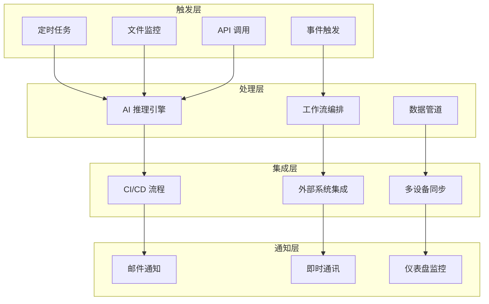

# 高级自动化配置

> **章节**: 08-高级应用 | **难度**: ⭐⭐⭐⭐⭐ | **预计时间**: 180 分钟

## 📖 概述

本指南将深入介绍如何为 Obsidian + OpenCode + Ollama + GPT 集成系统配置高级自动化功能，包括 CI/CD 流程、智能触发器、自动化测试等，实现真正的 AI 驱动工作流。

---

## 🎯 自动化层级架构

### 四层自动化体系



---

## 🤖 AI 推理自动化

### 1. 智能任务调度

#### 基于时间的调度

```yaml
# 自动化配置文件
scheduler_config:
  daily_tasks:
    - name: "每日知识整理"
      time: "08:00"
      trigger: "cron"
      workflow: "para_organize"

    - name: "日报生成"
      time: "18:00"
      trigger: "cron"
      workflow: "daily_report"

  weekly_tasks:
    - name: "周度知识回顾"
      time: "周日 09:00"
      trigger: "cron"
      workflow: "weekly_review"

  monthly_tasks:
    - name: "月度归档"
      day: 1
      time: "10:00"
      trigger: "cron"
      workflow: "monthly_archive"
```

#### 基于事件的触发

```yaml
event_triggers:
  file_changes:
    - pattern: "0 Personals/📥 00_InBox/*.md"
      action: "auto_tag"
      debounce: "5min"

    - pattern: "1 Projects/**/*.md"
      action: "update_project_status"
      debounce: "10min"

  git_commits:
    - branch: "main"
      action: "update_docs"
      on: "push"

  api_calls:
    - endpoint: "/webhooks/task_complete"
      action: "update_knowledge_graph"
```

### 2. AI 模型智能路由

#### 自适应模型选择算法

```python
# 智能路由器
class AITaskRouter:
    def __init__(self):
        self.models = {
            'local_fast': {
                'name': 'llama2:7b',
                'cost': 0,
                'latency': 50,
                'capacity': 'simple'
            },
            'local_balanced': {
                'name': 'mistral:7b',
                'cost': 0,
                'latency': 80,
                'capacity': 'medium'
            },
            'cloud_powerful': {
                'name': 'gpt-oss:120b-cloud',
                'cost': 0.01,
                'latency': 200,
                'capacity': 'complex'
            }
        }

    def route_task(self, task_info):
        """智能路由任务到合适的模型"""
        # 分析任务特征
        complexity = self._analyze_complexity(task_info)
        urgency = self._check_urgency(task_info)
        budget = self._get_budget_status()

        # 决策逻辑
        if urgency == 'high' and budget >= 0.01:
            return self.models['cloud_powerful']
        elif complexity == 'high' and budget >= 0.01:
            return self.models['cloud_powerful']
        elif complexity == 'medium':
            return self.models['local_balanced']
        else:
            return self.models['local_fast']

    def _analyze_complexity(self, task_info):
        """分析任务复杂度"""
        # 基于内容长度、类型、上下文等判断
        pass
```

---

## 🔄 CI/CD 自动化流程

### 1. GitHub Actions 配置

#### 知识库自动部署

```yaml
# .github/workflows/knowledge-deploy.yml
name: Knowledge Base Deployment

on:
  push:
    branches: [main]
  schedule:
    - cron: '0 9 * * *'  # 每天 9:00

jobs:
  deploy-knowledge:
    runs-on: ubuntu-latest

    steps:
      - name: Checkout
        uses: actions/checkout@v3

      - name: Setup Python
        uses: actions/setup-python@v4
        with:
          python-version: '3.10'

      - name: Install Ollama
        run: |
          curl -fsSL https://ollama.com/install.sh | sh
          ollama serve &

      - name: Run AI Analysis
        env:
          API_KEY: ${{ secrets.AI_API_KEY }}
        run: |
          python scripts/ai_analysis.py \
            --input vault/ \
            --output reports/ \
            --model mistral:7b

      - name: Generate Knowledge Graph
        run: |
          python scripts/generate_graph.py \
            --vault vault/ \
            --output assets/graph.json

      - name: Deploy
        run: |
          git config user.name "AI Bot"
          git config user.email "bot@example.com"
          git add reports/ assets/
          git commit -m "Auto-update: AI analysis and graphs"
          git push
```

### 2. Docker Compose 自动化

#### 完整服务编排

```yaml
# docker-compose.yml
version: '3.8'

services:
  obsidian-sync:
    image: obsidian/sync-server:latest
    volumes:
      - ./vault:/vault
    environment:
      - SYNC_TOKEN=${OBSIDIAN_SYNC_TOKEN}
    restart: unless-stopped

  ollama:
    image: ollama/ollama:latest
    volumes:
      - ./models:/root/.ollama
    ports:
      - "11434:11434"
    environment:
      - OLLAMA_NUM_PARALLEL=4
      - OLLAMA_MAX_LOADED_MODELS=3
    restart: unless-stopped
    deploy:
      resources:
        limits:
          cpus: '4'
          memory: 8G

  ai-processor:
    build: ./services/ai-processor
    volumes:
      - ./vault:/vault
      - ./logs:/logs
    environment:
      - API_BASE=http://ollama:11434
      - CLOUD_API_KEY=${CLOUD_API_KEY}
      - OBSIDIAN_VAULT=/vault
    depends_on:
      - ollama
    restart: unless-stopped

  web-dashboard:
    build: ./services/dashboard
    ports:
      - "3000:3000"
    environment:
      - GRAFANA_URL=http://grafana:3000
    restart: unless-stopped
```

---

## 📊 数据管道自动化

### 1. 知识提取与处理

#### ETL 流程

```python
# 知识 ETL 管道
class KnowledgeETL:
    """知识提取、转换、加载管道"""

    def __init__(self, vault_path, ai_client):
        self.vault_path = vault_path
        self.ai_client = ai_client

    def extract(self):
        """从 Obsidian 提取原始数据"""
        notes = []
        for file_path in Path(self.vault_path).rglob('*.md'):
            with open(file_path) as f:
                content = f.read()
                notes.append({
                    'path': file_path,
                    'content': content,
                    'metadata': self._extract_metadata(content)
                })
        return notes

    def transform(self, notes):
        """使用 AI 转换和增强数据"""
        enhanced_notes = []
        for note in notes:
            # AI 增强处理
            analysis = self.ai_client.analyze(
                content=note['content'],
                tasks=['summarize', 'extract_tags', 'find_relations']
            )

            enhanced_notes.append({
                **note,
                'summary': analysis['summary'],
                'tags': analysis['tags'],
                'relations': analysis['relations']
            })

        return enhanced_notes

    def load(self, enhanced_notes):
        """加载到知识图谱"""
        # 构建图谱
        graph = self._build_graph(enhanced_notes)

        # 保存为可视化格式
        graph_path = Path(self.vault_path) / 'assets' / 'knowledge_graph.json'
        with open(graph_path, 'w') as f:
            json.dump(graph, f, indent=2)

        return graph_path

    def run_pipeline(self):
        """运行完整 ETL 流程"""
        print("🔄 开始 ETL 流程...")

        # 1. 提取
        print("  1. 提取数据...")
        notes = self.extract()
        print(f"     ✓ 提取了 {len(notes)} 条笔记")

        # 2. 转换
        print("  2. AI 转换...")
        enhanced_notes = self.transform(notes)
        print(f"     ✓ 增强了 {len(enhanced_notes)} 条笔记")

        # 3. 加载
        print("  3. 构建知识图谱...")
        graph_path = self.load(enhanced_notes)
        print(f"     ✓ 知识图谱已保存到 {graph_path}")

        print("✅ ETL 流程完成！")
```

### 2. 实时数据流

#### Webhook 集成

```python
# Webhook 服务器
from fastapi import FastAPI, BackgroundTasks
from pydantic import BaseModel

app = FastAPI()

class NoteEvent(BaseModel):
    event_type: str
    note_path: str
    timestamp: datetime

@app.post("/webhooks/note")
async def handle_note_event(event: NoteEvent, background_tasks: BackgroundTasks):
    """处理笔记事件"""

    # 异步处理
    background_tasks.add_task(
        process_note_event,
        event.event_type,
        event.note_path
    )

async def process_note_event(event_type: str, note_path: str):
    """异步处理笔记事件"""

    if event_type == 'created':
        # 新笔记创建：自动打标签
        await auto_tag_note(note_path)

    elif event_type == 'updated':
        # 笔记更新：更新知识图谱
        await update_knowledge_graph(note_path)

    elif event_type == 'linked':
        # 笔记链接：增强关联分析
        await analyze_links(note_path)

# 启动服务器
if __name__ == "__main__":
    import uvicorn
    uvicorn.run(app, host="0.0.0.0", port=8000)
```

---

## 🚨 智能监控与告警

### 1. 系统监控仪表盘

#### Grafana 配置

```json
// Grafana Dashboard 配置
{
  "dashboard": {
    "title": "AI System Monitor",
    "panels": [
      {
        "title": "API 调用次数",
        "targets": [
          {
            "expr": "sum(rate(api_calls_total[5m]))",
            "legendFormat": "calls/sec"
          }
        ]
      },
      {
        "title": "推理延迟",
        "targets": [
          {
            "expr": "avg(inference_latency_ms)",
            "legendFormat": "ms"
          }
        ]
      },
      {
        "title": "模型使用分布",
        "type": "piechart",
        "targets": [
          {
            "expr": "count by (model) (inference_requests)"
          }
        ]
      },
      {
        "title": "知识库增长",
        "type": "graph",
        "targets": [
          {
            "expr": "knowledge_notes_total",
            "legendFormat": "notes"
          }
        ]
      }
    ]
  }
}
```

### 2. 智能告警系统

#### 告警规则

```yaml
# alerting_rules.yml
alerting:
  rules:
    - name: "high_latency"
      condition: "avg(inference_latency_ms) > 5000"
      duration: "5m"
      severity: "warning"
      notification:
        - email
        - slack
      message: "AI 推理延迟超过 5 秒！"

    - name: "api_error_rate"
      condition: "rate(api_errors_total[5m]) > 0.1"
      duration: "2m"
      severity: "critical"
      notification:
        - pagerduty
        - slack
      message: "API 错误率过高！"

    - name: "disk_space_low"
      condition: "disk_available_percent < 10"
      duration: "10m"
      severity: "warning"
      notification:
        - email
      message: "磁盘空间不足 10%！"

    - name: "model_not_loaded"
      condition: "model_loaded_count < 1"
      duration: "1m"
      severity: "critical"
      notification:
        - slack
      message: "没有加载任何模型！"
```

---

## 🧪 自动化测试

### 1. 集成测试套件

```python
# 自动化测试
import pytest
from ai_integration import AIClient, KnowledgeBase

@pytest.fixture
def ai_client():
    return AIClient(api_key="test_key")

@pytest.fixture
def knowledge_base():
    return KnowledgeBase(path="./test_vault")

class TestAIIntegration:
    """AI 集成测试"""

    def test_note_creation(self, ai_client):
        """测试笔记创建"""
        result = ai_client.create_note(
            title="测试笔记",
            content="这是测试内容"
        )
        assert result['status'] == 'success'
        assert 'note_id' in result

    def test_smart_search(self, ai_client, knowledge_base):
        """测试智能搜索"""
        # 创建测试数据
        knowledge_base.create_test_notes()

        # 执行搜索
        results = ai_client.smart_search(query="机器学习")

        assert len(results) > 0
        assert all('relevance_score' in r for r in results)

    def test_model_routing(self, ai_client):
        """测试模型路由"""
        # 简单任务应该用本地模型
        result1 = ai_client.complete(
            prompt="你好",
            auto_route=True
        )
        assert result1['model_type'] == 'local'

        # 复杂任务应该用云端模型
        result2 = ai_client.complete(
            prompt="详细分析这篇论文的核心贡献",
            auto_route=True
        )
        assert result2['model_type'] == 'cloud'

    def test_automated_organization(self, knowledge_base):
        """测试自动组织"""
        # 添加混乱的笔记
        knowledge_base.add_messy_notes()

        # 运行自动组织
        knowledge_base.auto_organize()

        # 验证分类
        categories = knowledge_base.get_categories()
        assert 'Projects' in categories
        assert 'Areas' in categories
        assert 'Resources' in categories

# 运行测试
if __name__ == "__main__":
    pytest.main([
        "--verbose",
        "--cov=ai_integration",
        "tests/"
    ])
```

### 2. 性能基准测试

```python
# 性能基准测试
import time
import statistics

class PerformanceBenchmark:
    """性能基准测试"""

    def benchmark_inference_speed(self, model_name, prompts):
        """测试推理速度"""
        latencies = []

        for prompt in prompts:
            start = time.time()
            result = self.ai_client.complete(
                model=model_name,
                prompt=prompt
            )
            latency = time.time() - start
            latencies.append(latency)

        return {
            'model': model_name,
            'avg_latency': statistics.mean(latencies),
            'p95_latency': statistics.quantiles(latencies, n=20)[18],
            'p99_latency': statistics.quantiles(latencies, n=20)[19],
            'tokens_per_second': self._calculate_tps(latencies, prompts)
        }

    def benchmark_throughput(self, concurrent_requests=10):
        """测试吞吐量"""
        import concurrent.futures

        start_time = time.time()

        with concurrent.futures.ThreadPoolExecutor(max_workers=concurrent_requests) as executor:
            futures = [
                executor.submit(self.ai_client.complete, prompt="test")
                for _ in range(concurrent_requests)
            ]
            concurrent.futures.wait(futures)

        total_time = time.time() - start_time

        return {
            'concurrent_requests': concurrent_requests,
            'total_time': total_time,
            'requests_per_second': concurrent_requests / total_time
        }
```

---

## 🎯 最佳实践

### 1. 自动化配置原则

```yaml
automation_principles:
  渐进式部署:
    - "从简单任务开始"
    - "逐步增加复杂度"
    - "每个阶段验证"

  容错设计:
    - "添加重试机制"
    - "实现降级策略"
    - "记录详细日志"

  可观测性:
    - "监控所有自动化流程"
    - "收集关键指标"
    - "设置合理告警"

  文档化:
    - "记录所有自动化配置"
    - "维护运行手册"
    - "更新故障排除指南"
```

### 2. 资源优化

```yaml
resource_optimization:
  模型加载:
    - "按需加载模型"
    - "卸载不常用模型"
    - "使用模型量化"

  内存管理:
    - "限制并发请求数"
    - "实现缓存策略"
    - "定期清理缓存"

  计算资源:
    - "根据任务类型分配资源"
    - "实现任务队列"
    - "使用批处理"
```

---

## 🚀 实施路线图

### 阶段一：基础自动化（1-2周）

- [ ] 配置定时任务
- [ ] 设置事件触发器
- [ ] 实现基础通知
- [ ] 部署监控仪表盘

### 阶段二：集成自动化（2-4周）

- [ ] 配置 CI/CD 流程
- [ ] 实现 ETL 数据管道
- [ ] 集成外部系统
- [ ] 建立自动化测试

### 阶段三：智能自动化（4-8周）

- [ ] 实现智能模型路由
- [ ] 部署高级监控系统
- [ ] 优化资源调度
- [ ] 建立自动化决策

---

## 🔗 相关链接

```
自动化.md
    ↓
← 07-故障排除/故障排除與維護.md
→ 09-资源下载/工具列表.md
↔ README.md (主目录)
```

---

## 📚 参考资源

- **自动化工具**: Ansible, Terraform, GitHub Actions
- **监控工具**: Grafana, Prometheus, Datadog
- **CI/CD**: Jenkins, GitLab CI, GitHub Actions
- **测试框架**: Pytest, Jest, Cypress

---

**更新时间**: 2026-01-22 | **版本**: v1.0
