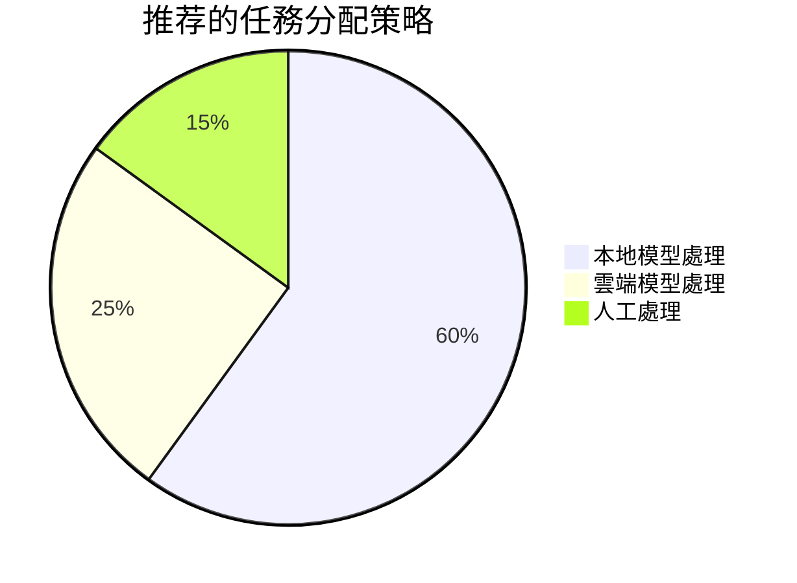

# 指南

# 指南

# 指南

# 管理

# 管理
- **💻 OpenCode** - AI驅動程式的代碼開發助手
# 部署
- **🤖 GPT-oss:120b-cloud** - 高效能雲端大语言模型

### 🎯 整合目標
# 管理
- 💻 **智能代碼開發**：AI驅動程式的代碼生成和優化
# 部署
# 管理

## 🏗️ 系統架構

```mermaid
graph TB
    subgraph "使用者界面层"
        A[Obsidian] --> B[OpenCode]
    end
    
    subgraph "AI服务层"
        C[Ollama 本地模型]
        D[GPT-oss:120b-cloud 雲端模型]
    end
    
    subgraph "數據儲存层"
# 知識庫
        F[雲端同步]
        G[代碼仓库]
    end
    
    A --> C
    A --> D
    B --> C
    B --> D
    
    A --> E
    A --> F
    B --> G
    
    C --> H[本地推理]
    D --> I[雲端推理]
```

## 📋 目錄导航

### 🎯 快速開始
| 章节 | 內容 | 难度 | 预计時間 |
|------|------|------|----------|
# 指南
# 配置
# 配置
# 部署

# 配置
| 章节                  | 內容                   | 难度    | 预计時間  |
| ------------------- | -------------------- | ----- | ----- |
# 配置
# 工作流
| [[故障排除與維護]] | 故障诊断和解決              | ⭐⭐    | 45分钟  |
# 配置

## 🎯 适用人群

### 👨‍💻 開發者
# 管理
- **AI開發者**：需要AI辅助的開發環境
# 工作流

# 知識
- **技術写作者**：需要AI辅助的內容创作
- **研究人员**：需要AI支持的学术研究
# 分析

### 🎓 学生学者
- **計算机专业学生**：學習AI辅助開發
- **研究生**：需要AI支持的学术研究
# 知識

## 🛠️ 技術棧详解

### 📝 Obsidian
**核心功能**：
# 知識
# 知識
- 📝 **Markdown支持**：標準化的文檔格式
- 🔌 **外掛生態**：豐富的擴展功能

**AI整合優勢**：
- 🤖 **AI助手外掛**：直接在Obsidian中使用AI
# 分析
# 知識

### 💻 OpenCode
**核心功能**：
- 🧠 **AI代碼生成**：智能代碼編寫
# 分析
- 🛠️ **重構建議**：AI驅動程式的代碼優化
- 📚 **文檔生成**：自動生成代碼文檔

**整合優勢**：
# 知識庫
# 知識庫
# 效率

### 🦙 Ollama
**核心功能**：
# 部署
- 🤖 **多模型支持**：支持多种開源模型
- ⚡ **高效能推理**：優化的推理效能
# 管理

# 部署
- 🔒 **數據安全**：敏感數據不离开本地
- 💰 **成本控制**：避免雲端API費用
- 🚀 **快速響應**：本地推理的低延遲

### 🤖 GPT-oss:120b-cloud
**核心特性**：
- 🧠 **超大参数**：1200亿参数规模
- ⚡ **雲端高效能**：强大的計算能力
- 🌐 **全球可用**：雲端服务的高可用性
- 💰 **按需付费**：灵活的成本控制

**使用優勢**：
- 🎯 **复杂任務**：處理复杂的AI任務
- 🔄 **负载均衡**：与本地模型形成互补
- 📈 **可擴展性**：根据需求動態擴展

## 📊 效能對比

### 🏠 本地 vs ☁️ 雲端
| 特性 | Ollama本地 | GPT-oss雲端 | 推荐場景 |
|------|------------|-------------|----------|
| **數據隱私** | ⭐⭐⭐⭐⭐ | ⭐⭐⭐ | 敏感數據處理 |
| **響應速度** | ⭐⭐⭐⭐ | ⭐⭐⭐⭐ | 实时交互需求 |
| **模型能力** | ⭐⭐⭐ | ⭐⭐⭐⭐⭐ | 复杂任務處理 |
| **成本控制** | ⭐⭐⭐⭐ | ⭐⭐⭐ | 预算敏感場景 |
| **可擴展性** | ⭐⭐ | ⭐⭐⭐⭐⭐ | 大规模應用程式 |

# 部署


## 🎯 使用場景

# 管理
# 整理
- **🔍 智能搜尋**：基于语义的智能內容檢索
# 知識
# 知識庫

### 💻 開發場景
- **🧠 代碼生成**：基于需求描述的代碼生成
- **🔍 代碼審查**：AI辅助的代碼品質檢查
- **📚 文檔編寫**：自動生成API文檔
- **🐛 除錯辅助**：AI驅動程式的错误诊断

### 🎓 學習場景
- **📚 个性化學習**：AI定制的學習路徑
# 知識庫
- **📝 內容创作**：AI辅助的学术写作
# 知識

## 📋 前置要求

### 💻 硬體要求
# 配置
|------|----------|----------|------|
| **CPU** | 4核心 | 8核心+ | 本地推理需要较强CPU |
| **記憶體** | 8GB | 16GB+ | 大模型需要充足記憶體 |
| **儲存** | 50GB | 100GB+ | 模型和數據儲存 |
| **GPU** | 可选 | RTX 3060+ | 加速本地推理 |

### 🛠️ 軟體要求
# 版本
|------|----------|----------|------|
| **操作系統** | Windows 10 | Windows 11 | 主要運行環境 |
# 管理
| **Python** | 3.8 | 3.10+ | Ollama依赖 |
# 部署

### 🌐 網路要求
- **带宽**：≥10Mbps（雲端模型調用）
- **延遲**：≤100ms（实时交互需求）
- **稳定性**：99%+（雲端服务可用性）

## 🚀 快速開始

### ⚡ 5分钟快速體驗
如果您想快速體驗整合效果，可以按以下步骤：

1. **📥 下載Obsidian**：安裝最新版Obsidian
2. **🔧 安裝AI外掛**：在Obsidian中安裝AI助手外掛
# 配置
4. **✨ 開始使用**：創建第一个AI辅助筆記

# 部署
# 部署

# 指南
# 配置
# 配置
# 部署
# 配置
# 工作流

## 💡 核心優勢

# 效率
- **⚡ 快速響應**：本地模型的低延遲
- **🧠 智能辅助**：AI驅動程式的自動化處理
- **🔄 無缝切換**：本地和雲端模型智能切換

### 🔒 數據安全
- **🏠 本地處理**：敏感數據本地化處理
- **🔐 隱私保護**：使用者數據完全可控
- **🛡️ 安全隔离**：本地和雲端安全隔离

### 💰 成本優化
- **🏠 本地优先**：减少雲端API調用
- **⚡ 智能调度**：根据任務类型選擇模型
- **📊 使用監控**：实时監控成本和使用

### 🌈 使用者體驗
- **🎨 統一界面**：Obsidian中的統一操作界面
- **🔗 深度整合**：工具间的無缝衔接
- **📱 多端同步**：支持多设备使用

## 📈 學習路徑

### 🥇 初学者路徑（1-2周）
```mermaid
flowchart LR
    A[環境准备] --> B[Obsidian基礎]
# 配置
# 工作流
```

**學習目標**：
# 配置
- 🔧 理解各工具的基本功能
# 工作流

### 🥈 进阶路徑（2-4周）
```mermaid
flowchart LR
# 配置
# 工作流
# 配置
```

**學習目標**：
# 部署
# 部署
# 工作流

### 🥉 专家路徑（4-8周）


**學習目標**：
# 配置
- ⚡ 優化系統效能
- 🔧 掌握高级整合技術

## 📞 支持与帮助

### 🆘 获取帮助
- **📖 線上文檔**：詳細的操作文檔
- **💬 社區支持**：活跃的使用者社區
- **🐛 問題回饋**：及时的問題響應
- **📧 電子郵件支持**：专业的技術支持

# 更新
# 更新
# 管理
# 版本
- **🎯 持續優化**：基于使用者回饋的改进

---

## 🎉 開始您的AI增强之旅

# 管理

### 📌 推荐起点
# 配置
# 指南
- **🎯 特定需求**：根据您的需求選擇相应章节

### 💡 温馨提示
- 📖 **循序渐进**：建議按章节顺序學習
- 🧪 **實踐驗證**：每个步骤都要实际操作驗證
- 🔄 **及时回饋**：遇到問題及时寻求帮助
# 配置

---

# 查看

**📧 联系方式**：support@ai-integration-guide.com

# 更新