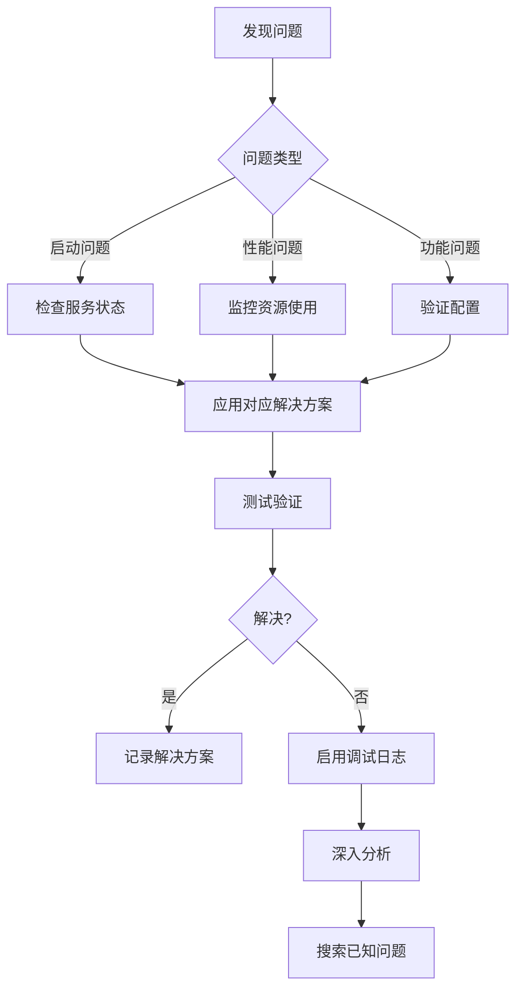

---
tags:
  - opencode
  - ollama
  - troubleshooting
  - guide
  - debug
created: 2026-01-15
---

# OpenCode 故障排除手册

## 🔍 快速诊断清单

### 启动问题
- [ ] OpenCode 无法启动
- [ ] Ollama 服务未运行
- [ ] 模型加载失败
- [ ] 配置文件错误

### 性能问题
- [ ] 响应速度过慢
- [ ] 内存使用过高
- [ ] GPU 未启用
- [ ] 模型推理中断

### 功能问题
- [ ] 工具调用失败
- [ ] 上下文截断
- [ ] 输出格式异常
- [ ] 模型切换失败

## 🐛 常见问题与解决方案

### 问题 1: "Model not found" 错误

**症状**: OpenCode 报告找不到模型

**原因**:
- 模型未正确下载
- 配置文件中模型名称错误
- Ollama 服务路径问题

**解决方案**:
```bash
# 检查已安装模型
ollama list

# 重新下载模型
ollama pull qwen2.5-coder:7b

# 检查 OpenCode 配置
cat ~/.config/opencode/opencode.json

# 重启 Ollama 服务
pkill ollama && ollama serve &

# 验证连接
curl http://localhost:11434/api/tags
```

### 问题 2: 工具调用不工作

**症状**: 模型无法执行文件操作

**原因**:
- 使用了不支持工具调用的模型
- 权限设置问题
- 插件未正确配置

**解决方案**:
```bash
# 检查模型工具支持
ollama show qwen2.5-coder:7b | grep -i tool

# 更换为支持工具的模型
opencode run "测试工具功能" --model ollama/qwen2.5-coder:7b

# 检查工具配置
grep -A 10 '"tools"' ~/.config/opencode/opencode.json

# 验证插件安装
opencode plugin list
```

### 问题 3: 性能过慢

**症状**: 生成速度明显低于预期

**原因**:
- CPU 模式运行（GPU 未启用）
- 内存不足频繁交换
- 模型量化不当

**解决方案**:
```bash
# 检查 GPU 使用情况
nvidia-smi

# 强制使用 GPU
export OLLAMA_GPU=1
export CUDA_VISIBLE_DEVICES=0

# 调整批处理大小
export OLLAMA_NUM_BATCH=256

# 监控资源使用
htop    # CPU 和内存
nvtop   # GPU 使用

# 量化模型提升性能
ollama pull qwen2.5-coder:7b-q4
```

### 问题 4: 上下文窗口不足

**症状**: 大文件处理时内容被截断

**原因**:
- 模型默认上下文窗口太小
- 输入内容过长

**解决方案**:
```bash
# 创建大上下文模型变体
ollama run qwen2.5-coder:7b
/set parameter num_ctx 16384
/save qwen2.5-coder:7b-16k
/bye

# 更新配置文件
```

```json
{
  "models": {
    "qwen2.5-coder:7b-16k": {
      "options": {
        "extraBody": {
          "num_ctx": 16384
        }
      }
    }
  }
}
```

### 问题 5: 内存溢出 (OOM)

**症状**: 进程被系统杀掉

**原因**:
- 模型太大超出内存限制
- 并发请求过多
- 系统内存不足

**解决方案**:
```bash
# 减小模型规模
ollama pull qwen2.5:3b

# 限制并发请求
export OLLAMA_MAX_QUEUE=64

# 释放内存
pkill ollama
ollama serve

# 使用量化模型
ollama pull qwen2.5-coder:7b-q4_K_M
```

### 问题 6: GPU 内存不足

**症状**: 提示 GPU 显存不足

**原因**:
- 模型超过 GPU 容量
- 其他程序占用 GPU
- 批处理设置过大

**解决方案**:
```bash
# 检查 GPU 内存
nvidia-smi

# 调整 GPU 内存分配
export OLLAMA_GPU_MEMORY_FRACTION=0.6

# 减少批处理大小
export OLLAMA_NUM_GPU=16
export OLLAMA_NUM_BATCH=128

# 关闭其他 GPU 程序
# 或者使用多个 GPU
export CUDA_VISIBLE_DEVICES=0,1
```

### 问题 7: 连接超时

**症状**: OpenCode 无法连接到 Ollama

**原因**:
- Ollama 服务未启动
- 端口被占用
- 防火墙阻止

**解决方案**:
```bash
# 检查 Ollama 服务状态
ps aux | grep ollama

# 启动 Ollama 服务
ollama serve

# 检查端口占用
lsof -i :11434

# 配置防火墙
sudo ufw allow 11434/tcp

# 测试连接
curl http://localhost:11434/api/tags
```

### 问题 8: 输出质量差

**症状**: 生成的内容不符合预期

**原因**:
- 温度参数设置不当
- 提示词不够清晰
- 模型不适合该任务

**解决方案**:
```json
{
  "models": {
    "qwen2.5-coder:7b-creative": {
      "options": {
        "temperature": 0.7,
        "top_p": 0.9,
        "top_k": 40
      }
    },
    "qwen2.5-coder:7b-precise": {
      "options": {
        "temperature": 0.1,
        "top_p": 0.9
      }
    }
  }
}
```

## 🔧 调试工具与命令

### 日志启用

```bash
# OpenCode 详细日志
export DEBUG=opencode:*
opencode --verbose

# Ollama 调试日志
export OLLAMA_DEBUG=1
ollama serve

# 保存日志到文件
ollama serve 2>&1 | tee ollama.log
```

### 连接测试

```bash
# 测试 Ollama API
curl http://localhost:11434/api/tags

# 测试模型响应
curl -X POST http://localhost:11434/api/generate \
  -H "Content-Type: application/json" \
  -d '{
    "model": "qwen2.5-coder:7b",
    "prompt": "Hello",
    "stream": false
  }'

# 测试模型信息
curl http://localhost:11434/api/show \
  -d '{"model": "qwen2.5-coder:7b"}'
```

### 性能基准测试

```bash
# 简单性能测试
time opencode run "生成一个简单的 Python 函数" --model ollama/qwen2.5-coder:7b

# 内存使用监控
watch -n 1 'ps aux | grep ollama'

# GPU 使用监控
watch -n 1 nvidia-smi
```

### 配置验证

```bash
# 验证 OpenCode 配置
cat ~/.config/opencode/opencode.json | jq '.'

# 验证 Ollama 配置
cat ~/.ollama/config 2>/dev/null || echo "No Ollama config found"

# 检查模型详情
ollama show qwen2.5-coder:7b --modelfile
```

## 📊 系统诊断脚本

### 完整诊断脚本

```bash
#!/bin/bash
# OpenCode + Ollama 诊断脚本

echo "=== OpenCode + Ollama 系统诊断 ==="
echo ""

# 1. 系统信息
echo "## 系统信息"
uname -a
echo ""

# 2. 检查 OpenCode
echo "## OpenCode 检查"
which opencode
opencode --version 2>&1
echo ""

# 3. 检查 Ollama
echo "## Ollama 检查"
which ollama
ollama --version
ollama list
echo ""

# 4. GPU 检查
echo "## GPU 检查"
if command -v nvidia-smi &> /dev/null; then
    nvidia-smi
else
    echo "NVIDIA GPU 未检测到"
fi
echo ""

# 5. 内存检查
echo "## 内存检查"
free -h
echo ""

# 6. 连接测试
echo "## 连接测试"
curl -s http://localhost:11434/api/tags | jq '.'
echo ""

# 7. 配置检查
echo "## 配置文件"
if [ -f ~/.config/opencode/opencode.json ]; then
    echo "OpenCode 配置文件存在"
else
    echo "⚠️  OpenCode 配置文件不存在"
fi
echo ""

echo "=== 诊断完成 ==="
```

## 🎯 问题解决流程

### 标准解决流程



## 📞 获取帮助

### 社区资源

- [OpenCode Discord](https://opencode.ai/discord) - 官方 Discord 社区
- [Ollama GitHub Discussions](https://github.com/ollama/ollama/discussions) - GitHub 讨论
- [Reddit r/LocalLLaMA](https://reddit.com/r/LocalLLaMA) - 本地模型讨论

### 报告问题

报告问题时请包含:
1. 操作系统版本
2. OpenCode 和 Ollama 版本
3. 完整的错误日志
4. 配置文件内容
5. 复现步骤

## 🔗 相关文档

- [[OpenCode快速开始]] - 基础安装配置
- [[OpenCode性能优化]] - 性能调优指南
- [[OpenCode模型选择与配置]] - 模型选择指南

## 📚 外部资源

- [OpenCode Documentation](https://opencode.ai/docs)
- [Ollama Troubleshooting](https://github.com/ollama/ollama/blob/main/docs/troubleshooting.md)
