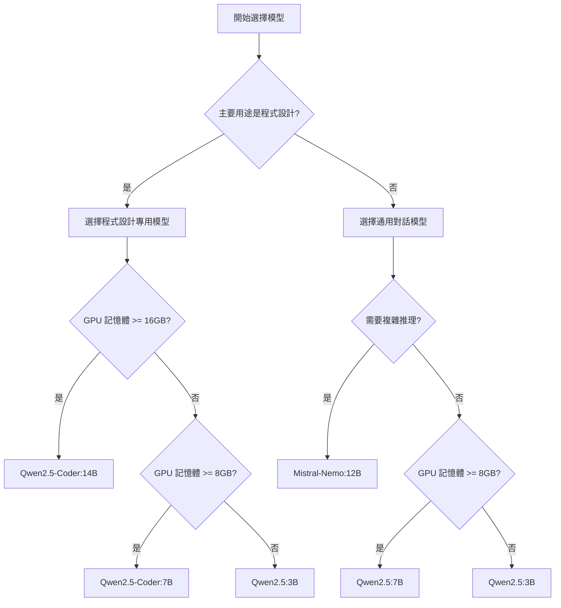

---
tags:
  - opencode
  - ollama
  - local-ai
  - guide
  - tutorial
created: 2026-01-15
updated: 2026-01-22
---

# 閃念：如何在 OpenCode 中使用本地大模型

## 🌟 概述 / Overview

本地大模型正在徹底改變開發者與 AI 的互動方式。透過將 OpenCode 與 Ollama 等本地模型提供者整合，您可以建立完全私有、零成本、離線可用的 AI 程式設計環境。

### 🎯 為什麼選擇本地模型？

| 特性 | 本地模型 | 雲端模型 |
|------|----------|----------|
| **隱私保護** | ✅ 100%本地處理 | ❌ 資料上傳到雲端 |
| **成本控制** | ✅ 一次性硬體投入 | ❌ 按使用量付費 |
| **離線使用** | ✅ 無需網路連接 | ❌ 依賴網路 |
| **自訂** | ✅ 可微調和客製 | ❌ 依賴服務商 |
| **回應速度** | ⚡ 硬體限制 | ⚡ 雲端強大 |

### 🎪 適用場景

#### ✅ 推薦使用場景
- **敏感程式碼專案** - 不願上傳到雲端的程式碼庫
- **離線開發環境** - 無網路或網路受限的環境
- **成本敏感專案** - 長期使用降低成本
- **學習研究** - 深入理解 AI 模型工作原理

#### ⚠️ 不推薦場景
- **快速原型開發** - 需要最高效能和最新模型
# 部署
# 配置

---

## 🚀 5分鐘快速開始 / Quick Start (5 Minutes)

> [!important] 前置條件檢查 / Prerequisites Check
> - **作業系統**: Windows 10/11, macOS, Linux
> - **記憶體**: 至少 16GB RAM
> - **GPU**: 推薦 NVIDIA GPU (8GB+ VRAM)
> - **儲存**: 至少 20GB 可用空間
> - **網路**: 首次安裝需要下載模型

### 步驟 1: 安裝 OpenCode

```bash
# 方法
curl -fsSL https://opencode.ai/install | bash

# 方法
npm install -g @opencode-ai/cli

# 方法
yarn global add @opencode-ai/cli
```

### 步驟 2: 安裝 Ollama

```bash
# macOS/Linux
curl -fsSL https://ollama.ai/install.sh | sh

# Windows (PowerShell)
iwr -useb https://ollama.ai/install.ps1 | iex

# 驗證安裝
ollama --version
```

### 步驟 3: 下載推薦模型

```bash
# 啟動 Ollama 服務
ollama serve

# 下載最適合程式設計的模型（推薦）
ollama pull qwen2.5-coder:7b

# 或者下載更小的模型（硬體要求低）
ollama pull qwen2.5:3b
```

# 配置

# 配置

```json
{
  "$schema": "https://opencode.ai/config.json",
  "provider": {
    "ollama": {
      "npm": "@ai-sdk/openai-compatible",
      "name": "Ollama (local)",
      "options": {
        "baseURL": "http://localhost:11434/v1"
      },
      "models": {
        "qwen2.5-coder:7b": {
          "name": "Qwen2.5-Coder 7B (Local)"
        }
      }
    }
  },
  "model": "ollama/qwen2.5-coder:7b"
}
```

```JSON
{

  "$schema": "https://opencode.ai/config.json",

  "provider": {

    "ollama": {

      "npm": "@ai-sdk/openai-compatible",

      "name": "Ollama (local)",

      "options": {

        "baseURL": "http://localhost:11434/v1"

      },

      "models": {

        "gpt-oss:120b-cloud": {

          "name": "gpt-oss 120b-cloud (Local)"

        }

      }

    }

  },

  "model": "ollama/gpt-oss:120b-cloud",

}
```

### 步驟 5: 首次測試

```bash
# 啟動 OpenCode
opencode

# 在 OpenCode 介面中
/models  # 選擇模型
建立一個簡單的 Python 函數
```

> [!success] 成功標誌 / Success Indicators
> - ✅ OpenCode 啟動無錯誤
> - ✅ 能看到本地模型選項
> - ✅ 成功生成程式碼
> - ✅ 工具呼叫正常工作

---

# 指南

### 系統要求詳解

#### 硬體要求矩陣

| GPU 記憶體 | 推薦模型 | 預期效能 | 適用場景 |
|-----------|----------|----------|----------|
| 4GB | Qwen2.5:1.5B | 40-60 tok/s | 基礎程式設計輔助 |
| 8GB | Qwen2.5:3B | 25-40 tok/s | 輕量級開發 |
| 16GB | Qwen2.5-Coder:7B | 15-25 tok/s | 通用程式設計任務 |
| 24GB+ | Qwen2.5-Coder:14B | 8-15 tok/s | 複雜專案開發 |

#### 軟體環境要求

```bash
# 版本
node --version  # 需要 v18.0.0 或更高

# 版本
python --version  # 需要 v3.8 或更高

# CUDA 支援（NVIDIA GPU）
# 版本
```

# 配置

# 配置

```json
{
  "$schema": "https://opencode.ai/config.json",
  "model": "ollama/qwen2.5-coder:7b",
  "provider": {
    "ollama": {
      "npm": "@ai-sdk/openai-compatible",
      "name": "Ollama (Local)",
      "options": {
        "baseURL": "http://localhost:11434/v1",
        "timeout": 120000,
        "maxRetries": 3,
        "headers": {
          "Connection": "keep-alive"
        }
      },
      "models": {
        "qwen2.5-coder:7b": {
          "name": "Qwen2.5-Coder 7B (Local)",
          "options": {
            "temperature": 0.1,
            "top_p": 0.9,
            "extraBody": {
              "num_ctx": 8192,
              "num_batch": 512,
              "repeat_penalty": 1.1
            }
          },
          "limit": {
            "context": 8192,
            "output": 4096
          }
        },
        "qwen2.5-coder:7b-16k": {
          "id": "qwen2.5-coder:7b",
          "name": "Qwen2.5-Coder 7B (16K)",
          "options": {
            "extraBody": {
              "num_ctx": 16384
            }
          },
          "limit": {
            "context": 16384,
            "output": 8192
          }
        }
      }
    }
  },
  "plugin": ["@opencode/file-operations"],
  "tools": {
    "timeout": 60000,
    "maxParallel": 3
  }
}
```

# 配置

#### 環境變數設定

```bash
# ~/.bashrc 或 ~/.zshrc
export OLLAMA_HOST=0.0.0.0:11434
export OLLAMA_ORIGINS=*
export OLLAMA_MODELS=/path/to/models
export OLLAMA_KEEP_ALIVE=24h
export OLLAMA_MAX_LOADED_MODELS=2

# 配置
source ~/.bashrc
```

# 配置

```ini
# /etc/systemd/system/ollama.service
[Unit]
Description=Ollama Service
After=network-online.target

[Service]
ExecStart=/usr/local/bin/ollama serve
User=ollama
Group=ollama
Restart=always
RestartSec=3
Environment="OLLAMA_HOST=0.0.0.0:11434"
Environment="OLLAMA_KEEP_ALIVE=24h"

[Install]
WantedBy=multi-user.target
```

---

## 🤖 推薦模型與選擇 / Recommended Models & Selection

### 模型分類與選擇

#### 🏆 程式設計專用模型（強烈推薦）

| 模型 | 參數量 | 上下文 | 程式設計能力 | 工具呼叫 | 硬體要求 |
|------|--------|--------|--------------|----------|----------|
| **Qwen2.5-Coder** | 7B/14B | 32K | ⭐⭐⭐⭐⭐ | ✅ | 中等 |
| **DeepSeek-Coder-V2** | 6.7B/16B | 32K | ⭐⭐⭐⭐ | ✅ | 中等 |
| **CodeLlama** | 7B/13B/34B | 16K | ⭐⭐⭐ | ❌ | 中高 |

#### 🎯 通用對話模型（適合基礎任務）

| 模型 | 參數量 | 上下文 | 程式設計能力 | 推理能力 | 硬體要求 |
|------|--------|--------|--------------|----------|----------|
| **Qwen2.5** | 3B/7B/14B | 32K | ⭐⭐⭐ | ⭐⭐⭐⭐ | 低-中等 |
| **Mistral-Nemo** | 12B | 128K | ⭐⭐⭐ | ⭐⭐⭐⭐⭐ | 中等 |
| **Llama3.1** | 8B/70B | 128K | ⭐⭐ | ⭐⭐⭐⭐ | 中-高 |

### 模型選擇決策樹



# 配置

```bash
# 推薦模型下載指令
ollama pull qwen2.5-coder:7b           # 程式設計專用，推薦
ollama pull qwen2.5:7b                 # 通用模型，平衡
ollama pull mistral-nemo:12b            # 推理能力強
ollama pull qwen2.5:3b                 # 輕量級選擇

# 版本
ollama run qwen2.5-coder:7b
/set parameter num_ctx 16384
/save qwen2.5-coder:7b-16k
/bye

# 驗證模型
ollama list
```

---

## 💡 實際應用場景 / Practical Use Cases

### 場景 1: 基礎程式碼生成

#### 範例請求
```
建立一個 Python 函數，用於計算費波那契數列的前 n 項，包含錯誤處理和效能最佳化
```

#### 預期輸出
```python
def fibonacci(n):
    """
    計算費波那契數列的前 n 項

    Args:
        n (int): 要計算的項數

    Returns:
        list: 費波那契數列

    Raises:
        ValueError: 當 n 不是正整數時
    """
    if not isinstance(n, int) or n <= 0:
        raise ValueError("n 必須是正整數")

    if n == 1:
        return [0]
    elif n == 2:
        return [0, 1]

    fib_sequence = [0, 1]
    for i in range(2, n):
        fib_sequence.append(fib_sequence[-1] + fib_sequence[-2])

    return fib_sequence
```

# 修改

# 工作流
1. 開啟需要重構的檔案
2. 使用 OpenCode 讀取檔案內容
3. 指定重構要求
# 修改

#### 範例請求
```
# 分析
1. 提取重複程式碼為函數
2. 改進錯誤處理
3. 新增型別提示
4. 最佳化演算法效能
```

### 場景 3: 專案級程式碼理解

# 分析
```bash
# 分析
# 分析

# 產生專案檔案
opencode run "為這個專案產生 README 檔案，包括安裝說明和使用範例"
```

### 場景 4: 批次處理自動化

#### 批量程式碼審查腳本
```bash
#!/bin/bash
# 批量程式碼審查腳本

for file in $(find . -name "*.py" -type f | head -10); do
    echo "審查檔案: $file"
    opencode run "審查這個 Python 檔案的程式碼品質，指出潛在問題" "$file"
    echo "---"
done
```

---

# 工作流

# 配置

# 配置

### Templater 範本

整合範本位於：`./Obsidian模板/`

- **OpenCode 請求.md** - 主要請求範本
- **批次處理操作.md** - 批次操作範本
# 配置

### 與 PARA 系統整合

# 管理
```markdown
---
para: project
domain:
  - "[[AI Development]]"
created: 2026-01-15
status: active
tags:
  - ai
  - local-models
  - opencode
---

# 🤖 OpenCode 本地模型整合專案

## 專案目標
建立完整的本地 AI 程式設計環境，實現隱私保護的程式碼助手

## 期望成果
# 指南
# 配置
# 工作流
- [ ] 效能最佳化方案
- [ ] 故障排除手冊
```

---

## ⚡ 效能最佳化技巧 / Performance Optimization

# 配置

#### 量化級別選擇
| 量化級別 | 模型大小 | 效能影響 | 品質損失 |
|----------|----------|----------|----------|
| **FP16** | 100% | 基準 | 無 |
| **INT8** | 50% | +20-30% | 微小 |
| **INT4** | 25% | +50-80% | 明顯 |

#### 量化指令範例
```bash
# 使用 Ollama 自動量化（推薦）
ollama run qwen2.5-coder:7b

# 手動量化（進階使用者）
ollama create qwen2.5-coder:7b-quantized -f ./quantized_model.gguf
```

# 配置

#### NVIDIA GPU 最佳化
```bash
# 檢查 CUDA 支援
nvidia-smi
export CUDA_VISIBLE_DEVICES=0

# 設定 GPU 記憶體分配
export OLLAMA_GPU_MEMORY_FRACTION=0.8
```

#### Apple Silicon 最佳化
```bash
# macOS Metal 效能設定
export OLLAMA_METAL=1
export OLLAMA_MAX_QUEUE=512
```

# 管理

#### 動態上下文調整
```json
{
  "models": {
    "qwen2.5-coder:7b-adaptive": {
      "options": {
        "extraBody": {
          "num_ctx": "auto",
          "ctx_size": "adaptive"
        }
      }
    }
  }
}
```

#### 內容分塊處理
```javascript
// 大檔案自動分塊處理
function chunkContent(content, maxTokens = 4000) {
    const estimatedTokens = content.length / 4;
    if (estimatedTokens <= maxTokens) return [content];

    const chunks = [];
    const chunkSize = maxTokens * 4;

    for (let i = 0; i < content.length; i += chunkSize) {
        chunks.push(content.slice(i, i + chunkSize));
    }

    return chunks;
}
```

---

## 🐛 故障排除手冊 / Troubleshooting Guide

### 快速診斷清單

#### 啟動問題
- [ ] OpenCode 無法啟動
- [ ] Ollama 服務未執行
- [ ] 模型載入失敗
# 配置

#### 效能問題
- [ ] 回應速度過慢
- [ ] 記憶體使用過高
- [ ] GPU 未啟用
- [ ] 模型推理中斷

#### 功能問題
- [ ] 工具呼叫失敗
# 修改
- [ ] 上下文截斷
- [ ] 輸出格式異常

### 常見問題與解決方案

#### 問題 1: "Model not found" 錯誤

**症狀**：OpenCode 回報找不到模型

**原因**：
- 模型未正確下載
# 配置
- Ollama 服務路徑問題

**解決方案**：
```bash
# 檢查已安裝模型
ollama list

# 重新下載模型
ollama pull qwen2.5-coder:7b

# 配置
cat ~/.config/opencode/opencode.json

# 重新啟動 Ollama 服務
pkill ollama && ollama serve &
```

#### 問題 2: 工具呼叫不工作

**症狀**：模型無法執行檔案操作

**原因**：
- 使用了不支援工具呼叫的模型
# 配置
- 權限設定問題

**解決方案**：
```bash
# 檢查模型工具支援
ollama show qwen2.5-coder:7b | grep "tool"

# 更換為支援工具的模型
opencode run "測試工具功能" --model ollama/qwen2.5-coder:7b

# 配置
grep -A 10 '"tools"' ~/.config/opencode/opencode.json
```

#### 問題 3: 效能過慢

**症狀**：生成速度明顯低於預期

**原因**：
- CPU 模式執行（GPU 未啟用）
- 記憶體不足頻繁交換
- 模型量化不當

**解決方案**：
```bash
# 檢查 GPU 使用情況
nvidia-smi

# 強制使用 GPU
export OLLAMA_GPU=1

# 調整批次處理大小
export OLLAMA_NUM_BATCH=256

# 監控資源使用
htop  # CPU 和記憶體
nvtop  # GPU 使用
```

#### 問題 4: 上下文視窗不足

**症狀**：大檔案處理時內容被截斷

**原因**：
- 模型預設上下文視窗太小
# 配置

**解決方案**：
```bash
# 建立大上下文模型變體
ollama run qwen2.5-coder:7b
/set parameter num_ctx 16384
/save qwen2.5-coder:7b-16k

# 配置
{
  "models": {
    "qwen2.5-coder:7b-16k": {
      "options": {
        "extraBody": {
          "num_ctx": 16384
        }
      }
    }
  }
}
```

### 除錯工具與指令

#### 日誌啟用
```bash
# OpenCode 詳細日誌
export DEBUG=opencode:*
opencode --verbose

# Ollama 除錯日誌
export OLLAMA_DEBUG=1
ollama serve
```

#### 連接測試
```bash
# 測試 Ollama API
curl http://localhost:11434/api/tags

# 測試模型回應
curl -X POST http://localhost:11434/api/generate \
  -H "Content-Type: application/json" \
  -d '{"model": "qwen2.5-coder:7b", "prompt": "Hello"}'
```

#### 效能基準測試
```bash
# 簡單效能測試
time opencode run "產生一個簡單的 Python 函數" --model ollama/qwen2.5-coder:7b

# 記憶體使用監控
watch -n 1 'ps aux | grep ollama'
```

---

## 🔮 進階應用 / Advanced Applications

# 工作流

#### 模型切換策略
```javascript
// 根據任務類型自動選擇模型
function selectOptimalModel(task) {
    const modelMap = {
        'code-generation': 'qwen2.5-coder:7b',
        'code-review': 'deepseek-coder:6.7b',
        'documentation': 'mistral-nemo:12b',
        'debugging': 'qwen2.5-coder:7b',
        'refactoring': 'qwen2.5-coder:14b'
    };

    return modelMap[task] || 'qwen2.5:7b';
}
```

#### 模型整合管道
```bash
#!/bin/bash
# 多模型協作管道

INPUT_FILE=$1
echo "階段 1: 程式碼生成 (Qwen2.5-Coder)"
opencode run "產生實作功能的程式碼" --model ollama/qwen2.5-coder:7b "$INPUT_FILE" > stage1.py

echo "階段 2: 程式碼審查 (DeepSeek-Coder)"
opencode run "審查程式碼品質和安全性" --model ollama/deepseek-coder:6.7b stage1.py > stage2_review.txt

echo "階段 3: 檔案生成 (Mistral-Nemo)"
opencode run "產生程式碼檔案" --model ollama/mistral-nemo:12b stage1.py > stage3_docs.md
```

### 自訂技能開發

#### OpenCode 技能定義
```json
{
  "name": "local-code-review",
  "description": "本地程式碼審查技能",
  "parameters": {
    "file_path": {
      "type": "string",
      "description": "要審查的檔案路徑"
    },
    "review_type": {
      "type": "string",
      "enum": ["security", "performance", "style", "logic"],
      "description": "審查類型"
    }
  },
  "handler": "local-code-review.js"
}
```

#### 自訂技能實作
```javascript
// local-code-review.js
module.exports = async function(params, context) {
    const { file_path, review_type } = params;

    // 讀取檔案內容
    const content = await context.readFile(file_path);

    // 建構審查提示
    const prompt = `請審查這個程式碼的${review_type}方面：\n\n${content}`;

    // 呼叫本地模型
    const result = await context.ai.generate(prompt, {
        model: 'qwen2.5-coder:7b',
        temperature: 0.1
    });

    return {
        review: result.text,
        suggestions: extractSuggestions(result.text),
        score: calculateScore(result.text)
    };
};
```

### CI/CD 整合

# 配置
```yaml
name: Local AI Code Review
on: [pull_request]

jobs:
  ai-review:
    runs-on: ubuntu-latest
    steps:
      - uses: actions/checkout@v2

      - name: Setup Ollama
        run: |
          curl -fsSL https://ollama.ai/install.sh | sh
          ollama serve &
          ollama pull qwen2.5-coder:7b

      - name: Setup OpenCode
        run: |
          npm install -g @opencode-ai/cli
          echo '{"provider":{"ollama":{"npm":"@ai-sdk/openai-compatible","options":{"baseURL":"http://localhost:11434/v1"}}}}' > ~/.config/opencode/opencode.json

      - name: AI Code Review
        run: |
          opencode run "審查這個 PR 的程式碼變更" --model ollama/qwen2.5-coder:7b
```

# 部署

# 部署
```dockerfile
FROM nvidia/cuda:12.1-devel-ubuntu22.04

# 安裝依賴
RUN apt-get update && apt-get install -y \
    curl \
    git \
    python3 \
    nodejs \
    npm

# 安裝 Ollama
RUN curl -fsSL https://ollama.ai/install.sh | sh
RUN ollama serve &

# 下載模型
RUN ollama pull qwen2.5-coder:7b

# 安裝 OpenCode
RUN npm install -g @opencode-ai/cli

# 配置
COPY opencode.json /root/.config/opencode/
COPY entrypoint.sh /entrypoint.sh
RUN chmod +x /entrypoint.sh

EXPOSE 11434
ENTRYPOINT ["/entrypoint.sh"]
```

# 配置
```yaml
version: '3.8'
services:
  opencode-ollama:
    build: .
    ports:
      - "11434:11434"
    volumes:
      - ./models:/root/.ollama
      - ./config:/root/.config/opencode
    environment:
      - OLLAMA_HOST=0.0.0.0:11434
      - OLLAMA_GPU_MEMORY_FRACTION=0.8
    deploy:
      resources:
        reservations:
          devices:
            - driver: nvidia
              count: 1
              capabilities: [gpu]
```

---

## 📚 參考資源 / Reference Resources

### 📖 官方檔案

- **[OpenCode Documentation](https://opencode.ai/docs)** - 完整的官方檔案
# 指南
- **[Qwen Models](https://huggingface.co/Qwen)** - Qwen 模型系列
- **[AI SDK Documentation](https://ai-sdk.dev/)** - AI 開發工具包

### 🛠️ 工具與資源

#### 模型下載站點
- **[Hugging Face](https://huggingface.co/models)** - 開源模型庫
- **[Ollama Library](https://ollama.ai/library)** - Ollama 官方模型庫
- **[ModelScope](https://modelscope.cn/)** - 阿里雲模型庫

#### 效能監控工具
- **[nvtop](https://github.com/Syllo/nvtop)** - GPU 監控
- **[htop](https://htop.dev/)** - 系統資源監控
- **[Glances](https://nicolargo.github.io/glances/)** - 綜合監控工具

### 🌐 社群資源

#### 討論社群
- **[OpenCode Discord](https://opencode.ai/discord)** - 官方 Discord 社群
- **[Ollama GitHub](https://github.com/ollama/ollama/discussions)** - GitHub 討論
- **[Reddit r/LocalLLaMA](https://reddit.com/r/LocalLLaMA)** - 本地模型討論

# 指南
- **[Local AI Course](https://github.com/danielmiessler/fabric)** - 本地 AI 課程
# 指南

### 🔧 開發工具

# 配置
# 配置
- **[Ollama Web UI](https://github.com/ollama-webui/ollama-webui)** - Web 介面

#### 除錯工具
- **[Model Inspector](https://huggingface.co/spaces/Xenova/model-inspector)** - 模型檢查器
- **[LLM Playground](https://huggingface.co/spaces/Xenova/LLM-Playground)** - 模型測試平台

---

# 更新

# 版本

# 版本
|--------------|------------|----------|------|
| v1.0.x | v0.1.x | Qwen2.5-Coder | ✅ 穩定 |
| v1.1.x | v0.2.x | Qwen2.5-Coder | ✅ 穩定 |
| v1.2.x | v0.3.x | Qwen2.5-Coder | 🔄 測試中 |

# 更新

# 更新
- **新增**: Qwen2.5-Coder 系列模型支援
# 管理
- **修復**: 工具呼叫在某些模型上的相容性問題

# 更新
- **新增**: DeepSeek-Coder-V2 支援
# 效率
- **改進**: 批次處理效能

### 未來發展路線圖

#### Q1 2026 計畫
- **多模態支援** - 影像+文字處理
- **分散式推理** - 多 GPU 並行處理
- **模型熱切換** - 執行時無縫切換模型

#### Q2 2026 計畫
- **自適應量化** - 動態調整模型精度
- **智慧快取** - 上下文智慧快取機制
# 管理

---

## 🎓 最佳實踐總結 / Best Practices Summary

# 配置

1. **選擇合適的模型** - 根據硬體和需求平衡效能與品質
2. **最佳化上下文視窗** - 避免不必要的記憶體浪費
3. **啟用 GPU 加速** - 最大化硬體效能
# 更新

### 🛡️ 安全最佳實踐

1. **本地執行** - 確保資料不離開本地網路
# 更新
3. **網路隔離** - 在受限環境中執行敏感專案
# 配置

### 🚀 效能最佳實踐

1. **量化模型** - 在品質和速度間找到平衡
# 效率
3. **快取策略** - 重用常見查詢結果
4. **資源監控** - 持續監控和最佳化資源使用

### 🔧 維護最佳實踐

# 配置
2. **日誌記錄** - 保持詳細的使用日誌
3. **定期清理** - 清理不用的模型和快取
# 更新

---

## 🔗 相關檔案連結 / Related Documentation Links

### 在本文檔中
# 配置
- **[[OpenCode 請求]]** - 主要請求範本
# 配置

### 在本倉庫中
# 指南
# 指南
# 工作流

### 外部資源
- **[OpenCode 官網](https://opencode.ai)** - 官方網站和檔案
- **[Ollama 官網](https://ollama.ai)** - Ollama 模型庫和檔案
- **[Hugging Face](https://huggingface.co)** - 開源模型庫

---

> [!tip] 💭 最後思考
> 本地 AI 模型代表著程式設計輔助的未來方向。雖然目前效能和便利性可能不如雲端方案，但隱私保護、成本控制和離線使用的優勢使其成為特定場景下的最佳選擇。隨著硬體效能提升和模型最佳化，本地模型將會越來越強大。

# 指南

---

# 更新

# 更新
# 版本
**維護者**: OpenCode 本地模型整合專案
