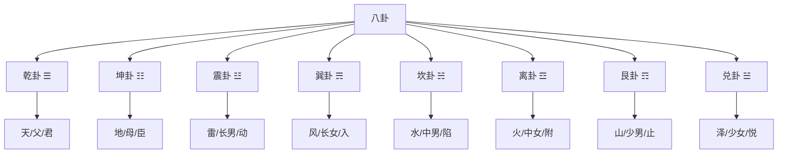
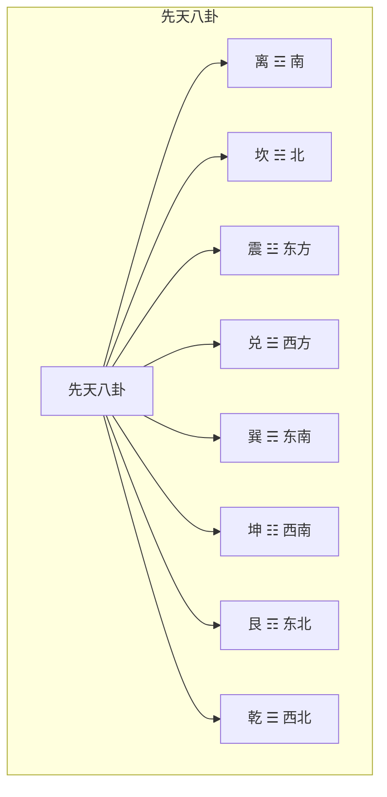

# 八卦基礎与象征

> 🎯 **學習目標**：掌握八卦的基本构成、象征意义、方位关系和先天后天八卦的区别，为深入學習《周易》和易学哲学打下坚实基礎。

## 📚 八卦的基本概念

### 什么是八卦

八卦是由三条爻组成的符号，每爻可以是阳爻（—）或阴爻（- -），因此八卦共有2³=8种组合。八卦是易学的基礎，象征着宇宙万物的八种基本狀態。

### 八卦的构成原理

**三条爻**：八卦由三条爻组成，从下到上分别称为下爻、中爻、上爻。

**阳爻阴爻**：每爻可以是阳爻（—）或阴爻（- -）。

**八卦组合**：三条爻可以产生2³=8种组合，这就是八卦。

**爻位含義**：下爻代表地，中爻代表人，上爻代表天，体现了天、地、人三才之道。

## 🔵 先天八卦

### 先天八卦的构成

先天八卦又称伏羲八卦，相传为伏羲氏所创。先天八卦强调宇宙的生成和演化過程。

### 先天八卦图

### 先天八卦的顺序

先天八卦的顺序是：乾、兑、离、震、巽、坎、艮、坤。這個顺序反映了宇宙的生成過程。

**乾一**：天，宇宙的起源
**兑二**：泽，天地的交融
**离三**：火，能量的释放
**震四**：雷，生命的萌动
**巽五**：风，万物的生长
**坎六**：水，生命的基礎
**艮七**：山，生命的形成
**坤八**：地，万物的母亲

### 先天八卦的哲学内涵

先天八卦主要体现的是宇宙的生成演化规律，体现了"有生于無"的哲学思想。

**从無到有**：从乾（天）到坤（地），体现了从無到有的生成過程。

**阴阳消长**：从乾到坤，体现了阴阳的消长過程。

**天地定位**：乾上坤下，体现了天在上、地在下的宇宙观。

**万物化生**：八卦象征万物的八种基本狀態，体现了万物的生成過程。

## 🟡 后天八卦

### 后天八卦的构成

后天八卦又称文王八卦，相传为周文王在先天八卦的基礎上重新排列而成。后天八卦强调万物的生成和發展過程。

### 后天八卦图

### 后天八卦的顺序

后天八卦的顺序是：震、巽、离、坤、兑、乾、坎、艮。這個顺序反映了万物的生长發展過程。

**震一**：春，万物萌动
**巽二**：春末，万物生长
**离三**：夏，万物繁盛
**坤四**：夏末，万物成熟
**兑五**：秋，万物收获
# 收藏
**坎七**：冬，万物蛰伏
**艮八**：冬末，万物待生

### 后天八卦的哲学内涵

后天八卦主要体现的是万物的生长發展规律，体现了"生生不息"的哲学思想。

**春夏秋冬**：八卦对应四季，体现了季节的循环。

# 收藏

**天地交感**：后天八卦体现了天地的交感互动。

**人道体现**：后天八卦更侧重于人道，强调人的作用。

## 🔤 先后天八卦的区别

### 主要区别

| 特點 | 先天八卦 | 后天八卦 |
|------|----------|----------|
| 创造者 | 伏羲 | 文王 |
| 强调 | 宇宙生成 | 万物發展 |
| 顺序 | 乾兑离震巽坎艮坤 | 震巽离坤兑乾坎艮 |
| 哲学 | 天道观 | 人道观 |
| 應用程式 | 宇宙观 | 实际應用程式 |

### 哲学意义

先天八卦主要体现的是宇宙的生成演化规律，强调天道。

后天八卦主要体现的是万物的生长發展规律，强调人道。

# 方法

## 📖 每一卦的詳細象征

### 乾卦 ☰

**基本象征**：天、父、君

**自然属性**：刚健、主动

**家庭象征**：父亲

**身体部位**：头、肺

**五行**：金

**卦德**：刚健中正

### 坤卦 ☷

**基本象征**：地、母、臣

**自然属性**：柔顺、被动

**家庭象征**：母亲

**身体部位**：腹、脾

**五行**：土

**卦德**：厚德载物

### 震卦 ☳

**基本象征**：雷、长男、动

**自然属性**：震动、啟動

**家庭象征**：长男

**身体部位**：足、肝

**五行**：木

**卦德**：震动奋起

### 巽卦 ☴

**基本象征**：风、长女、入

**自然属性**：顺从、渗透

**家庭象征**：长女

**身体部位**：股、胆

**五行**：木

**卦德**：顺从随和

### 坎卦 ☵

**基本象征**：水、中男、陷

**自然属性**：陷险、险陷

**家庭象征**：中男

**身体部位**：耳、肾

**五行**：水

**卦德**：险陷中求

### 离卦 ☲

**基本象征**：火、中女、附

**自然属性**：光明、依附

**家庭象征**：中女

**身体部位**：目、心

**五行**：火

**卦德**：光明附丽

### 艮卦 ☶

**基本象征**：山、少男、止

**自然属性**：止住、静止

**家庭象征**：少男

**身体部位**：手、胃

**五行**：土

**卦德**：止静待动

### 兑卦 ☱

**基本象征**：泽、少女、悦

**自然属性**：喜悦、快乐

**家庭象征**：少女

**身体部位**：口、肺

**五行**：金

**卦德**：喜悦和悦

## 🎯 八卦的哲学内涵

### 阴阳平衡

八卦体现了阴阳平衡的思想，每一卦都有特定的阴阳属性。

**四阳四阴**：八卦中，乾、震、坎、艮是阳卦，兑、离、巽、坤是阴卦。

**阴阳中和**：每一卦都有阴阳，体现了阴阳中和的思想。

**刚柔并济**：阳卦代表刚，阴卦代表柔，刚柔并济才能达到和谐。

### 三才之道

八卦体现了天、地、人三才之道的思想。

**下爻**：代表地，体现地之德
**中爻**：代表人，体现人之德
**上爻**：代表天，体现天之德

天人合一，是易学的核心思想。

### 宇宙观

八卦体现了古代中国的宇宙观。

**天圆地方**：乾代表天，坤代表地，体现了天圆地方的宇宙观。

**八极方位**：八卦对应八个方位，体现了对宇宙空間的认知。

**万物生成**：八卦象征万物的八种基本狀態，体现了万物生成的思想。

## 🔗 八卦与自然万物的对应

### 自然现象

| 八卦 | 自然现象 | 特征 |
|------|----------|------|
| 乾 | 天 | 高远、刚健 |
| 坤 | 地 | 承载、柔顺 |
| 震 | 雷 | 震动、啟動 |
| 巽 | 风 | 流动、渗透 |
| 坎 | 水 | 险陷、下流 |
| 离 | 火 | 光明、上升 |
| 艮 | 山 | 稳固、静止 |
| 兑 | 泽 | 汇聚、喜悦 |

### 家庭成员

| 八卦 | 家庭成员 | 关系 |
|------|----------|------|
| 乾 | 父亲 | 一家之主 |
| 坤 | 母亲 | 一家之母 |
| 震 | 长男 | 长子 |
| 巽 | 长女 | 长女 |
| 坎 | 中男 | 次子 |
| 离 | 中女 | 次女 |
| 艮 | 少男 | 少子 |
| 兑 | 少女 | 少女 |

### 身体部位

| 八卦 | 身体部位 | 特征 |
|------|----------|------|
| 乾 | 头、肺 | 高贵、呼吸 |
| 坤 | 腹、脾 | 包容、消化 |
| 震 | 足、肝 | 运动、疏泄 |
| 巽 | 股、胆 | 行动、决断 |
| 坎 | 耳、肾 | 聆听、排泄 |
| 离 | 目、心 | 视觉、神明 |
| 艮 | 手、胃 | 执握、消化 |
| 兑 | 口、肺 | 语言、呼吸 |

### 动物

| 八卦 | 动物 | 特征 |
|------|------|------|
| 乾 | 马 | 健壮、快速 |
| 坤 | 牛 | 温顺、勤劳 |
| 震 | 龙 | 威猛、变化 |
| 巽 | 鸡 | 守时、警觉 |
| 坎 | 猪 | 贪吃、懒惰 |
| 离 | 雉/雉鸡 | 美丽、骄傲 |
| 艮 | 狗 | 忠诚、看家 |
| 兑 | 羊 | 温和、合群 |

## 🎨 八卦在生活中的應用程式

### 決策參考

八卦可以用来辅助決策：

**乾卦**：适合采取主动、刚健的決策
**坤卦**：适合采取顺从、柔和的決策
**震卦**：适合采取啟動、变革的決策
**巽卦**：适合采取渗透、渐进的決策
**坎卦**：适合采取谨慎、冒险的決策
**离卦**：适合采取光明、附丽的決策
**艮卦**：适合采取稳重、保守的決策
**兑卦**：适合采取和谐、喜悦的決策

### 处世哲学

八卦蕴含着豐富的处世哲学：

**乾卦**：君子以自强不息
**坤卦**：君子以厚德载物
**震卦**：君子以恐惧修省
**巽卦**：君子以申命行事
**坎卦**：君子以常德行习教事
**离卦**：君子以明慎用刑而不留狱
**艮卦**：君子以思不出其位
**兑卦**：君子以朋友讲习

# 方法

### 先理解后记忆

理解八卦的基本构成和象征意义，然后再记忆，不要死记硬背。

### 圖形结合

结合八卦图来理解，通過圖形可以更直观地理解八卦的方位和关系。

### 實踐應用程式

将八卦的哲学思想應用程式于实际生活，在實踐中加深理解。

### 循序渐进

不要急于求成，先理解一两个卦，然后逐步擴展到全部八卦。

## 🔗 相關資源

- [[易学概述与發展史]] - 了解易学的發展历程
- [[易经结构与组成]] - 理解《周易》的基本结构
- [[阴阳五行理论基礎]] - 學習阴阳五行的基本理论
- [[六十四卦详解]] - 系統學習每一卦

---
*創建時間: 2026-02-01*  
*分類: 4 Interests*
