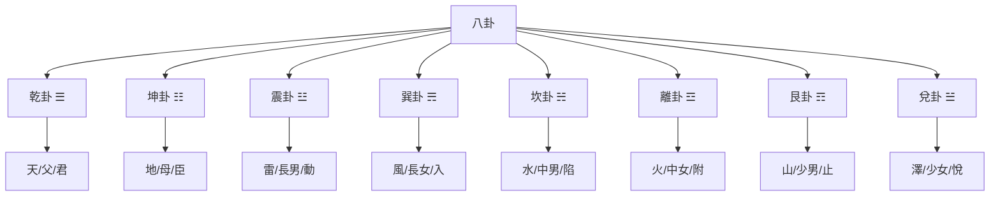
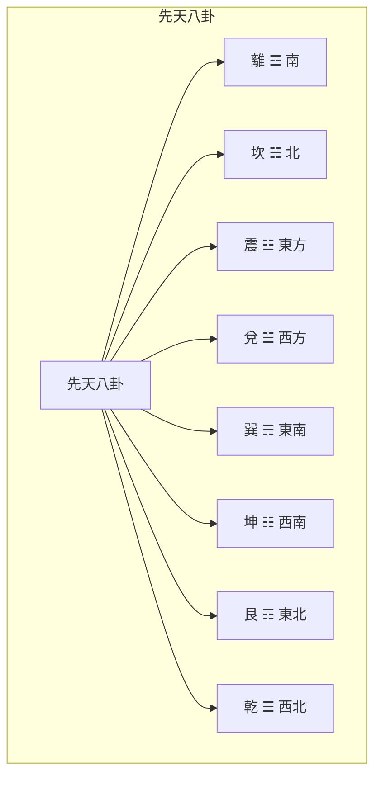

# 八卦基礎與象徵

> 🎯 **學習目標**：掌握八卦的基本構成、象徵意義、方位關係和先天后天八卦的區別，爲深入學習《周易》和易學哲學打下堅實基礎。

## 📚 八卦的基本概念

### 什麼是八卦

八卦是由三條爻組成的符號，每爻可以是陽爻（—）或陰爻（- -），因此八卦共有2³=8種組合。八卦是易學的基礎，象徵着宇宙萬物的八種基本狀態。

### 八卦的構成原理

**三條爻**：八卦由三條爻組成，從下到上分別稱爲下爻、中爻、上爻。

**陽爻陰爻**：每爻可以是陽爻（—）或陰爻（- -）。

**八卦組合**：三條爻可以產生2³=8種組合，這就是八卦。

**爻位含義**：下爻代表地，中爻代表人，上爻代表天，體現了天、地、人三才之道。

## 🔵 先天八卦

### 先天八卦的構成

先天八卦又稱伏羲八卦，相傳爲伏羲氏所創。先天八卦強調宇宙的生成和演化過程。

### 先天八卦圖

### 先天八卦的順序

先天八卦的順序是：乾、兌、離、震、巽、坎、艮、坤。這個順序反映了宇宙的生成過程。

**乾一**：天，宇宙的起源
**兌二**：澤，天地的交融
**離三**：火，能量的釋放
**震四**：雷，生命的萌動
**巽五**：風，萬物的生長
**坎六**：水，生命的基礎
**艮七**：山，生命的形成
**坤八**：地，萬物的母親

### 先天八卦的哲學內涵

先天八卦主要體現的是宇宙的生成演化規律，體現了"有生於無"的哲學思想。

**從無到有**：從乾（天）到坤（地），體現了從無到有的生成過程。

**陰陽消長**：從乾到坤，體現了陰陽的消長過程。

**天地定位**：乾上坤下，體現了天在上、地在下的宇宙觀。

**萬物化生**：八卦象徵萬物的八種基本狀態，體現了萬物的生成過程。

## 🟡 後天八卦

### 後天八卦的構成

後天八卦又稱文王八卦，相傳爲周文王在先天八卦的基礎上重新排列而成。後天八卦強調萬物的生成和發展過程。

### 後天八卦圖

### 後天八卦的順序

後天八卦的順序是：震、巽、離、坤、兌、乾、坎、艮。這個順序反映了萬物的生長發展過程。

**震一**：春，萬物萌動
**巽二**：春末，萬物生長
**離三**：夏，萬物繁盛
**坤四**：夏末，萬物成熟
**兌五**：秋，萬物收穫
# 收藏
**坎七**：冬，萬物蟄伏
**艮八**：冬末，萬物待生

### 後天八卦的哲學內涵

後天八卦主要體現的是萬物的生長發展規律，體現了"生生不息"的哲學思想。

**春夏秋冬**：八卦對應四季，體現了季節的循環。

# 收藏

**天地交感**：後天八卦體現了天地的交感互動。

**人道體現**：後天八卦更側重於人道，強調人的作用。

## 🔤 先後天八卦的區別

### 主要區別

| 特點 | 先天八卦 | 後天八卦 |
|------|----------|----------|
| 創造者 | 伏羲 | 文王 |
| 強調 | 宇宙生成 | 萬物發展 |
| 順序 | 乾兌離震巽坎艮坤 | 震巽離坤兌乾坎艮 |
| 哲學 | 天道觀 | 人道觀 |
| 應用程式 | 宇宙觀 | 實際應用程式 |

### 哲學意義

先天八卦主要體現的是宇宙的生成演化規律，強調天道。

後天八卦主要體現的是萬物的生長發展規律，強調人道。

# 方法

## 📖 每一卦的詳細象徵

### 乾卦 ☰

**基本象徵**：天、父、君

**自然屬性**：剛健、主動

**家庭象徵**：父親

**身體部位**：頭、肺

**五行**：金

**卦德**：剛健中正

### 坤卦 ☷

**基本象徵**：地、母、臣

**自然屬性**：柔順、被動

**家庭象徵**：母親

**身體部位**：腹、脾

**五行**：土

**卦德**：厚德載物

### 震卦 ☳

**基本象徵**：雷、長男、動

**自然屬性**：震動、啟動

**家庭象徵**：長男

**身體部位**：足、肝

**五行**：木

**卦德**：震動奮起

### 巽卦 ☴

**基本象徵**：風、長女、入

**自然屬性**：順從、滲透

**家庭象徵**：長女

**身體部位**：股、膽

**五行**：木

**卦德**：順從隨和

### 坎卦 ☵

**基本象徵**：水、中男、陷

**自然屬性**：陷險、險陷

**家庭象徵**：中男

**身體部位**：耳、腎

**五行**：水

**卦德**：險陷中求

### 離卦 ☲

**基本象徵**：火、中女、附

**自然屬性**：光明、依附

**家庭象徵**：中女

**身體部位**：目、心

**五行**：火

**卦德**：光明附麗

### 艮卦 ☶

**基本象徵**：山、少男、止

**自然屬性**：止住、靜止

**家庭象徵**：少男

**身體部位**：手、胃

**五行**：土

**卦德**：止靜待動

### 兌卦 ☱

**基本象徵**：澤、少女、悅

**自然屬性**：喜悅、快樂

**家庭象徵**：少女

**身體部位**：口、肺

**五行**：金

**卦德**：喜悅和悅

## 🎯 八卦的哲學內涵

### 陰陽平衡

八卦體現了陰陽平衡的思想，每一卦都有特定的陰陽屬性。

**四陽四陰**：八卦中，乾、震、坎、艮是陽卦，兌、離、巽、坤是陰卦。

**陰陽中和**：每一卦都有陰陽，體現了陰陽中和的思想。

**剛柔並濟**：陽卦代表剛，陰卦代表柔，剛柔並濟才能達到和諧。

### 三才之道

八卦體現了天、地、人三才之道的思想。

**下爻**：代表地，體現地之德
**中爻**：代表人，體現人之德
**上爻**：代表天，體現天之德

天人合一，是易學的核心思想。

### 宇宙觀

八卦體現了古代中國的宇宙觀。

**天圓地方**：乾代表天，坤代表地，體現了天圓地方的宇宙觀。

**八極方位**：八卦對應八個方位，體現了對宇宙空間的認知。

**萬物生成**：八卦象徵萬物的八種基本狀態，體現了萬物生成的思想。

## 🔗 八卦與自然萬物的對應

### 自然現象

| 八卦 | 自然現象 | 特徵 |
|------|----------|------|
| 乾 | 天 | 高遠、剛健 |
| 坤 | 地 | 承載、柔順 |
| 震 | 雷 | 震動、啟動 |
| 巽 | 風 | 流動、滲透 |
| 坎 | 水 | 險陷、下流 |
| 離 | 火 | 光明、上升 |
| 艮 | 山 | 穩固、靜止 |
| 兌 | 澤 | 匯聚、喜悅 |

### 家庭成員

| 八卦 | 家庭成員 | 關係 |
|------|----------|------|
| 乾 | 父親 | 一家之主 |
| 坤 | 母親 | 一家之母 |
| 震 | 長男 | 長子 |
| 巽 | 長女 | 長女 |
| 坎 | 中男 | 次子 |
| 離 | 中女 | 次女 |
| 艮 | 少男 | 少子 |
| 兌 | 少女 | 少女 |

### 身體部位

| 八卦 | 身體部位 | 特徵 |
|------|----------|------|
| 乾 | 頭、肺 | 高貴、呼吸 |
| 坤 | 腹、脾 | 包容、消化 |
| 震 | 足、肝 | 運動、疏泄 |
| 巽 | 股、膽 | 行動、決斷 |
| 坎 | 耳、腎 | 聆聽、排泄 |
| 離 | 目、心 | 視覺、神明 |
| 艮 | 手、胃 | 執握、消化 |
| 兌 | 口、肺 | 語言、呼吸 |

### 動物

| 八卦 | 動物 | 特徵 |
|------|------|------|
| 乾 | 馬 | 健壯、快速 |
| 坤 | 牛 | 溫順、勤勞 |
| 震 | 龍 | 威猛、變化 |
| 巽 | 雞 | 守時、警覺 |
| 坎 | 豬 | 貪喫、懶惰 |
| 離 | 雉/雉雞 | 美麗、驕傲 |
| 艮 | 狗 | 忠誠、看家 |
| 兌 | 羊 | 溫和、合羣 |

## 🎨 八卦在生活中的應用程式

### 決策參考

八卦可以用來輔助決策：

**乾卦**：適合採取主動、剛健的決策
**坤卦**：適合採取順從、柔和的決策
**震卦**：適合採取啟動、變革的決策
**巽卦**：適合採取滲透、漸進的決策
**坎卦**：適合採取謹慎、冒險的決策
**離卦**：適合採取光明、附麗的決策
**艮卦**：適合採取穩重、保守的決策
**兌卦**：適合採取和諧、喜悅的決策

### 處世哲學

八卦蘊含着豐富的處世哲學：

**乾卦**：君子以自強不息
**坤卦**：君子以厚德載物
**震卦**：君子以恐懼修省
**巽卦**：君子以申命行事
**坎卦**：君子以常德行習教事
**離卦**：君子以明慎用刑而不留獄
**艮卦**：君子以思不出其位
**兌卦**：君子以朋友講習

# 方法

### 先理解後記憶

理解八卦的基本構成和象徵意義，然後再記憶，不要死記硬背。

### 圖形結合

結合八卦圖來理解，通過圖形可以更直觀地理解八卦的方位和關係。

### 實踐應用程式

將八卦的哲學思想應用程式於實際生活，在實踐中加深理解。

### 循序漸進

不要急於求成，先理解一兩個卦，然後逐步擴展到全部八卦。

## 🔗 相關資源

- [[易學概述與發展史]] - 瞭解易學的發展歷程
- [[易經結構與組成]] - 理解《周易》的基本結構
- [[陰陽五行理論基礎]] - 學習陰陽五行的基本理論
- [[六十四卦詳解]] - 系統學習每一卦

---
*創建時間: 2026-02-01*  
*分類: 4 Interests*
