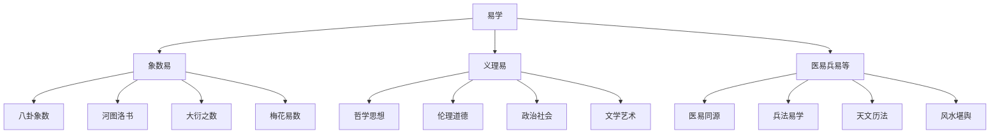
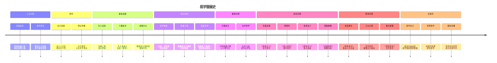

# 易学概述与發展史

> 🎯 **學習目標**：了解易学的起源、發展历程、主要流派和在中国文化史上的重要地位，建立对易学的整體认识。

## 📚 什么是易学

### 易学的基本概念

# 方法

### 易学的三重内涵



### 易学三义

**变易**：宇宙万物都在不断变化，没有永恒不变的事物。《系辞上》雲端："生生之谓易"，說明易的核心在于变化。

**不易**：虽然万物在变化，但变化的规律是永恒不变的。春夏秋冬四季循环，生老病死自然规律，这些都是不易。

**简易**：掌握了变化的规律后，复杂的事物就变得简单了。所谓"大道至简"，易学的最高境界就是将复杂的宇宙规律簡化为最简单的形式。

### 易学在中国文化中的地位

```mermaid
graph LR
    A[易学] --> B[六经之首]
    A --> C[哲学源头]
    A --> D[智慧宝库]
    A --> E[文化核心]
    
    B --> B1[儒家推崇]
    B --> B2[科举必考]
    B --> B3[文人必读]
    
    C --> C1[道家思想]
    C --> C2[兵法兵家]
    C --> C3[医易同源]
    
# 方法
    D --> D2[处世哲学]
    D --> D3[決策智慧]
    
    E --> E1[天人合一]
    E --> E2[中庸之道]
    E --> E3[阴阳平衡]
```

## 🕰️ 易学發展歷史

### 三圣作易

根据传统说法，易学的形成经历了"三圣作易"的過程：

**伏羲氏**（上古）：作八卦

相传伏羲氏仰观天象，俯察地理，创造了八卦，用以象征宇宙万物的八种基本狀態。《系辞下》雲端："古者包牺氏之王天下也，仰则观象于天，俯则观法于地，观鸟兽之文与地之宜，近取诸身，远取诸物，于是始作八卦，以通神明之德，以类万物之情。"

**周文王**（中古）：演六十四卦

周文王在伏羲八卦的基礎上，将八卦两两相重，演为六十四卦，并作了卦辞和爻辞。《系辞下》雲端："易之兴也，其于中古乎？作易者，其有忧患乎？"

**孔子**（近古）：作十翼

孔子晚年喜易，韦编三绝，作《易传》（又称《十翼》）来解釋《易经》。《史记·孔子世家》载："孔子晚而喜易，序彖、系、象、说卦、文言。"

### 易学發展時間軸



## 🏛️ 易学主要流派

### 象数易派

**特點**：注重卦象和数理，通過观察卦象的变化来推测吉凶。

**代表人物**：
- **京房**（汉）：创立八宫卦说、纳甲法、纳支法，开创象数易学新纪元
- **邵雍**（宋）：创立先天学，著《皇极经世书》，用数理推演宇宙歷史
- **尚秉和**（清）：专研象数，著《周易尚氏学》

# 方法
- 八宫卦：将六十四卦按八宫分類，每宫八卦
- 纳甲纳支：将天干地支纳入卦中，用于占卜
- 大衍之数：用五十根蓍草進行占卜
- 梅花易数：用数字、時間、方位等起卦

### 义理易派

**特點**：注重易理的哲学内涵，从伦理、政治、哲学等角度阐释《周易》。

**代表人物**：
- **王弼**（魏晋）：扫除象数之繁，以义理为主，主张"得意忘象"
- **程颐**（宋）：著《伊川易传》，用理学思想阐释易理
- **朱熹**（宋）：著《周易本义》，集义理易学之大成
- **王夫之**（明末清初）：著《周易外传》，用唯物主义观点阐释易理

**主要观点**：
- 易学是政治哲学：《周易》包含君臣父子、治国安邦的道理
- 易学是伦理学：强调君子之道、中庸之德
- 易学是哲学：探讨天人关系、宇宙规律、人生哲理

### 医易派

# 方法

**代表人物**：
- **孙思邈**（唐）："不知易，不足以言太医"
- **张景岳**（明）：著《类经图翼》，用易理解釋医学

**主要理论**：
- 阴阳平衡：用阴阳理论解釋人体生理病理
- 五行生克：用五行理论解釋脏腑关系
- 卦象与疾病：将八卦与身体部位、器官对应
- 八卦与药物：用八卦理论解釋药性药理

### 兵法易派

**特點**：将易学應用程式于军事，用易理指导战争。

**代表人物**：
- **孙武**（春秋）：《孙子兵法》深受易学影响
- **诸葛亮**（三国）：精通易学，用之指导军事

**主要應用程式**：
# 分析
- 军队布局：用八卦方位安排军队
- 时机把握：用十二訊息卦把握战机

## 📊 易学的哲学贡献

### 天人合一思想

易学的核心思想是"天人合一"，认为人是自然的一部分，應該顺应自然规律而生活。

**《系辞上》雲端**："一阴一阳之谓道，继之者善也，成之者性也。"这說明阴阳变化是道，人應該继承这种变化，形成自己的本性。

### 变易哲学

易学认为宇宙万物都在不断变化，没有永恒不变的事物。这种变化是有规律的，掌握了规律就能顺应变化。

**《系辞下》雲端**："易之为书也，广大悉备，有天道焉，有人道焉，有地道焉。"說明易学包含了天地人的道理。

### 中庸之道

易学强调中庸之道，主张凡事不要走极端，要适度。

**《系辞上》雲端**："一阴一阳之谓道"，說明阴阳要平衡，不可偏废。在处世中也要刚柔并济，阴阳平衡。

## 🎯 易学的现代價值

### 哲学價值

易学是中国古代哲学的集大成者，对后来的儒家、道家、兵家、医家等都产生了深远影响。

### 文化價值

易学是中国文化的源头之一，是中国人的宇宙观、價值观、人生观的重要来源。

### 應用程式價值

易学的智慧可以應用程式于现代生活的各个方面：

```mermaid
graph TB
    A[易学现代應用程式] --> B[个人修养]
# 管理
    A --> D[決策咨询]
    A --> E[心理健康]
    
    B --> B1[自我认知]
    B --> B2[心性修养]
    B --> B3[人生規劃]
    
    C --> C1[战略決策]
# 管理
    C --> C3[危机应对]
    
    D --> D1[时机把握]
    D --> D2[风险評估]
    D --> D3[进退判斷]
    
    E --> E1[情绪调节]
# 管理
    E --> E3[人格完善]
```

## 📖 重要经典文獻

### 古代经典

**《周易》**：分为《经》和《传》两部分。《经》包括六十四卦的卦辞和爻辞；《传》包括《彖辞》《象辞》《系辞》《文言》《说卦》《序卦》《杂卦》等七种十篇，合称《十翼》。

**《易传》**：又称《十翼》，是对《经》的解釋和发挥，是易学哲学思想的重要载体。

### 历代注疏

**《周易本义》**（朱熹 宋）：朱熹对《周易》的注疏，是理学的代表作品。

**《易经来注》**（来知德 明）：明代来知德的注本，集前人之大成。

**《周易折中》**（李光地 清）：清代官方注本，乾隆帝御定。

**《王弼注》**（王弼 魏晋）：扫除象数之繁，以义理为主的代表作品。

## 🤔 學習易学的意义

### 文化传承

學習易学是传承中华優秀传统文化的重要途径，了解中国人的宇宙观、價值观、人生观。

### 哲学思辨

易学蕴含着深刻的哲学思想，學習易学可以培养思辨能力，理解宇宙人生的深刻道理。

### 實踐指导

易学的智慧可以指导我们的日常生活，帮助我们做出更好的決策，處理人际关系，提升个人修养。

### 心灵滋养

易学是一种心灵滋养的方式，通過學習易学，可以达到内心的平静和智慧的增长。

## 💡 學習易学的正确态度

### 尊重传统

对传统文化保持敬畏之心，理解易学在中华文明中的重要地位，不轻视、不嘲弄。

### 理性客观

以理性客观的态度學習易学，不陷入迷信和宿命论，理解易学的哲学内涵而非占卜結果。

### 哲学导向

将易学作为一种哲学思想来學習，而非纯粹的占卜工具，注重其哲学價值和人生智慧。

### 循序渐进

从基礎開始，循序渐进地學習，不可急于求成，更不可断章取义。

### 理论實踐结合

# 方法

## 🔗 相關資源

- [[易经结构与组成]] - 學習《周易》的基本结构
# 知識
- [[阴阳五行理论基礎]] - 理解阴阳五行的基本理论
# 方法

---
*創建時間: 2026-02-01*  
*分類: 4 Interests*
