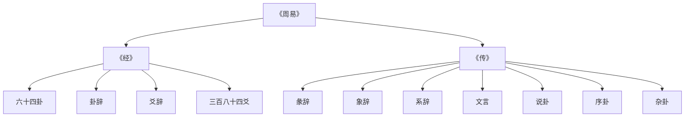
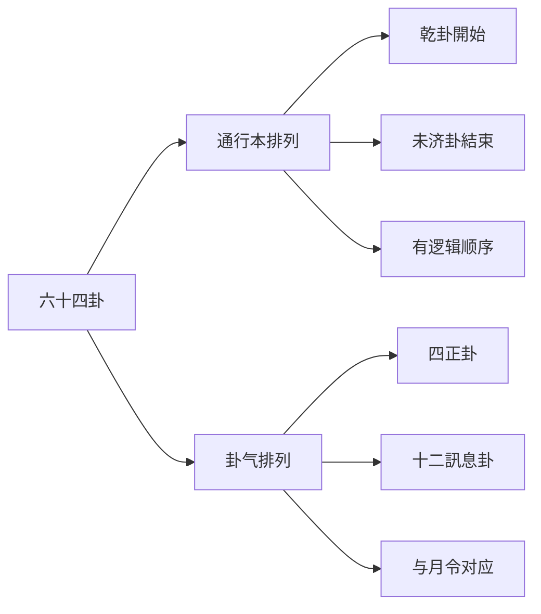
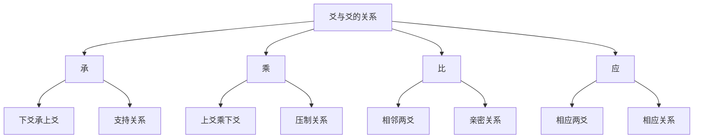
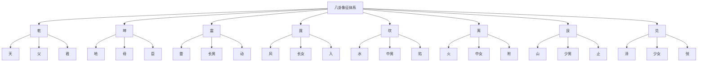

# 易经结构与组成

> 🎯 **學習目標**：掌握《周易》的基本结构，理解《经》与《传》的关系，熟悉六十四卦的排列规律，为深入學習《周易》打下坚实基礎。

## 📚 《周易》的基本构成

### 经传分体

《周易》由《经》和《传》两部分组成，这是易学研究的基本分類。

### 《经》的组成

《经》是指《周易》的原文部分，包括六十四卦、卦辞和爻辞。

**六十四卦**：由八卦两两相重而成，每卦六爻，共三百八十四爻。

**卦辞**：每卦的总說明，解釋一卦的基本含義。《说卦》雲端："卦者，象也；象者，像也。"

**爻辞**：每爻的具体說明，解釋某一爻的特殊情况。《系辞下》雲端："爻者，效天下之动者也。"

**三百八十四爻**：六十四卦每卦六爻，共三百八十四爻。

### 《传》的组成

《传》又称《十翼》，是对《经》的解釋和发挥，共七种十篇。

**《彖辞》**（上下篇）：解釋卦辞的哲学内涵，阐明一卦的大义。

**《象辞》**（上下篇）：用形象比喻解釋卦的含義，分大象和小象。

**《系辞》**（上下篇）：阐述易学的哲学思想，是易学哲学的集中体现。

**《文言》**：专门解釋乾、坤两卦，是《彖辞》《象辞》的补充。

**《说卦》**：解釋八卦的象征意义，阐述八卦与自然万物的对应关系。

**《序卦》**：解釋六十四卦的排列顺序，說明卦与卦之间的因果关系。

**《杂卦》**：杂述六十四卦的关系，用简洁的语言概括每卦的特點。

## 📖 六十四卦的结构

### 卦的基本构成

每卦由六个爻组成，从下到上分别称为：初爻、二爻、三爻、四爻、五爻、上爻。

**爻的性质**：爻分阴阳，用"—"表示阳爻，用"- -"表示阴爻。

**爻的位置**：爻的位置有特殊的哲学意义。初爻代表開始，上爻代表终结。

**爻的变化**：爻可以变化，阴爻可以变为阳爻，阳爻可以变为阴爻，这就是"变爻"。

### 卦名的构成

卦名通常由两个字组成，如"乾卦""坤卦"等。

**第一个字**：通常表示卦的基本性质，如"乾"表示刚健，"坤"表示柔顺。

**第二个字**：表示卦的属性，如"卦"表示这是一个卦象。

### 六十四卦的排列

六十四卦按照一定的规律排列，主要有两种排列方式：

**通行本排列**：即《周易》的排列方式，从乾卦開始，到未济卦結束。

**卦气排列**：按卦气学说排列，每卦对应一个月，用卦气表示一年四季的变化。

## 🎯 卦辞的结构

### 卦辞的基本构成

卦辞是对一卦的总說明，通常包括以下內容：

**卦名**：說明这是哪一卦。

**卦义**：解釋一卦的基本含義。

**吉凶**：判斷这一卦是吉还是凶。

**条件**：說明在什么情况下是吉，什么情况下是凶。

# 方法

解读卦辞需要注意以下几点：

**理解卦名**：首先要理解卦名的含義，这是理解一卦的基礎。

**结合卦象**：卦辞要与卦象结合起来理解，不能孤立地解读卦辞。

**注意条件**：卦辞中的吉凶都是有条件的，不能简单地认为某卦就是吉或某卦就是凶。

**參考彖象**：彖辞和象辞是对卦辞的深入解釋，要结合起来理解。

## 📿 爻辞的结构

### 爻辞的基本构成

爻辞是对一爻的具体說明，通常包括以下內容：

**爻位**：說明这是第几爻。

**爻的性质**：說明这一爻是阳爻还是阴爻。

**爻义**：解釋这一爻的含義。

**吉凶**：判斷这一爻是吉还是凶。

# 方法

解读爻辞需要注意以下几点：

**理解爻位**：爻位有特殊的哲学意义，初爻代表開始，上爻代表终结。

**理解爻性**：爻性指爻的性质，阳爻代表刚健，阴爻代表柔顺。

**理解爻与爻的关系**：爻与爻之间有承乘比应的关系，这影响爻的含義。

**理解变爻**：爻可以变化，变爻会影响卦的含義。

### 爻与爻的关系

**承**：下爻承上爻，表示支持关系。

**乘**：上爻乘下爻，表示压制关系。

**比**：相邻两爻，表示亲密关系。

**应**：相应两爻（初爻与四爻，二爻与五爻，三爻与上爻），表示相应关系。

## 🔤 《彖辞》的结构

### 彖辞的基本构成

彖辞是对卦辞的哲学解釋，通常包括以下內容：

**卦名**：說明这是哪一卦。

**卦德**：解釋一卦的德性。

**卦用**：解釋一卦的用途。

**卦象**：解釋一卦的象义。

### 彖辞的哲学内涵

彖辞的哲学内涵非常豐富，主要包括：

**天道观**：阐述天人关系，强调人應該顺应天道。

**伦理观**：阐述君臣父子、夫妻朋友的伦理关系。

**政治观**：阐述治国安邦的道理。

**人生观**：阐述处世的哲学和人生智慧。

## 🌊 《象辞》的结构

### 象辞的基本构成

象辞是用形象比喻解釋卦的含義，分为大象和小象。

**大象**：解釋一卦的整體象义。

**小象**：解釋一爻的象义。

### 象辞的修辞艺术

象辞的修辞艺术非常高超，主要特點包括：

**形象生动**：用具体的形象說明抽象的道理。

**比喻恰当**：用恰当的比喻解釋复杂的易理。

**简洁精炼**：用简洁的语言传达深刻的哲理。

**音韵和谐**：讲究音韵，读起来朗朗上口。

## 📜 《系辞》的结构

### 《系辞》的基本构成

《系辞》是易学哲学的集中体现，分为上下两篇。

**上篇**：主要阐述宇宙观、人生观、天人关系等哲学問題。

# 方法

### 《系辞》的哲学思想

《系辞》的哲学思想非常豐富，主要包括：

**一阴一阳之谓道**：阴阳是宇宙的基本规律。

**天人合一**：人是自然的一部分，應該顺应自然规律。

**变易不易简易**：宇宙万物都在变化，但变化的规律不变，掌握了规律就变得简单。

**中庸之道**：凡事不要走极端，要适度。

## 🎨 《文言》的结构

### 《文言》的基本构成

《文言》是专门解釋乾、坤两卦的文章，分为两部分：

**乾卦文言**：解釋乾卦的卦辞、爻辞、彖辞、象辞。

**坤卦文言**：解釋坤卦的卦辞、爻辞、彖辞、象辞。

### 《文言》的哲学内涵

《文言》的哲学内涵主要包括：

**君子的品德**：阐述君子應該具备的品德和修养。

# 方法

**进退的道理**：阐述君子进退的道理和时机把握。

## 🔮 《说卦》的结构

### 《说卦》的基本构成

《说卦》主要解釋八卦的象征意义，阐述八卦与自然万物的对应关系。

**八卦的基本含義**：解釋乾、坤、震、巽、坎、离、艮、兑八卦的基本含義。

**八卦与自然万物的对应**：阐述八卦与自然万物的对应关系，包括天、地、雷、风、水、火、山、泽等。

### 八卦的象征体系

## 📖 《序卦》的结构

### 《序卦》的基本构成

《序卦》解釋六十四卦的排列顺序，說明卦与卦之间的因果关系。

**卦序的逻辑**：阐述六十四卦排列的逻辑和顺序。

**卦与卦的关系**：說明卦与卦之间的因果关系和發展关系。

### 《序卦》的逻辑思想

《序卦》的逻辑思想主要包括：

**因果关系**：前一卦是后一卦的原因，后一卦是前一卦的結果。

**發展关系**：卦与卦之间存在發展的关系，从低级到高级。

**循环关系**：卦与卦之间还存在循环关系，从起点回到起点。

## 🎭 《杂卦》的结构

### 《杂卦》的基本构成

《杂卦》杂述六十四卦的关系，用简洁的语言概括每卦的特點。

**卦的特點**：概括每卦的特點和性质。

**卦与卦的关系**：杂述卦与卦之间的关系。

### 《杂卦》的修辞特點

**简洁精炼**：用简洁的语言概括复杂的卦义。

**对仗工整**：卦与卦之间形成对仗，形式美观。

**音韵和谐**：讲究音韵，读起来朗朗上口。

## 🔗 相關資源

- [[易学概述与發展史]] - 了解易学的發展历程
# 知識
- [[阴阳五行理论基礎]] - 理解阴阳五行理论
- [[六十四卦详解]] - 系統學習每一卦

---
*創建時間: 2026-02-01*  
*分類: 4 Interests*
