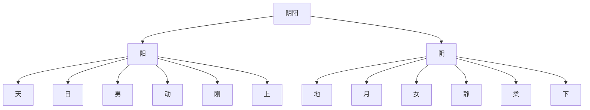
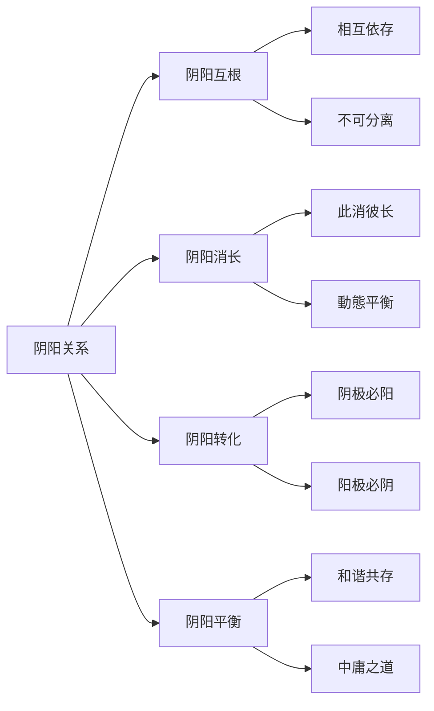
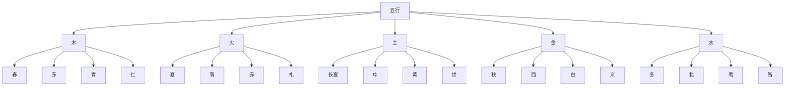
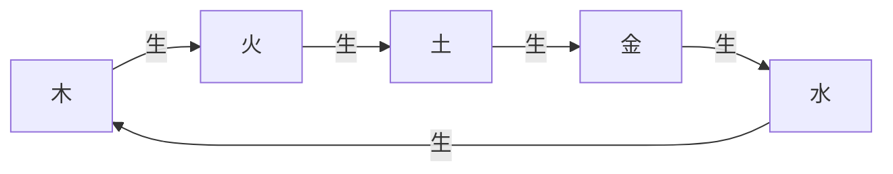
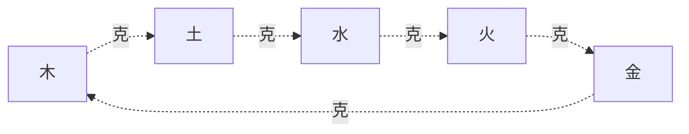
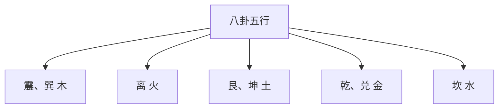

# 阴阳五行理论基礎

> 🎯 **學習目標**：掌握阴阳的基本概念和五行理论，理解阴阳五行的相生相克关系，以及在易学中的應用程式，为深入學習《周易》打下坚实的理论基礎。

## 📚 阴阳的基本概念

### 什么是阴阳

阴阳是中国古代哲学的一对基本概念，用来解釋宇宙万物的对立統一关系。阴阳不是绝对的对立，而是相互依存、相互转化、相互制约的对立統一。

### 阴阳的特征

**阳**：
- 主动、外向、明亮、温暖、刚强
- 天、日、男、上、左、奇数
- 功能为推动、创造、發展

**阴**：
- 被动、内向、阴暗、寒冷、柔弱
- 地、月、女、下、右、偶数
# 收藏

### 阴阳的关系

### 阴阳在易学中的應用程式

**八卦的阴阳**：
- 乾、震、坎、艮为阳卦
- 兑、离、巽、坤为阴卦

**六十四卦的阴阳**：
- 阳卦：阳爻多于阴爻的卦
- 阴卦：阴爻多于阳爻的卦
- 阴阳平衡卦：阴阳爻数量相等的卦

**爻的阴阳**：
- 阳爻：—
- 阴爻：- -

## 🌊 五行的基本概念

### 什么是五行

五行是中国古代哲学的另一个基本概念，用来解釋宇宙万物的构成和相互关系。五行包括木、火、土、金、水五种基本元素，这五种元素之间存在相生相克的关系。

### 五行的基本属性

### 五行的特征

**木**：
- 季节：春
- 方位：东
- 颜色：青
- 五德：仁
- 特性：生发、条达
- 对应：肝、胆、目、筋

**火**：
- 季节：夏
- 方位：南
- 颜色：赤
- 五德：礼
- 特性：炎上、光明
- 对应：心、小肠、舌、脉

**土**：
- 季节：长夏
- 方位：中
- 颜色：黄
- 五德：信
- 特性：承载、生化
- 对应：脾、胃、口、肉

**金**：
- 季节：秋
- 方位：西
- 颜色：白
- 五德：义
- 特性：收敛、肃杀
- 对应：肺、大肠、鼻、皮

**水**：
- 季节：冬
- 方位：北
- 颜色：黑
- 五德：智
# 收藏
- 对应：肾、膀胱、耳、骨

## 🔄 五行相生相克

### 五行相生

五行相生是指五行之间存在促进、助长、滋生、帮助的关系。

**相生关系**：
- 木生火：木燃烧产生火
- 火生土：火烧成灰变为土
- 土生金：土中埋藏金矿
- 金生水：金属冷却产生水
- 水生木：水滋养树木

### 五行相克

五行相克是指五行之间存在制约、压制、克服、控制的关系。

**相克关系**：
- 木克土：树木破土而出
- 土克水：土吸收水分
- 水克火：水能灭火
- 火克金：火能熔金
- 金克木：金能砍木

### 五行的旺相休囚死

**旺**：处于最旺盛的狀態
**相**：处于次旺盛的狀態
**休**：处于休息的狀態
**囚**：处于受制狀態
**死**：处于最衰弱的狀態

以木为例：
- 春季：木旺、火相、土休、金囚、水死

## 🎯 阴阳与五行的关系

### 阴阳在五行中的体现

**木**：阳木、阴木
**火**：阳火、阴火
**土**：阳土、阴土
**金**：阳金、阴金
**水**：阳水、阴水

每一行都有阴阳之分，体现了阴阳思想的普遍性。

### 五行在八卦中的体现

**震、巽**：属木
**离**：属火
**艮、坤**：属土
**乾、兑**：属金
**坎**：属水

## 🔍 阴阳五行在占卜中的應用程式

### 卦的五行属性

在占卜中，每一卦都有特定的五行属性。

**震卦、巽卦**：属木
**离卦**：属火
**艮卦、坤卦**：属土
**乾卦、兑卦**：属金
**坎卦**：属水

### 爻的五行属性

# 方法

### 五行的生克應用程式

在占卜中，五行的生克关系是判斷吉凶的重要依据。

**生**：五行相生为吉
**克**：五行相克为凶
**比**：五行相同为和

## 💡 阴阳五行在生活中的應用程式

### 养生保健

阴阳五行理论是中国传统养生保健的基礎。

**春夏养阳，秋冬养阴**：
- 春夏是阳气生长的季节，要注意养阳
# 收藏

**饮食养生**：
- 木行人：多吃酸味食物，养肝
- 火行人：多吃苦味食物，养心
- 土行人：多吃甘味食物，养脾
- 金行人：多吃辛味食物，养肺
- 水行人：多吃咸味食物，养肾

# 管理

# 管理

**木行人**：容易愤怒，要学会宽容
**火行人**：容易急躁，要学会冷静
**土行人**：容易多疑，要学会信任
**金行人**：容易悲伤，要学会乐观
**水行人**：容易恐惧，要学会勇敢

### 人际交往

阴阳五行理论可以用来指导人际交往。

**五行相生**：相生关系的人容易相处
**五行相克**：相克关系的人容易产生冲突

## 🔗 阴阳五行在易学中的地位

### 基礎理论

阴阳五行理论是易学的基礎理论，不理解阴阳五行就無法理解《周易》的深层含義。

### 哲学核心

阴阳五行理论是易学哲学的核心，体现了中国古代对宇宙万物的根本认识。

### 實踐指导

阴阳五行理论是易学實踐的指导，为占卜、养生、处世等提供了理论基礎。

## 📊 阴阳五行的歷史發展

### 阴阳学说的發展

阴阳学说起源于上古，經過长期的發展，形成了完整的理论体系。

**起源**：上古时期，人们对自然现象的观察
**發展**：春秋战国，诸子百家对阴阳的阐述
**成熟**：汉代，董仲舒等对阴阳的哲学化
**完善**：宋明时期，理学家对阴阳的深入阐释

### 五行学说的發展

五行学说同样经历了长期的發展過程。

**起源**：上古时期，人们对物质的认识
**發展**：春秋战国，《尚书·洪范》明确五行
**成熟**：汉代，五行的系統化
**完善**：宋明时期，五行的哲学化

## 🎨 阴阳五行的现代意义

### 哲学意义

阴阳五行理论体现了中国古代的辩证法思想，对现代哲学仍有启发意义。

### 科學意义

阴阳五行理论虽然不是现代科學，但其整體观念、平衡观念对现代科學仍有借鉴意义。

### 文化意义

阴阳五行理论是中国传统文化的重要组成部分，对现代文化仍有重要影响。

# 方法

### 理解为主

理解阴阳五行的基本概念和相互关系，不要死记硬背。

### 圖形结合

结合五行图、八卦图等圖形来理解，通過圖形可以更直观地理解阴阳五行的关系。

### 實踐應用程式

将阴阳五行的理论應用程式于实际生活，在實踐中加深理解。

### 理性客观

以理性客观的态度學習阴阳五行，不要陷入迷信和神秘化。

## 🔗 相關資源

- [[易学概述与發展史]] - 了解易学的發展历程
- [[易经结构与组成]] - 理解《周易》的基本结构
# 知識
- [[六十四卦详解]] - 系統學習每一卦

---
*創建時間: 2026-02-01*  
*分類: 4 Interests*
