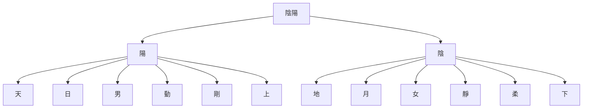
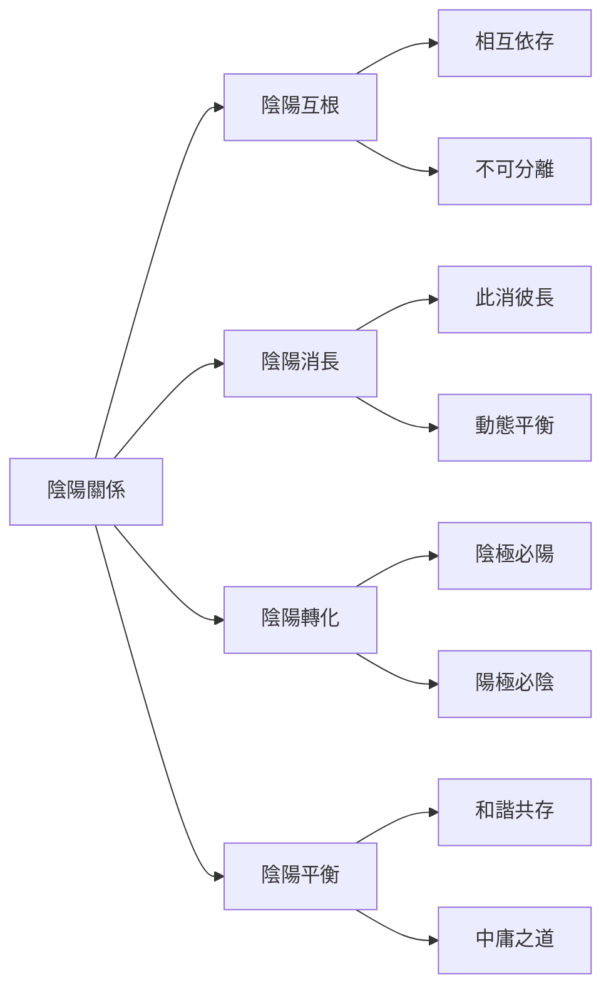
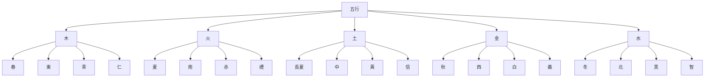
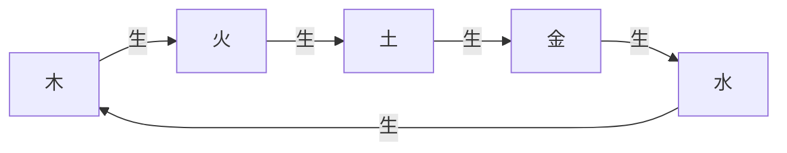
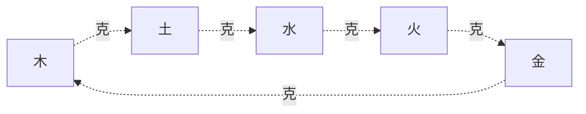
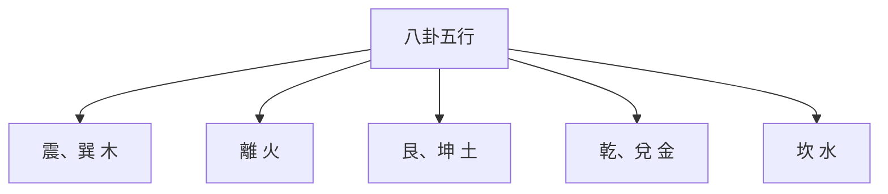

# 陰陽五行理論基礎

> 🎯 **學習目標**：掌握陰陽的基本概念和五行理論，理解陰陽五行的相生相剋關係，以及在易學中的應用程式，爲深入學習《周易》打下堅實的理論基礎。

## 📚 陰陽的基本概念

### 什麼是陰陽

陰陽是中國古代哲學的一對基本概念，用來解釋宇宙萬物的對立統一關係。陰陽不是絕對的對立，而是相互依存、相互轉化、相互制約的對立統一。

### 陰陽的特徵

**陽**：
- 主動、外向、明亮、溫暖、剛強
- 天、日、男、上、左、奇數
- 功能爲推動、創造、發展

**陰**：
- 被動、內向、陰暗、寒冷、柔弱
- 地、月、女、下、右、偶數
# 收藏

### 陰陽的關係

### 陰陽在易學中的應用程式

**八卦的陰陽**：
- 乾、震、坎、艮爲陽卦
- 兌、離、巽、坤爲陰卦

**六十四卦的陰陽**：
- 陽卦：陽爻多於陰爻的卦
- 陰卦：陰爻多於陽爻的卦
- 陰陽平衡卦：陰陽爻數量相等的卦

**爻的陰陽**：
- 陽爻：—
- 陰爻：- -

## 🌊 五行的基本概念

### 什麼是五行

五行是中國古代哲學的另一個基本概念，用來解釋宇宙萬物的構成和相互關係。五行包括木、火、土、金、水五種基本元素，這五種元素之間存在相生相剋的關係。

### 五行的基本屬性

### 五行的特徵

**木**：
- 季節：春
- 方位：東
- 顏色：青
- 五德：仁
- 特性：生髮、條達
- 對應：肝、膽、目、筋

**火**：
- 季節：夏
- 方位：南
- 顏色：赤
- 五德：禮
- 特性：炎上、光明
- 對應：心、小腸、舌、脈

**土**：
- 季節：長夏
- 方位：中
- 顏色：黃
- 五德：信
- 特性：承載、生化
- 對應：脾、胃、口、肉

**金**：
- 季節：秋
- 方位：西
- 顏色：白
- 五德：義
- 特性：收斂、肅殺
- 對應：肺、大腸、鼻、皮

**水**：
- 季節：冬
- 方位：北
- 顏色：黑
- 五德：智
# 收藏
- 對應：腎、膀胱、耳、骨

## 🔄 五行相生相剋

### 五行相生

五行相生是指五行之間存在促進、助長、滋生、幫助的關係。

**相生關係**：
- 木生火：木燃燒產生火
- 火生土：火燒成灰變爲土
- 土生金：土中埋藏金礦
- 金生水：金屬冷卻產生水
- 水生木：水滋養樹木

### 五行相剋

五行相剋是指五行之間存在制約、壓制、克服、控制的關係。

**相剋關係**：
- 木克土：樹木破土而出
- 土克水：土吸收水分
- 水克火：水能滅火
- 火克金：火能熔金
- 金克木：金能砍木

### 五行的旺相休囚死

**旺**：處於最旺盛的狀態
**相**：處於次旺盛的狀態
**休**：處於休息的狀態
**囚**：處於受制狀態
**死**：處於最衰弱的狀態

以木爲例：
- 春季：木旺、火相、土休、金囚、水死

## 🎯 陰陽與五行的關係

### 陰陽在五行中的體現

**木**：陽木、陰木
**火**：陽火、陰火
**土**：陽土、陰土
**金**：陽金、陰金
**水**：陽水、陰水

每一行都有陰陽之分，體現了陰陽思想的普遍性。

### 五行在八卦中的體現

**震、巽**：屬木
**離**：屬火
**艮、坤**：屬土
**乾、兌**：屬金
**坎**：屬水

## 🔍 陰陽五行在占卜中的應用程式

### 卦的五行屬性

在占卜中，每一卦都有特定的五行屬性。

**震卦、巽卦**：屬木
**離卦**：屬火
**艮卦、坤卦**：屬土
**乾卦、兌卦**：屬金
**坎卦**：屬水

### 爻的五行屬性

# 方法

### 五行的生克應用程式

在占卜中，五行的生克關係是判斷吉凶的重要依據。

**生**：五行相生爲吉
**克**：五行相剋爲兇
**比**：五行相同爲和

## 💡 陰陽五行在生活中的應用程式

### 養生保健

陰陽五行理論是中國傳統養生保健的基礎。

**春夏養陽，秋冬養陰**：
- 春夏是陽氣生長的季節，要注意養陽
# 收藏

**飲食養生**：
- 木行人：多喫酸味食物，養肝
- 火行人：多喫苦味食物，養心
- 土行人：多喫甘味食物，養脾
- 金行人：多喫辛味食物，養肺
- 水行人：多喫鹹味食物，養腎

# 管理

# 管理

**木行人**：容易憤怒，要學會寬容
**火行人**：容易急躁，要學會冷靜
**土行人**：容易多疑，要學會信任
**金行人**：容易悲傷，要學會樂觀
**水行人**：容易恐懼，要學會勇敢

### 人際交往

陰陽五行理論可以用來指導人際交往。

**五行相生**：相生關係的人容易相處
**五行相剋**：相剋關係的人容易產生衝突

## 🔗 陰陽五行在易學中的地位

### 基礎理論

陰陽五行理論是易學的基礎理論，不理解陰陽五行就無法理解《周易》的深層含義。

### 哲學核心

陰陽五行理論是易學哲學的核心，體現了中國古代對宇宙萬物的根本認識。

### 實踐指導

陰陽五行理論是易學實踐的指導，爲占卜、養生、處世等提供了理論基礎。

## 📊 陰陽五行的歷史發展

### 陰陽學說的發展

陰陽學說起源於上古，經過長期的發展，形成了完整的理論體系。

**起源**：上古時期，人們對自然現象的觀察
**發展**：春秋戰國，諸子百家對陰陽的闡述
**成熟**：漢代，董仲舒等對陰陽的哲學化
**完善**：宋明時期，理學家對陰陽的深入闡釋

### 五行學說的發展

五行學說同樣經歷了長期的發展過程。

**起源**：上古時期，人們對物質的認識
**發展**：春秋戰國，《尚書·洪範》明確五行
**成熟**：漢代，五行的系統化
**完善**：宋明時期，五行的[[易學概述與發展史]] 陰陽五行的現代意義

### 哲學意義

陰陽五行理論體現了中國古代的辯證法思想，對現代哲學仍有啓發意義。

### 科學意義

陰陽五行理論雖然不是現代科學，但其整體觀念、平衡觀念對現代科學仍有借鑑意義。

### 文化意義

陰陽五行理論是中國傳統文化的重要組成部分，對現代文化仍有重要影響。

# 方法

### 理解爲主

理解陰陽五行的基本概念和相互關係，不要死記硬背。

### 圖形結合

結合五行圖、八卦圖等圖形來理解，通過圖形可以更直觀地理解陰陽五行的關係。

### 實踐應用程式

將陰陽五行的理論應用程式於實際生活，在實踐中加深理解。

### 理性客觀

以理性客觀的態度學習陰陽五行，不要陷入迷信和神祕化。

## 🔗 相關資源

- [[易學概述與發展史]] - 瞭解易學的發展歷程
- [[易經結構與組成]] - 理解《周易》的基本結構
# 知識
- [[六十四卦詳解]] - 系統學習每一卦

---
*創建時間: 2026-02-01*  
*分類: 4 Interests*
