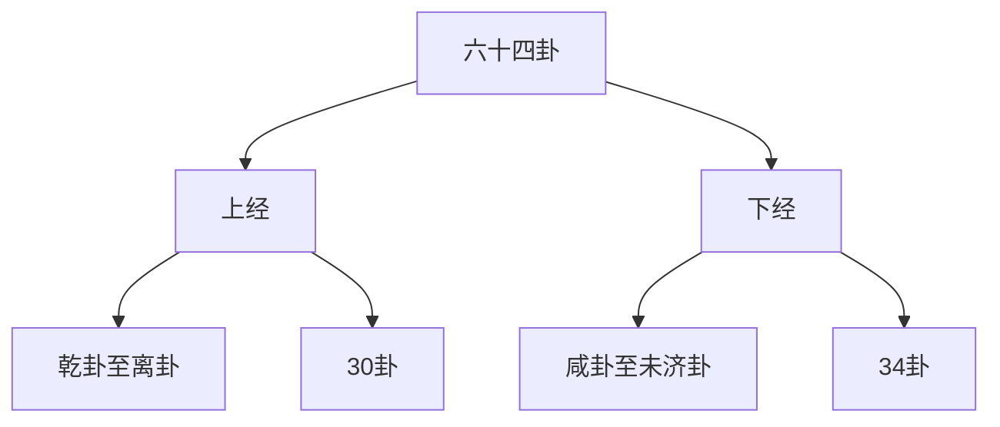
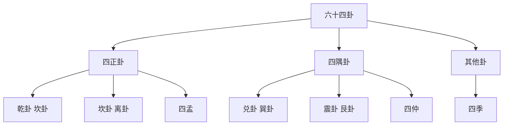
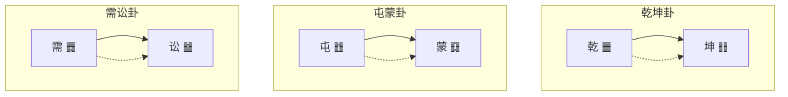

# 六十四卦详解

> 🎯 **学习目标**：系统掌握六十四卦的基本含义、卦辞、象辞和哲学内涵，为深入研读《周易》奠定坚实基础。

## 📚 六十四卦概述

### 六十四卦的构成

六十四卦是由八卦两两相重而成，每卦六爻，共三百八十四爻。六十四卦构成了《周易》的核心内容，模拟宇宙万物的各种状态。

### 六十四卦的排列规律

六十四卦按照一定的规律排列，体现了事物的发展变化规律。

**上经**：从乾卦到离卦，共30卦，主要阐述天地初创、万物萌发的过程。

**下经**：从咸卦到未济卦，共34卦，主要阐述人伦关系、社会发展的过程。

## 🌌 乾卦（乾为天）

### 卦画卦象
**卦画**：䷀（六爻皆阳）
**卦象**：天

### 卦辞
**乾，元亨利贞。**

**象辞**
**大象**：天行健，君子以自强不息。
**小象**：潜龙勿用，阳在下也。见龙在田，德施普也。终日乾乾，反复道也。或跃在渊，进无咎也。飞龙在天，大人造也。亢龙有悔，盈不可久也。用九，天德不可为首也。

### 爻辞详解
**初九：潜龙勿用。**
九二：见龙在田，利见大人。
九三：君子终日乾乾，夕惕若厉，无咎。
九四：或跃在渊，进无咎。
九五：飞龙在天，利见大人。
上九：亢龙有悔。
用九：见群龙无首，吉。

### 哲学内涵
乾卦象征天的刚健性质，强调自强不息的精神。初爻代表潜藏待时，二爻代表崭露头角，三爻代表勤奋努力，四爻代表谨慎进取，五爻代表事业有成，上爻代表盛极必衰。

## 🌍 坤卦（坤为地）

### 卦画卦象
**卦画**：䷁（六爻皆阴）
**卦象**：地

### 卦辞
**坤，元亨，利牝马之贞。君子有攸往，先迷后得主，利西南得朋，东北丧朋。安贞吉。**

**象辞**
**大象**：地势坤，君子以厚德载物。
**小象**：履霜坚冰至，驯致其道。直方大，不习无不利。含章可贞，或从王事，无成有终。括囊无咎，慎害也。黄裳元吉，文在中也。龙战于野，其血玄黄。

### 爻辞详解
初六：履霜，坚冰至。
六二：直方大，不习无不利。
六三：含章可贞，或从王事，无成有终。
六四：括囊，无咎无誉。
六五：黄裳，元吉。
上六：龙战于野，其血玄黄。

### 哲学内涵
坤卦象征地的柔顺性质，强调厚德载物的精神。坤卦体现了包容、承载、柔顺的品德，是女性、母亲、大地的象征。

## 🌟 屯卦（水雷屯）

### 卦画卦象
**卦画**：䷂（坎上震下）
**卦象**：云雷

### 卦辞
**屯，元亨利贞，勿用有攸往，利建侯。**

### 哲学内涵
屯卦象征万物初生的艰难，强调创业起步阶段的困难。屯卦告诉我们，事物的发展不会一帆风顺，需要克服困难，稳步前进。

## 🌞 蒙卦（山水蒙）

### 卦画卦象
**卦画**：䷃（艮上坎下）
**卦象**：山出云

### 卦辞
**蒙，亨。匪我求童蒙，童蒙求我。初筮告，再三渎，渎则不告。利贞。**

### 哲学内涵
蒙卦象征蒙昧无知的状态，强调启蒙教育的重要性。蒙卦告诉我们，学习需要谦逊、有耐心，不可急于求成。

## 📊 六十四卦分类体系

### 按卦气分类

### 按卦象性质分类

**阳卦**：乾、震、坎、艮（四卦为阳）

**阴卦**：坤、巽、离、兑（四卦为阴）

**纯阳卦**：乾卦（六爻皆阳）

**纯阴卦**：坤卦（六爻皆阴）

### 按六爻阴阳数分类

**阳卦**：阳爻多于阴爻的卦

**阴卦**：阴爻多于阳爻的卦

**平衡卦**：阴阳爻数量相等的卦

## 🎯 六十四卦学习要点

### 掌握基本构成

理解每一卦的：
- 卦画：六爻的阴阳构成
- 卦名：卦的名称和含义
- 卦象：卦象征的事物
- 卦辞：一卦的总论

### 理解爻辞含义

理解每一爻的：
- 爻辞：每一爻的具体含义
- 爻位：爻位特殊的哲学意义
- 爻象：爻所象征的状态

### 结合彖象辞

将卦辞、爻辞与彖辞、象辞结合起来理解，融会贯通。

### 理解哲学内涵

每一卦都蕴含着深刻的哲学思想，要理解其哲学内涵。

## 💡 学习建议

### 循序渐进

不要试图一次记住所有六十四卦，要循序渐进地学习。

### 先易后难

先学习纯阳纯阴卦，再学习其他卦。

### 结合生活

将六十四卦与生活实际结合起来，在应用中加深理解。

### 持续复习

六十四卦需要反复学习，才能深入理解。

## 📖 六十四卦速查表

| 序号 | 卦名 | 卦画 | 卦象 | 特征 |
|------|------|------|------|------|
| 1 | 乾卦 | ䷀ | 天 | 刚健 |
| 2 | 坤卦 | ䷁ | 地 | 柔顺 |
| 3 | 屯卦 | ䷂ | 云雷 | 初生 |
| 4 | 蒙卦 | ䷃ | 山出云 | 蒙昧 |
| 5 | 需卦 | ䷅ | 水天 | 讼息 |
| 6 | 讼卦 | ䷄ | 天水 | 争讼 |
| ... | ... | ... | ... | ... |
| 64 | 未济卦 | ䷾ | 水在火上 | 未完成 |

## 🔄 六十四卦的关系

### 相错关系

卦与卦之间六爻阴阳相反，称为相错。

### 相综关系

卦的上下卦位置互换，称为相综。

### 消息卦

阴阳爻逐一消长的十二卦，称为消息卦。

## 🎨 学习图表

### 六十四卦方图

## 🔗 相关资源

- [[易经结构与组成]] - 理解《周易》的基本结构
- [[卦辞爻辞解读]] - 深入学习卦辞爻辞的解读方法
- [[彖辞象辞解析]] - 深入理解彖辞象辞的哲学内涵
- [[十二消息卦]] - 学习十二消息卦的特殊规律

---
*创建时间: 2026-02-01*  
*分类: 4 Interests*
