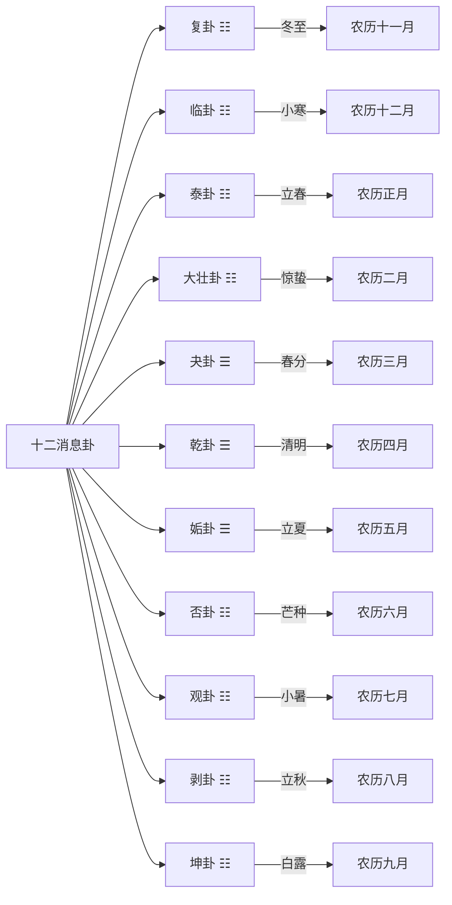
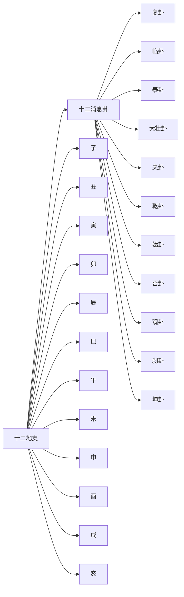

# 十二消息卦

> 🎯 **学习目标**：掌握十二消息卦的概念、与月令节气的关系、阴阳消长规律，以及在占卜中的应用。

## 📚 十二消息卦概述

### 什么是十二消息卦

十二消息卦是根据阴阳消长规律选出的十二个卦，每一卦对应一个月，用卦气表示一年四季的变化。

### 十二消息卦与节气的关系

## 🔄 十二消息卦详解

### 复卦（地雷复）

**时间**：农历十一月（冬至月）
**节气**：冬至
**卦象**：上卦为坤（地），下卦为震（雷）
**卦德**：刚反，顺而动

**含义**：复卦象征阳气初生，一阳生于下。冬至一阳生，是万物复苏的开始。

**哲学内涵**：复卦告诉我们，即使处于最黑暗的时候，也要看到希望。阳气刚刚开始生发，万物复苏的时期已经到来。

### 临卦（地泽临）

**时间**：农历十二月
**节气**：小寒、大寒
**卦象**：上卦为坤（地），下卦为兑（泽）
**卦德**：临，刚浸而长

**含义**：临卦象征阳气渐长，二阳在下，阳气逐渐壮大。

**哲学内涵**：临卦告诉我们，机会正在逐渐增多，要抓住时机。阳气在不断增长，是发展的大好时期。

### 泰卦（地天泰）

**时间**：农历正月
**节气**：立春、雨水
**卦象**：上卦为坤（地），下卦为乾（天）
**卦德**：泰，小往大来，吉亨

**含义**：泰卦象征天地交感，阴阳和畅，万物通畅。

**哲学内涵**：泰卦告诉我们，阴阳和谐，天地交感，是万物生长的最佳时期。这体现了"否极泰来"的哲学思想。

### 大壮卦（雷天大壮）

**时间**：农历二月
**节气**：惊蛰、春分
**卦象**：上卦为震（雷），下卦为乾（天）
**卦德**：大壮，利贞

**含义**：大壮卦象征阳气旺盛，万物壮盛生长。

**哲学内涵**：大壮卦告诉我们，阳气已十分旺盛，是积极进取、奋发有为的好时机。

### 夬卦（天雷夬）

**时间**：农历三月
**节气**：清明、谷雨
**卦象**：上卦为乾（天），下卦为震（雷）
**卦德**：夬，扬于王庭

**含义**：夬卦象征阳气达到极盛，开始有阴气产生。

**哲学内涵**：夬卦告诉我们，盛极必衰，要在阳盛之时做好准备。

### 乾卦（天为乾）

**时间**：农历四月
**节气**：立夏、小满
**卦象**：上卦为乾（天），下卦为乾（天）
**卦德**：乾，元亨利贞

**含义**：乾卦象征阳气达到极盛，纯阳之卦。

**哲学内涵**：乾卦告诉我们，自强不息，刚健进取。在阳气极盛之时，更要保持刚健的精神。

### 姤卦（天风姤）

**时间**：农历五月
**节气**：芒种、夏至
**卦象**：上卦为乾（天），下卦为巽（风）
**卦德**：姤，女壮，勿用取女

**含义**：姤卦象征一阴生于下，阳气开始消退。

**哲学内涵**：姤卦告诉我们，阴气开始产生，要开始注意防备。这是阴阳转折的开始。

### 否卦（天地否）

**时间**：农历六月
**节气**：小暑、大暑
**卦象**：上卦为乾（天），下卦为坤（地）
**卦德**：否，之匪人

**含义**：否卦象征天地隔绝，阴阳不交，万物闭塞。

**哲学内涵**：否卦告诉我们，阴阳不交，天地隔绝，是万物闭塞的时期。这体现了"泰极否来"的哲学思想。

### 观卦（风地观）

**时间**：农历七月
**节气**：立秋、处暑
**卦象**：上卦为巽（风），下卦为坤（地）
**卦德**：观，盥而不荐

**含义**：观卦象征阳气继续消退，二阴在下。

**哲学内涵**：观卦告诉我们，要以观象的方式观察万物的发展，顺应阴阳消长的规律。

### 剥卦（山地剥）

**时间**：农历八月
**节气**：白露、秋分
**卦象**：上卦为艮（山），下卦为坤（地）
**卦德**：剥，剥也，不利有攸往

**含义**：剥卦象征阳气进一步消退，五阴在下。

**哲学内涵**：剥卦告诉我们，阳气正在不断剥落，要顺应自然的规律，做好收藏的准备。

### 坤卦（坤为地）

**时间**：农历九月
**节气**：寒露、霜降
**卦象**：上卦为坤（地），下卦为坤（地）
**卦德**：坤，元亨，利牝马之贞

**含义**：坤卦象征阳气完全消尽，纯阴之卦。

**哲学内涵**：坤卦告诉我们，顺应自然规律，厚德载物，做好收藏的准备。

## 🔄 阴阳消长规律

### 阴阳消长循环

### 阴阳消长的哲学意义

**春生**：从复卦到泰卦，阳气从一阳增长到三阳，万物复苏生长。

**夏长**：从大壮卦到乾卦，阳气继续增长，万物繁荣茂盛。

**秋收**：从姤卦到剥卦，阳气从五阳消退到一阳，万物成熟收藏。

**冬藏**：从坤卦到复卦，阳气完全消尽后重新开始一阳生，万物蛰伏。

## 📊 十二消息卦在占卜中的应用

### 占卜中的运用

**测时**：根据起卦的时间对应的十二消息卦，判断当前的时机。

**测卦**：根据起出的卦，参考十二消息卦的阴阳消长，判断发展趋势。

**测事**：根据事态的发展阶段，参考十二消息卦，判断何时有利。

### 实际应用

**判断时机**：
- 复卦到泰卦：阳气增长，是开始事业、发展计划的好时机
- 乾卦到姤卦：阳气极盛转衰，要注意防备
- 否卦到坤卦：阴气旺盛，适合收藏、守成
- 坤卦到复卦：阳气将生，是准备新的开始

**判断发展趋势**：
- 阳气增长的阶段：事情将向上发展
- 阴气增长的阶段：事情将向下发展
- 阴阳平衡的阶段：事情将稳定发展

## 💡 十二消息卦的哲学智慧

### 顺应天时

十二消息卦体现了"顺应天时"的哲学智慧。春夏秋冬四季循环，阴阳消长有规律，人要顺应这个规律。

### 盛衰有数

十二消息卦告诉我们，盛衰有数，物极必反。阳盛极之时，阴气将生；阴盛极之时，阳气将生。

### 把握时机

十二消息卦强调把握时机的重要性。阳气增长时要积极进取，阴气增长时要审慎保守。

### 否极泰来

泰卦和否卦体现了"否极泰来"和"泰极否来"的哲学思想。事物的发展是循环的，不会永远顺利，也不会永远困难。

## 📚 十二消息卦与十二地支

### 对应关系

### 地支与十二消息卦的配合

每一地支都对应一个消息卦，这是占卜中经常用到的配合关系。

## 🎯 学习要点

### 理解消息卦的概念
理解什么是十二消息卦，为什么要选这十二个卦。

### 掌握与节气的关系
掌握十二消息卦与二十四节气的关系，理解阴阳消长的规律。

### 理解阴阳消长
理解阳气从一阳生到六阳盛，再到阴气从一阴生到六阴盛的过程。

### 学会在占卜中应用
学会在占卜中运用十二消息卦，判断时机和发展趋势。

## 🔗 相关资源

- [[六十四卦详解]] - 系统学习每一卦
- [[阴阳五行理论基础]] - 理解阴阳五行理论
- [[易学入门方法论]] - 学习正确的学习方法

---
*创建时间: 2026-02-01*  
*分类: 4 Interests*
