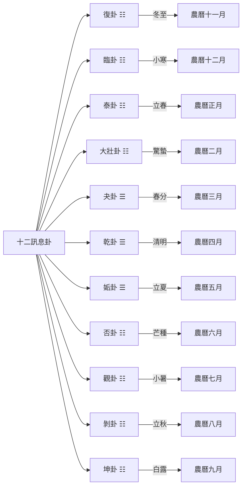

# 十二訊息卦

> 🎯 **學習目標**：掌握十二訊息卦的概念、與月令節氣的關係、陰陽消長規律，以及在占卜中的應用程式。

## 📚 十二訊息卦概述

### 什麼是十二訊息卦

十二訊息卦是根據陰陽消長規律選出的十二個卦，每一卦對應一個月，用卦氣表示一年四季的變化。

### 十二訊息卦與節氣的關係



## 🔄 十二訊息卦詳解

### 復卦（地雷復）

**時間**：農曆十一月（冬至月）
**節氣**：冬至
**卦象**：上卦爲坤（地），下卦爲震（雷）
**卦德**：剛反，順而動

**含義**：復卦象徵陽氣初生，一陽生於下。冬至一陽生，是萬物復甦的開始。

**哲學內涵**：復卦告訴我們，即使處於最黑暗的時候，也要看到希望。陽氣剛剛開始生髮，萬物復甦的時期已經到來。

### 臨卦（地澤臨）

**時間**：農曆十二月
**節氣**：小寒、大寒
**卦象**：上卦爲坤（地），下卦爲兌（澤）
**卦德**：臨，剛浸而長

**含義**：臨卦象徵陽氣漸長，二陽在下，陽氣逐漸壯大。

**哲學內涵**：臨卦告訴我們，機會正在逐漸增多，要抓住時機。陽氣在不斷增長，是發展的大好時期。

### 泰卦（地天泰）

**時間**：農曆正月
**節氣**：立春、雨水
**卦象**：上卦爲坤（地），下卦爲乾（天）
**卦德**：泰，小往大來，吉亨

**含義**：泰卦象徵天地交感，陰陽和暢，萬物通暢。

**哲學內涵**：泰卦告訴我們，陰陽和諧，天地交感，是萬物生長的最佳時期。這體現了"否極泰來"的哲學思想。

### 大壯卦（雷天大壯）

**時間**：農曆二月
**節氣**：驚蟄、春分
**卦象**：上卦爲震（雷），下卦爲乾（天）
**卦德**：大壯，利貞

**含義**：大壯卦象徵陽氣旺盛，萬物壯盛生長。

**哲學內涵**：大壯卦告訴我們，陽氣已十分旺盛，是積極進取、奮發有爲的好時機。

### 夬卦（天雷夬）

**時間**：農曆三月
**節氣**：清明、穀雨
**卦象**：上卦爲乾（天），下卦爲震（雷）
**卦德**：夬，揚於王庭

**含義**：夬卦象徵陽氣達到極盛，開始有陰氣產生。

**哲學內涵**：夬卦告訴我們，盛極必衰，要在陽盛之時做好準備。

### 乾卦（天爲乾）

**時間**：農曆四月
**節氣**：立夏、小滿
**卦象**：上卦爲乾（天），下卦爲乾（天）
**卦德**：乾，元亨利貞

**含義**：乾卦象徵陽氣達到極盛，純陽之卦。

**哲學內涵**：乾卦告訴我們，自強不息，剛健進取。在陽氣極盛之時，更要保持剛健的精神。

### 姤卦（天風姤）

**時間**：農曆五月
**節氣**：芒種、夏至
**卦象**：上卦爲乾（天），下卦爲巽（風）
**卦德**：姤，女壯，勿用取女

**含義**：姤卦象徵一陰生於下，陽氣開始消退。

**哲學內涵**：姤卦告訴我們，陰氣開始產生，要開始注意防備。這是陰陽轉折的開始。

### 否卦（天地否）

**時間**：農曆六月
**節氣**：小暑、大暑
**卦象**：上卦爲乾（天），下卦爲坤（地）
**卦德**：否，之匪人

**含義**：否卦象徵天地隔絕，陰陽不交，萬物閉塞。

**哲學內涵**：否卦告訴我們，陰陽不交，天地隔絕，是萬物閉塞的時期。這體現了"泰極否來"的哲學思想。

### 觀卦（風地觀）

**時間**：農曆七月
**節氣**：立秋、處暑
**卦象**：上卦爲巽（風），下卦爲坤（地）
**卦德**：觀，盥而不薦

**含義**：觀卦象徵陽氣繼續消退，二陰在下。

**哲學內涵**：觀卦告訴我們，要以觀象的方式觀察萬物的發展，順應陰陽消長的規律。

### 剝卦（山地剝）

**時間**：農曆八月
**節氣**：白露、秋分
**卦象**：上卦爲艮（山），下卦爲坤（地）
**卦德**：剝，剝也，不利有攸往

**含義**：剝卦象徵陽氣進一步消退，五陰在下。

# 收藏

### 坤卦（坤爲地）

**時間**：農曆九月
**節氣**：寒露、霜降
**卦象**：上卦爲坤（地），下卦爲坤（地）
**卦德**：坤，元亨，利牝馬之貞

**含義**：坤卦象徵陽氣完全消盡，純陰之卦。

# 收藏

## 🔄 陰陽消長規律

### 陰陽消長循環


### 陰陽消長的哲學意義

**春生**：從復卦到泰卦，陽氣從一陽增長到三陽，萬物復甦生長。

**夏長**：從大壯卦到乾卦，陽氣繼續增長，萬物繁榮茂盛。

# 收藏

**冬藏**：從坤卦到復卦，陽氣完全消盡後重新開始一陽生，萬物蟄伏。

## 📊 十二訊息卦在占卜中的應用程式

### 占卜中的運用

**測時**：根據起卦的時間對應的十二訊息卦，判斷當前的時機。

**測卦**：根據起出的卦，參考十二訊息卦的陰陽消長，判斷發展趨勢。

**測事**：根據事態的發展階段，參考十二訊息卦，判斷何時有利。

### 實際應用程式

**判斷時機**：
- 復卦到泰卦：陽氣增長，是開始事業、發展計劃的好時機
- 乾卦到姤卦：陽氣極盛轉衰，要注意防備
# 收藏
- 坤卦到復卦：陽氣將生，是準備新的開始

**判斷發展趨勢**：
- 陽氣增長的階段：事情將向上發展
- 陰氣增長的階段：事情將向下發展
- 陰陽平衡的階段：事情將穩定發展

## 💡 十二訊息卦的哲學智慧

### 順應天時

十二訊息卦體現了"順應天時"的哲學智慧。春夏秋冬四季循環，陰陽消長有規律，人要順應這個規律。

### 盛衰有數

十二訊息卦告訴我們，盛衰有數，物極必反。陽盛極之時，陰氣將生；陰盛極之時，陽氣將生。

### 把握時機

十二訊息卦強調把握時機的重要性。陽氣增長時要積極進取，陰氣增長時要審慎保守。

### 否極泰來

泰卦和否卦體現了"否極泰來"和"泰極否來"的哲學思想。事物的發展是循環的，不會永遠順利，也不會永遠困難。

## 📚 十二訊息卦與十二地支

### 對應關係

```mermaid
graph LR
    A[十二地支] --> B[十二訊息卦]
    
    A --> 子[子]
    A --> 醜[醜]
    A --> 寅[寅]
    A --> 卯[卯]
    A --> 辰[辰]
    A --> 巳[巳]
    A --> 午[午]
    A --> 未[未]
    A --> 申[申]
    A --> 酉[酉]
    A --> 戌[戌]
    A --> 亥[亥]
    
    B --> 復[復卦]
    B --> 臨[臨卦]
    B --> 泰[泰卦]
    B --> 大壯[大壯卦]
    B --> 夬[夬卦]
    B --> 乾[乾卦]
    B --> 姤[姤卦]
    B --> 否[否卦]
    B --> 觀[觀卦]
    B --> 剝[剝卦]
    B [[陰陽五行理論基礎]]``

### 地支與十二訊息卦的配合

每一地支都對應一個訊息卦，這是占卜中經常用到的配合關係。

## 🎯 學習要點

### 理解訊息卦的概念
理解什麼是十二訊息卦，爲什麼要選這十二個卦。

### 掌握與節氣的關係
掌握十二訊息卦與二十四節氣的關係，理解陰陽消長的規律。

### 理解陰陽消長
理解陽氣從一陽生到六陽盛，再到陰氣從一陰生到六陰盛的過程。

### 學會在占卜中應用程式
學會在占卜中運用十二訊息卦，判斷時機和發展趨勢。

## 🔗 相關資源

- [[六十四卦詳解]] - 系統學習每一卦
- [[陰陽五行理論基礎]] - 理解陰陽五行理論
# 方法

---
*創建時間: 2026-02-01*  
*分類: 4 Interests*
