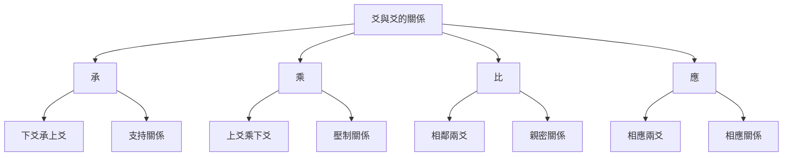

# 卦辭爻辭解讀

# 方法

## 📚 卦辭概述

### 什麼是卦辭

卦辭是對一卦的總說明，解釋一卦的基本含義、吉凶情況和適用條件。

### 卦辭的構成

**卦名**：說明這是哪一卦。

**卦義**：解釋一卦的基本含義。

**吉凶**：判斷這一卦是吉還是兇。

**條件**：說明在什麼情況下是吉，什麼情況下是兇。

# 方法

### 理解卦辭的基本步驟

1. **理解卦名**：首先理解卦名的含義，這是理解一卦的基礎。

2. **理解卦象**：理解卦象（上下卦的組成）對卦義的影響。

3. **理解卦辭**：理解卦辭的具體內容，包括吉凶、條件等。

4. **結合彖象**：結合彖辭和象辭來理解卦辭，彖辭和象辭是對卦辭的深入解釋。

### 卦辭解讀的注意事項

**不要斷章取義**：不要只取一句卦辭就下定論，要結合整卦來理解。

**注意條件**：卦辭中的吉凶都是有條件的，不能簡單地認爲某卦就是吉或某卦就是兇。

**考慮時位**：卦辭的含義會受到時間和位置的影響，要考慮具體的時位。

**參考註疏**：參考歷代注家的註疏，理解不同的解讀。

## 📿 爻辭概述

### 什麼是爻辭

爻辭是對一爻的具體說明，解釋某一爻在特定狀態下的吉凶和含義。

### 爻辭的構成

**爻位**：說明這是第幾爻（初爻、二爻、三爻、四爻、五爻、上爻）。

**爻性**：說明這一爻是陽爻還是陰爻。

**爻義**：解釋這一爻的含義。

**吉凶**：判斷這一爻是吉還是兇。

## 🔍 爻與爻的關係

### 承、乘、比、應

**承**：下爻承上爻，表示支持關係。下爻對上爻有支持作用。

**乘**：上爻乘下爻，表示壓制關係。上爻對下爻有壓制作用。

**比**：相鄰兩爻，表示親密關係。相鄰的兩爻關係密切。

**應**：相應兩爻（初爻與四爻，二爻與五爻，三爻與上爻），表示相應關係。相應兩爻相互呼應。

### 爻位的重要性

**初爻**：代表事物的開始，位置最下。

**上爻**：代表事物的終結，位置最高。

**中爻**：二爻、三爻、四爻、五爻爲中間爻，中爻通常比較重要。

# 方法

### 系統解讀法

1. **先讀卦辭**：先讀卦辭，理解一卦的基本含義。

2. **再讀爻辭**：再讀爻辭，理解每一爻的具體含義。

3. **結合彖象**：結合彖辭和象辭，深入理解卦的含義。

4. **參看註疏**：參考歷代注家的註疏，理解不同的解讀。

### 象數義理綜合解讀法

1. **觀象**：觀察卦象（上下卦的組成）。

# 分析

3. **義理**：理解義理（卦辭爻辭的哲學內涵）。

4. **綜合判斷**：綜合象數義理，進行綜合判斷。

## 💡 卦辭爻辭解讀實例

### 乾卦的卦辭爻辭解讀

#### 卦辭解讀

**乾，元亨利貞。**

**解讀**：
- **元**：始也，萬善之首
- **亨**：通也，萬美會通
- **利**：和也，萬物無各
- **貞**：正也，中正不偏

乾卦元亨利貞，說明乾卦是最吉利的卦，代表天道的完美狀態。

#### 爻辭解讀

**初九：潛龍勿用。**

**解讀**：初九代表潛藏的陽氣，像潛藏的龍一樣，還不可用。

**九二：見龍在田，利見大人。**

**解讀**：九二代表陽爻出現于田，像龍出現在田野，有利於出現於大人面前。

**九三：君子終日乾乾，夕惕若厲，無咎。**

**解讀**：九三代表整天勤奮努力，即使晚上也要謹慎，這樣纔沒有過錯。

**九四：或躍在淵，進無咎。**

**解讀**：九四代表可能向前跳躍，即使跳到深淵中，向前也沒有過錯。

**九五：飛龍在天，利見大人。**

**解讀**：九五代表飛龍在天，達到最高的成就，有利於被大人賞識。

**上九：亢龍有悔。**

**解讀**：上九代表龍飛得太高，產生悔恨。這是盛極必衰的表現。

### 坤卦的卦辭爻辭解讀

#### 卦辭解讀

**坤，元亨，利牝馬之貞。君子有攸往，先迷後得主，利西南得朋，東北喪朋。安貞吉。**

**解讀**：坤卦象徵地，具有元亨的特性。像雌馬一樣順從，有利於貞問。君子有所前往，先迷失方向後得到明主，有利於在西南得到朋友，在東北喪失朋友。安於正道則吉利。

#### 爻辭解讀

**初六：履霜，堅冰至。**

**解讀**：初六代表踩到霜，堅冰將至。這是見微知著的道理。

**六二：直方大，不習無不利。**

**解讀**：六二代表正直、方正、宏大，不需要學習就自然做到。

**六三：含章可貞，或從王事，無成有終。**

**解讀**：六三代表內含文采可以貞問，或者跟隨大王做事，雖然沒有成就但有始有終。

**六四：括囊，無咎無譽。**

**解讀**：六四代表像包裹一樣，既沒有過錯也沒有讚譽。

**六五：黃裳，元吉。**

**解讀**：六五代表穿黃色衣裳，最爲吉利。黃是中的顏色，象徵中正。

**上六：龍戰於野，其血玄黃。**

**解讀**：上六代表龍在野外戰鬥，血染成玄黃色。這是陰陽交戰的極端狀態。

## 🎯 爻位解讀的哲學意義

### 初爻（起始）

初爻代表事物的開始階段，特點是：
- 陰陽初現
- 潛藏待發
- 需要謹慎

### 二爻（發展）

二爻代表事物的發展階段，特點是：
- 陰陽增長
- 逐漸顯露
- 需要努力

### 三爻（轉折）

三爻代表事物的轉折階段，特點是：
- 陰陽變化
- 進退不定
- 需要審慎

### 四爻（深入）

四爻代表事物的深入階段，特點是：
- 陰陽平衡
- 狀態穩定
- 需要堅持

### 五爻（巔峯）

五爻代表事物的巔峯階段，特點是：
- 陽陽旺盛
- 狀態最佳
- 需要收斂

### 上爻（終結）

上爻代表事物的終結階段，特點是：
- 陰陽轉化
- 盛極必衰
# 更新

## 💡 卦辭爻辭解讀技巧

### 結合卦象理解

卦象（上下卦的組成）會影響卦辭和爻辭的含義，要結合卦象來理解。

### 考慮陰陽爻性

陽爻和陰爻的性質不同，陽爻代表剛健，陰爻代表柔順，這會影響爻辭的含義。

### 注意承乘比應

# 分析

### 理解時間位置

時間和位置會影響卦辭爻辭的含義，要考慮具體的時位。

## 📚 卦辭爻辭的學習順序

### 學習順序建議

1. **先讀卦辭**：先讀卦辭，理解一卦的基本含義。

2. **再讀爻辭**：再讀爻辭，理解每一爻的具體含義。

3. **結合彖象**：結合彖辭和象辭，深入理解。

4. **參考註疏**：參考歷代注家，理解不同解讀。

### 複習鞏固

1. **定期複習**：定期複習卦辭爻辭，加深理解。

2. **實踐應用程式**：在占卜中應用程式，加深理解。

3. **交流討論**：與他人交流討論，相互啓發。

## 🔗 相關資源

- [[六十四卦詳解]] - 系統學習每一卦
- [[彖辭象辭解析]] - 學習彖辭象辭
- [[易理哲學思想]] - 理解易理哲學

---
*創建時間: 2026-02-01*  
*分類: 4 Interests*
