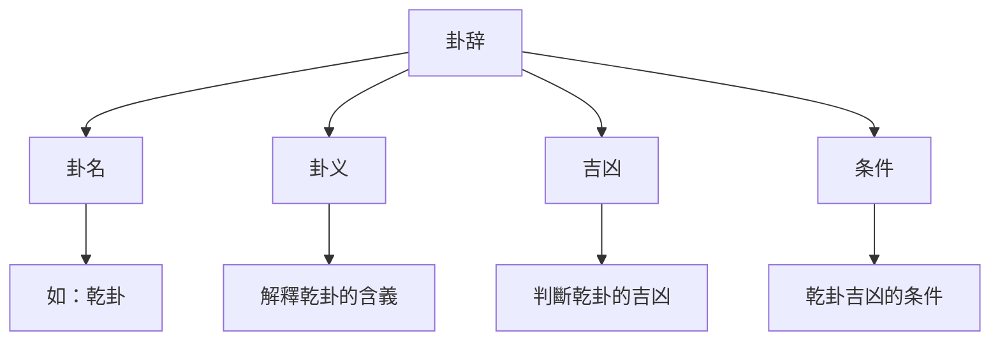
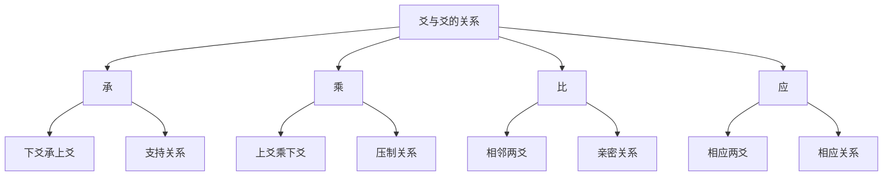

# 卦辞爻辞解读

# 方法

## 📚 卦辞概述

### 什么是卦辞

卦辞是对一卦的总說明，解釋一卦的基本含義、吉凶情况和适用条件。

### 卦辞的构成

**卦名**：說明这是哪一卦。

**卦义**：解釋一卦的基本含義。

**吉凶**：判斷这一卦是吉还是凶。

**条件**：說明在什么情况下是吉，什么情况下是凶。

# 方法

### 理解卦辞的基本步骤

1. **理解卦名**：首先理解卦名的含義，这是理解一卦的基礎。

2. **理解卦象**：理解卦象（上下卦的组成）对卦义的影响。

3. **理解卦辞**：理解卦辞的具体內容，包括吉凶、条件等。

4. **结合彖象**：结合彖辞和象辞来理解卦辞，彖辞和象辞是对卦辞的深入解釋。

### 卦辞解读的注意事項

**不要断章取义**：不要只取一句卦辞就下定论，要结合整卦来理解。

**注意条件**：卦辞中的吉凶都是有条件的，不能简单地认为某卦就是吉或某卦就是凶。

**考虑时位**：卦辞的含義会受到時間和位置的影响，要考虑具体的时位。

**參考注疏**：參考历代注家的注疏，理解不同的解读。

## 📿 爻辞概述

### 什么是爻辞

爻辞是对一爻的具体說明，解釋某一爻在特定狀態下的吉凶和含義。

### 爻辞的构成

**爻位**：說明这是第几爻（初爻、二爻、三爻、四爻、五爻、上爻）。

**爻性**：說明这一爻是阳爻还是阴爻。

**爻义**：解釋这一爻的含義。

**吉凶**：判斷这一爻是吉还是凶。

## 🔍 爻与爻的关系

### 承、乘、比、应

**承**：下爻承上爻，表示支持关系。下爻对上爻有支持作用。

**乘**：上爻乘下爻，表示压制关系。上爻对下爻有压制作用。

**比**：相邻两爻，表示亲密关系。相邻的两爻关系密切。

**应**：相应两爻（初爻与四爻，二爻与五爻，三爻与上爻），表示相应关系。相应两爻相互呼应。

### 爻位的重要性

**初爻**：代表事物的開始，位置最下。

**上爻**：代表事物的终结，位置最高。

**中爻**：二爻、三爻、四爻、五爻为中间爻，中爻通常比较重要。

# 方法

### 系統解读法

1. **先读卦辞**：先读卦辞，理解一卦的基本含義。

2. **再读爻辞**：再读爻辞，理解每一爻的具体含義。

3. **结合彖象**：结合彖辞和象辞，深入理解卦的含義。

4. **参看注疏**：參考历代注家的注疏，理解不同的解读。

### 象数义理综合解读法

1. **观象**：观察卦象（上下卦的组成）。

# 分析

3. **义理**：理解义理（卦辞爻辞的哲学内涵）。

4. **综合判斷**：综合象数义理，進行综合判斷。

## 💡 卦辞爻辞解读实例

### 乾卦的卦辞爻辞解读

#### 卦辞解读

**乾，元亨利贞。**

**解读**：
- **元**：始也，万善之首
- **亨**：通也，万美会通
- **利**：和也，万物無各
- **贞**：正也，中正不偏

乾卦元亨利贞，說明乾卦是最吉利的卦，代表天道的完美狀態。

#### 爻辞解读

**初九：潜龙勿用。**

**解读**：初九代表潜藏的阳气，像潜藏的龙一样，还不可用。

**九二：见龙在田，利见大人。**

**解读**：九二代表阳爻出现于田，像龙出现在田野，有利于出现于大人面前。

**九三：君子终日乾乾，夕惕若厉，無咎。**

**解读**：九三代表整天勤奋努力，即使晚上也要谨慎，这样才没有过错。

**九四：或跃在渊，进無咎。**

**解读**：九四代表可能向前跳跃，即使跳到深渊中，向前也没有过错。

**九五：飞龙在天，利见大人。**

**解读**：九五代表飞龙在天，达到最高的成就，有利于被大人赏识。

**上九：亢龙有悔。**

**解读**：上九代表龙飞得太高，产生悔恨。这是盛极必衰的表现。

### 坤卦的卦辞爻辞解读

#### 卦辞解读

**坤，元亨，利牝马之贞。君子有攸往，先迷后得主，利西南得朋，东北丧朋。安贞吉。**

**解读**：坤卦象征地，具有元亨的特性。像雌马一样顺从，有利于贞问。君子有所前往，先迷失方向后得到明主，有利于在西南得到朋友，在东北丧失朋友。安于正道则吉利。

#### 爻辞解读

**初六：履霜，坚冰至。**

**解读**：初六代表踩到霜，坚冰将至。这是见微知著的道理。

**六二：直方大，不习無不利。**

**解读**：六二代表正直、方正、宏大，不需要學習就自然做到。

**六三：含章可贞，或从王事，無成有终。**

**解读**：六三代表内含文采可以贞问，或者跟随大王做事，虽然没有成就但有始有终。

**六四：括囊，無咎無誉。**

**解读**：六四代表像包裹一样，既没有过错也没有赞誉。

**六五：黄裳，元吉。**

**解读**：六五代表穿黄色衣裳，最为吉利。黄是中的颜色，象征中正。

**上六：龙战于野，其血玄黄。**

**解读**：上六代表龙在野外战斗，血染成玄黄色。这是阴阳交战的极端狀態。

## 🎯 爻位解读的哲学意义

### 初爻（起始）

初爻代表事物的開始階段，特點是：
- 阴阳初现
- 潜藏待发
- 需要谨慎

### 二爻（發展）

二爻代表事物的發展階段，特點是：
- 阴阳增长
- 逐渐显露
- 需要努力

### 三爻（转折）

三爻代表事物的转折階段，特點是：
- 阴阳变化
- 进退不定
- 需要审慎

### 四爻（深入）

四爻代表事物的深入階段，特點是：
- 阴阳平衡
- 狀態稳定
- 需要坚持

### 五爻（巅峰）

五爻代表事物的巅峰階段，特點是：
- 阳阳旺盛
- 狀態最佳
- 需要收敛

### 上爻（终结）

上爻代表事物的终结階段，特點是：
- 阴阳转化
- 盛极必衰
# 更新

## 💡 卦辞爻辞解读技巧

### 结合卦象理解

卦象（上下卦的组成）会影响卦辞和爻辞的含義，要结合卦象来理解。

### 考虑阴阳爻性

阳爻和阴爻的性质不同，阳爻代表刚健，阴爻代表柔顺，这会影响爻辞的含義。

### 注意承乘比应

# 分析

### 理解時間位置

時間和位置会影响卦辞爻辞的含義，要考虑具体的时位。

## 📚 卦辞爻辞的學習顺序

### 學習顺序建議

1. **先读卦辞**：先读卦辞，理解一卦的基本含義。

2. **再读爻辞**：再读爻辞，理解每一爻的具体含義。

3. **结合彖象**：结合彖辞和象辞，深入理解。

4. **參考注疏**：參考历代注家，理解不同解读。

### 复习巩固

1. **定期复习**：定期复习卦辞爻辞，加深理解。

2. **實踐應用程式**：在占卜中應用程式，加深理解。

3. **交流讨论**：与他人交流讨论，相互启发。

## 🔗 相關資源

- [[六十四卦详解]] - 系統學習每一卦
- [[彖辞象辞解析]] - 學習彖辞象辞
- [[易理哲学思想]] - 理解易理哲学

---
*創建時間: 2026-02-01*  
*分類: 4 Interests*
