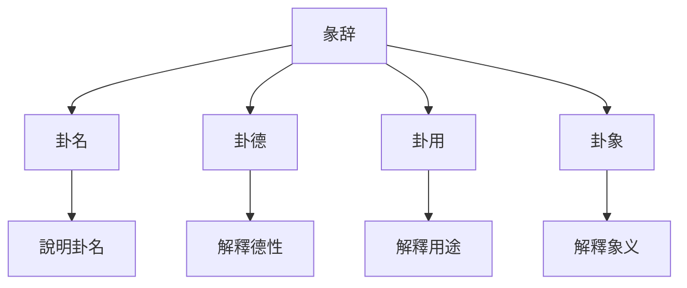
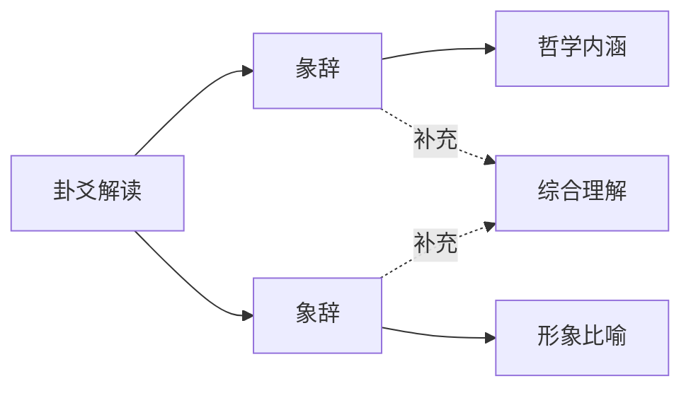

# 彖辞象辞解析

# 方法

## 📚 彖辞概述

### 什么是彖辞

彖辞又称"彖传"，是对卦辞的总论，主要解釋卦的哲学内涵、卦德和卦用。《系辞上》雲端："彖者，言乎象者也。"說明彖辞是用形象比喻来解釋卦义。

### 彖辞的构成

**卦名**：說明这是哪一卦。

**卦德**：解釋一卦的德性。

**卦用**：解釋一卦的用途。

**卦象**：解釋一卦的象义。

## 📖 象辞概述

### 什么是象辞

象辞又称"象传"，是对卦辞和爻辞的形象化解釋，包括大象和小象。《系辞下》雲端："象者，像也。"

### 象辞的构成

**大象**：解釋全卦的象义。

**小象**：解釋每一爻的象义。

**修辞特點**：用生动的形象比喻解釋抽象的易理。

## 🔄 彖辞与象辞的关系

### 相互补充

彖辞和象辞不是对立的，而是相互补充的关系。

**彖辞**：侧重于哲学内涵的阐述。

**象辞**：侧重于形象比喻的說明。

**结合运用**：解读卦爻时，要将彖辞和象辞结合起来理解。

## 🎯 彖辞的哲学内涵

### 天道观

彖辞主要阐述的是天道观，即人与天的关系。

**顺应天道**：强调人應該顺应天道，按照天道的规律行事。

**天人合一**：强调人是自然的一部分，應該与自然和谐相处。

**变易不易**：强调万物都在变化，但变化的规律永恒不变。

### 伦理观

彖辞也包含豐富的伦理观念，强调君臣父子、夫妻朋友的伦理关系。

**君臣之道**：阐述君臣應該各尽其责，君主要明智，臣主要忠诚。

**父子之道**：阐述父子之间的伦理关系，父主要慈爱，子主要孝顺。

**夫妻之道**：阐述夫妻之间的伦理关系，主要和谐互补。

**朋友之道**：阐述朋友之间的伦理关系，主要诚信互助。

### 政治观

彖辞还包含政治观念，阐述治国安邦的道理。

**德治为主**：强调以德治国，君主要以德来感化臣民。

**礼乐并重**：强调礼乐的重要性，用礼乐来規範社会秩序。

**中庸之道**：强调中庸不偏，不要走极端。

## 🎨 象辞的修辞艺术

### 形象生动

象辞的修辞艺术非常高超，主要特點包括：

**用具体形象**：用具体的自然现象来說明抽象的易理。

**比喻恰当**：用恰当的比喻来解釋复杂的易理。

**简洁精炼**：用简洁的语言传达深刻的哲理。

**音韵和谐**：讲究音韵，读起来朗朗上口。

### 修辞手法

**比喻**：用自然现象比喻人事。

**拟人**：将自然现象拟人化。

**对仗**：形成对仗工整的结构。

**排比**：用排比句式增强气势。

## 📊 彖辞的哲学思想

### 变易思想

彖辞深入阐述了变易的哲学思想。

**万物皆变**：宇宙万物都在不断变化，没有永恒不变的事物。

**变中有常**：虽然万物都在变化，但变化的规律是永恒不变的。

**顺应变化**：人應該顺应万物的变化，不要固执己见。

### 不易思想

彖辞也体现了不易的思想。

**规律永恒**：虽然万物都在变化，但变化的规律是永恒不变的。

**天道不变**：天的運行规律是永恒不变的，春夏秋冬四季循环。

**人道不变**：人的基本伦理道德也是不变的。

### 简易思想

彖辞还体现了简易的思想。

**大道至简**：掌握了变化的规律后，复杂的事物就变得简单了。

**执简御繁**：用简单的道理来處理复杂的事情。

**知变应变**：掌握了变化规律，就能从容应对各种变化。

## 🎨 象辞的形象比喻

### 自然现象比喻

象辞用大量的自然现象来比喻人事：

**天**：象征君、父、刚健、高远。

**地**：象征母、臣、柔顺、承载。

**雷**：象征动、起、震惊、奋发。

**风**：象征入、从、柔顺、渗透。

**水**：象征陷、险、下流、潜藏。

**火**：象征明、上、炎上、附丽。

**山**：象征止、固、高崇、稳重。

**泽**：象征悦、聚、柔顺、和美。

### 人体比喻

象辞还用人体部位来比喻：

**头**：象征高贵、统御、智慧。

**腹**：象征包容、承载、消化。

**足**：象征行动、运动、奔跑。

**手**：象征把握、操作、创造。

**目**：象征观察、辨别、智慧。

**耳**：象征倾听、接受、智慧。

### 动物比喻

象辞用动物来比喻：

**马**：象征刚健、奔跑、奋斗。

**牛**：象征勤劳、温顺、奉献。

**龙**：象征变化、神秘、高贵。

**雉**：象征隐逸、等待、机缘。

**猪**：象征贪吃、懒惰、满足。

# 方法

### 结合卦象

解读彖辞象辞要结合卦象来理解。

**理解卦的组成**：理解上卦和下卦的组成及其象征意义。

**理解卦的关系**：理解上卦与下卦的关系。

**理解卦的整體**：从整體上理解一卦的含義。

### 结合卦辞

解读彖辞象辞要结合卦辞来理解。

**理解卦辞的吉凶**：理解卦辞判斷的吉凶情况。

**理解卦辞的条件**：理解卦辞中吉凶的条件。

**理解卦辞的應用程式**：理解卦辞在什么情况下應用程式。

### 结合爻辞

解读彖辞象辞要结合爻辞来理解。

**理解爻辞的含義**：理解每一爻的具体含義。

**理解爻与爻的关系**：理解承乘比应关系对爻辞的影响。

**理解爻的变化**：理解爻变对卦辞含義的影响。

## 💡 彖辞象辞的應用程式

### 在解卦中的應用程式

**辅助判斷**：用彖辞象辞辅助判斷卦的含義。

**深入理解**：用彖辞象辞深入理解卦的哲学内涵。

**综合判斷**：结合卦辞爻辞、彖辞象辞進行综合判斷。

### 在处世中的應用程式

**哲学指导**：从彖辞中學習处世哲学。

# 方法

**決策智慧**：从彖辞象辞中學習決策的智慧。

## 🔍 彖辞象辞的深度解读

### 天人合一思想

**《系辞上》雲端**："易与天地准，故能弥纶天地之道。"

**天人关系**：彖辞象辞强调天人合一，人是自然的一部分。

**顺应天时**：人應該顺应天时，按照天道的规律行事。

**成就事业**：顺应天道才能成就大事业。

### 君子之道

**《系辞上》雲端**："君子进德修业。"

**君子品德**：从彖辞象辞中學習君子應該具备的品德。

# 方法

# 方法

### 中庸之道

**《系辞上》雲端**："一阴一阳之谓道。"

**阴阳平衡**：彖辞象辞强调阴阳平衡，不要走极端。

**中正之道**：从彖辞象辞中學習中正之道。

**适度原則**：从象辞中學習适度原則，不要太过或不及。

## 📊 彖辞象辞的學習要點

### 理解哲学内涵

**天道观**：理解彖辞中体现的天道观。

**伦理观**：理解彖辞中体现的伦理观。

**政治观**：理解彖辞中体现的政治观。

**人生观**：理解彖辞中体现的人生观。

### 掌握修辞技巧

**比喻艺术**：掌握彖辞象辞的比喻艺术。

**对仗技巧**：掌握彖辞象辞的对仗技巧。

**排比手法**：掌握彖辞象辞的排比手法。

**音韵和谐**：体会彖辞象辞的音韵和谐。

### 结合实际應用程式

**解卦應用程式**：在解卦中运用彖辞象辞。

**处世應用程式**：在处世中运用彖辞象辞的智慧。

**修养應用程式**：在自我修养中运用彖辞象辞。

**決策應用程式**：在決策中运用彖辞象辞的智慧。

## 💡 學習建議

### 按序渐进

**先理解卦辞**：先理解卦辞，再學習彖辞象辞。

**再理解彖辞**：理解彖辞的哲学内涵。

**再理解象辞**：理解象辞的形象比喻。

**最后综合**：将三者综合起来理解。

### 參考注疏

**历代注家**：參考历代注家的注释，理解不同的解读。

**對比學習**：對比不同注家的解读，形成自己的理解。

**融会贯通**：将不同注家的解读融会贯通。

### 實踐應用程式

**解卦實踐**：在解卦中运用彖辞象辞。

**生活實踐**：在生活中运用彖辞象辞的智慧。

**反思總結**：反思總結學習心得，形成自己的体悟。

## 🔗 相關資源

- [[六十四卦详解]] - 系統學習每一卦
# 方法
- [[易理哲学思想]] - 學習易理的哲学思想
- [[易经中的处世哲学]] - 學習处世哲学

---
*創建時間: 2026-02-01*  
*分類: 4 Interests*
