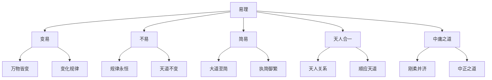

# 易理哲学思想

> 🎯 **学习目标**：深入理解易学的核心哲学思想，掌握变易不易简易三易的内涵，理解天人合一的思想，为深入研读《周易》奠定哲学基础。

## 📚 易理哲学概述

### 什么是易理

易理是指《周易》中蕴含的哲学思想，是中华文明哲学思想的重要组成部分。易理博大精深，涵盖宇宙观、人生观、伦理观、政治观等多个方面。

### 易理的核心

## 🔄 变易思想

### 万物皆变

**《系辞上》云**："在天成象，在地成形，变化见矣。"

**变化规律**：宇宙万物都在不断变化，没有永恒不变的事物。

**变化类型**：
- **量变**：数量的逐渐变化
- **质变**：性质的根本变化
- **渐变**：逐渐的变化
- **突变**：突然的变化

### 变中有常

**《系辞上》云**："一阴一阳之谓道，继之者善也，成之者性也。"

**规律永恒**：虽然万物都在变化，但变化的规律是永恒不变的。

**变化的规律**：
- **阴阳消长**：阴阳的不断消长变化
- **五行相生相克**：五行的相生相克循环
- **四季循环**：春夏秋冬的四季循环
- **生死循环**：生死存亡的循环变化

### 顺应变化

**《系辞下》云**："变通者，趣时者也。"

**顺应时机**：人应该顺应万物的变化，抓住时机。

**灵活应变**：人应该灵活地应对各种变化，不要固执己见。

**持续学习**：人应该持续学习，不断提高自己的能力。

## 🎯 不易思想

### 规律永恒

**《系辞上》云**："天行健，君子以自强不息。"

**天道规律**：天的运行规律是永恒不变的，春夏秋冬四季循环。

**人性规律**：人的基本伦理道德也是永恒不变的。

**社会规律**：社会的基本秩序也是永恒不变的。

### 知常达变

**知常**：理解变化的规律是永恒不变的。

**达变**：在理解规律的基础上，灵活地应对各种变化。

**变通**：在掌握规律的基础上，灵活变通地应用。

**创新**：在掌握规律的基础上，创新性地应用。

## 🎨 简易思想

### 大道至简

**《系辞上》云**："易则易知，简则易从。"

**化繁为简**：将复杂的事物简化为最简单的形式。

**执简御繁**：用简单的道理来处理复杂的事情。

**知变应变**：掌握了变化规律，就能从容应对各种变化。

### 化难为易

**复杂化简**：将复杂的问题简化为简单的问题。

**化繁为简**：将复杂的步骤简化为简单的步骤。

**化险为夷**：将危险的情况转化为安全的情况。

## 🌍 天人合一思想

### 天人关系

**《系辞上》云**："易与天地准，故能弥纶天地之道。"

**天人合一**：人是自然的一部分，应该与自然和谐相处。

**顺应天时**：人应该顺应天时，按照天道的规律行事。

**成就事业**：顺应天道才能成就大事业。

### 天道人道

**天道**：天的运行规律，春夏秋冬四季循环。

**人道**：人的运行规律，君臣父子夫妇朋友。

**天道人道**：人道应该顺应天道，符合自然规律。

**和谐共处**：天人和谐共处，万物和谐发展。

## 📏 中庸之道

### 刚柔并济

**《系辞上》云**："一阴一阳之谓道。"

**阴阳平衡**：阴阳要平衡，不可偏废。

**刚柔并济**：刚柔要并济，不可只刚不柔或只柔不刚。

**中正之道**：做事要中正，不偏不倚。

### 适度原则

**不要极端**：做事不要走极端，要把握适度。

**知足常乐**：要知足常乐，不要贪得无厌。

**适可而止**：做事要适可而止，不要过度。

## 🎯 易理哲学的实践应用

### 在决策中的应用

**顺应天时**：在决策时，要考虑时机是否合适。

**把握规律**：在决策时，要把握事物的发展规律。

**灵活应变**：在决策时，要灵活地应对各种情况。

### 在处世中的应用

**君子之道**：在处世中，要践行君子之道。

**中庸之道**：在处世中，要践行中庸之道。

**顺应自然**：在处世中，要顺应自然规律。

### 在修养中的应用

**自我完善**：在修养中，要不断完善自己。

**心性修养**：在修养中，要修养心性，提升品德。

**智慧增长**：在修养中，要增长智慧，提升境界。

## 📊 易理哲学的核心要素

### 变易

**万物皆变**：宇宙万物都在不断变化。

**变中有常**：变化规律永恒不变。

**顺应变化**：顺应时机，灵活应变。

### 不易

**规律永恒**：变化规律是永恒不变的。

**知常达变**：理解规律，灵活应用。

**创新应用**：掌握规律，创新应用。

### 简易

**大道至简**：掌握规律后变得简单。

**执简御繁**：用简单道理处理复杂事情。

**化繁为简**：将复杂问题简化。

### 天人合一

**天人关系**：人是自然的一部分。

**顺应天时**：顺应天道规律。

**和谐共处**：天人和谐共处。

### 中庸之道

**刚柔并济**：阴阳平衡，刚柔并济。

**适度原则**：不走极端，把握适度。

**中正之道**：不偏不倚，中正处事。

## 💡 学习要点

### 理解三易

**变易**：理解万物都在变化的道理。

**不易**：理解变化规律永恒不变的道理。

**简易**：理解掌握规律后变得简单的道理。

### 理解天人合一

**天人关系**：理解天人合一的思想。

**顺应天道**：理解顺应天道的方法。

**和谐共处**：理解天人和谐共处的意义。

### 理解中庸之道

**刚柔并济**：理解阴阳平衡、刚柔并济。

**适度原则**：理解适度原则的应用。

**中正之道**：理解中正之道的实践。

## 💡 学习建议

### 理论学习

**深入研读**：深入研读《系辞》等经典文献。

**理解哲学**：理解易理的哲学内涵。

**掌握规律**：掌握易理的变化规律。

### 实践应用

**解卦实践**：在解卦中应用易理哲学。

**生活实践**：在生活中应用易理哲学。

**修养实践**：在自我修养中应用易理哲学。

### 交流讨论

**小组学习**：组建学习小组，共同研读。

**专家讲座**：参加专家的讲座和课程。

**心得交流**：与他人交流学习心得和体悟。

## 📚 易理哲学的重要文献

### 经典文献

**《周易·系辞》**：易理哲学的集中体现。

**《周易·说卦》**：八卦象征意义的阐述。

**《周易·序卦》**：六十四卦排列顺序的阐释。

**《周易·杂卦》**：六十四卦关系的杂述。

### 历代注疏

**《周易正义》**（唐·孔颖达）：官方易学注本。

**《周易本义》**（宋·朱熹）：义理易学代表作品。

**《周易折中》**（清·李光地）：清代官方注本。

**《周易来注》**（明·来知德）：集前人之大成。

### 现代著作

**《易经系传别讲》**（南怀瑾）：南怀瑾对《系辞》的解读。

**《易经入门》**（傅佩荣）：现代学者的入门解读。

**《周易哲学》**（现代）：现代学者对易理哲学的研究。

## 🔗 相关资源

- [[六十四卦详解]] - 系统学习每一卦
- [[卦辞爻辞解读]] - 学习卦辞爻辞的解读方法
- [[彖辞象辞解析]] - 学习彖辞象辞的哲学内涵
- [[易经中的处世哲学]] - 学习处世哲学

---
*创建时间: 2026-02-01*  
*分类: 4 Interests*
