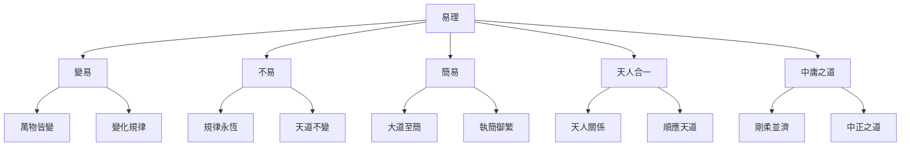

# 易理哲學思想

> 🎯 **學習目標**：深入理解易學的核心哲學思想，掌握變易不易簡易三易的內涵，理解天人合一的思想，爲深入研讀《周易》奠定哲學基礎。

## 📚 易理哲學概述

### 什麼是易理

易理是指《周易》中蘊含的哲學思想，是中華文明哲學思想的重要組成部分。易理博大精深，涵蓋宇宙觀、人生觀、倫理觀、政治觀等多個方面。

### 易理的核心

## 🔄 變易思想

### 萬物皆變

**《繫辭上》雲端**："在天成象，在地成形，變化見矣。"

**變化規律**：宇宙萬物都在不斷變化，沒有永恆不變的事物。

**變化類型**：
- **量變**：數量的逐漸變化
- **質變**：性質的根本變化
- **漸變**：逐漸的變化
- **突變**：突然的變化

### 變中有常

**《繫辭上》雲端**："一陰一陽之謂道，繼之者善也，成之者性也。"

**規律永恆**：雖然萬物都在變化，但變化的規律是永恆不變的。

**變化的規律**：
- **陰陽消長**：陰陽的不斷消長變化
- **五行相生相剋**：五行的相生相剋循環
- **四季循環**：春夏秋冬的四季循環
- **生死循環**：生死存亡的循環變化

### 順應變化

**《繫辭下》雲端**："變通者，趣時者也。"

**順應時機**：人應該順應萬物的變化，抓住時機。

**靈活應變**：人應該靈活地應對各種變化，不要固執己見。

**持續學習**：人應該持續學習，不斷提高自己的能力。

## 🎯 不易思想

### 規律永恆

**《繫辭上》雲端**："天行健，君子以自強不息。"

**天道規律**：天的運行規律是永恆不變的，春夏秋冬四季循環。

**人性規律**：人的基本倫理道德也是永恆不變的。

**社會規律**：社會的基本秩序也是永恆不變的。

### 知常達變

**知常**：理解變化的規律是永恆不變的。

**達變**：在理解規律的基礎上，靈活地應對各種變化。

**變通**：在掌握規律的基礎上，靈活變通地應用程式。

**創新**：在掌握規律的基礎上，創新性地應用程式。

## 🎨 簡易思想

### 大道至簡

**《繫辭上》雲端**："易則易知，簡則易從。"

**化繁爲簡**：將複雜的事物簡化爲最簡單的形式。

**執簡御繁**：用簡單的道理來處理複雜的事情。

**知變應變**：掌握了變化規律，就能從容應對各種變化。

### 化難爲易

**複雜化簡**：將複雜的問題簡化爲簡單的問題。

**化繁爲簡**：將複雜的步驟簡化爲簡單的步驟。

**化險爲夷**：將危險的情況轉化爲安全的情況。

## 🌍 天人合一思想

### 天人關係

**《繫辭上》雲端**："易與天地準，故能彌綸天地之道。"

**天人合一**：人是自然的一部分，應該與自然和諧相處。

**順應天時**：人應該順應天時，按照天道的規律行事。

**成就事業**：順應天道才能成就大事業。

### 天道人道

**天道**：天的運行規律，春夏秋冬四季循環。

**人道**：人的運行規律，君臣父子夫婦朋友。

**天道人道**：人道應該順應天道，符合自然規律。

**和諧共處**：天人和諧共處，萬物和諧發展。

## 📏 中庸之道

### 剛柔並濟

**《繫辭上》雲端**："一陰一陽之謂道。"

**陰陽平衡**：陰陽要平衡，不可偏廢。

**剛柔並濟**：剛柔要並濟，不可只剛不柔或只柔不剛。

**中正之道**：做事要中正，不偏不倚。

### 適度原則

**不要極端**：做事不要走極端，要把握適度。

**知足常樂**：要知足常樂，不要貪得無厭。

**適可而止**：做事要適可而止，不要過度。

## 🎯 易理哲學的實踐應用程式

### 在決策中的應用程式

**順應天時**：在決策時，要考慮時機是否合適。

**把握規律**：在決策時，要把握事物的發展規律。

**靈活應變**：在決策時，要靈活地應對各種情況。

### 在處世中的應用程式

**君子之道**：在處世中，要踐行君子之道。

**中庸之道**：在處世中，要踐行中庸之道。

**順應自然**：在處世中，要順應自然規律。

### 在修養中的應用程式

**自我完善**：在修養中，要不斷完善自己。

**心性修養**：在修養中，要修養心性，提升品德。

**智慧增長**：在修養中，要增長智慧，提升境界。

## 📊 易理哲學的核心要素

### 變易

**萬物皆變**：宇宙萬物都在不斷變化。

**變中有常**：變化規律永恆不變。

**順應變化**：順應時機，靈活應變。

### 不易

**規律永恆**：變化規律是永恆不變的。

**知常達變**：理解規律，靈活應用程式。

**創新應用程式**：掌握規律，創新應用程式。

### 簡易

**大道至簡**：掌握規律後變得簡單。

**執簡御繁**：用簡單道理處理複雜事情。

**化繁爲簡**：將複雜問題簡化。

### 天人合一

**天人關係**：人是自然的一部分。

**順應天時**：順應天道規律。

**和諧共處**：天人和諧共處。

### 中庸之道

**剛柔並濟**：陰陽平衡，剛柔並濟。

**適度原則**：不走極端，把握適度。

**中正之道**：不偏不倚，中正處事。

## 💡 學習要點

### 理解三易

**變易**：理解萬物都在變化的道理。

**不易**：理解變化規律永恆不變的道理。

**簡易**：理解掌握規律後變得簡單的道理。

### 理解天人合一

**天人關係**：理解天人合一的思想。

# 方法

**和諧共處**：理解天人和諧共處的意義。

### 理解中庸之道

**剛柔並濟**：理解陰陽平衡、剛柔並濟。

**適度原則**：理解適度原則的應用程式。

**中正之道**：理解中正之道的實踐。

## 💡 學習建議

### 理論學習

**深入研讀**：深入研讀《繫辭》等經典文獻。

**理解哲學**：理解易理的哲學內涵。

**掌握規律**：掌握易理的變化規律。

### 實踐應用程式

**解卦實踐**：在解卦中應用程式易理哲學。

**生活實踐**：在生活中應用程式易理哲學。

**修養實踐**：在自我修養中應用程式易理哲學。

### 交流討論

**小組學習**：組建學習小組，共同研讀。

**專家講座**：參加專家的講座和課程。

**心得交流**：與他人交流學習心得和體悟。

## 📚 易理哲學的重要文獻

### 經典文獻

**《周易·繫辭》**：易理哲學的集中體現。

**《周易·說卦》**：八卦象徵意義的闡述。

**《周易·序卦》**：六十四卦排列順序的闡釋。

**《周易·雜卦》**：六十四卦關係的雜述。

### 歷代註疏

**《周易正義》**（唐·孔穎達）：官方易學注本。

**《周易本義》**（宋·朱熹）：義理易學代表作品。

**《周易折中》**（清·李光地）：清代官方注本。

**《周易來注》**（明·來知德）：集前人之大成。

### 現代著作

**《易經系傳別講》**（南懷瑾）：南懷瑾對《繫辭》的解讀。

**《易經入門》**（傅佩榮）：現代學者的入門解讀。

**《周易哲學》**（現代）：現代學者對易理哲學的研究。

## 🔗 相關資源

- [[六十四卦詳解]] - 系統學習每一卦
# 方法
- [[彖辭象辭解析]] - 學習彖辭象辭的哲學內涵
- [[易經中的處世哲學]] - 學習處世哲學

---
*創建時間: 2026-02-01*  
*分類: 4 Interests*
