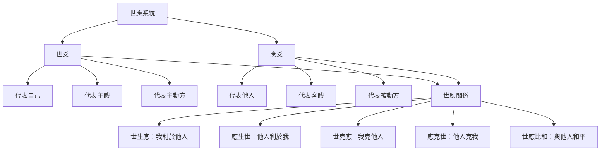
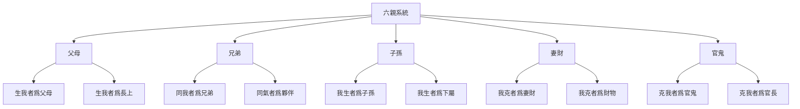
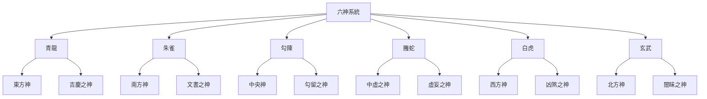
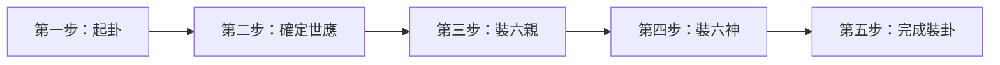

# 六爻預測基礎

> 🎯 **學習目標**：掌握六爻預測的基本概念、裝卦方法和斷卦技巧，能夠獨立進行基礎的六爻預測，理解世應、六親、六神系統在斷卦中的應用。

## 📚 六爻預測概述

### 什麼是六爻預測

六爻預測，又稱文王卦法，是易學占卜的重要方法之一。它以六十四卦為基礎，通過世應、六親、六神三個系統來輔助斷卦，是歷代最為流行的占卜方法之一。

**核心特點**：
- **基於六十四卦**：以《周易》六十四卦為基本框架
- **世應明確**：世爻代表自己，應爻代表他人或事
- **六親俱全**：父母、兄弟、子孫、妻財、官鬼五行俱全
- **六神輔助**：青龍、朱雀、勾陳、螣蛇、白虎、玄武六神輔助斷卦

### 六爻預測的特點

**系統性強**：
- 世應系統明確主賓關係
- 六親系統涵蓋人生各方面
- 六神系統提供吉凶判斷輔助

**實用性高**：
- 適用於各類占卜事項
- 斷卦方法具體可操作
- 結果解釋清晰明確

**學習門檻**：
- 需要掌握八卦、五行基礎
- 需要理解六親、六神含義
- 需要大量實踐積累經驗

## 🔄 六爻基礎概念

### 世應系統

#### 世爻與應爻

世應系統是六爻占卜的核心，用於確定占卜的主賓關係。

#### 世應位置規律

| 卦位 | 世爻位置 | 應爻位置 | 含義 |
|------|---------|---------|------|
| 乾卦 | 六爻 | 三爻 | 天位高位 |
| 坤卦 | 六爻 | 三爻 | 地位低位 |
| 震卦 | 初爻 | 四爻 | 雷動在下 |
| 巽卦 | 初爻 | 四爻 | 風行在上 |
| 坎卦 | 二爻 | 五爻 | 水流中道 |
| 離卦 | 二爻 | 五爻 | 火居中道 |
| 艮卦 | 三爻 | 六爻 | 山止上位 |
| 兌卦 | 三爻 | 六爻 | 澤悅下位 |

**世應規律口訣**：
- 天地定位：乾坤世在上，應在三爻
- 雷風相薄：震巽世在下，應在四爻
- 水火不相射：坎離世在中，應在五爻
- 山澤通氣：艮兌世在三，應在上爻

### 六親系統

#### 六親的構成

六親系統根據五行生克關係確定，是六爻預測的核心。

**六親關係口訣**：
- 生我者父母
- 同我者兄弟
- 我生者子孫
- 我克者妻財
- 克我者官鬼

#### 六親的關係表

| 世爻五行 | 父母 | 兄弟 | 子孫 | 妻財 | 官鬼 |
|---------|------|------|------|------|------|
| 金 | 土 | 金 | 水 | 木 | 火 |
| 木 | 水 | 木 | 火 | 土 | 金 |
| 水 | 金 | 水 | 木 | 火 | 土 |
| 火 | 木 | 火 | 土 | 金 | 水 |
| 土 | 火 | 土 | 金 | 水 | 木 |

#### 六親在占卜中的應用

| 占卜事項 | 用神 | 含義 | 旺相吉凶 |
|---------|------|------|---------|
| 父母健康 | 父母爻 | 生我者 | 旺相健康，休囚有病 |
| 兄弟和睦 | 兄弟爻 | 同氣者 | 旺相和睦，休囚爭吵 |
| 子孫成長 | 子孫爻 | 我生者 | 旺相順利，休囚不順 |
| 財運求財 | 妻財爻 | 我克者 | 旺相財旺，休囚財弱 |
| 官職升遷 | 官鬼爻 | 克我者 | 旺相升遷，休囚降職 |

### 六神系統

#### 六神的構成

六神系統根據日辰確定，用於輔助判斷吉凶。

#### 六神的含義

| 六神 | 五行 | 吉凶 | 含義 | 應對策略 |
|------|------|------|------|---------|
| 青龍 | 木 | 吉 | 喜慶、嫁娶、生育 | 順勢而爲 |
| 朱雀 | 火 | 兇 | 文書、官司、是非 | 謹慎處理 |
| 勾陳 | 土 | 中 | 拖延、留滯、爭執 | 耐心應對 |
| 螣蛇 | 土 | 兇 | 虛妄、欺騙、纏繞 | 警惕防範 |
| 白虎 | 金 | 兇 | 刑傷、疾病、官司 | 注意安全 |
| 玄武 | 水 | 兇 | 闇昧、盜竊、曖昧 | 保持清醒 |

#### 六神裝卦規則

**根據日辰裝六神**：

| 日辰 | 初爻 | 二爻 | 三爻 | 四爻 | 五爻 | 上爻 |
|------|------|------|------|------|------|------|
| 甲日 | 青龍 | 朱雀 | 勾陳 | 螣蛇 | 白虎 | 玄武 |
| 乙日 | 青龍 | 朱雀 | 勾陳 | 螣蛇 | 白虎 | 玄武 |
| 丙日 | 青龍 | 朱雀 | 勾陳 | 螣蛇 | 白虎 | 玄武 |
| 丁日 | 青龍 | 朱雀 | 勾陳 | 螣蛇 | 白虎 | 玄武 |
| 戊日 | 青龍 | 朱雀 | 勾陳 | 螣蛇 | 白虎 | 玄武 |
| 己日 | 青龍 | 朱雀 | 勾陳 | 螣蛇 | 白虎 | 玄武 |
| 庚日 | 青龍 | 朱雀 | 勾陳 | 螣蛇 | 白虎 | 玄武 |
| 辛日 | 青龍 | 朱雀 | 勾陳 | 螣蛇 | 白虎 | 玄武 |
| 壬日 | 青龍 | 朱雀 | 勾陳 | 螣蛇 | 白虎 | 玄武 |
| 癸日 | 青龍 | 朱雀 | 勾陳 | 螣蛇 | 白虎 | 玄武 |

**六神輪轉規律**：從甲日到癸日，六神順序相同，從初爻開始青龍，順次輪轉至玄武。

## 📦 裝卦步驟

### 基礎裝卦步驟

### 第一步：起卦

使用銅錢卦法或蓍草占卜法得到本卦。

**起卦方法選擇**：
- 銅錢卦法：簡單快捷，適合日常占卜
- 蓍草占卜法：傳統正統，適合重要決策

### 第二步：確定世應

根據卦象確定世爻和應爻的位置。

**確定方法**：
1. 查看本卦是哪一卦
2. 根據世應位置規律表確定世爻位置
3. 世應位置相隔三爻（初對四、二對五、三對上）

### 第三步：裝六親

根據世爻五行和各爻位置裝六親。

**裝六親步驟**：
1. 確定世爻的位置
2. 根據世爻所在下卦的五行屬性確定世爻五行
3. 根據世爻五行，按六親關係表爲每爻裝六親

**六親裝卦示例**：

假設世爻爲乾卦（金），則：

| 爻位 | 地支 | 五行 | 六親 | 六親含義 |
|------|------|------|------|---------|
| 上爻 | 戌土 | 土 | 父母 | 生世爻者 |
| 五爻 | 申金 | 金 | 兄弟 | 同世爻者 |
| 四爻 | 午火 | 火 | 官鬼 | 克世爻者 |
| 三爻 | 辰土 | 土 | 父母 | 生世爻者 |
| 二爻 | 寅木 | 木 | 妻財 | 世爻克者 |
| 初爻 | 子水 | 水 | 子孫 | 世爻生者 |

### 第四步：裝六神

根據日辰裝六神。

**裝六神步驟**：
1. 確定占卜日辰（甲日、乙日...）
2. 根據六神裝卦規則表裝六神
3. 從初爻開始青龍，順次輪轉

**六神裝卦示例**：

假設占卜日爲甲日，則：

| 爻位 | 六神 | 吉凶 | 含義 | 應對策略 |
|------|------|------|------|---------|
| 上爻 | 玄武 | 兇 | 闇昧之事 | 保持清醒 |
| 五爻 | 白虎 | 兇 | 刑傷疾病 | 注意安全 |
| 四爻 | 螣蛇 | 兇 | 虛妄欺騙 | 警惕防範 |
| 三爻 | 勾陳 | 中 | 拖延留滯 | 耐心應對 |
| 二爻 | 朱雀 | 兇 | 文書官司 | 謹慎處理 |
| 初爻 | 青龍 | 吉 | 喜慶之事 | 順勢而爲 |

### 第五步：完成裝卦

將以上步驟的結果整合，完成完整的六爻卦裝卦。

**完整裝卦示例**：

本卦：乾卦
世爻：六爻
日辰：甲日
世爻五行：金

| 爻位 | 地支 | 五行 | 六親 | 六神 | 世應 |
|------|------|------|------|------|------|
| 上爻 | 戌土 | 土 | 父母 | 玄武 | 世 |
| 五爻 | 申金 | 金 | 兄弟 | 白虎 | - |
| 四爻 | 午火 | 火 | 官鬼 | 螣蛇 | 應 |
| 三爻 | 辰土 | 土 | 父母 | 勾陳 | - |
| 二爻 | 寅木 | 木 | 妻財 | 朱雀 | - |
| 初爻 | 子水 | 水 | 子孫 | 青龍 | - |

## 🔍 斷卦方法

### 斷卦基本原則

#### 世應關係判斷

**世爻爲主**：
- 世爻旺相：自身能力強，有利
- 世爻休囚：自身能力弱，不利
- 世爻受克：自身不利，需謹慎

**應爻爲賓**：
- 應爻生世爻：他人對我有利
- 應爻克世爻：他人對我有害
- 應爻比和：與他人和平相處

#### 六親關係判斷

**用神原則**：
根據占卜事項確定用神（主爻）

| 占卜事項 | 用神 | 含義 | 旺相吉凶 |
|---------|------|------|---------|
| 父母健康 | 父母爻 | 生我者 | 旺相健康，休囚有病 |
| 兄弟和睦 | 兄弟爻 | 同氣者 | 旺相和睦，休囚爭吵 |
| 子孫成長 | 子孫爻 | 我生者 | 旺相順利，休囚不順 |
| 財運求財 | 妻財爻 | 我克者 | 旺相財旺，休囚財弱 |
| 官職升遷 | 官鬼爻 | 克我者 | 旺相升遷，休囚降職 |

#### 六神輔助判斷

**六神吉凶判斷**：
- 青龍：吉慶之事，利於婚嫁、生育、喜事
- 朱雀：文書官司，需注意文書糾紛、是非口舌
- 勾陳：拖延留滯，事情可能拖延，需耐心等待
- 螣蛇：虛妄欺騙，需警惕虛假信息和欺騙
- 白虎：刑傷疾病，需注意安全，提防疾病
- 玄武：闇昧盜竊，需保持清醒，防範暗算

### 斷卦具體步驟

#### 第一步：確定用神

根據占卜事項確定用神（主爻）。

**確定方法**：
- 問父母：用父母爻
- 問兄弟：用兄弟爻
- 問子孫：用子孫爻
- 問妻財：用妻財爻
- 問官職：用官鬼爻

#### 第二步：判斷用神狀態

**用神旺衰判斷**：
- 用神旺相：有利，事情順利
- 用神休囚：不利，事情困難
- 用神受生：得助，有貴人相助
- 用神受克：受損，有人阻礙

**旺相休囚判斷**：
- 旺相：五行得令（春季木旺、夏季火旺、秋季金旺、冬季水旺、四季土旺）
- 休囚：五行失令（不得時）

#### 第三步：判斷六神吉凶

**六神吉凶判斷**：
- 吉神（青龍）旺相：吉祥，大吉
- 凶神（朱雀、白虎、螣蛇、玄武）休囚：不兇，可化解
- 吉神休囚：不吉，運勢一般
- 凶神旺相：大凶，需特別注意

**六神位置判斷**：
- 六神在世爻：自身影響
- 六神在應爻：他人影響
- 六神在用神：用神受六神影響

#### 第四步：綜合判斷

**綜合判斷原則**：
1. 以用神爲主，世應爲輔
2. 以六神判斷吉凶
3. 綜合世應關係、用神狀態、六神吉凶進行最終判斷

## 🎯 六爻斷卦實例

### 實例一：問財運

#### 裝卦情況

假設起得乾卦，世爻在六爻（金），日辰爲甲日：

| 爻位 | 地支 | 五行 | 六親 | 六神 | 世應 |
|------|------|------|------|------|------|
| 上爻 | 戌土 | 土 | 父母 | 玄武 | 世 |
| 五爻 | 申金 | 金 | 兄弟 | 白虎 | - |
| 四爻 | 午火 | 火 | 官鬼 | 螣蛇 | 應 |
| 三爻 | 辰土 | 土 | 父母 | 勾陳 | - |
| 二爻 | 寅木 | 木 | 妻財 | 朱雀 | - |
| 初爻 | 子水 | 水 | 子孫 | 青龍 | - |

#### 斷卦分析

**確定用神**：
- 占卜事項：財運
- 用神：妻財爻（二爻寅木）

**用神狀態**：
- 妻財爻爲寅木
- 日辰甲木，木得時旺相
- 用神旺相，有利於求財

**世應關係**：
- 世爻（金）克妻財（木）
- 我克財，利於求財

**六神判斷**：
- 用神妻財爻臨朱雀
- 朱雀爲文書官司之神
- 需注意文書糾紛或財務糾紛

**綜合判斷**：
- 用神旺相，利於求財
- 世爻克妻財，我能得財
- 但用神臨朱雀，可能有文書糾紛或財務糾紛
- 建議：求財順利，但需注意合同文書，避免糾紛

### 實例二：問疾病

#### 裝卦情況

假設起得坤卦，世爻在六爻（土），日辰爲丙日：

| 爻位 | 地支 | 五行 | 六親 | 六神 | 世應 |
|------|------|------|------|------|------|
| 上爻 | 亥水 | 水 | 妻財 | 玄武 | 世 |
| 五爻 | 酉金 | 金 | 官鬼 | 白虎 | - |
| 四爻 | 酉金 | 金 | 官鬼 | 螣蛇 | 應 |
| 三爻 | 亥水 | 水 | 妻財 | 勾陳 | - |
| 二爻 | 醜土 | 土 | 兄弟 | 朱雀 | - |
| 初爻 | 未土 | 土 | 兄弟 | 青龍 | - |

#### 斷卦分析

**確定用神**：
- 占卜事項：疾病
- 用神：官鬼爻（四爻和五爻酉金）

**用神狀態**：
- 官鬼爻爲酉金
- 日辰丙火，火克金
- 用神受克，不利

**世應關係**：
- 世爻（土）生官鬼（金）
- 我生官鬼，有病

**六神判斷**：
- 五爻官鬼臨白虎
- 白虎爲刑傷疾病之神
- 五爻爲君位，病情嚴重

**綜合判斷**：
- 用神受克，病情嚴重
- 世爻生官鬼，自身有病
- 官鬼臨白虎，需注意刑傷
- 建議：病情嚴重，需及時就醫，不可拖延

### 實例三：問官職

#### 裝卦情況

假設起得震卦，世爻在初爻（木），日辰爲庚日：

| 爻位 | 地支 | 五行 | 六親 | 六神 | 世應 |
|------|------|------|------|------|------|
| 上爻 | 酉金 | 金 | 官鬼 | 玄武 | - |
| 五爻 | 申金 | 金 | 官鬼 | 白虎 | 應 |
| 四爻 | 午火 | 火 | 妻財 | 螣蛇 | - |
| 三爻 | 辰土 | 土 | 父母 | 勾陳 | - |
| 二爻 | 寅木 | 木 | 兄弟 | 朱雀 | - |
| 初爻 | 子水 | 水 | 子孫 | 青龍 | 世 |

#### 斷卦分析

**確定用神**：
- 占卜事項：官職升遷
- 用神：官鬼爻（五爻和上爻酉金）

**用神狀態**：
- 官鬼爻爲酉金
- 日辰庚金，金得時旺相
- 用神旺相，有利於升遷

**世應關係**：
- 應爻（五爻）爲官鬼
- 應爻代表他人，應爻生世爻有利
- 但應爻是官鬼，克世爻（木克土），不利

**六神判斷**：
- 五爻官鬼臨白虎
- 白虎爲凶煞之神
- 需注意權力鬥爭

**綜合判斷**：
- 用神旺相，升遷機會大
- 但應爻克世爻，需要努力
- 官鬼臨白虎，需注意權力鬥爭
- 建議：升遷有望，但需努力爭取，注意權力鬥爭

## 💡 六爻預測學習要點

### 循序漸進

1. **理解基礎概念**：
   - 先理解世應、六親、六神的基本概念
   - 掌握八卦、五行基礎知識
   - 熟悉六十四卦基本結構

2. **學習裝卦方法**：
   - 練習確定世應位置
   - 練習裝六親
   - 練習裝六神

3. **掌握斷卦原則**：
   - 理解用神確定方法
   - 理解旺相休囚判斷
   - 理解世應關係判斷

4. **多練習斷卦**：
   - 通過實例練習提高斷卦能力
   - 對比不同斷卦結果
   - 總結斷卦經驗

### 實踐應用

1. **從小事占卜**：
   - 先從小事開始占卜
   - 如問財運、問健康
   - 逐步積積累經驗

2. **多斷卦**：
   - 對不同事項進行斷卦
   - 如問感情、問事業、問官職
   - 積累斷卦經驗

3. **驗證結果**：
   - 事後驗證斷卦的準確性
   - 分析準確和錯誤的原因
   - 改進斷卦方法

4. **總結經驗**：
   - 總結斷卦經驗和規律
   - 記錄成功的斷卦案例
   - 形成自己的斷卦風格

### 注意事項

1. **勿過度迷信**：
   - 六爻預測是輔助決策的工具
   - 不是決定命運的依據
   - 不要完全依賴占卜結果

2. **保持理性**：
   - 占卜時保持理性客觀的態度
   - 避免主觀臆斷
   - 不要陷入迷信

3. **學習相關知識**：
   - 學習易學相關知識
   - 學習周易哲學思想
   - 提高自身素養

4. **因時制宜**：
   - 斷卦要根據具體情況靈活判斷
   - 不要生搬硬套
   - 考慮具體環境和背景

## 📊 六爻預測圖表彙總

### 六親裝卦速查表

| 世爻五行 | 父母 | 兄弟 | 子孫 | 妻財 | 官鬼 |
|---------|------|------|------|------|------|
| 金 | 土 | 金 | 水 | 木 | 火 |
| 木 | 水 | 木 | 火 | 土 | 金 |
| 水 | 金 | 水 | 木 | 火 | 土 |
| 火 | 木 | 火 | 土 | 金 | 水 |
| 土 | 火 | 土 | 金 | 水 | 木 |

### 六神含義表

| 六神 | 五行 | 吉凶 | 含義 | 應對策略 |
|------|------|------|------|---------|
| 青龍 | 木 | 吉 | 喜慶、嫁娶、生育 | 順勢而爲 |
| 朱雀 | 火 | 兇 | 文書、官司、是非 | 謹慎處理 |
| 勾陳 | 土 | 中 | 拖延、留滯、爭執 | 耐心應對 |
| 螣蛇 | 土 | 兇 | 虛妄、欺騙、纏繞 | 警惕防範 |
| 白虎 | 金 | 兇 | 刑傷、疾病、官司 | 注意安全 |
| 玄武 | 水 | 兇 | 闇昧、盜竊、曖昧 | 保持清醒 |

### 世應位置速查表

| 卦位 | 世爻位置 | 應爻位置 |
|------|---------|---------|
| 乾卦 | 六爻 | 三爻 |
| 坤卦 | 六爻 | 三爻 |
| 震卦 | 初爻 | 四爻 |
| 巽卦 | 初爻 | 四爻 |
| 坎卦 | 二爻 | 五爻 |
| 離卦 | 二爻 | 五爻 |
| 艮卦 | 三爻 | 六爻 |
| 兌卦 | 三爻 | 六爻 |

## 🔗 相關資源

- [[銅錢卦法]] - 學習銅錢卦法起卦
- [[蓍草占卜法]] - 學習傳統大衍筮法
- [[梅花易數入門]] - 學習梅花易數起卦
- [[現代易學應用程式]] - 學習現代易學應用
- [[易經與決策智慧]] - 學習易經決策智慧
- [[個人修身與易經]] - 個人修養指導

---
*創建時間: 2026-02-01*
*分類: 4 Interests*
