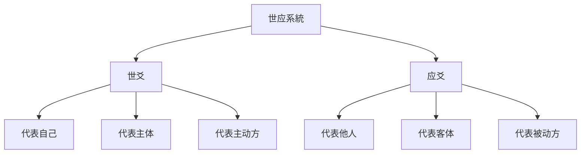
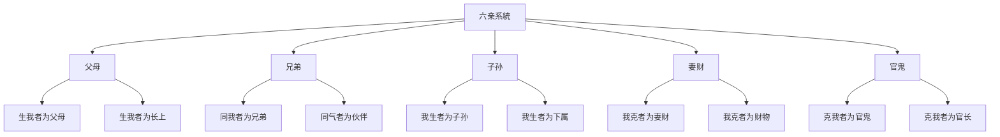
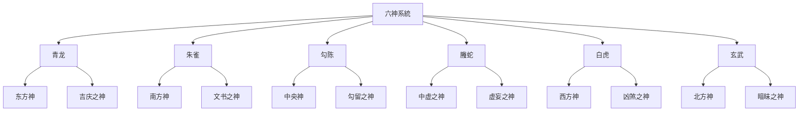
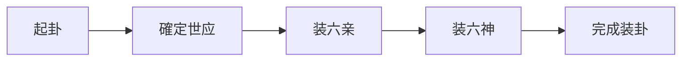
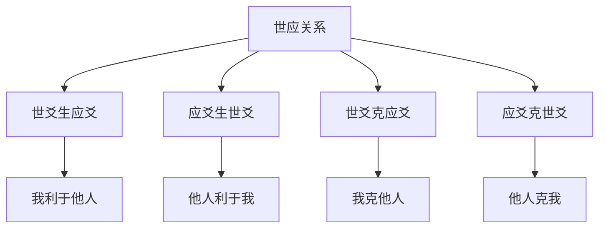

# 六爻预测基礎

# 方法

## 📚 六爻预测概述

### 什么是六爻预测

# 方法

### 六爻预测的特點

# 方法

**世应明确**：世爻代表自己，应爻代表他人或事

**六亲俱全**：父母、兄弟、子孙、妻财、官鬼五行俱全

**六神豐富**：青龙、朱雀、勾陈、螣蛇、白虎、玄武六神辅助断卦

## 🔄 六爻基礎概念

### 世应系統

#### 世爻与应爻

#### 世应位置规律

| 卦位 | 世爻位置 | 应爻位置 | 含義 |
|------|---------|---------|------|
| 乾卦 | 六爻 | 三爻 | 天位高位 |
| 坤卦 | 六爻 | 三爻 | 地位低位 |
| 震卦 | 初爻 | 四爻 | 雷动在下 |
| 巽卦 | 初爻 | 四爻 | 风行在上 |
| 坎卦 | 二爻 | 五爻 | 水流中道 |
| 离卦 | 二爻 | 五爻 | 火居中道 |
| 艮卦 | 三爻 | 六爻 | 山止上位 |
| 兑卦 | 三爻 | 六爻 | 泽悦下位 |

### 六亲系統

#### 六亲的构成

#### 六亲的关系表

| 世爻五行 | 父母 | 兄弟 | 子孙 | 妻财 | 官鬼 |
|---------|------|------|------|------|------|
| 金 | 土 | 金 | 水 | 木 | 火 |
| 木 | 水 | 木 | 火 | 土 | 金 |
| 水 | 金 | 水 | 木 | 火 | 土 |
| 火 | 木 | 火 | 土 | 金 | 水 |
| 土 | 火 | 土 | 金 | 水 | 木 |

### 六神系統

#### 六神的构成

#### 六神的含義

| 六神 | 五行 | 吉凶 | 含義 |
|------|------|------|------|
| 青龙 | 木 | 吉 | 喜庆、嫁娶、生育 |
| 朱雀 | 火 | 凶 | 文书、官司、是非 |
| 勾陈 | 土 | 中 | 拖延、留滞、争执 |
| 螣蛇 | 土 | 凶 | 虚妄、欺骗、缠绕 |
| 白虎 | 金 | 凶 | 刑伤、疾病、官司 |
| 玄武 | 水 | 凶 | 暗昧、盗窃、暧昧 |

# 方法

### 基礎装卦步骤

#### 第一步：起卦

使用铜钱卦法或蓍草占卜法得到体卦。

#### 第二步：確定世应

根据卦象確定世爻和应爻的位置。

#### 第三步：装六亲

根据世爻五行和各爻位置装六亲。

#### 第四步：装六神

根据日辰装六神。

# 方法

#### 六亲装卦规则

**確定世爻五行**：
1. 確定世爻的位置
2. 根据世爻所在下卦的五行属性確定世爻五行

**装六亲**：
根据世爻五行，按六亲关系表为每爻装六亲。

#### 六亲装卦示例

假设世爻为乾卦（金），则：

| 爻位 | 地支 | 六亲 | 六亲含義 |
|------|------|------|---------|
| 上爻 | 戌土 | 父母 | 生世爻者 |
| 五爻 | 申金 | 兄弟 | 同世爻者 |
| 四爻 | 午火 | 官鬼 | 克世爻者 |
| 三爻 | 辰土 | 父母 | 生世爻者 |
| 二爻 | 寅木 | 妻财 | 世爻克者 |
| 初爻 | 子水 | 子孙 | 世爻生者 |

# 方法

#### 六神装卦规则

**根据日辰装六神**：

| 日辰 | 初爻 | 二爻 | 三爻 | 四爻 | 五爻 | 上爻 |
|------|------|------|------|------|------|------|
| 甲日 | 青龙 | 朱雀 | 勾陈 | 螣蛇 | 白虎 | 玄武 |
| 乙日 | 青龙 | 朱雀 | 勾陈 | 螣蛇 | 白虎 | 玄武 |
| 丙日 | 青龙 | 朱雀 | 勾陈 | 螣蛇 | 白虎 | 玄武 |
| 丁日 | 青龙 | 朱雀 | 勾陈 | 螣蛇 | 白虎 | 玄武 |
| 戊日 | 青龙 | 朱雀 | 勾陈 | 螣蛇 | 白虎 | 玄武 |

#### 六神装卦示例

假设占卜日为甲日，则：

| 爻位 | 六神 | 吉凶 | 含義 |
|------|------|------|------|
| 上爻 | 玄武 | 凶 | 暗昧之事 |
| 五爻 | 白虎 | 凶 | 刑伤疾病 |
| 四爻 | 螣蛇 | 凶 | 虚妄欺骗 |
| 三爻 | 勾陈 | 中 | 拖延留滞 |
| 二爻 | 朱雀 | 凶 | 文书官司 |
| 初爻 | 青龙 | 吉 | 喜庆之事 |

# 方法

### 断卦基本原則

#### 世应关系

**世爻为主**：
- 世爻旺相：自身能力强
- 世爻休囚：自身能力弱
- 世爻受克：自身不利

**应爻为宾**：
- 应爻生世爻：他人对我有利
- 应爻克世爻：他人对我有害
- 应爻比和：与他人和平相处

#### 六亲关系

**用神原則**：
根据占卜事項確定用神（主爻）

- 问父母：用父母爻
- 问兄弟：用兄弟爻
- 问子孙：用子孙爻
- 问妻财：用妻财爻
- 问官职：用官鬼爻

#### 六神辅助

**六神含義**：
- 青龙：吉庆之事
- 朱雀：文书、官非
- 勾陈：留滞、纠缠
- 螣蛇：虚妄、欺诈
- 白虎：刑伤、疾病
- 玄武：暗昧、盗窃

# 方法

#### 第一步：確定用神

根据占卜事項確定用神：

| 占卜事項 | 用神 | 含義 |
|---------|------|------|
| 父母健康 | 父母爻 | 生我者 |
| 兄弟和睦 | 兄弟爻 | 同气者 |
| 子孙成长 | 子孙爻 | 我生者 |
| 财运财运 | 妻财爻 | 我克者 |
| 官职升迁 | 官鬼爻 | 克我者 |

# 分析

**用神旺衰**：
- 用神旺相：有利
- 用神休囚：不利
- 用神受生：得助
- 用神受克：受损

**用神位置**：
- 用神在世爻：自身有助
- 用神在应爻：他人有助
- 用神在动爻：时机变化

# 分析

**六神吉凶**：
- 吉神旺相：吉祥
- 凶神休囚：不凶
- 吉神休囚：不吉
- 凶神旺相：大凶

**六神位置**：
- 六神在世爻：自身影响
- 六神在应爻：他人影响

#### 第四步：综合判斷

**世应+用神+六神**：
综合世应关系、用神狀態、六神吉凶進行最终判斷。

## 🎯 六爻断卦实例

### 实例一：问财运

#### 装卦情况

假设起得乾卦，世爻在六爻（金），日辰为甲日：

| 爻位 | 地支 | 六亲 | 六神 | 世应 |
|------|------|------|------|------|
| 上爻 | 戌土 | 父母 | 玄武 | 世 |
| 五爻 | 申金 | 兄弟 | 白虎 | - |
| 四爻 | 午火 | 官鬼 | 螣蛇 | - |
| 三爻 | 辰土 | 父母 | 勾陈 | 应 |
| 二爻 | 寅木 | 妻财 | 朱雀 | - |
| 初爻 | 子水 | 子孙 | 青龙 | - |

# 分析

**確定用神**：问财运，用神为妻财爻（二爻）

**用神狀態**：妻财爻为寅木，日辰甲木，木旺相，用神旺相

**世应关系**：世爻金克妻财木，我克财，利于求财

# 分析

**综合判斷**：用神旺相，利于求财，但可能有文书纠纷或财务纠纷

### 实例二：问疾病

#### 装卦情况

假设起得坤卦，世爻在六爻（土），日辰为丙日：

| 爻位 | 地支 | 六亲 | 六神 | 世应 |
|------|------|------|------|------|
| 上爻 | 亥水 | 妻财 | 玄武 | 世 |
| 五爻 | 酉金 | 官鬼 | 白虎 | - |
| 四爻 | 酉金 | 官鬼 | 螣蛇 | - |
| 三爻 | 亥水 | 妻财 | 勾陈 | 应 |
| 二爻 | 丑土 | 兄弟 | 朱雀 | - |
| 初爻 | 未土 | 兄弟 | 青龙 | - |

# 分析

**確定用神**：问疾病，用神为官鬼爻（四爻）

**用神狀態**：官鬼爻为酉金，日辰丙火，火克金，用神受克，不利

**世应关系**：世爻土生官鬼金，我生官鬼，有病

# 分析

**综合判斷**：用神受克，病情严重，需及时就医

## 💡 六爻预测學習要點

### 循序渐进

1. **理解基礎概念**：世应、六亲、六神
# 方法
# 方法
4. **多练习断卦**：通過实例练习提高断卦能力

### 實踐應用程式

# 方法
2. **多断卦**：对不同事項進行断卦，积累經驗
3. **驗證結果**：事后驗證断卦的准确性
4. **總結經驗**：總結断卦經驗和规律

### 注意事項

1. **勿过度迷信**：六爻预测是辅助決策的工具，不是决定命运的依据
2. **保持理性**：占卜时保持理性客观的态度
# 分析
4. **因时制宜**：断卦要根据具体情况灵活判斷

## 📊 六爻预测圖表彙總

### 六亲装卦速查表

| 世爻五行 | 父母 | 兄弟 | 子孙 | 妻财 | 官鬼 |
|---------|------|------|------|------|------|
| 金 | 土 | 金 | 水 | 木 | 火 |
| 木 | 水 | 木 | 火 | 土 | 金 |
| 水 | 金 | 水 | 木 | 火 | 土 |
| 火 | 木 | 火 | 土 | 金 | 水 |
| 土 | 火 | 土 | 金 | 水 | 木 |

### 六神含義表

| 六神 | 五行 | 吉凶 | 含義 | 应对 |
|------|------|------|------|------|
| 青龙 | 木 | 吉 | 喜庆、嫁娶、生育 | 顺势而为 |
| 朱雀 | 火 | 凶 | 文书、官司、是非 | 谨慎處理 |
| 勾陈 | 土 | 中 | 拖延、留滞、争执 | 耐心应对 |
| 螣蛇 | 土 | 凶 | 虚妄、欺骗、缠绕 | 警惕防范 |
| 白虎 | 金 | 凶 | 刑伤、疾病、官司 | 注意安全 |
| 玄武 | 水 | 凶 | 暗昧、盗窃、暧昧 | 保持清醒 |

## 🔗 相關資源

# 方法
- [[蓍草占卜法]] - 學習传统大衍筮法
- [[梅花易数入门]] - 學習梅花易数起卦
# 方法
- [[个人修身与易经]] - 个人修养指导

---
*創建時間: 2026-02-01*  
*分類: 4 Interests*
