# 梅花易数入门

# 方法

## 📚 梅花易数概述

### 什么是梅花易数

# 方法

### 梅花易数的特點

**起卦灵活**：可以用時間、方位、数字、物象等多种方式起卦

**重外应**：非常重视外应（年月日时）的配合作用

# 分析

**形象生动**：用花叶象喻易理，易于理解和记忆

## 🔄 梅花易数基礎

### 基礎概念

#### 体卦、互卦、变卦

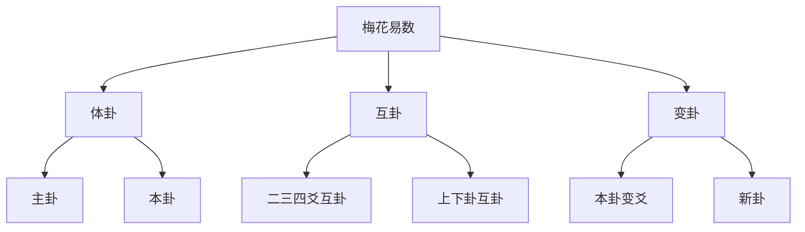

#### 外应、卦体、卦用

**外应**：取卦的時間年月日时

**卦体**：本卦（体卦）
- 上卦：上三爻
- 下卦：下三爻

**卦用**：起卦时的外部因素

### 基本原理

#### 起卦原理

1. **確定外应**：記錄起卦的年月日时
# 方法
3. **求互卦**：根据体卦的上下卦关系求互卦
4. **求变卦**：根据动爻的位置和阴阳变化求变卦
5. **断卦**：根据体卦、互卦、变卦的综合情况推断吉凶

# 方法

### 時間起卦法

#### 年月日时起卦

**基本原理**：
- 年月日时对应八卦
- 根据時間推算体卦

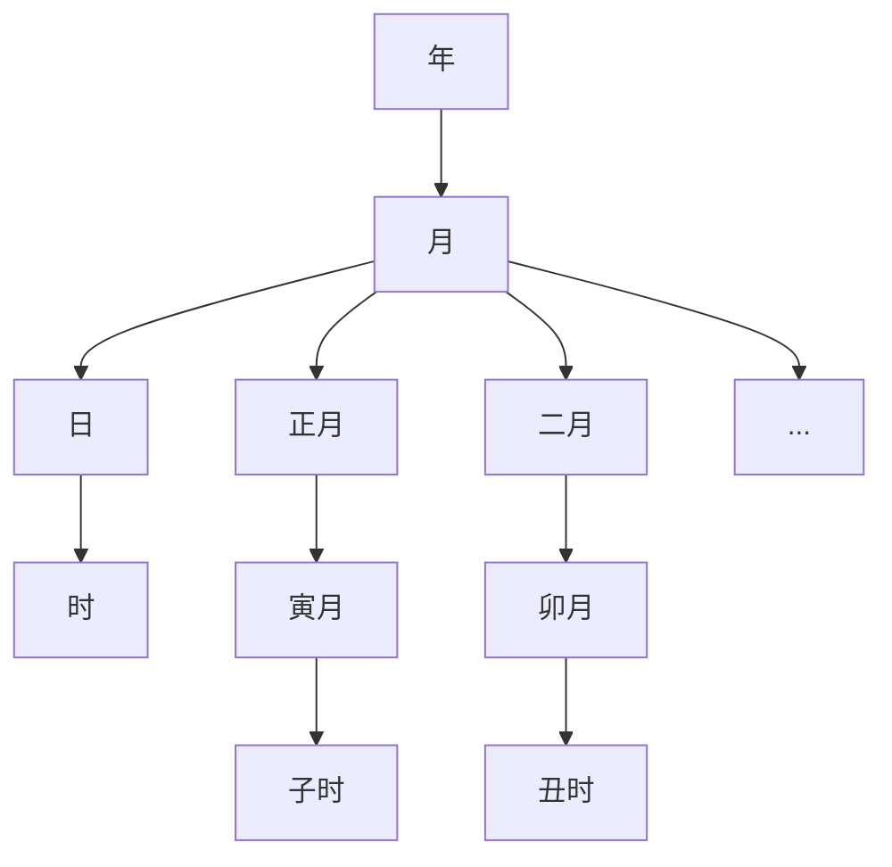

#### 年上起月法

# 方法
1. 取年卦：年上起月，如2024年→2024年对应的年卦
2. 取月卦：月上起日，如农历正月
3. 取日卦：日上起时，如日上起时辰
4. 取时卦：时上起刻，如子时对应的时卦

#### 具体起卦示例

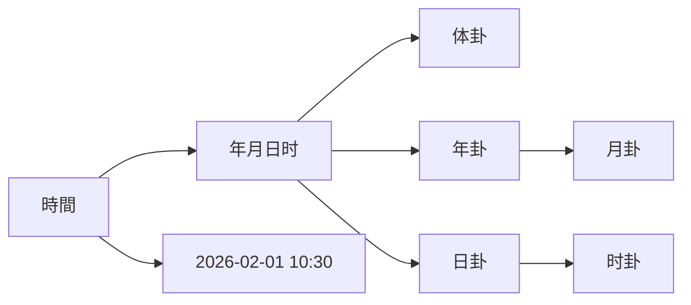

### 方位起卦法

#### 方位八卦对应

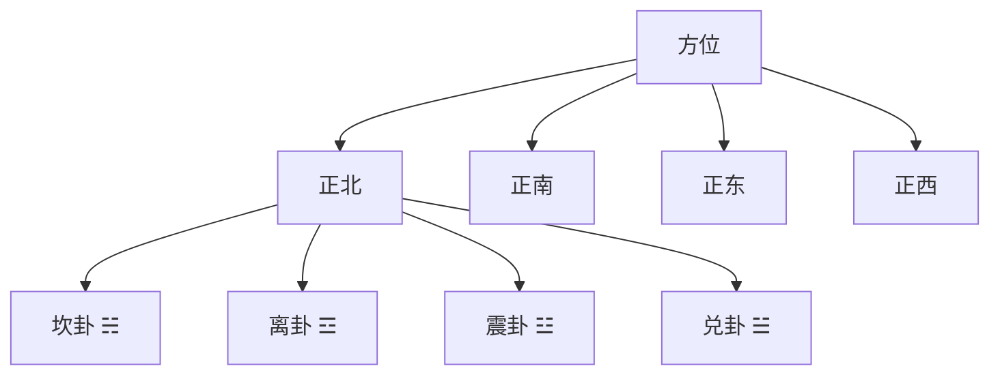

#### 方位起卦步骤

1. **確定方位**：確定起卦的方位
2. **確定卦象**：根据方位確定对应的八卦
3. **確定体卦**：方位为上卦，反卦为下卦

### 数字起卦法

# 方法

**基本原理**：
- 取1-8任意数字，按照规则组合成卦

#### 常用数字起卦法

1. **上下卦各3数字组合法**
2. **余数起卦法**
3. **卦序数法**
4. **数字分组起卦法**

## 🎯 外应的重要性

### 外应的基本概念

#### 外应的构成

**外应 = 年 + 月 + 日 + 时**

- **年上起月**：根据年份取年卦，根据农历月份取月卦
- **日上起日**：根据日支取日卦，根据时辰取时卦
- **日上起时**：根据时支取时卦

#### 外应的卦象关系

**上下卦关系**：
- 上卦：外应年卦
- 下卦：外应月卦
- 上上卦：外应年卦的上卦
- 下下卦：外应年卦的下卦

### 外应的吉凶作用

#### 外应与体卦的关系

**相生为吉，相克为凶**

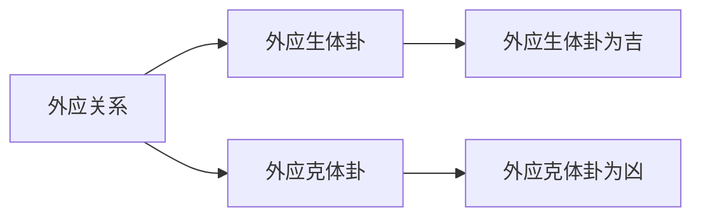

## 🔄 互卦的求法

### 互卦的概念

互卦是指从体卦的上下卦各取三爻组成的新卦。

### 互卦的求法

#### 基本互卦

**上卦互卦**：
- 上上卦：上卦的上三爻
- 上下卦：上卦的下三爻
- 互卦：上上卦 + 上下卦

#### 下卦互卦

**下卦互卦**：
- 下上卦：下卦的上三爻
- 下下卦：下卦的下三爻
- 互卦：下上卦 + 下下卦

### 互卦的圖表

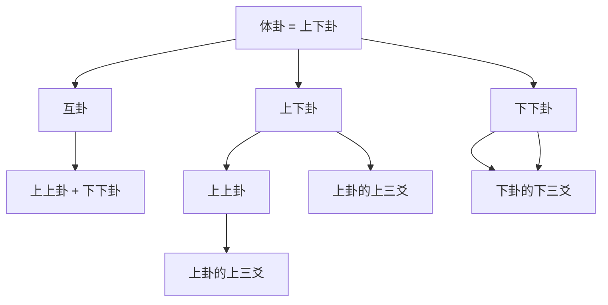

### 互卦的作用

**辅助判斷**：
- 互卦辅助判斷卦的含義
- 互卦的五行关系影响吉凶

**补充体卦**：
- 提供体卦的补充資訊
- 豐富对卦的理解

## 🔀 变卦的求法

### 变卦的概念

变卦是指当某爻发生变化时（从阳变阴或从阴变阳），产生的新卦。

### 变卦的求法

#### 基本变卦求法

**动爻位置**：
- 初爻变：初爻发生变化
- 二爻变：二爻发生变化
- ...（其他爻不变）

#### 变卦的圖表

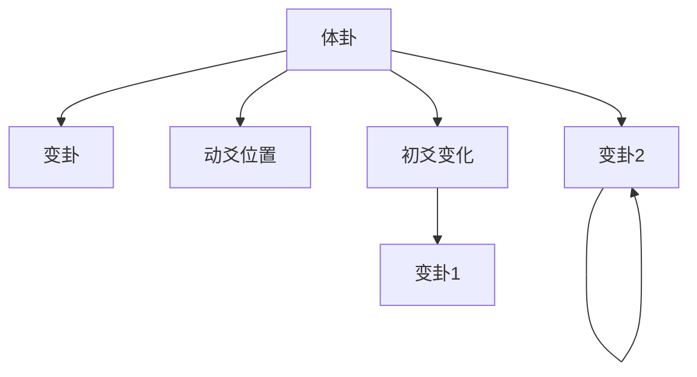

### 动爻位置对变卦的影响

#### 初爻变

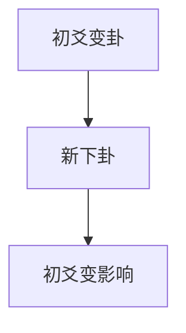

#### 上爻变

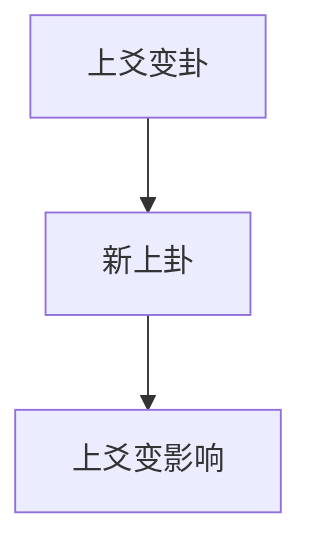

#### 中爻变

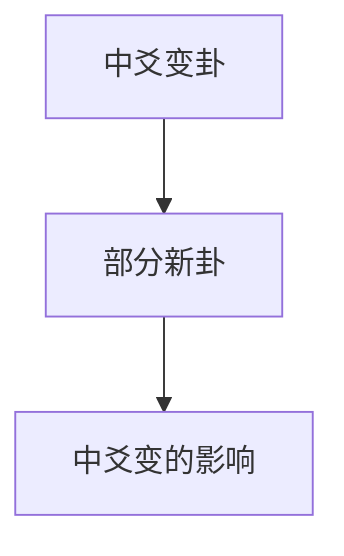

### 变卦的类型

#### 本卦变卦关系

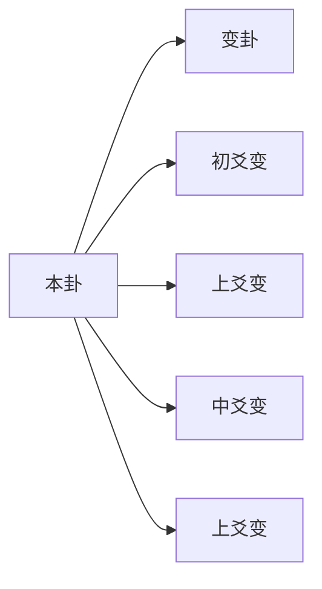

### 变卦的哲学意义

**变化原理**：
- 动爻变化体现事物的变化
- 体现了"变易"的哲学
- 变化是宇宙的基本规律

**变与不变**：
- 动爻变化：部分变化
- 不动爻：保持稳定
- 体现了"不易"的思想

### 变卦的吉凶判斷

#### 变卦的吉凶规律

**变卦与体卦的关系**：
- 变卦生体卦：多为吉
- 变卦克体卦：多为凶
- 变卦比体卦：多为和

#### 动爻位置吉凶

**初爻变**：影响基礎
- 二爻变：影响發展
- 三爻变：影响转折
- 四爻变：影响深入
- 五爻变：影响巅峰
- 上爻变：影响結果

# 方法

### 断卦的综合判斷

#### 综合判斷要素

```mermaid
graph TB
    A[断卦] --> B[综合判斷]
    
    A --> C[体卦]
    A --> D[互卦]
    A --> E[变卦]
    
    B --> B1[体卦含義]
    B --> B2[互卦补充]
    B --> B3[变卦影响]
    
    B --> F[综合判斷]
    F --> F1[吉凶判斷]
# 分析
```

#### 断卦的流程

# 分析
1. 理解体卦的基本含義
# 分析
3. 判斷体卦的基本吉凶

# 分析
1. 理解互卦的组成和关系
# 分析
3. 判斷互卦对体卦的影响

# 分析
1. 理解变卦的变化类型
# 分析
3. 判斷变化的方向和結果

**第四步：综合判斷**
1. 综合体卦、互卦、变卦
2. 结合外应卦体卦的关系
3. 判斷最终的吉凶

### 断卦的技巧

#### 理解主卦

**主卦的選擇**：
# 分析
- 互卦和变卦是辅助判斷
- 主次分明

# 分析

**阴爻变化**：
- 阴爻变阳：从消极到积极
- 阳爻保持：维持现状

**阳爻变化**：
- 阳爻变阴：从积极到保守
- 阳爻保持：保持刚健

#### 动爻位置

**下爻变化**：
- 初爻变：影响基礎
- 中爻变化：影响發展
- 上爻变化：影响結果

## 💡 梅花易数學習要點

### 循序渐进

1. **先理解基礎概念**：体卦、互卦、变卦
# 方法
3. **理解外应原理**：外应与体卦的关系
# 方法

### 實踐應用程式

# 方法
2. **記錄断卦心得**：記錄起卦、解卦、驗證結果
3. **驗證断卦准确性**：事后驗證断卦的准确性
4. **總結断卦經驗**：總結各种情况的断卦經驗

### 常见断卦要點

# 分析

**重基礎**：重视体卦的基本含義和哲学内涵

# 分析

**看三才**：天人地三才是否协调

# 分析

**重辅助**：互卦只是辅助判斷，不是主断卦依据

# 分析

# 分析

**重变化**：理解变卦对整體的影响

**看位置**：不同位置的变化影响不同

# 分析

**整體判斷**：不要只看单一因素
**综合平衡**：体、互卦、变卦综合判斷
**实事求是**：根据实际情况判斷吉凶

## 📊 梅花易数圖表彙總

### 外应八卦对应表

| 時間 | 外应 | 外应上下卦 | 外应上上卦 | 外应下下卦 |
|------|------|------------|-------------|-------------|
| 子时 | 坎 | 艮坤 | 坎坎 |
| 丑时 | 坎 | 艮坤 | 坎兑 |
| 寅时 | 艮坤 | 巽巽 | 艮离 |
| 卯时 | 巽震 | 巽艮 | 巽坎 |
| 辰时 | 巽震 | 巽艮 | 巽兑 |
| 辰时 | 巽巽 | 巽坎 | 巽离 |
| 已时 | 巽巽 | 巽艮 | 巽兑 |
| 午时 | 坎艮 | 坎坎 | 坎兑 |
| 申时 | 巽兑 | 巽坤 | 巽兑 |

### 方位八卦对应表

| 方位 | 八卦 | 方位 | 八卦 |
|------|------|------|------|
| 正北 | 坎卦 ☵ | 正东 | 震卦 ☳ |
| 正南 | 离卦 ☲ | 正西 | 兑卦 ☱ |
| 正东 | 震卦 ☳ | 正西 | 兑卦 ☱ |
| 正西 | 兑卦 ☱ | 正东 | 震卦 ☳ |
| 东南 | 巽卦 ☴ | 西南 | 离卦 ☷ |
| 西南 | 离卦 ☷ | 东北 | 坎卦 ☶ |
| 西北 | 坎坎 ☵ | 西东 | 兑卦 ☱ |

## 🎯 梅花易数实例演示

### 示例1：起卦演示

#### 時間起卦法演示

假设2026年2月1日上午10:30起卦，演示体卦計算過程：

#### 第一步：確定外应

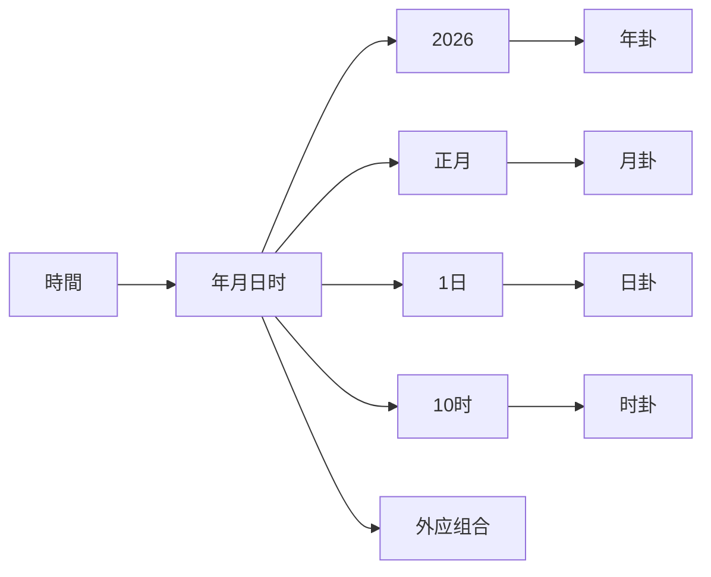

#### 第二步：計算体卦

根据外应组合，計算得到体卦的上下卦。

#### 第三步：求互卦

根据体卦的上下卦，求出上卦互卦和下卦互卦。

#### 第四步：確定变卦

根据实际起卦时的动爻位置，確定变卦。

# 分析

综合体卦、互卦、变卦進行综合断卦。

## 💡 梅花易数的應用程式場景

### 占卜應用程式

# 方法
- 時間起卦：選擇合适的時間起卦
- 方位起卦：選擇合适的方位起卦
- 数字起卦：選擇合适的数字起卦
- 物象起卦：選擇合适的物象起卦

### 断卦應用程式

**个人決策**：
# 分析
- 用梅花易数辅助決策
- 综合体卦、互卦、卦象断吉凶

**职业規劃**：
- 用梅花易数辅助职业決策
# 分析
- 評估發展方向

### 事务预测

**事务判斷**：
- 事务的發展趨勢
- 事务的成功概率
- 事务的风险評估

## 🔗 相關資源

- [[六爻预测基礎]] - 學習六爻占卜
- [[六爻预测基礎]] - 六爻的世应六亲系統
# 方法
- [[占卜中的心理投射]] - 理解占卜的心理機制
- [[个人修身与易经]] - 个人修养指导

---
*創建時間: 2026-02-01*  
*分類: 4 Interests*
