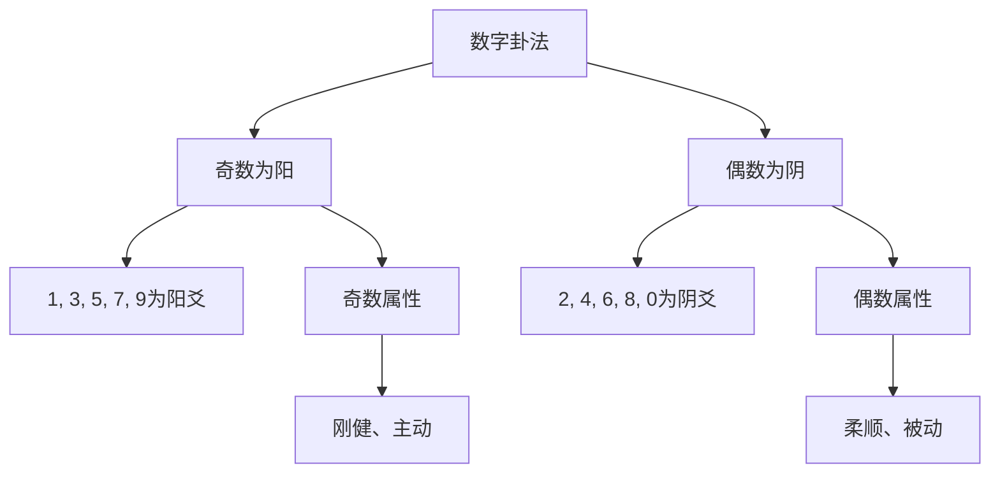
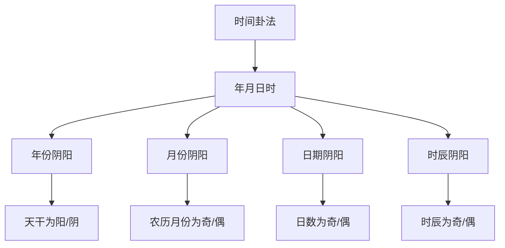
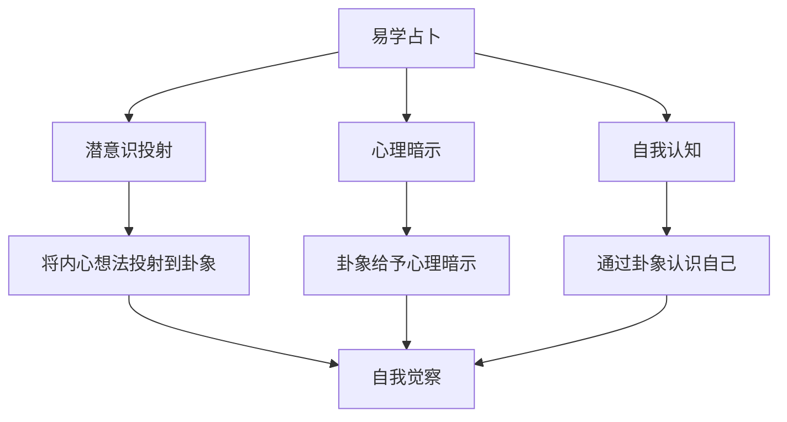

# 现代易学应用

# 學習

## 📚 现代易学概述

### 易学的现代转型

传统易学在现代社会中经历了重要转型，从纯粹的占卜工具转向哲学智慧体系。现代易学更强调易理的哲学内涵和心理调节作用，而非简单的预测未来。

### 现代易学的特点

**哲学导向**：强调易学作为哲学智慧的指导作用

# 分析

# 管理

**决策辅助**：将易学作为辅助决策的思考工具，而非决定工具

# 方法

### 数字卦法

#### 数字卦法的原理

# 方法



#### 数字卦法操作步骤

**第一步：选取数字**
从生活中选取一个数字，可以是：
- 手机号码中的数字
- 身份证号中的数字
- 时间数字
- 随机数字

**第二步：确定卦象**
将数字转换为阴阳爻：
- 奇数 → 阳爻（—）
- 偶数 → 阴爻（- -）

**第三步：组成卦象**
按照从下到上的顺序排列六爻，形成卦象

#### 数字卦法示例

假设选取手机号码13800138000中的前6位：

| 位置 | 数字 | 奇偶 | 阴阳 | 爻象 |
|------|------|------|------|------|
| 初爻 | 1 | 奇 | 阳爻 | — |
| 二爻 | 3 | 奇 | 阳爻 | — |
| 三爻 | 8 | 偶 | 阴爻 | - - |
| 四爻 | 0 | 偶 | 阴爻 | - - |
| 五爻 | 0 | 偶 | 阴爻 | - - |
| 上爻 | 1 | 奇 | 阳爻 | — |

最终卦象：䷀（乾卦）变体

### 时间卦法

#### 时间卦法的原理

时间卦法根据时间的阴阳属性起卦，体现了易学"天人合一"的思想。



#### 时间卦法操作步骤

# 記錄
# 記錄

**第二步：确定阴阳**
- 年份：根据天干确定阴阳
- 月份：农历月份奇数为阳，偶数为阴
- 日期：日数奇数为阳，偶数为阴
- 时辰：子丑寅卯辰巳为阳，午未申酉戌亥为阴

**第三步：组成卦象**
按照时间顺序确定初爻到上爻

#### 时间卦法示例

假设占卜时间为2026年2月1日10:30：

| 时间 | 数值 | 奇偶 | 阴阳 | 爻象 |
|------|------|------|------|------|
| 年份 | 2026（丙午年） | 丙火为阳 | 阳爻 | — |
| 月份 | 正月 | 1为奇 | 阳爻 | — |
| 日期 | 1日 | 1为奇 | 阳爻 | — |
| 时辰 | 巳时 | 巳为阳 | 阳爻 | — |
| 时序 | 10时 | 0为偶 | 阴爻 | - - |
| 分钟 | 30 | 0为偶 | 阴爻 | - - |

最终卦象：䷀（乾卦）变体

### 随机数卦法

#### 随机数卦法的原理

利用现代随机数生成器起卦，体现易学的随机性原理。

#### 随机数卦法操作步骤

**第一步：生成随机数**
使用手机、电脑等设备生成随机数

**第二步：确定阴阳**
- 随机数为奇数 → 阳爻
- 随机数为偶数 → 阴爻

**第三步：重复六次**
重复上述过程六次，得到六爻

## 🧠 易学与现代心理学

### 心理投射理论

#### 占卜的心理机制

易学占卜在现代心理学中可理解为一种"心理投射"机制：



#### 心理投射的作用

**自我认知**：
通过起卦和断卦，认识自己的内心真实想法和需求

**情绪疏导**：
# 管理

**决策辅助**：
通过卦象的哲学内涵，启发新的思考角度

### 认知行为理论

#### 易学与认知行为的结合

易学智慧可以帮助改善认知偏差：

# 方法
|---------|---------|---------|
| 二元对立思维 | 阴阳平衡 | 理解阴阳相生相克，避免绝对化思维 |
| 过度概括 | 变易思想 | 理解事物不断变化，避免以偏概全 |
| 灾难化思维 | 不易思想 | 理解规律永恒，从变化中找到稳定性 |
| 个人化思维 | 天人合一 | 理解天人关系，避免过分自责或自大 |

#### 易学认知重构练习

**第一步：识别负面思维**
用易学概念识别负面思维模式

# 分析
# 分析

**第三步：变易思考**
用变易思想考虑变化的可能性

**第四步：不易稳定**
用不易思想找到稳定的支点

# 管理

# 管理

#### 乾坤之道与领导力

**乾卦领导力**：
- 自强不息：领导者要不断进取
- 厚德载物：领导者要宽容包容
- 刚柔并济：领导方式要刚柔适度

**坤卦领导力**：
- 顺势而为：顺应规律而非强求
- 包容万物：包容不同观点和人才
- 持之以恒：坚持长期主义

# 管理

屯卦（䷂）象征万物始生，对应创业阶段：

```mermaid
graph TB
# 管理
    A --> C[困难期]
    A --> D[突破期]
    
    B --> B1[草创之时，万事起头难]
    C --> C1[困难重重，需要坚持]
    D --> D1[突破困境，迎来发展]
    
    B1 --> E[屯卦初爻]
    C1 --> E
    D1 --> E
```

# 管理
- 创业要有长期坚持的准备
- 困难时要保持信心和耐心
- 时机成熟时要果断突破

# 管理

泰卦（䷊）象征天地交泰，对应团队和谐：

# 管理
- 上下沟通要顺畅（天地交）
- 团队氛围要和谐
- 目标一致才能成功

# 管理

#### 易学决策框架

**易学决策四要素**：
1. **天时**：外部环境和时机
# 資源
3. **人和**：团队和能力
# 分析

```mermaid
graph TB
    A[易学决策] --> B[天时]
    A --> C[地利]
    A --> D[人和]
    A --> E[卦象]
    
# 分析
# 資源
    D --> D1[考察团队能力]
    E --> E1[综合判断决策]
    
    B1 --> F[决策结果]
    C1 --> F
    D1 --> F
    E1 --> F
```

#### 易学决策应用

# 分析
# 分析
- 判断决策的时机是否成熟
- 理解变易的规律

**第二步：评估地利**
# 資源
# 分析
- 理解不易的稳定因素

**第三步：考察人和**
- 评估团队能力
- 考虑利益相关者
- 理解人的因素

**第四步：卦象综合判断**
- 综合天时地利人和
- 参考卦象的哲学内涵
- 做出理性决策

## 🌟 易学与现代生活

### 职场应用

#### 易学职场智慧

**谦卦与职场**
- 谦卦（䷎）象征谦虚低调
- 职场中保持谦虚，更容易获得支持和认可
- 谦虚不等于软弱，是智慧的体现

**夬卦与职场**
- 夬卦（䷪）象征决断
- 职场中需要果断的决策能力
# 分析

#### 易学职业规划

**第一步：自我认知**
# 分析
- 理解阴阳平衡，发挥自己的优势

# 分析
# 分析
- 判断职业发展的时机

**第三步：目标设定**
- 设定符合易学智慧的职业目标
- 目标要有长远规划，符合不易思想

**第四步：行动执行**
- 根据天时地利人和制定行动计划
- 在变化中保持不变的原则

### 家庭应用

#### 易学家庭智慧

**家人卦与家庭**
- 家人卦（䷤）象征家庭和睦
- 家庭中要遵循家人卦的启示
- 父母要有威严，子女要孝顺

**渐卦与家庭教育**
- 渐卦（䷴）象征循序渐进
- 教育子女要循序渐进，不能急于求成
- 每个阶段都有不同的教育重点

#### 易学家庭关系

**夫妻关系**：
- 理解阴阳互补，相互包容
- 夫妻关系要和谐平衡
- 遇到问题要变易思考

**亲子关系**：
- 父母要厚德载物，包容子女
- 子女要自强不息，不断进步
- 父母要引导子女，而非强制

### 健康应用

#### 易学养生智慧

**五行养生**：
- 根据五行属性养生
- 木（肝）：养肝护肝，情志舒畅
- 火（心）：养心安神，心态平和
- 土（脾胃）：健脾养胃，饮食有节
- 金（肺）：养肺润肺，呼吸顺畅
- 水（肾）：养肾固肾，节制房事

**四季养生**：
- 春养肝：顺应春生之气
- 夏养心：顺应夏长之气
- 秋养肺：顺应秋收之气
- 冬养肾：顺应冬藏之气

#### 易学心理养生

**心态调节**：
- 用阴阳平衡调节心态
- 避免过于刚强或过于柔弱
- 保持中正平和的心态

# 管理
- 用易学概念理解情绪
- 情绪也是阴阳变化
- 顺应情绪，而非压抑

# 學習

# 學習

1. **避免迷信**：不将占卜作为决定命运的依据
2. **哲学导向**：注重易学的哲学内涵
3. **心理调节**：将易学作为心理调节的工具
4. **决策辅助**：将易学作为辅助决策的思考工具

### 实践应用

# 方法
2. **心理应用**：运用易学智慧进行心理调节
# 管理
4. **生活应用**：将易学智慧应用于现代生活

# 學習

1. **研读经典**：深入研读《周易》等经典文献
2. **实践验证**：在实践中验证易学智慧
# 分析
# 知識

## 📊 现代易学应用图表汇总

# 方法

# 方法
|---------|------|------|---------|
# 場景
| 时间卦法 | 体现天人合一 | 需要记住时间对应关系 | 需要考虑时间的占卜 |
| 随机数卦法 | 随机性强 | 需要电子设备 | 需要强随机性的占卜 |

### 易学与现代心理学对应关系

| 易学概念 | 心理学概念 | 应用 |
|---------|-----------|------|
| 阴阳平衡 | 认知平衡 | 调节极端思维 |
| 变易思想 | 认知灵活性 | 适应变化 |
| 不易思想 | 心理稳定 | 寻找稳定支点 |
| 简易思想 | 简化策略 | 简化复杂问题 |
| 天人合一 | 整体观 | 整体看待问题 |

# 資源

# 學習
# 學習
# 學習
- [[易经与决策智慧]] - 易学决策智慧
- [[个人修身与易经]] - 个人修养指导

---
# 創建
# 分類
